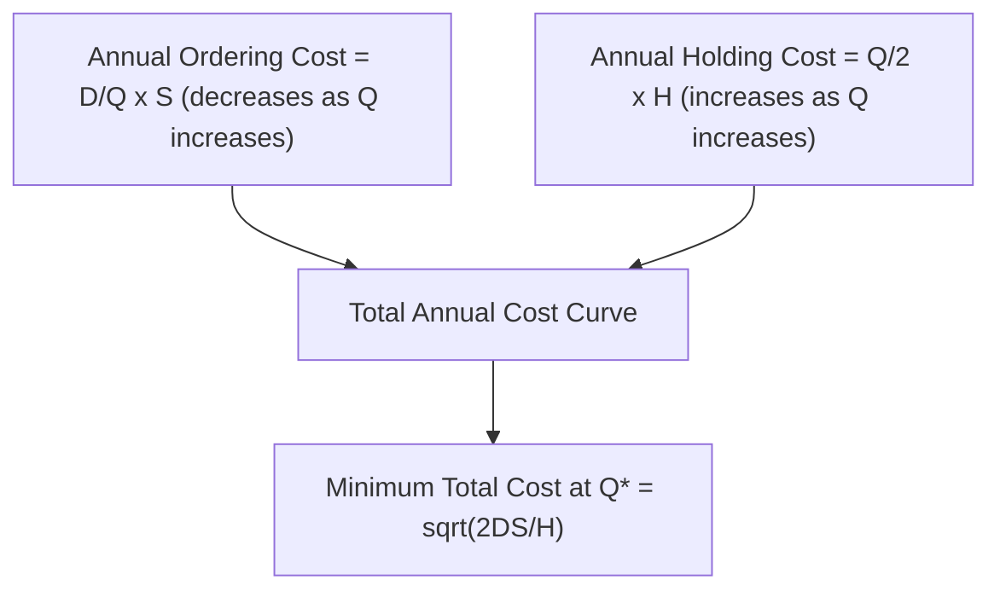

## Economic Order Quantity Model

### Definition and Purpose

The Economic Order Quantity (EOQ) model is a foundational inventory-control formula that determines the order quantity which minimizes the total cost of ordering and holding inventory for an item with known, constant demand. Developed by Ford W. Harris in 1913 (and later popularized by R.H. Wilson, leading to its alternative name "Wilson formula"), EOQ remains the baseline lot-sizing model taught in operations management, against which more complex inventory models are typically compared and extended.

The core insight of EOQ is that two cost categories move in opposite directions as order size changes: ordering costs decrease per unit as order size increases (fewer orders per year), while holding costs increase as order size increases (more average inventory sitting in stock). EOQ identifies the order quantity at which these two opposing costs are balanced, minimizing their sum.

### Key Assumptions

The classical EOQ model rests on a specific set of simplifying assumptions, and understanding these is essential to knowing when the model applies and when extensions are needed:

1. Demand rate is known, constant, and continuous over the planning horizon (no variability)
2. Lead time is known and constant (zero or fixed)
3. No stockouts are permitted (shortage cost is effectively infinite, or irrelevant since demand is deterministic)
4. Ordering cost per order is fixed and independent of order quantity
5. Holding cost per unit per year is constant and linear in inventory quantity
6. Unit purchase price is constant regardless of order quantity (no quantity discounts, in the base model)
7. Replenishment is instantaneous (entire order arrives at once) — this distinguishes the basic EOQ from the Economic Production Quantity (EPQ) model, which assumes a finite production/replenishment rate
8. A single item is considered in isolation (no interaction with other items' ordering decisions)

[Inference] Because these assumptions rarely hold exactly in practice, EOQ is best understood as a baseline approximation whose output is often adjusted judgmentally or via extended models (e.g., quantity-discount EOQ, EPQ, stochastic reorder-point models) rather than applied literally in high-variability environments.

### Cost Components and the Total Cost Function

**Annual Ordering (Setup) Cost:**

$$\text{Annual Ordering Cost} = \frac{D}{Q} \times S$$

**Annual Holding (Carrying) Cost:**

$$\text{Annual Holding Cost} = \frac{Q}{2} \times H$$

**Total Annual Inventory Cost:**

$$TC(Q) = \frac{D}{Q}S + \frac{Q}{2}H + DC$$

where:

- $D$ = annual demand (units/year)
- $Q$ = order quantity (units per order) — the decision variable
- $S$ = fixed ordering/setup cost per order
- $H$ = annual holding cost per unit (often expressed as $H = iC$, where $i$ is the annual holding-cost rate as a percentage and $C$ is unit cost)
- $C$ = unit purchase cost
- The $DC$ term represents total annual purchase cost, which is constant and does not affect the optimal $Q$ in the basic model (it matters only when quantity discounts are introduced)

### Deriving the EOQ Formula

The optimal order quantity minimizes $TC(Q)$. Taking the derivative of $TC(Q)$ with respect to $Q$ and setting it to zero:

$$\frac{d(TC)}{dQ} = -\frac{DS}{Q^2} + \frac{H}{2} = 0$$

Solving for $Q$:

$$Q^* = \sqrt{\frac{2DS}{H}}$$

This is the **Economic Order Quantity**. At $Q^*$, annual ordering cost exactly equals annual holding cost — this equality is a defining property of the EOQ solution, not a coincidence, and follows directly from the first-order condition above.

### Related Metrics Derived from EOQ

**Number of orders per year:**

$$N = \frac{D}{Q^*}$$

**Time between orders (order cycle length):**

$$T = \frac{Q^*}{D} \times (\text{working days per year})$$

**Total annual cost at optimum:**

$$TC(Q^*) = \sqrt{2DSH}$$

**Reorder Point (ROP)**, under deterministic demand and constant lead time (no safety stock needed):

$$ROP = d \times L$$

where $d$ is daily demand ($D$ divided by working days per year) and $L$ is lead time in days.

### Worked Example

An auto parts distributor sells a specific brake pad set with the following data:

- Annual demand, $D = 7,200$ units/year
- Ordering cost, $S = \$45$ per order
- Unit cost, $C = \$20$
- Annual holding cost rate, $i = 20\%$ of unit cost, so $H = 0.20 \times \$20 = \$4$ per unit per year
- Working days per year = 300
- Lead time, $L = 6$ working days

**Step 1 — Calculate EOQ:**

$$Q^* = \sqrt{\frac{2 \times 7{,}200 \times 45}{4}} = \sqrt{\frac{648{,}000}{4}} = \sqrt{162{,}000} \approx 402.5 \text{ units}$$

Rounded to a practical order quantity: $Q^* = 402$ or $403$ units (order quantities are typically rounded to whole units, or to case-pack quantities in practice).

**Step 2 — Number of orders per year:**

$$N = \frac{7{,}200}{402.5} \approx 17.9 \text{ orders/year}$$

**Step 3 — Time between orders:**

$$T = \frac{402.5}{7{,}200} \times 300 \approx 16.8 \text{ working days}$$

**Step 4 — Total annual cost at optimum:**

$$TC(Q^*) = \sqrt{2 \times 7{,}200 \times 45 \times 4} = \sqrt{2{,}592{,}000} \approx \$1{,}609.97$$

Verification (ordering cost should equal holding cost at $Q^*$):

$$\text{Ordering Cost} = \frac{7{,}200}{402.5} \times 45 \approx \$804.97 \qquad \text{Holding Cost} = \frac{402.5}{2} \times 4 \approx \$805.00$$

The near-equality (small difference due to rounding $Q^*$) confirms the solution.

**Step 5 — Reorder point:**

$$d = \frac{7{,}200}{300} = 24 \text{ units/day} \qquad ROP = 24 \times 6 = 144 \text{ units}$$

The distributor should place a new order of approximately 402–403 units whenever on-hand inventory drops to 144 units.

### Sensitivity: Why Total Cost Is Relatively Flat Near $Q^*$

A notable property of the EOQ total cost curve is that it is relatively insensitive to moderate deviations from $Q^*$ — ordering, say, 20% more or less than the calculated EOQ typically increases total cost by only a few percent, because the total cost function is flat (low curvature) near its minimum. This gives planners practical flexibility to round EOQ to convenient case-pack, pallet, or container quantities without materially increasing cost.

### Extensions to the Basic EOQ Model

| Extension | Relaxes Assumption | Key Modification |
| --- | --- | --- |
| **Economic Production Quantity (EPQ)** | Instantaneous replenishment | Accounts for finite production rate $p$, where inventory builds gradually during production; $Q^* = \sqrt{\frac{2DS}{H(1 - d/p)}}$ |
| **Quantity Discount EOQ** | Constant unit price | Evaluates total cost (including purchase cost) at each price-break quantity, since discounts can make a larger-than-EOQ order economically optimal |
| **EOQ with Planned Shortages (Backorder Model)** | No stockouts allowed | Introduces a shortage cost per unit, allowing a portion of demand to be backordered when shortage cost is low relative to holding cost |
| **Stochastic/Probabilistic Models (ROP with Safety Stock)** | Known constant demand and lead time | Introduces demand and/or lead-time variability, requiring safety stock layered on top of the EOQ-derived cycle stock |

### Benefits

- Provides a mathematically optimal, easily computed baseline order quantity requiring only three inputs ($D$, $S$, $H$)
- Minimizes the combined ordering and holding cost trade-off explicitly, rather than relying on judgment or arbitrary batch sizes
- The relative flatness of the total cost curve near $Q^*$ means practical rounding (to case packs, pallets, containers) rarely causes significant cost penalty
- Serves as the conceptual and mathematical foundation for numerous more advanced lot-sizing and inventory-control models

### Limitations and Considerations

- The model's deterministic assumptions (constant demand, constant lead time, no stockouts, no discounts) are frequently violated in real operations, requiring the extensions listed above
- EOQ optimizes ordering and holding cost only; it does not account for other cost drivers such as spoilage/obsolescence risk, storage capacity constraints, cash-flow/working-capital constraints, or supplier minimum order quantities, all of which may override the theoretically optimal $Q^*$ in practice
- Accurately estimating $S$ (ordering cost) and $H$ (holding cost) is often difficult in practice, since these figures require allocating overhead costs that may not be cleanly attributable per order or per unit
- [Unverified] The degree to which real-world firms use literal EOQ calculations versus heuristic or system-default order quantities varies significantly by industry and firm sophistication; general prevalence claims should be treated cautiously absent a specific cited source.

### Key Points

- EOQ minimizes the sum of annual ordering cost and annual holding cost, given deterministic demand and lead time
- The formula $Q^* = \sqrt{2DS/H}$ is derived by setting the derivative of total cost with respect to $Q$ to zero
- At the optimal $Q^*$, annual ordering cost equals annual holding cost
- The total cost curve is relatively flat near the optimum, giving practical flexibility in rounding order quantities
- Real-world deviations from EOQ's assumptions are addressed via extensions: EPQ (finite production rate), quantity-discount models, and backorder/shortage models

### Related Topics

- Functions and types of inventory (cycle stock)
- ABC classification analysis (differentiating EOQ rigor by item value class)
- Safety stock and reorder point under demand/lead-time uncertainty
- Economic Production Quantity (EPQ) model
- Quantity discount models in lot sizing
- Continuous review (Q) vs. periodic review (P) inventory systems
- Total cost of ownership and inventory holding cost components