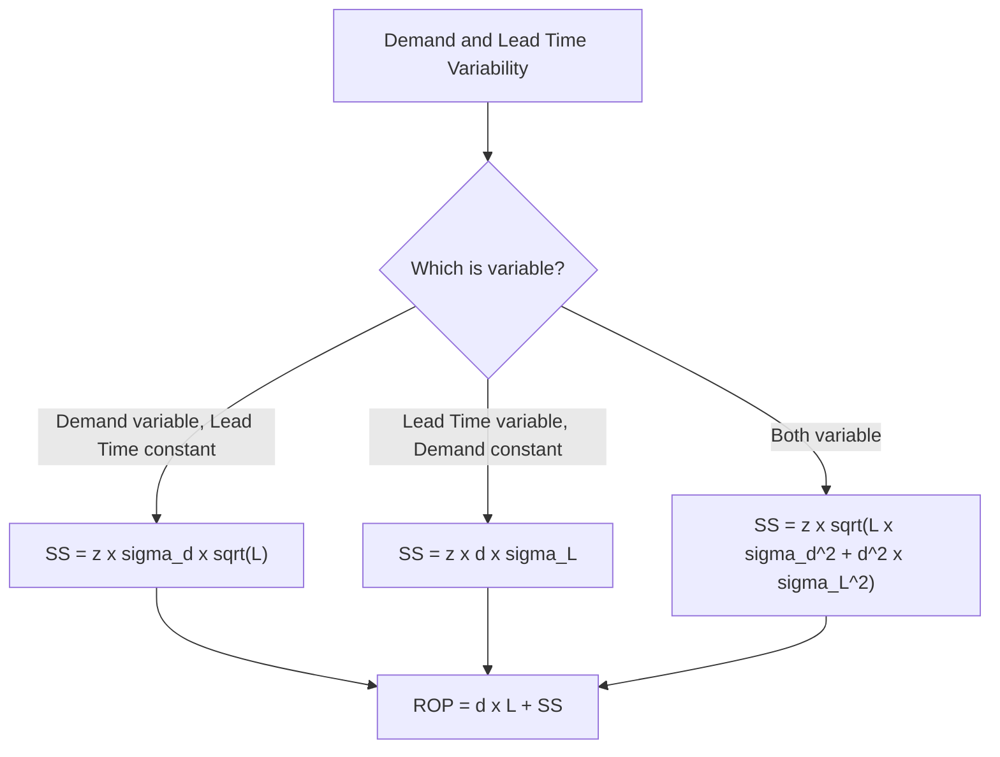

## Reorder Point and Safety Stock Calculation

### Definition and Purpose

The reorder point (ROP) is the inventory level at which a new replenishment order must be triggered so that the incoming order arrives before existing stock is depleted. Safety stock is the buffer inventory held above expected demand during lead time, specifically to protect against variability in demand and/or lead time, reducing the risk of stockouts to an acceptable, chosen level.

While the Economic Order Quantity (EOQ) model answers "how much to order," the reorder point and safety stock calculations answer "when to order" and "how much buffer to hold against uncertainty." Together, these form the continuous-review (Q, ROP) inventory policy widely used when demand and/or lead time are not perfectly predictable — which is the realistic case in most operational settings, in contrast to the deterministic assumptions of basic EOQ.

### Reorder Point Under Deterministic Conditions (No Safety Stock)

When demand and lead time are both known with certainty, the reorder point is simply the expected demand consumed during the lead-time window:

$$ROP = d \times L$$

where $d$ = average demand rate per period (e.g., units/day) and $L$ = lead time (in the same period units).

This deterministic case was addressed in the EOQ topic. In practice, however, demand during lead time is rarely perfectly predictable, requiring safety stock to be added.

### Reorder Point Under Uncertainty (With Safety Stock)

$$ROP = (d \times L) + SS$$

where $SS$ is the safety stock quantity, sized according to the variability present and the desired service level.

### Safety Stock Formulas by Variability Source

**Case 1 — Demand is variable, lead time is constant:**

$$SS = z \times \sigma_d \times \sqrt{L}$$

**Case 2 — Lead time is variable, demand is constant:**

$$SS = z \times d \times \sigma_L$$

**Case 3 — Both demand and lead time are variable (general case):**

$$SS = z \times \sqrt{L \times \sigma_d^2 + d^2 \times \sigma_L^2}$$

where:

- $z$ = number of standard deviations corresponding to the desired service level (the z-score from the standard normal distribution)
- $\sigma_d$ = standard deviation of demand per period
- $\sigma_L$ = standard deviation of lead time (in the same period units as demand)
- $d$ = average demand per period
- $L$ = average lead time (in periods)

The general formula (Case 3) reduces to Cases 1 or 2 when $\sigma_L = 0$ or $\sigma_d = 0$ respectively, confirming internal consistency across the three formulations.

### Understanding the Service Level and Z-Score

The service level represents the target probability of *not* stocking out during a single replenishment cycle (this specific definition is known as **cycle service level**, distinct from **fill rate**, which measures the percentage of unit demand satisfied directly from stock — the two metrics are related but numerically different and should not be conflated).

Common service levels and corresponding z-scores (from the standard normal distribution):

| Service Level | z-score |
| --- | --- |
| 90% | 1.28 |
| 95% | 1.645 |
| 97.5% | 1.96 |
| 99% | 2.33 |
| 99.9% | 3.09 |

A higher target service level requires a larger $z$, and therefore more safety stock — the relationship is nonlinear, since the normal distribution's tail requires disproportionately more buffer stock to eliminate the last few percentage points of stockout risk.

### Worked Example

A hardware retailer stocks a specific power drill model with the following data:

- Average daily demand, $d = 20$ units/day
- Standard deviation of daily demand, $\sigma_d = 5$ units/day
- Average lead time, $L = 9$ days
- Standard deviation of lead time, $\sigma_L = 2$ days
- Desired cycle service level = 95% ($z = 1.645$)

**Step 1 — Calculate safety stock (general case, both demand and lead time variable):**

$$SS = z \times \sqrt{L \times \sigma_d^2 + d^2 \times \sigma_L^2}$$

$$SS = 1.645 \times \sqrt{9 \times 5^2 + 20^2 \times 2^2}$$

$$SS = 1.645 \times \sqrt{9 \times 25 + 400 \times 4}$$

$$SS = 1.645 \times \sqrt{225 + 1{,}600}$$

$$SS = 1.645 \times \sqrt{1{,}825}$$

$$SS = 1.645 \times 42.72 \approx 70.3 \text{ units}$$

Rounded: $SS \approx 70$ units.

**Step 2 — Calculate expected demand during lead time:**

$$d \times L = 20 \times 9 = 180 \text{ units}$$

**Step 3 — Calculate reorder point:**

$$ROP = 180 + 70 = 250 \text{ units}$$

**Interpretation:** the retailer should place a replenishment order whenever on-hand inventory drops to 250 units. This ensures a 95% probability that the 180 units of expected lead-time demand plus the 70-unit safety buffer will cover actual demand before the next order arrives, given the observed variability in both daily demand and lead time.

**Sensitivity check — raising the service level to 99% ($z = 2.33$):**

$$SS = 2.33 \times 42.72 \approx 99.5 \text{ units} \qquad ROP = 180 + 99.5 \approx 279.5 \text{ units}$$

Increasing the target service level from 95% to 99% (a 4-percentage-point improvement) requires roughly 42% more safety stock (70 → 99.5 units) — illustrating the nonlinear, increasing marginal cost of pursuing near-zero stockout risk.

### Relationship Between Lead-Time Variability and Demand Variability Contributions

In the worked example, it is useful to decompose which variability source drives more of the required safety stock:

- Contribution from demand variability: $L \times \sigma_d^2 = 9 \times 25 = 225$
- Contribution from lead-time variability: $d^2 \times \sigma_L^2 = 400 \times 4 = 1{,}600$

Here, lead-time variability contributes roughly seven times more to the variance under the square root than demand variability does ($1{,}600$ vs. $225$), despite $\sigma_L$ having a numerically small standard deviation (2 days). This occurs because lead-time variability is scaled by $d^2$ (average demand squared), making it a disproportionately large driver of safety stock whenever average demand is high — a pattern with direct managerial implications: reducing lead-time variability (e.g., through supplier reliability improvement) can be more impactful for safety stock reduction than reducing demand variability, particularly for high-volume items.

### Continuous Review (Q, ROP) vs. Periodic Review (P) Systems

| Feature | Continuous Review (Q, ROP) | Periodic Review (P) |
| --- | --- | --- |
| **Trigger** | Order placed whenever inventory drops to ROP (continuously monitored) | Order placed only at fixed review intervals |
| **Order quantity** | Fixed at EOQ ($Q^*$) each time | Variable — brings inventory up to a target level $S$ |
| **Safety stock requirement** | Covers lead time only | Covers lead time *plus* the review period (typically requiring more safety stock) |
| **Safety stock formula** | Uses $L$ in the variance term | Uses $(L + P)$ in place of $L$, where $P$ is the review period |
| **Monitoring cost** | Higher (requires continuous or frequent inventory tracking) | Lower (inventory checked only at review intervals) |
| **Common use case** | High-value (Class A) items warranting tight control | Lower-value (Class B/C) items, or systems with batched ordering cycles |

For a periodic review system, the safety stock formula extends the protection period from $L$ to $(L + P)$:

$$SS_{periodic} = z \times \sigma_d \times \sqrt{L + P}$$

reflecting that inventory ordered at a periodic review must last through both the review interval and the subsequent lead time before the next review's order arrives.

### Benefits

- Provides a statistically grounded method for setting reorder triggers that explicitly accounts for demand and lead-time uncertainty, rather than relying on arbitrary buffer rules
- Allows service level to be an explicit, tunable management decision (via $z$) rather than an incidental outcome
- Decomposing variability sources (demand vs. lead time) surfaces which lever — demand forecasting improvement vs. supplier lead-time reliability — offers greater safety-stock reduction potential
- Directly compatible with ABC classification, allowing differentiated service-level targets (e.g., 99% for Class A, 90% for Class C)

### Limitations and Considerations

- The formulas assume demand (and often lead time) follow a normal distribution; for highly intermittent or lumpy demand (common in spare parts or long-tail SKUs), the normal-distribution assumption breaks down, and alternative methods (e.g., Poisson-based or bootstrapping approaches) are more appropriate
- Cycle service level and fill rate are frequently confused in practice; a 95% cycle service level does *not* mean 95% of units demanded are satisfied — actual fill rate is typically higher than the cycle service level for a given safety stock level, since stockouts (when they occur) are usually partial, not complete
- Historical $\sigma_d$ and $\sigma_L$ estimates assume future variability resembles past variability; structural shifts (new supplier, new market, demand shocks) require re-estimation
- [Inference] In practice, many ERP/APS systems allow safety stock to be set via direct override or simplified rules-of-thumb (e.g., "two weeks of average demand") rather than the full statistical formula, particularly for lower-value (Class C) items where the analytical effort is not justified relative to the item's value.

### Key Points

- ROP triggers replenishment; it equals expected lead-time demand plus safety stock
- Safety stock formula selection depends on which factor (demand, lead time, or both) is variable
- Service level (via the z-score) is the key management lever determining safety stock size, with diminishing returns (increasing marginal cost) as service level approaches 100%
- Lead-time variability's contribution to safety stock is scaled by average demand squared, often making it a more significant driver than demand variability for high-volume items
- Periodic review systems require more safety stock than continuous review systems, because the protection window extends across the review period plus lead time

### Related Topics

- Economic Order Quantity (EOQ) model
- ABC classification analysis (differentiated service-level targets)
- Continuous review vs. periodic review inventory systems
- Cycle service level vs. fill rate vs. ready rate metrics
- Demand forecasting methods and forecast error's role in safety stock sizing
- Multi-echelon inventory optimization
- Supplier lead-time variability and vendor performance management