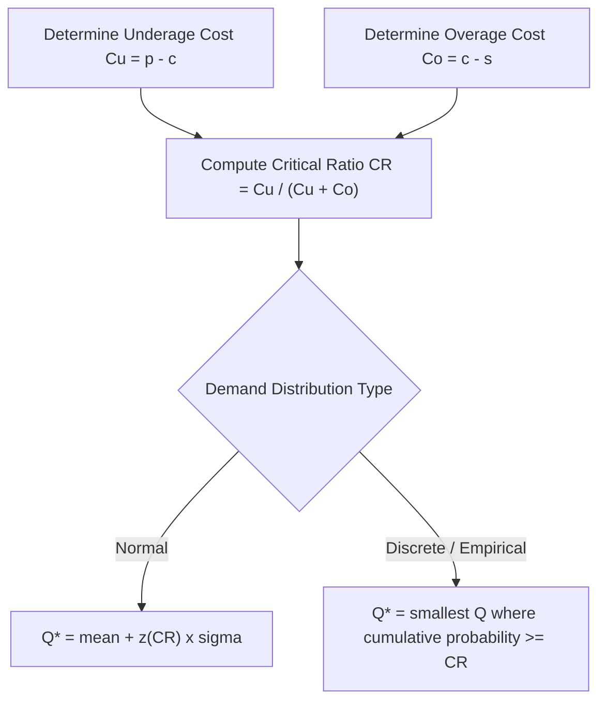

## Single-Period Newsvendor Model

### Definition and Purpose

The single-period newsvendor model (also called the "newsboy problem" or "newsvendor problem") is an inventory optimization model for products that must be ordered *once* before an uncertain demand realizes, with no opportunity for replenishment during the selling period, and where any unsold units at the end of the period carry a salvage value typically lower than cost (or are discarded entirely). The name derives from the classic example of a newspaper vendor who must decide each morning how many papers to stock, knowing that unsold papers at day's end are essentially worthless, while running out means lost sales.

The model applies broadly to any product with these characteristics: perishable goods (fresh food, flowers), seasonal/fashion merchandise (holiday items, fashion apparel with a single selling season), one-time event merchandise (concert T-shirts, Olympic memorabilia), and products with rapid obsolescence (technology components tied to a single product generation). Unlike the EOQ model (which addresses repeated ordering cycles for stable, ongoing-demand items), the newsvendor model addresses a **single, non-repeating** ordering decision under demand uncertainty.

### Core Trade-Off: Underage Cost vs. Overage Cost

The newsvendor model balances two asymmetric costs of forecast error:

- **Underage cost ($C_u$)**: the opportunity cost of ordering *too little* — the lost profit margin (and potentially lost goodwill) from each unit of demand that could not be satisfied because inventory ran out.

$$C_u = \text{Selling Price} - \text{Unit Cost} = p - c$$

- **Overage cost ($C_o$)**: the cost of ordering *too much* — the loss incurred on each unit that remains unsold at the end of the period and must be salvaged (or discarded) at a value below cost.

$$C_o = \text{Unit Cost} - \text{Salvage Value} = c - s$$

If demand exceeded the order quantity, the firm has understocked (incurring underage cost on the shortfall); if demand fell short of the order quantity, the firm has overstocked (incurring overage cost on the excess).

### The Critical Ratio and Optimal Service Level

The optimal order quantity is derived by finding the order quantity that balances the *expected marginal cost* of ordering one additional unit against the *expected marginal benefit*. This yields the **critical ratio (CR)**, which represents the optimal probability of *not* stocking out (i.e., the optimal in-stock probability, equivalently the target cycle service level):

$$CR = \frac{C_u}{C_u + C_o}$$

The optimal order quantity $Q^*$ is the quantity at which the cumulative distribution function (CDF) of demand equals the critical ratio:

$$P(\text{Demand} \leq Q^*) = CR$$

$$Q^* = F^{-1}(CR)$$

where $F^{-1}$ is the inverse of the demand distribution's CDF.

### Solving Under a Normal Demand Distribution

When demand is assumed to follow a normal distribution with mean $\mu$ and standard deviation $\sigma$, the optimal order quantity is:

$$Q^* = \mu + z_{CR} \times \sigma$$

where $z_{CR}$ is the z-score corresponding to the cumulative probability equal to the critical ratio (found from the standard normal table, the same table used for safety stock z-scores).

### Worked Example — Normal Demand Distribution

A bakery sells a specialty holiday cake that can only be made once per season; unsold cakes are marked down and sold to a discount outlet.

- Selling price, $p = \$40$
- Unit production cost, $c = \$18$
- Salvage value (discount outlet price), $s = \$10$
- Demand is normally distributed: $\mu = 300$ units, $\sigma = 60$ units

**Step 1 — Calculate underage and overage costs:**

$$C_u = p - c = 40 - 18 = \$22$$

$$C_o = c - s = 18 - 10 = \$8$$

**Step 2 — Calculate the critical ratio:**

$$CR = \frac{C_u}{C_u + C_o} = \frac{22}{22 + 8} = \frac{22}{30} \approx 0.733$$

**Step 3 — Find the z-score corresponding to CR ≈ 0.733:**

From the standard normal table, $P(Z \leq 0.62) \approx 0.7324$, so $z_{CR} \approx 0.62$.

**Step 4 — Calculate optimal order quantity:**

$$Q^* = \mu + z_{CR} \times \sigma = 300 + (0.62 \times 60) = 300 + 37.2 \approx 337 \text{ units}$$

**Interpretation:** the bakery should produce approximately 337 cakes. This exceeds the mean forecasted demand (300 units) because the underage cost ($22, the lost margin from a missed sale) is substantially higher than the overage cost ($8, the loss on a markdown), so the model deliberately biases the order upward — it is economically better to risk having some unsold, discounted cakes than to risk running out and losing full-margin sales.

**Sensitivity check:** if overage cost were instead higher than underage cost (e.g., a highly perishable item with near-zero salvage value and modest margin), the critical ratio would fall below 0.5, and the optimal order would fall *below* the mean demand — the model correctly reverses direction based on the relative cost asymmetry.

### Solving Under a Discrete/Empirical Demand Distribution

When demand is represented by a discrete probability distribution (e.g., historical demand frequencies) rather than assumed normal, the same critical ratio is used, but $Q^*$ is found as the smallest order quantity whose **cumulative probability** meets or exceeds $CR$.

**Example:** A flower shop sells a specific bouquet for Valentine's Day (single-period, no reorder possible). Historical demand data gives the following distribution:

| Demand (units) | Probability | Cumulative Probability |
| --- | --- | --- |
| 40 | 0.10 | 0.10 |
| 50 | 0.15 | 0.25 |
| 60 | 0.25 | 0.50 |
| 70 | 0.20 | 0.70 |
| 80 | 0.15 | 0.85 |
| 90 | 0.10 | 0.95 |
| 100 | 0.05 | 1.00 |

Given $p = \$60$, $c = \$25$, $s = \$5$:

$$C_u = 60 - 25 = \$35 \qquad C_o = 25 - 5 = \$20$$

$$CR = \frac{35}{35 + 20} = \frac{35}{55} \approx 0.636$$

Scanning the cumulative probability column for the **smallest demand value whose cumulative probability is ≥ 0.636**: at 70 units, cumulative probability = 0.70, which is the first value meeting or exceeding 0.636 (60 units gives only 0.50, which is insufficient).

**Optimal order quantity: $Q^* = 70$ bouquets.**

### Expected Profit Calculation

Once $Q^*$ is determined, expected profit can be evaluated (particularly useful for comparing candidate order quantities or justifying the decision to stakeholders), generally computed as:

$$E[\text{Profit}] = p \times E[\min(Q, \text{Demand})] + s \times E[\max(0, Q - \text{Demand})] - c \times Q$$

This requires computing the expected sales (capped at $Q$) and expected leftover units (salvaged), which for discrete distributions is done by summing over each demand scenario weighted by its probability, and for continuous (normal) distributions uses the normal loss function. [Inference] Expected-profit computation is typically handled via spreadsheet simulation or the normal loss function table in practice, rather than manual integration, given the complexity of the closed-form continuous solution.

### Extensions to the Basic Newsvendor Model

| Extension | Modification |
| --- | --- |
| **Newsvendor with lost sales and goodwill cost** | Underage cost includes an explicit goodwill/reputation penalty beyond lost margin |
| **Newsvendor with initial inventory** | Order quantity is optimized net of existing on-hand stock: $Q^* - I_0$, where $I_0$ is current inventory |
| **Multi-product newsvendor with budget or capacity constraint** | Requires constrained optimization (e.g., Lagrangian methods) across multiple SKUs sharing a common production/space constraint |
| **Newsvendor with price-setting (price and quantity jointly optimized)** | Selling price becomes a decision variable rather than fixed, requiring joint optimization of price and order quantity against a price-dependent demand curve |

### Benefits

- Provides an analytically rigorous framework for the common and economically significant problem of one-shot ordering under demand uncertainty
- Explicitly incorporates the asymmetry between underage and overage costs, rather than treating all forecast error as symmetric (as many simpler models implicitly do)
- The critical-ratio logic generalizes cleanly across both continuous (normal) and discrete (empirical) demand distributions
- Directly informs practical seasonal/promotional buying decisions in retail, fashion, and perishables sectors

### Limitations and Considerations

- The model assumes a single ordering opportunity with no replenishment; it is not applicable to items with ongoing, repeated ordering cycles (where EOQ/ROP models apply instead)
- Accurately estimating the full demand distribution (not just its mean) is more data-intensive than estimating average demand alone, and misspecifying the distribution shape (e.g., assuming normality for a demand pattern that is actually skewed) can bias $Q^*$
- The basic model assumes unmet demand is simply lost (no backorder); extensions exist for backorder scenarios but require additional cost parameters (backorder cost vs. lost-sale cost)
- [Unverified] Real-world overage costs can be more complex than a simple linear salvage-value calculation, since disposal costs, markdown cascades (multiple successive price cuts), and holding costs during the clearance period are often present but not captured in the basic $C_o = c - s$ formulation.

### Key Points

- The newsvendor model applies to single-period, non-repeating ordering decisions for perishable, seasonal, or rapidly obsolescing products
- The optimal order quantity is set where the critical ratio $CR = C_u / (C_u + C_o)$ equals the cumulative probability of demand being met
- A higher underage cost relative to overage cost pushes the optimal order above mean demand; a higher overage cost relative to underage cost pushes it below mean demand
- The same critical-ratio logic applies whether demand is modeled continuously (normal distribution, via z-score) or discretely (empirical cumulative probability table)

### Related Topics

- Reorder point and safety stock calculation (multi-period analog of demand-uncertainty buffering)
- Economic Order Quantity (EOQ) model (repeated-cycle contrast to single-period ordering)
- Demand forecasting methods for seasonal and promotional items
- Markdown and clearance pricing strategy
- Perishable inventory management
- Revenue management and dynamic pricing