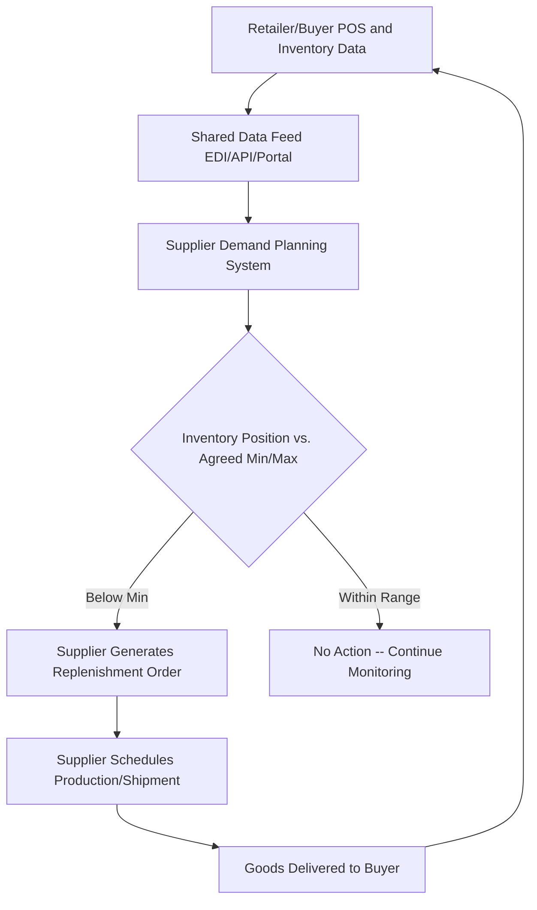

## Vendor-Managed Inventory

### Definition and Purpose

Vendor-Managed Inventory (VMI) is a supply chain arrangement in which the supplier (vendor), rather than the buyer (retailer or downstream customer), assumes responsibility for monitoring inventory levels at the customer's location and determining when and how much to replenish. The buyer grants the supplier visibility into its point-of-sale (POS) data, inventory positions, and often agreed-upon min/max inventory parameters, and the supplier uses this data to generate replenishment orders on the buyer's behalf — typically without the buyer issuing a traditional purchase order for each shipment.

VMI shifts the inventory *decision-making* responsibility upstream while often keeping inventory *ownership* with the buyer until consumption (though ownership arrangements vary by contract; see Consignment Inventory below). The underlying premise is that the supplier, who has visibility across many customers and production/logistics constraints, is often better positioned to optimize replenishment timing and quantity than the buyer, who sees only its own local demand signal.

### Core Mechanism and Data Flow

**Typical process flow:**

1. The buyer shares POS/consumption data and current inventory levels with the supplier, commonly via EDI (Electronic Data Interchange), a web-based portal, or API integration.
2. Both parties agree in advance on inventory parameters — minimum and maximum stock levels, target service levels, and lead-time assumptions.
3. The supplier's planning system continuously (or periodically) monitors the buyer's inventory position against these agreed parameters.
4. When inventory approaches the minimum threshold, the supplier generates and schedules a replenishment shipment, without waiting for a buyer-initiated purchase order.
5. The buyer receives, verifies, and typically still approves the shipment before it counts as a formal transaction, retaining an oversight/exception role even though day-to-day replenishment decisions are supplier-driven.

### VMI vs. Traditional Replenishment vs. CPFR

| Dimension | Traditional (Buyer-Managed) | VMI | CPFR |
| --- | --- | --- | --- |
| **Who decides replenishment quantity/timing** | Buyer | Supplier | Jointly, via structured forecast collaboration |
| **Who forecasts demand** | Buyer (from its own order history) | Supplier (from buyer's POS/inventory data) | Both parties, with formal exception-resolution process |
| **Trigger for order** | Buyer-issued purchase order | Supplier-generated shipment based on inventory monitoring | Jointly agreed forecast converted to firm order |
| **Data shared** | Purchase orders only | POS data, inventory levels, min/max parameters | POS, inventory, promotions, causal data, forecasts themselves |
| **Typical relationship depth** | Transactional | Operational collaboration | Strategic, multi-phase collaboration (9-step VICS model) |

VMI can be understood as one possible *execution mechanism* that may exist within a broader CPFR relationship, though many VMI arrangements operate independently of a full CPFR framework — VMI focuses specifically on replenishment execution, while CPFR encompasses joint forecasting and business planning more broadly.

### Ownership Models Within VMI

- **Standard VMI (title transfers at delivery/receipt)**: the buyer takes ownership when goods are delivered to its facility, as in conventional purchasing, but the supplier — not the buyer — decides shipment timing and quantity.
- **Consignment Inventory (a common VMI variant)**: the supplier retains ownership of the inventory even after it is physically located at the buyer's facility; title (and the associated payment obligation) transfers only when the buyer actually consumes or sells the item. This shifts inventory carrying-cost risk further onto the supplier and is common in industries with high-value or slow-turning components (e.g., industrial equipment, healthcare/surgical supplies).

### Worked Example

A beverage manufacturer implements VMI with a large grocery chain for a line of bottled drinks.

1. **Data sharing setup**: the grocery chain provides the manufacturer with daily POS data by SKU and store, plus current DC inventory levels, via an EDI 852 (Product Activity Data) transaction.
2. **Agreed parameters**: min/max inventory levels are set per SKU per DC — for a specific SKU, minimum = 500 cases, maximum = 2,000 cases, based on average demand and the manufacturer's 4-day replenishment lead time.
3. **Monitoring**: the manufacturer's planning system observes that DC inventory for this SKU has dropped to 480 cases (below the 500-case minimum), triggered by a regional heat wave increasing beverage sales.
4. **Replenishment decision**: without waiting for the grocery chain to issue a purchase order, the manufacturer's system automatically generates a replenishment shipment of 1,520 cases (bringing inventory to the 2,000-case maximum), scheduling production and delivery within the agreed 4-day lead time.
5. **Delivery and reconciliation**: the shipment arrives, the grocery chain confirms receipt, and an invoice is generated per the standard (non-consignment) VMI ownership model — title transfers at delivery, and payment terms follow the pre-negotiated contract.

This example illustrates VMI's key advantage: the manufacturer detected and reacted to the regional demand spike directly from POS data, without the delay of the grocery chain first recognizing the shortfall, generating an internal requisition, and issuing a purchase order.

### Benefits

- **Reduced bullwhip effect**: because the supplier reacts to actual POS/consumption data rather than the buyer's order pattern, demand-signal distortion is reduced relative to traditional order-based replenishment
- **Lower inventory across the supply chain**: suppliers can often optimize replenishment more efficiently across multiple customers simultaneously than each buyer can independently
- **Reduced buyer administrative burden**: the buyer's purchasing/planning staff are freed from routine reorder-point monitoring for VMI-managed items
- **Improved product availability**: faster reaction to demand signals typically reduces stockout frequency for the buyer
- **Improved supplier production planning**: visibility into real consumption data (rather than lagged, batched order data) allows the supplier to smooth its own production scheduling

### Limitations and Risks

- **Trust and data-sharing reluctance**: buyers may be hesitant to expose granular POS and inventory data, particularly regarding margin-sensitive or competitively significant SKUs
- **Supplier concentration risk**: VMI deepens the operational dependency on a given supplier, which can be a risk if the supplier's own capacity, financial health, or reliability deteriorates
- **System integration cost**: EDI/API integration between buyer and supplier systems requires upfront investment and ongoing maintenance
- **Potential for supplier over-optimization for its own benefit**: because the supplier controls replenishment quantity, there is an inherent (though usually contractually constrained) incentive risk that the supplier could favor its own production efficiency (e.g., preferring larger, less-frequent shipments to reduce its own setup costs) over the buyer's ideal inventory levels, unless min/max parameters and performance metrics are carefully governed
- [Inference] Because VMI shifts inventory-decision effort and risk toward the supplier, the arrangement is generally more attractive to suppliers when it deepens their overall relationship or volume with the buyer, and less attractive as a standalone concession absent other reciprocal terms — this is a structural/negotiating consideration rather than a purely operational one.

### Governance and Performance Monitoring

Effective VMI programs typically define explicit service-level agreements (SLAs) and performance metrics to prevent misalignment of incentives, commonly including:

- **Fill rate**: percentage of demand satisfied directly from stock without stockout
- **Inventory turnover**: monitored to ensure the supplier is not simply maximizing shipment size at the expense of buyer holding cost
- **On-time delivery performance**: against the agreed lead-time commitments
- **Min/max compliance**: periodic audits confirming actual inventory levels stay within agreed parameters, with exception review processes for deviations

### Benefits Summary Table

| Stakeholder | Primary Benefit |
| --- | --- |
| Buyer | Reduced stockouts, lower administrative burden, reduced inventory investment |
| Supplier | Improved production planning visibility, potentially deeper/more secure customer relationship |
| Overall Supply Chain | Reduced bullwhip effect, lower total inventory, improved responsiveness |

### Key Points

- VMI shifts replenishment decision-making (timing and quantity) from the buyer to the supplier, based on shared POS and inventory data
- VMI is distinct from CPFR: VMI is an execution mechanism focused on replenishment, while CPFR is a broader joint-forecasting and business-planning framework
- Inventory ownership under VMI can follow standard transfer-at-delivery terms, or a consignment model where the supplier retains title until consumption
- Success depends on data-sharing trust, system integration, and clearly governed performance metrics to align supplier incentives with buyer inventory goals

### Related Topics

- Collaborative Planning, Forecasting, and Replenishment (CPFR)
- Bullwhip effect and its causes/mitigation
- Continuous review vs. periodic review inventory systems
- Consignment inventory arrangements
- Supplier relationship management and performance scorecards
- EDI standards in supply chain data exchange
- AI and machine learning in demand sensing