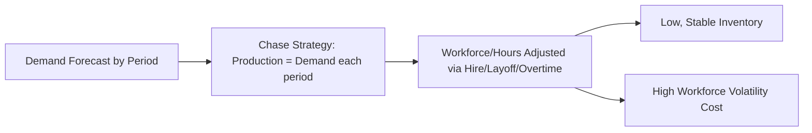
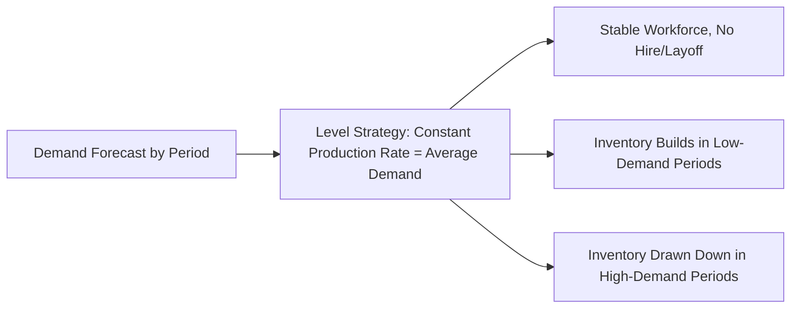

## Aggregate Planning Strategies: Chase, Level, and Hybrid

### Definition and Purpose

Aggregate planning is the process of determining production levels, workforce size, inventory levels, and related resource commitments over an intermediate planning horizon (typically 3–18 months), working at an aggregated level (product families or total output measured in common units, such as labor hours or standardized units) rather than at the individual SKU level. The three fundamental aggregate planning strategies — chase, level, and hybrid — represent distinct approaches to reconciling fluctuating demand with production capacity over this horizon, each making a different trade-off among workforce stability, inventory investment, and cost.

The choice of strategy directly determines which cost categories an organization incurs and which it avoids: chase strategy incurs workforce-change costs to avoid inventory costs, level strategy incurs inventory costs to avoid workforce-change costs, and hybrid strategies blend both to manage the trade-off according to organizational priorities.

### Relevant Cost Categories

Before comparing strategies, it is necessary to identify the cost types each strategy manipulates:

- **Hiring cost**: cost of recruiting, hiring, and training additional workers
- **Layoff/termination cost**: severance costs, unemployment insurance impact, and loss of institutional knowledge
- **Overtime premium cost**: additional wage cost for hours worked beyond standard capacity
- **Undertime/idle cost**: cost of paying workers when demand does not require full capacity utilization
- **Inventory holding cost**: cost of carrying finished goods inventory built up during low-demand periods for use in high-demand periods
- **Backorder/stockout cost**: cost of unmet demand carried forward or lost
- **Subcontracting cost**: cost of outsourcing production during demand peaks that exceed internal capacity

### Chase Strategy

**Definition:** The chase strategy matches production output (and by extension, workforce or capacity) directly to demand in each period, varying the workforce level (through hiring and layoffs) or working-hours level (through overtime and undertime) period by period to track demand closely.

**Mechanism:** Production capacity is adjusted up during high-demand periods and down during low-demand periods, so that inventory levels remain low and relatively constant throughout the planning horizon.

**Primary cost driver:** hiring, layoff, and/or overtime/undertime costs — inventory holding cost is minimized since output tracks demand closely.

**When chase is favored:**

- The product is perishable or has high holding cost, making inventory accumulation impractical or expensive
- Labor is relatively low-skill, easy to hire/train quickly, and layoffs carry low institutional/morale cost
- Demand fluctuations are large and predictable enough to plan workforce changes in advance
- The organization has flexible labor arrangements (temporary staffing agreements, seasonal labor pools)

### Level Strategy

**Definition:** The level strategy maintains a constant workforce size and constant production rate throughout the planning horizon, regardless of period-to-period demand fluctuations, absorbing the difference between production and demand through inventory building (in low-demand periods) and inventory drawdown (in high-demand periods), or through backorders when inventory is insufficient.

**Mechanism:** Production output is held steady at a rate typically equal to average demand over the horizon; surplus production during low-demand periods builds inventory, which is then depleted during high-demand periods.

**Primary cost driver:** inventory holding cost (and potentially backorder cost during peak periods if built-up inventory is insufficient) — workforce-change costs are minimized since the workforce remains stable.

**When level is favored:**

- Holding cost is relatively low and the product is not perishable or does not become obsolete quickly
- Skilled labor is scarce, expensive to train, or costly/disruptive to hire and lay off repeatedly
- Workforce morale and organizational culture place high value on employment stability
- Demand fluctuations are moderate enough that reasonable inventory levels can absorb the variability without excessive holding cost

### Hybrid (Mixed) Strategy

**Definition:** A hybrid strategy combines elements of chase and level approaches, using some combination of moderate workforce adjustments, overtime/undertime, limited inventory building, subcontracting, and backordering to balance the cost trade-offs rather than pursuing either extreme.

**Mechanism:** Rather than fully matching demand each period (chase) or holding production perfectly flat (level), a hybrid plan might, for example, maintain a stable core workforce sized to the low-demand baseline, use overtime to cover moderate demand increases, build limited inventory ahead of predictable seasonal peaks, and subcontract only the portion of peak demand that exceeds both overtime capacity and built-up inventory.

**Primary cost driver:** a blended mix of moderate holding cost, moderate overtime cost, and limited hiring/layoff cost — hybrid strategies are generally the most commonly used in practice because pure chase or pure level strategies are rarely cost-optimal or operationally feasible in isolation.

[Inference] Because most real organizations face both workforce constraints (limits on how quickly workers can be hired/trained/laid off) and holding-cost constraints (limits on warehouse space or product shelf life), hybrid strategies are more prevalent in practice than either pure strategy, even though textbook examples often isolate chase and level for pedagogical clarity.

### Strategy Comparison Table

| Dimension | Chase Strategy | Level Strategy | Hybrid Strategy |
| --- | --- | --- | --- |
| **Workforce/production rate** | Varies to match demand each period | Constant throughout horizon | Partially varies (moderate adjustments) |
| **Inventory level** | Low and stable | Fluctuates (builds and depletes) | Moderate fluctuation |
| **Primary cost incurred** | Hiring/layoff/overtime cost | Inventory holding cost | Blend of both, plus possibly subcontracting |
| **Workforce stability/morale** | Low (frequent hire/layoff cycles) | High (stable employment) | Moderate |
| **Best suited for** | Perishable goods, low-skill/flexible labor | Skilled labor, low holding cost, non-perishable goods | Most real-world manufacturing/service contexts |
| **Capital tied up in inventory** | Low | High | Moderate |

### Worked Example

A company forecasts the following quarterly demand (in standardized units) for the next year, with one worker able to produce 500 units per quarter at regular time, a regular-time labor cost of $3,000 per worker per quarter, a hiring cost of $500 per worker, a layoff cost of $800 per worker, and a holding cost of $2 per unit per quarter:

| Quarter | Demand (units) |
| --- | --- |
| Q1 | 4,000 |
| Q2 | 6,000 |
| Q3 | 8,000 |
| Q4 | 5,000 |

**Total annual demand** = 23,000 units; **average quarterly demand** = 5,750 units.

**Pure Chase Strategy:**

Workforce required each quarter = Demand ÷ 500 units/worker:

| Quarter | Demand | Workers Needed | Workers Prior Quarter | Hires | Layoffs |
| --- | --- | --- | --- | --- | --- |
| Q1 | 4,000 | 8 | (start) 8 | 0 | 0 |
| Q2 | 6,000 | 12 | 8 | 4 | 0 |
| Q3 | 8,000 | 16 | 12 | 4 | 0 |
| Q4 | 5,000 | 10 | 16 | 0 | 6 |

Total hires = 8 (4+4); total layoffs = 6.

Hiring cost = $8 \times \$500 = \$4{,}000$; Layoff cost = $6 \times \$800 = \$4{,}800$.

Regular-time labor cost = $(8+12+16+10) \times \$3{,}000 = 46 \times \$3{,}000 = \$138{,}000$.

Inventory holding cost ≈ $0 (production matches demand each quarter, no carryover).

**Total Chase Strategy Cost ≈ $138,000 + $4,000 + $4,800 = $146,800**

**Pure Level Strategy:**

Constant workforce sized to meet *average* demand: $5{,}750 \div 500 = 11.5$, rounded to **12 workers** (to avoid any shortfall), producing $12 \times 500 = 6{,}000$ units/quarter.

| Quarter | Demand | Production | Ending Inventory |
| --- | --- | --- | --- |
| Q1 | 4,000 | 6,000 | 2,000 |
| Q2 | 6,000 | 6,000 | 2,000 |
| Q3 | 8,000 | 6,000 | 0 (2,000 drawn down, exactly meets demand) |
| Q4 | 5,000 | 6,000 | 1,000 |

Regular-time labor cost = $12 \times 4 \times \$3{,}000 = \$144{,}000$ (constant workforce, no hires/layoffs after initial staffing).

Average ending inventory-quarters ≈ $(2{,}000 + 2{,}000 + 0 + 1{,}000) = 5{,}000$ unit-quarters of holding exposure; approximate holding cost = $5{,}000 \times \$2 = \$10{,}000$ (a simplified approximation; precise calculation would use average inventory within each quarter rather than ending inventory alone).

**Total Level Strategy Cost ≈ $144,000 + $10,000 = $154,000**

**Comparison:** in this simplified example, chase strategy (≈$146,800) is marginally less costly than level strategy (≈$154,000), primarily because labor cost dominates and the level strategy requires carrying 12 workers even during the lowest-demand quarter (Q1, where only 8 are needed). [Inference] This result is sensitive to the specific cost parameters assumed; a scenario with higher hiring/layoff costs relative to holding cost, or more skilled/scarce labor, would commonly favor level or hybrid strategies instead — the worked numbers here illustrate the calculation method, not a universal conclusion that chase is generally cheaper.

**Hybrid alternative (illustrative, not fully costed here):** maintain a stable core workforce of 10 workers (5,000 units/quarter capacity) year-round, use overtime to cover the Q2 and Q3 shortfalls (1,000 and 3,000 units respectively) at an overtime premium, and accept modest inventory buildup or drawdown for the remaining gaps — avoiding both large-scale layoffs and large sustained inventory buildup.

### Linear Programming Formulation (General Structure)

Aggregate planning problems, particularly hybrid strategies with multiple decision variables, are commonly solved using linear programming, with a general objective function structured as:

$$\min \sum_{t=1}^{T} \left( C_h H_t + C_l L_t + C_r R_t + C_o O_t + C_i I_t + C_b B_t + C_s S_t \right)$$

subject to production-demand balance constraints for each period $t$, where $H_t, L_t, R_t, O_t, I_t, B_t, S_t$ represent hires, layoffs, regular-time output, overtime output, ending inventory, backorders, and subcontracted units respectively in period $t$, each with an associated unit cost $C$. [Inference] This LP formulation is the standard method taught for solving hybrid aggregate planning problems with many periods or complex constraint sets, since manual trial-and-error (as used in the simplified chase/level comparison above) becomes impractical beyond a small number of periods or decision variables.

### Benefits and Trade-Offs Summary

- **Chase** minimizes inventory investment and obsolescence risk but incurs workforce volatility costs and potential morale/quality impacts from frequent hiring and layoffs
- **Level** minimizes workforce disruption and preserves institutional knowledge/skill but requires holding capacity for inventory investment and carries obsolescence/spoilage risk
- **Hybrid** allows an organization to tailor the balance of these costs to its specific labor market, product characteristics, and financial constraints, and is the most commonly implemented approach in practice

### Limitations and Considerations

- Aggregate plans operate on aggregated units (e.g., total labor hours or a standardized product-family unit), and must later be **disaggregated** into a detailed master production schedule (MPS) at the individual SKU level — a separate but related planning step
- The choice of strategy interacts with broader HR policy, union agreements, and regional labor market conditions, which may constrain the feasibility of rapid hiring/layoff cycles assumed in a pure chase strategy
- [Unverified] The relative prevalence of pure chase, pure level, and hybrid strategies across industries is not something that should be asserted with specific statistics absent a cited industry survey; general statements above about hybrid being "most common in practice" reflect standard operations management pedagogy rather than a specific empirical benchmark.

### Key Points

- Chase strategy varies workforce/production to match demand, minimizing inventory but incurring hiring/layoff/overtime costs
- Level strategy holds workforce/production constant, absorbing demand variability through inventory, minimizing workforce disruption but incurring holding costs
- Hybrid strategies blend both approaches and are the most commonly applied in real-world settings due to labor and holding-cost constraints on either pure extreme
- Complex hybrid aggregate planning problems are typically solved via linear programming rather than manual trial-and-error methods

### Related Topics

- Master production scheduling and disaggregation
- Sales and Operations Planning (S&OP) process
- Linear programming methods in operations planning
- Workforce scheduling and labor flexibility strategies
- Functions and types of inventory (anticipation stock, in the level strategy context)
- Capacity planning and utilization
- Subcontracting and outsourcing decisions in production planning