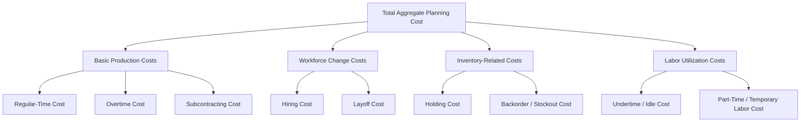

## Cost Factors in Aggregate Planning

### Definition and Purpose

Cost factors in aggregate planning are the categories of expense that vary depending on which production and workforce decisions are made across an intermediate planning horizon, and which therefore must be quantified and compared when selecting among chase, level, or hybrid strategies (or when formulating a linear programming model to solve the aggregate planning problem). Accurately identifying and estimating each cost factor is a prerequisite to any aggregate planning analysis, since the entire purpose of comparing planning strategies is to minimize the total sum of these costs over the planning horizon.

Unlike costs relevant to lot-sizing decisions (ordering cost, holding cost, as in EOQ) or single-period decisions (underage/overage cost, as in the newsvendor model), aggregate planning cost factors specifically concern the intermediate-term deployment of *workforce and production capacity* against a forecasted demand pattern.

### Category 1: Basic Production Costs

- **Regular-time cost**: the cost of producing one unit (or one unit-equivalent of output) using the standard workforce during normal working hours, typically including direct labor and variable overhead. This is the baseline cost against which all other production-cost categories represent a premium or an alternative.
- **Overtime cost**: the incremental cost of producing output beyond regular-time capacity using the existing workforce working extra hours, almost always at a wage premium (commonly time-and-a-half or double-time, depending on labor agreements and jurisdiction).
- **Subcontracting cost**: the cost of having an external supplier produce units on the organization's behalf during periods when internal capacity (even with overtime) is insufficient to meet demand. Subcontracting cost per unit is typically higher than internal regular-time cost, since it includes the subcontractor's own margin, but it avoids the need to add permanent internal capacity for what may be a temporary demand peak.

### Category 2: Workforce Change Costs

- **Hiring cost**: cost of recruitment, onboarding, and training incurred each time the workforce is increased. This cost is often nonlinear in practice — training productivity losses during a new hire's ramp-up period are a real cost even when not separately itemized in a simplified model.
- **Layoff (termination) cost**: cost of severance payments, unemployment insurance rate impacts, and administrative processing incurred each time the workforce is decreased. Layoffs also carry harder-to-quantify costs: loss of institutional knowledge, potential quality degradation from reduced experienced-worker density, and morale/reputation effects on remaining and future employees.

These two cost categories are the primary cost driver of a **chase strategy**, since chase deliberately varies workforce size to track demand, incurring hiring and layoff costs repeatedly across the planning horizon.

### Category 3: Inventory-Related Costs

- **Holding (carrying) cost**: the cost of carrying one unit of inventory for one period, comprising capital cost (opportunity cost of capital tied up in inventory), storage/warehousing cost, insurance, taxes, and obsolescence/spoilage risk. This is the same holding-cost concept used in EOQ and reorder-point models, applied here to the inventory built up under a level or hybrid aggregate plan.
- **Backorder/stockout cost**: the cost of demand that cannot be met from current inventory or current-period production and must either be fulfilled later (backordered, incurring expediting cost and customer dissatisfaction) or is permanently lost (lost-sale cost, equal to lost margin plus potential goodwill/reputation damage).

Holding cost is the primary cost driver of a **level strategy**, since level strategy deliberately maintains constant production and absorbs demand fluctuations through inventory buildup and drawdown.

### Category 4: Labor Utilization Costs

- **Undertime (idle time) cost**: the cost of paying workers their regular wage during periods when production requirements are below the workforce's full capacity, effectively paying for unused labor capacity. This cost arises specifically under a level or hybrid strategy that maintains a workforce sized above the current period's actual requirement.
- **Part-time/temporary labor cost**: the cost of using flexible labor arrangements (temporary staffing agencies, part-time workers) as an alternative to permanent hiring/layoff cycles — often used specifically to reduce the hiring/layoff cost burden of a chase-oriented strategy while retaining some workforce flexibility.

### How Cost Factors Map to Planning Strategies

| Cost Factor | Chase Strategy Relevance | Level Strategy Relevance | Hybrid Strategy Relevance |
| --- | --- | --- | --- |
| Regular-time cost | Always present (baseline) | Always present (baseline) | Always present (baseline) |
| Overtime cost | Sometimes used to smooth extreme peaks | Rarely primary driver | Commonly used to cover moderate peaks without full hiring |
| Subcontracting cost | Occasionally, for peaks exceeding hire capacity | Rarely needed | Commonly used for peak overflow |
| Hiring/layoff cost | **Primary driver** — incurred every period demand shifts | Minimal (workforce constant) | Moderate — some adjustment, less frequent than chase |
| Holding cost | Minimal (production tracks demand) | **Primary driver** — inventory absorbs all variability | Moderate — partial inventory buffering |
| Backorder/stockout cost | Minimal if hiring is timely | Possible if peak demand exceeds built-up inventory | Possible, managed alongside other buffers |
| Undertime cost | Minimal (workforce sized to demand each period) | Present during low-demand periods (workforce exceeds need) | Present but smaller than pure level strategy |

### Worked Example: Estimating and Comparing Cost Factors

A manufacturer is evaluating two possible responses to a demand increase of 2,000 units in an upcoming quarter, where current regular-time capacity is fully utilized:

**Option A — Overtime:**

- Overtime premium = $15/unit above regular-time cost of $40/unit → total overtime cost = $55/unit
- Total cost for 2,000 units = $2{,}000 \times \$55 = \$110{,}000$

**Option B — Hire additional temporary workers:**

- Hiring cost = $300/worker; each worker produces 100 units/quarter at regular-time cost of $40/unit
- Workers needed = $2{,}000 \div 100 = 20$ workers
- Hiring cost = $20 \times \$300 = \$6{,}000$
- Regular-time production cost = $2{,}000 \times \$40 = \$80{,}000$
- Layoff cost (assuming workers are let go after the quarter, at $250/worker) = $20 \times \$250 = \$5{,}000$
- **Total cost for Option B** = $6,000 + $80,000 + $5,000 = $91,000

**Comparison:** Option B (hiring temporary workers for the single quarter) totals $91,000 versus Option A (overtime) totaling $110,000 — in this scenario, temporary hiring is the lower-cost choice once hiring and layoff costs are both fully accounted for, despite carrying two distinct cost categories (hiring and layoff) that overtime avoids entirely. [Inference] This numeric conclusion is specific to the assumed cost parameters; a scenario with a smaller overtime premium, or a higher hiring/layoff cost per worker (e.g., for more specialized/skilled roles), could reverse the comparison — the calculation method, not the specific numeric conclusion, is the generalizable takeaway.

### Cost Estimation Challenges in Practice

- **Holding cost estimation**: as with EOQ-related models, holding cost is often expressed as a percentage of unit value (commonly cited in the range of 15–30% annually in various operations management texts), but the appropriate rate depends on the organization's cost of capital, storage cost structure, and obsolescence risk specific to the product
- **Hiring/layoff cost estimation**: beyond direct recruitment and severance costs, indirect costs (training-period productivity loss, morale impact on remaining staff, potential unionized-labor contractual constraints on layoff timing/notice) are difficult to quantify precisely and are sometimes omitted from simplified models, understating the true cost of a chase-heavy strategy
- **Backorder/lost-sale cost estimation**: quantifying goodwill loss or long-term customer-relationship damage from a stockout is inherently more subjective than the other cost categories, which are generally based on direct, observable transactions
- [Unverified] Specific numeric benchmarks for any of these cost categories (e.g., "hiring costs typically run X% of first-year salary") vary substantially by industry, role type, and region, and should be sourced from a specific, current industry study rather than treated as universal constants.

### Benefits of Systematic Cost Factor Identification

- Enables a structured, quantitative comparison between chase, level, and hybrid strategies rather than a qualitative or intuition-based choice
- Provides the necessary cost inputs for formal optimization methods (e.g., linear programming) used to solve complex, multi-period aggregate planning problems
- Surfaces hidden or indirect costs (e.g., undertime, training productivity loss) that might otherwise be overlooked in a simplified analysis focused only on direct wage costs
- Supports sensitivity analysis — testing how the optimal strategy shifts if a given cost factor (e.g., holding cost, or hiring cost) changes materially

### Limitations and Considerations

- Real organizations frequently face cost factors that are not purely linear (e.g., a large layoff may trigger a step-function cost such as a plant-closure notification requirement, or a large hire may exceed a training program's capacity, forcing higher per-unit training cost above a threshold), which simplified linear cost models do not always capture
- Some cost factors interact with non-financial constraints (e.g., a labor contract may cap the frequency or magnitude of workforce changes regardless of the calculated cost-optimal solution), meaning the "lowest cost" plan by these factors alone may not be organizationally or legally feasible
- Cost factors relevant to aggregate planning should not be confused with the cost factors used in EOQ/lot-sizing (ordering cost, unit holding cost per SKU) or newsvendor models (underage/overage cost) — while holding cost appears in multiple models, its calculation context (aggregate workforce-driven inventory buildup vs. per-SKU cycle stock) differs

### Key Points

- Aggregate planning cost factors fall into four categories: basic production costs (regular time, overtime, subcontracting), workforce change costs (hiring, layoff), inventory-related costs (holding, backorder/stockout), and labor utilization costs (undertime, temporary labor)
- Chase strategy is driven primarily by workforce change costs; level strategy is driven primarily by holding cost; hybrid strategies balance a blend of all categories
- Accurately estimating each cost factor — including harder-to-quantify indirect costs like training productivity loss or goodwill damage from stockouts — is essential for a valid strategy comparison
- These cost factors are distinct from, though conceptually related to, the cost factors used in EOQ and newsvendor models

### Related Topics

- Aggregate planning strategies: chase, level, and hybrid
- Linear programming formulation of the aggregate planning problem
- Sales and Operations Planning (S&OP) process
- Economic Order Quantity (EOQ) model (holding and ordering cost concepts)
- Single-period newsvendor model (underage/overage cost concepts)
- Workforce scheduling and labor contract constraints
- Master production scheduling and disaggregation