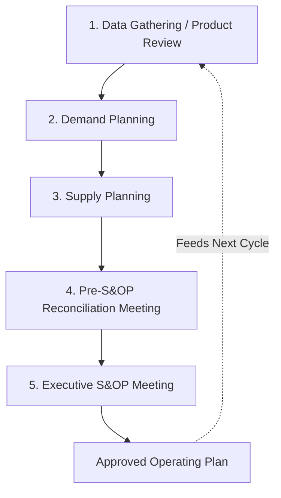

## The Sales and Operations Planning Process

### Definition and Purpose

Sales and Operations Planning (S&OP) is a cross-functional business process that reconciles demand plans (sales, marketing forecasts) with supply plans (production, procurement, capacity) on a recurring monthly cycle, producing a single, agreed-upon operating plan that aligns the organization's commercial and operational functions with financial goals. S&OP operates at the aggregate level (product families, not individual SKUs) over an intermediate horizon (typically 3–18 months, often extending to 24 months in more mature implementations), and serves as the organizational governance mechanism through which aggregate planning strategies (chase, level, hybrid) are actually selected, approved, and monitored.

The purpose of S&OP is to prevent the common organizational failure mode in which sales, marketing, finance, and operations each maintain separate, unreconciled plans, leading to mismatches such as overproduction, stockouts, or financial targets that operations cannot feasibly support. S&OP creates a single forum and a single set of numbers that all functions commit to.

### Origins and Evolution

S&OP originated in the 1980s, closely associated with Oliver Wight, as an extension of Manufacturing Resource Planning (MRP II) concepts into a broader executive decision-making process. Over subsequent decades, the process has evolved and is increasingly referred to as **Integrated Business Planning (IBP)** in more mature organizations, reflecting a broader scope that explicitly incorporates financial planning and new-product introduction alongside the original demand-supply reconciliation focus. [Inference] The terms S&OP and IBP are sometimes used interchangeably in practice, though IBP is generally presented in more recent literature as a more mature, financially integrated evolution of the original S&OP concept rather than a wholly separate process.

### The Standard Five-Step Monthly S&OP Cycle

**Step 1 — Data Gathering / Product Review:**

Historical sales data, current inventory positions, and new-product-introduction plans are compiled. This step often includes a formal product review, examining product lifecycle status, discontinuations, and pipeline additions that will affect future demand and supply requirements.

**Step 2 — Demand Planning:**

Sales, marketing, and demand-planning teams develop a consensus demand forecast at the product-family level, incorporating statistical forecasts, market intelligence, promotional plans, and sales-team input. The output is an **unconstrained demand plan** — what the organization believes it could sell, before checking whether supply can support it.

**Step 3 — Supply Planning:**

Operations and supply-chain teams evaluate whether current production capacity, workforce, materials, and logistics can meet the demand plan. Where gaps exist, supply planners identify options: overtime, subcontracting, inventory drawdown, or — if the gap cannot be closed — a recommendation to constrain the demand plan. This step directly draws on the aggregate planning strategies and cost factors covered in the preceding topics.

**Step 4 — Pre-S&OP (Reconciliation) Meeting:**

Mid-level managers from sales, operations, finance, and product management meet to reconcile the demand and supply plans, identify unresolved gaps or conflicts (e.g., demand exceeding feasible supply, or a promotional plan requiring capacity investment), and prepare a set of clear decision options and financial implications for executive review. This step is critical: issues should be resolved or clearly framed here, not left unaddressed for the executive meeting.

**Step 5 — Executive S&OP Meeting:**

Senior leadership (often including the CEO/General Manager in mature implementations) reviews the reconciled plan, resolves any remaining major gaps or trade-off decisions (e.g., approving capital investment to expand capacity, or accepting a lower demand plan for a constrained product), and formally approves the operating plan for the coming period. This approved plan becomes the basis for the detailed master production schedule and financial forecasts until the next monthly cycle.

### Key Outputs of the S&OP Process

- **An approved, single operating plan** for volumes by product family, reconciling demand and supply
- **A financial plan** consistent with the operating plan (revenue, cost, and margin projections aligned with actual production/sales capability)
- **Explicit identification of gaps and risks** (e.g., capacity shortfalls, demand upside opportunities) with agreed mitigation actions
- **Inputs to the master production schedule (MPS)**, which disaggregates the family-level S&OP plan into item-level production schedules

### The Demand-Supply Balancing Logic

At its core, each S&OP cycle addresses a balancing equation for each product family and period:

$$\text{Supply Plan} \geq \text{Demand Plan} - \text{Available Inventory} + \text{Desired Ending Inventory}$$

When supply capability falls short of this requirement, the S&OP process must resolve the gap through one or more levers: increasing supply (overtime, subcontracting, capacity investment), reducing the demand plan (fewer promotions, allocation/rationing), or adjusting the inventory strategy (accepting lower service levels temporarily, or drawing down safety stock).

### Worked Example

A consumer electronics manufacturer runs its monthly S&OP cycle for a headphone product family.

1. **Data Gathering**: the product review flags that a competing product line is being discontinued next quarter, likely increasing demand for the manufacturer's mid-tier headphone family.
2. **Demand Planning**: the sales and marketing team, incorporating the competitor discontinuation intelligence, raises the unconstrained demand forecast for the family from 50,000 to 65,000 units for the upcoming quarter.
3. **Supply Planning**: operations reviews current capacity (48,000 units/quarter at regular time) and determines that meeting 65,000 units requires either 17,000 units of overtime/subcontracted production or a combination of moderate overtime (10,000 units) plus drawing down 7,000 units of existing finished-goods inventory.
4. **Pre-S&OP Meeting**: mid-level managers review both options' financial impact — the overtime/subcontract-only option costs an estimated $85,000 more than the blended option, but preserves inventory buffer for other product lines. The team prepares both options with financial trade-offs for executive review, recommending the blended option.
5. **Executive S&OP Meeting**: leadership approves the blended plan (10,000 units overtime, 7,000 units inventory drawdown), noting the trade-off of reduced inventory buffer against lower incremental cost, and formally sets the quarter's operating plan at 65,000 units for this product family.

This approved 65,000-unit plan then becomes the basis for the detailed master production schedule, translating the family-level decision into specific SKU-level production quantities and timing.

### S&OP's Relationship to Aggregate Planning and Other Processes

| Process | Scope | Horizon | Relationship to S&OP |
| --- | --- | --- | --- |
| **Aggregate Planning** | Product family, workforce/capacity decisions | 3–18 months | S&OP is the governance forum through which aggregate planning strategy choices (chase/level/hybrid) are decided and approved |
| **Master Production Schedule (MPS)** | Individual SKU/item level | Weeks to a few months | MPS disaggregates the S&OP-approved family-level plan into item-level detail |
| **Demand Forecasting** | Statistical/causal demand prediction | Varies (short to long horizon) | Feeds the Demand Planning step of S&OP as a key input |
| **CPFR** | Cross-company (buyer-supplier) forecast collaboration | Similar to S&OP horizon | A complementary, external-facing process; S&OP is primarily an internal cross-functional process, though mature CPFR relationships can feed into a company's internal S&OP demand plan |

### Maturity Levels of S&OP Implementation

Organizations commonly progress through recognized maturity stages:

1. **Informal/reactive**: no structured monthly cycle; functions plan independently and reconcile only when problems surface
2. **Basic S&OP**: a monthly cycle exists, but focuses primarily on volume reconciliation between sales and operations, with limited financial integration
3. **Advanced S&OP**: the process includes structured demand review, supply review, and executive decision-making, with reasonably reliable forecasts and cross-functional buy-in
4. **Integrated Business Planning (IBP)**: financial planning, new-product introduction, and strategic scenario planning are fully integrated into the monthly cycle, with the process explicitly linked to overall business strategy and typically involving top executive participation

[Unverified] Specific claims about what percentage of organizations operate at each maturity stage vary across different consulting and industry surveys and should be sourced from a specific, current study rather than asserted generally.

### Benefits

- Creates a single, agreed-upon plan across sales, operations, and finance, reducing the costly mismatches that arise from siloed, unreconciled planning
- Surfaces capacity and demand gaps with enough lead time (typically weeks to months ahead) to take corrective action, rather than discovering mismatches only when a stockout or overproduction event has already occurred
- Provides a structured forum for cross-functional trade-off decisions (e.g., accepting higher cost to protect service level, or vice versa) with financial visibility
- Establishes accountability, since functions formally commit to the numbers agreed upon in the executive meeting

### Limitations and Considerations

- S&OP's effectiveness depends heavily on data quality and forecast accuracy feeding into the Demand Planning step; a poor underlying forecast undermines the value of an otherwise well-run process
- The process requires sustained executive engagement and cross-functional discipline; if the Executive S&OP Meeting becomes a rubber-stamp exercise rather than a genuine decision forum, the process degrades toward the "informal/reactive" maturity level in practice despite nominally following the five-step structure
- Monthly cycle cadence may be too slow for industries with highly volatile, fast-moving demand, motivating supplementary short-horizon processes (such as demand sensing) to handle within-month adjustments that the monthly S&OP cycle cannot address
- [Inference] Organizations transitioning from basic to advanced S&OP or IBP maturity commonly face significant change-management challenges, since the process requires functions historically operating with independent goals and incentives (e.g., sales incentivized on volume, operations incentivized on cost efficiency) to accept a jointly reconciled plan.

### Key Points

- S&OP is a recurring (typically monthly) cross-functional process reconciling demand and supply plans at the product-family level
- The standard cycle comprises five steps: data gathering/product review, demand planning, supply planning, pre-S&OP reconciliation, and executive S&OP decision-making
- S&OP serves as the governance mechanism through which aggregate planning strategies and their associated cost trade-offs are formally selected and approved
- Integrated Business Planning (IBP) represents a more mature evolution of S&OP with deeper financial and strategic integration

### Related Topics

- Aggregate planning strategies: chase, level, and hybrid
- Cost factors in aggregate planning
- Master production scheduling and disaggregation
- Demand forecasting methods
- Collaborative Planning, Forecasting, and Replenishment (CPFR)
- AI and machine learning in demand sensing
- Integrated Business Planning (IBP) maturity models