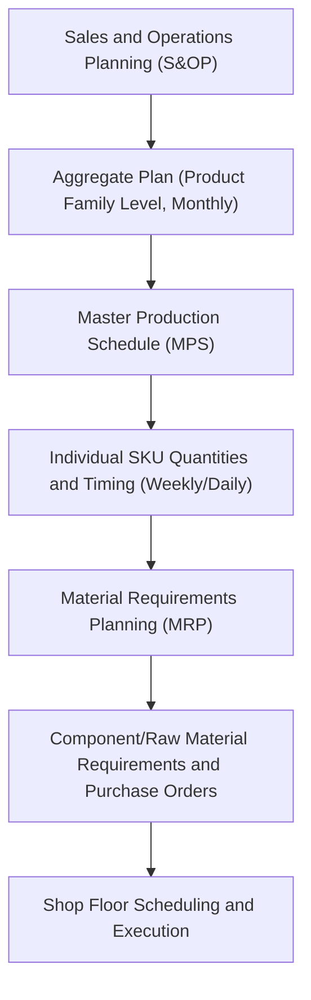

## Master Production Scheduling

### Definition and Purpose

Master Production Scheduling (MPS) is the process of translating an aggregate, product-family-level operating plan (typically approved through the S&OP process) into a detailed, time-phased schedule specifying the exact quantity and timing of production for individual end items (specific SKUs or finished-good configurations) over a shorter horizon than aggregate planning — commonly weeks to a few months, with weekly or even daily time buckets rather than the monthly buckets typical of S&OP.

MPS serves as the critical link between top-down aggregate/strategic planning and bottom-up detailed execution: it disaggregates the S&OP-approved family volume into specific item quantities, and its output becomes the primary input to Material Requirements Planning (MRP), which in turn determines component and raw-material requirements, purchasing schedules, and shop-floor production orders.

### Position in the Planning Hierarchy

MPS sits at the disaggregation boundary: everything above it (S&OP, aggregate planning) operates on aggregated units and longer time buckets; everything below it (MRP, shop-floor scheduling) operates on detailed, item-specific requirements derived from the MPS quantities.

### Core Inputs to the MPS Process

- **Aggregate production plan**: the family-level volume and timing approved through S&OP, which constrains total MPS output within each family
- **Firm customer orders**: confirmed orders that must be scheduled with certainty
- **Forecasted demand** for items not yet covered by firm orders (particularly relevant in make-to-stock environments)
- **Current inventory position** by item (on-hand stock, safety stock targets)
- **Available production capacity** by period, including any known constraints (equipment maintenance windows, planned changeovers)
- **Bill of materials (BOM) and lead-time data**, needed to translate finished-item schedules into component-level requirements downstream in MRP

### The MPS Record Structure

The MPS is typically maintained as a time-phased record for each item, showing the following rows across sequential time periods (commonly weeks):

| Row | Definition |
| --- | --- |
| **Forecast** | Statistically or judgmentally forecasted demand for the period |
| **Customer Orders (Actual/Booked)** | Confirmed orders already received for the period |
| **Projected Available Balance (PAB)** | Running inventory projection: prior period's PAB, plus this period's MPS quantity, minus the greater of forecast or actual orders (see formula below) |
| **Available-to-Promise (ATP)** | The portion of MPS quantity not yet committed to firm customer orders, available for new order promising |
| **Master Production Schedule (MPS) Quantity** | The planned production quantity for the period, the primary output of the process |

**Projected Available Balance formula:**

$$PAB_t = PAB_{t-1} + MPS_t - \max(\text{Forecast}_t, \text{Customer Orders}_t)$$

(Using the greater of forecast or actual orders reflects standard MPS logic in many environments: within the "demand time fence" — a near-term window where orders are considered firm and unlikely to change — actual orders are used; beyond it, forecast is used. Some implementations instead consume forecast by actual orders received, an alternative but related convention; the specific consumption logic can vary by system configuration.)

**Available-to-Promise (basic formula, first period):**

$$ATP_1 = \text{Beginning Inventory} + MPS_1 - \sum(\text{Customer Orders before next MPS receipt})$$

For subsequent periods with a new MPS receipt:

$$ATP_t = MPS_t - \sum(\text{Customer Orders until next MPS receipt})$$

### Worked Example

A furniture manufacturer maintains an MPS for a specific sofa model over a 4-week horizon. Beginning inventory = 50 units. Lot size for each MPS run = 200 units (produced in Weeks 1 and 3 per the production plan).

|  | Week 1 | Week 2 | Week 3 | Week 4 |
| --- | --- | --- | --- | --- |
| Forecast | 80 | 80 | 80 | 80 |
| Customer Orders | 90 | 70 | 40 | 20 |
| MPS Quantity | 200 | 0 | 200 | 0 |

**Step 1 — Calculate Projected Available Balance (PAB), using max(Forecast, Orders) each week:**

Week 1: $\max(80, 90) = 90$

$$PAB_1 = 50 + 200 - 90 = 160$$

Week 2: $\max(80, 70) = 80$

$$PAB_2 = 160 + 0 - 80 = 80$$

Week 3: $\max(80, 40) = 80$

$$PAB_3 = 80 + 200 - 80 = 200$$

Week 4: $\max(80, 20) = 80$

$$PAB_4 = 200 + 0 - 80 = 120$$

**Step 2 — Calculate Available-to-Promise (ATP):**

Week 1 (first period, includes beginning inventory): the MPS receipt of 200 in Week 1 must cover customer orders in Weeks 1 and 2 (the periods before the next MPS receipt in Week 3):

$$ATP_1 = (\text{Beginning Inventory} + MPS_1) - (\text{Orders}_1 + \text{Orders}_2) = (50 + 200) - (90 + 70) = 250 - 160 = 90$$

Week 3 (next MPS receipt): covers customer orders in Weeks 3 and 4 (through the end of the horizon, since no further MPS receipt is scheduled):

$$ATP_3 = MPS_3 - (\text{Orders}_3 + \text{Orders}_4) = 200 - (40 + 20) = 200 - 60 = 140$$

Weeks 2 and 4 show no ATP value of their own (0) since no new MPS receipt occurs in those weeks — any additional order-promising capability in those weeks is already captured in the ATP calculated at the prior MPS receipt point.

**Interpretation:** the planner can confidently promise up to 90 additional units to new customers in the Week 1–2 window, and up to 140 additional units in the Week 3–4 window, without touching inventory already committed to existing forecasts or orders. This is the core value of ATP: it gives sales/customer-service staff a defensible number for promising delivery dates without needing to consult production planning for every new order.

### Time Fences in MPS

MPS systems commonly use **time fences** to control how much flexibility exists to change the schedule as the planning horizon approaches execution:

- **Frozen zone (demand time fence)**: the near-term period (e.g., within lead time) during which the MPS is not changed except in exceptional circumstances, since components may already be committed, in production, or purchased
- **Slushy/trading zone**: a middle period where changes are possible but require review of resource and material implications
- **Liquid zone (planning time fence)**: the far-term period where the MPS can be changed relatively freely as new forecast or order information arrives

Time fences balance a fundamental tension: too much schedule flexibility (a "liquid" schedule extending too close to execution) causes shop-floor and supplier disruption from constant changes ("nervousness"); too little flexibility (an overly "frozen" schedule) prevents the organization from responding to genuine new demand information.

### MPS Nervousness

A recognized challenge in MPS management is **schedule nervousness** — excessive, disruptive changes to the MPS triggered by relatively small changes in forecast, actual orders, or upstream MRP netting logic. Nervousness is problematic because it cascades downstream: a small MPS change can trigger large changes in component-level MRP requirements (due to lot-sizing and lead-time offsetting), disrupting supplier schedules and shop-floor plans that had already been committed. Time fences are one primary mechanism for controlling nervousness, along with techniques such as firming planned orders within the frozen zone.

### Benefits

- Provides the essential disaggregation step connecting family-level S&OP decisions to item-level execution, without which aggregate plans could not be executed at the operational level
- ATP calculation gives customer-facing staff a rigorous, defensible basis for order promising without needing real-time production-planning consultation for every order
- Time-fence structures explicitly balance schedule stability (reducing costly downstream disruption) against responsiveness to new demand information
- Provides the direct input required for Material Requirements Planning (MRP) to calculate component and raw-material requirements

### Limitations and Considerations

- MPS accuracy is entirely dependent on the quality of its inputs (forecast accuracy, timely order capture, accurate inventory records); errors at this level propagate directly into MRP-driven purchasing and production commitments downstream
- Excessive schedule nervousness, if not controlled via time fences and related techniques, can generate substantial hidden costs in supplier disruption, expediting, and shop-floor inefficiency that are not always visible in the MPS record itself
- The specific consumption logic for forecast versus actual orders (which of the two is used, and how the transition across the demand time fence is handled) varies by ERP/APS system configuration, so the formulas presented represent a standard, commonly taught convention rather than a universal, single implementation
- [Unverified] The optimal placement of time fences (how many weeks or days each zone should span) depends heavily on specific lead times, product complexity, and industry norms, and should be derived from the organization's actual lead-time and volatility data rather than a generic rule.

### Key Points

- MPS disaggregates the S&OP-approved aggregate plan into item-level production quantities and timing, typically in weekly or daily time buckets
- The MPS record tracks forecast, customer orders, projected available balance (PAB), and available-to-promise (ATP) for each item and period
- ATP allows order-promising decisions without disturbing inventory already committed to existing forecasts or orders
- Time fences (frozen, slushy, liquid zones) manage the trade-off between schedule stability and responsiveness, controlling a phenomenon known as schedule nervousness

### Related Topics

- The sales and operations planning process
- Aggregate planning strategies: chase, level, and hybrid
- Material Requirements Planning (MRP)
- Bill of materials (BOM) and product structure
- Available-to-promise and order-promising logic
- Demand time fences and forecast consumption logic
- Capacity requirements planning (CRP)