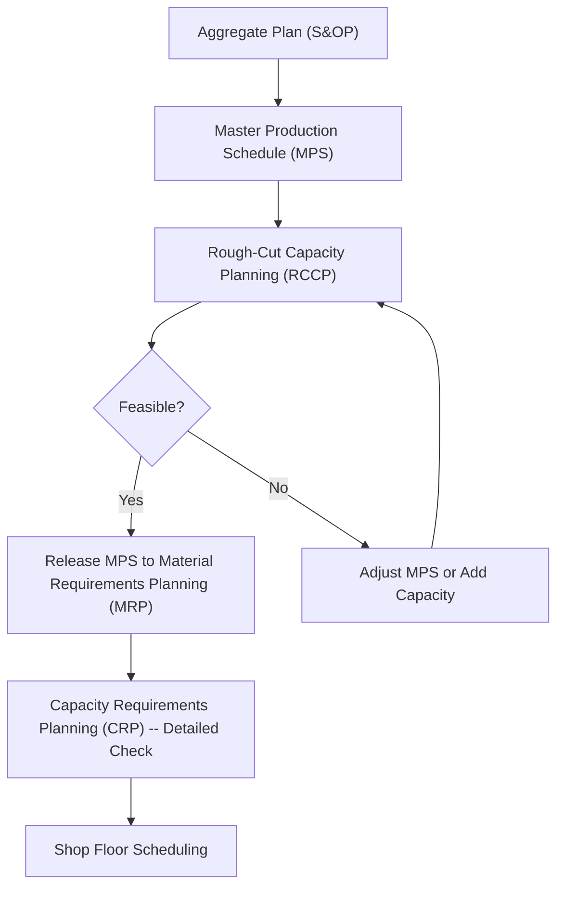

## Rough-Cut Capacity Planning

### Definition and Purpose

Rough-Cut Capacity Planning (RCCP) is a high-level, approximate technique for verifying whether a proposed Master Production Schedule (MPS) is feasible from a capacity standpoint, before that schedule is released for detailed material requirements planning (MRP) and shop-floor execution. RCCP checks only critical, capacity-constrained resources (bottleneck work centers, key labor skills, critical equipment) rather than exhaustively validating every resource in the production system, providing a fast feasibility check that avoids the computational and data burden of a full, detailed capacity analysis.

RCCP occupies a specific position in the planning hierarchy: it sits between the Master Production Schedule and the more detailed Capacity Requirements Planning (CRP) that follows MRP. Its purpose is to catch major capacity infeasibilities early — before detailed material plans and purchase commitments are made — so that the MPS can be adjusted while changes are still relatively low-cost, rather than discovering a capacity shortfall only after MRP has already generated detailed, cascading material and purchasing plans.

### Position in the Planning Hierarchy

RCCP acts as a gatekeeper: an MPS should not be formally released to drive detailed MRP and purchasing activity until it has passed this rough capacity feasibility check, since discovering an infeasibility after MRP has already generated purchase orders and shop orders is far more costly to correct.

### Core Methodology

RCCP calculates the capacity load a proposed MPS would place on critical resources, using standardized load profiles (also called **bills of resources** or **bills of capacity**), and compares this required capacity against known available capacity for each critical resource in each time period.

**Basic RCCP calculation:**

$$\text{Capacity Required}_{resource, t} = \sum_{items} (\text{MPS Quantity}_{item, t} \times \text{Resource Hours per Unit}_{item, resource})$$

This required capacity is then compared to:

$$\text{Capacity Available}_{resource, t} = (\text{Number of Machines or Workers}) \times (\text{Hours per Shift}) \times (\text{Shifts per Period}) \times (\text{Utilization/Efficiency Factor})$$

A resource is considered a capacity constraint (or "bottleneck" for RCCP purposes) if, across the MPS horizon, required capacity approaches or exceeds available capacity in any period.

### Common RCCP Techniques

| Technique | Description | Level of Detail |
| --- | --- | --- |
| **Capacity Planning using Overall Factors (CPOF)** | Applies a single historical ratio (e.g., total labor hours per aggregate unit of output) to the MPS total, allocated across work centers using historical proportions | Least detailed, fastest to compute |
| **Bill of Labor (or Bill of Capacity) Approach** | Uses a standard resource-requirement profile (hours per unit at each critical work center) for each end item, summed across the MPS | Moderate detail — item-specific but not fully time-phased by operation sequence |
| **Resource Profile (Time-Phased) Approach** | Similar to the bill-of-labor approach, but explicitly time-phases the resource requirement based on the item's lead-time offset structure (e.g., recognizing that a component's machining occurs 2 weeks before final assembly) | Most detailed of the three RCCP techniques, closest to (but still simpler than) full CRP |

[Inference] Organizations commonly select among these three techniques based on the trade-off between calculation speed/simplicity and accuracy; CPOF is typically used for very quick, high-level sanity checks, while the resource-profile approach is used when a more reliable rough-cut signal is needed before committing to detailed MRP.

### Worked Example (Bill of Labor Approach)

A machine shop plans to validate its MPS against capacity at its critical CNC machining work center, which has 3 machines, each available 40 hours/week, with an assumed 85% utilization/efficiency factor.

**Available capacity per week:**

$$\text{Capacity Available} = 3 \times 40 \times 0.85 = 102 \text{ hours/week}$}

**Bill of labor (CNC hours required per unit) for two products in the MPS:**

| Product | CNC Hours per Unit |
| --- | --- |
| Product A | 0.8 |
| Product B | 1.5 |

**Proposed MPS for the coming week:**

| Product | MPS Quantity |
| --- | --- |
| Product A | 60 units |
| Product B | 30 units |

**Required capacity:**

$$\text{Capacity Required} = (60 \times 0.8) + (30 \times 1.5) = 48 + 45 = 93 \text{ hours}$$

**Feasibility check:**

$$93 \text{ hours required} \leq 102 \text{ hours available}$$

The proposed MPS is feasible for the CNC work center in this week, with 9 hours of slack capacity (a utilization rate of approximately 91%, calculated as 93/102).

**Follow-on scenario — a demand increase:** if Product A's MPS quantity is later revised upward to 90 units (from 60) to capture an unexpected order:

$$\text{Capacity Required} = (90 \times 0.8) + (30 \times 1.5) = 72 + 45 = 117 \text{ hours}$$

$$117 \text{ hours required} > 102 \text{ hours available}$$

This reveals an **infeasible MPS** — a 15-hour weekly shortfall at the CNC work center. RCCP has flagged this gap before the MPS was released to MRP, giving planners the opportunity to resolve it through options such as adding a partial overtime shift, shifting some Product A volume to a later week with available slack, or subcontracting the shortfall — decisions made now, while adjustment is relatively low-cost, rather than after detailed material commitments have already been generated downstream.

### RCCP vs. Capacity Requirements Planning (CRP)

| Dimension | Rough-Cut Capacity Planning (RCCP) | Capacity Requirements Planning (CRP) |
| --- | --- | --- |
| **Timing in process** | Before MPS release, at the MPS stage | After MRP has generated detailed planned orders |
| **Scope** | Only critical/bottleneck resources | All work centers and resources potentially affected |
| **Level of detail** | Approximate, standard load profiles | Detailed, based on actual routing data and current shop-floor open orders |
| **Data requirements** | Lower — standard bills of resource/labor | Higher — full routings, current WIP status, detailed lead-time offsets |
| **Computation speed** | Fast, suitable for rapid what-if scenario testing during MPS development | Slower, more computationally intensive |
| **Primary use** | Quick feasibility screening before committing to a detailed plan | Fine-grained validation and scheduling adjustment after detailed planned orders exist |

RCCP and CRP are complementary, not redundant: RCCP's speed makes it suitable for testing multiple candidate MPS scenarios quickly during the planning stage, while CRP's greater precision is applied once a specific MPS has already been provisionally selected and passed through MRP.

### Benefits

- Provides an early, computationally inexpensive capacity feasibility check before the more resource-intensive MRP process is run, avoiding wasted planning effort on an infeasible MPS
- Enables rapid what-if scenario testing (e.g., "can we support this alternative MPS?") since it relies on standardized load profiles rather than full, detailed routing data
- Focuses attention specifically on critical/bottleneck resources, avoiding the analytical burden of checking every resource in the production system when only a few genuinely constrain output
- Surfaces capacity gaps early enough in the planning cycle that corrective options (overtime, subcontracting, MPS timing adjustment) remain relatively low-cost

### Limitations and Considerations

- RCCP's approximate nature (standard load profiles, aggregated utilization factors) means it can miss capacity problems at non-critical resources that nonetheless become bottlenecks under specific circumstances (e.g., an unusual product mix that stresses a resource not normally considered critical)
- The accuracy of RCCP depends heavily on how well the standard bill-of-labor/resource profiles reflect actual current shop-floor conditions; profiles that are not periodically updated to reflect process changes, new equipment, or efficiency improvements can produce misleading feasibility signals
- RCCP does not account for detailed sequencing, setup-time interactions between specific job sequences, or current work-in-process status at the level of detail that CRP provides, so a "feasible" RCCP result is not a guarantee that CRP will not later surface finer-grained scheduling conflicts
- [Unverified] The specific choice of utilization/efficiency factor (commonly cited examples range from roughly 80–95% in various operations management texts) should be derived from the organization's own historical performance data rather than assumed as a generic industry constant.

### Key Points

- RCCP is a fast, approximate capacity feasibility check performed on a proposed MPS before it is released to detailed MRP, focused only on critical/bottleneck resources
- Three common techniques exist at increasing levels of detail: Capacity Planning using Overall Factors (CPOF), the bill-of-labor approach, and the time-phased resource-profile approach
- RCCP compares required capacity (derived from standard load profiles applied to MPS quantities) against available capacity, flagging periods where required capacity exceeds available capacity
- RCCP complements, rather than replaces, the more detailed Capacity Requirements Planning (CRP) performed later, after MRP has generated detailed planned orders

### Related Topics

- Master production scheduling
- Capacity requirements planning (CRP)
- The sales and operations planning process
- Aggregate planning strategies: chase, level, and hybrid
- Material requirements planning (MRP)
- Bottleneck analysis and theory of constraints
- Bill of materials (BOM) and bill of resources/labor