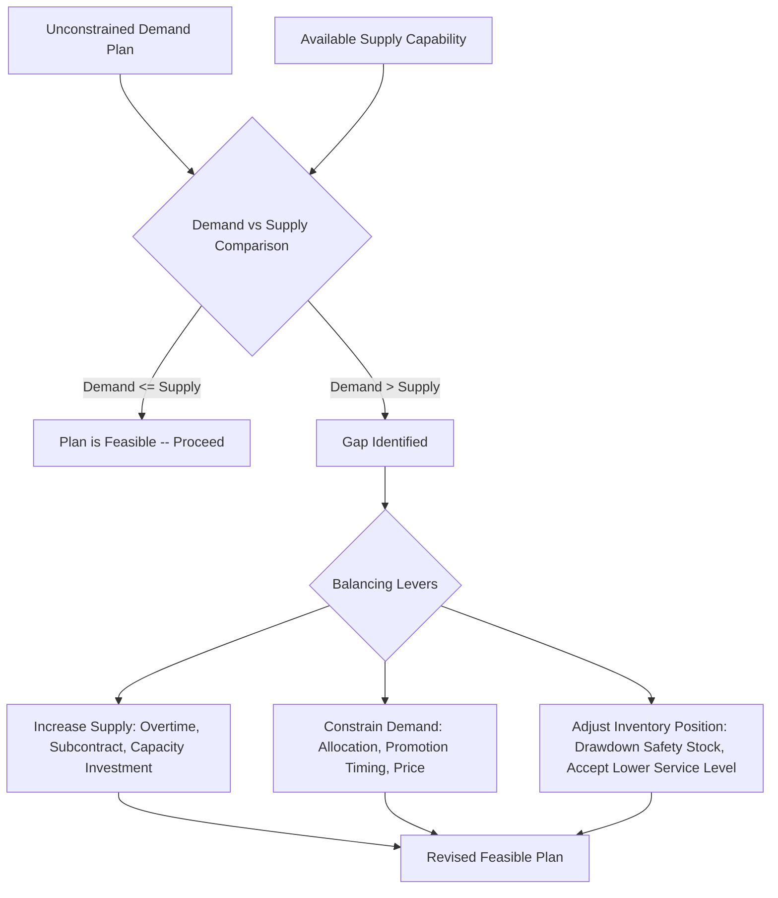

## Demand and Supply Balancing

### Definition and Purpose

Demand and supply balancing is the analytical and decision-making process of reconciling what the market wants (demand) with what the organization can feasibly produce or deliver (supply), across a given planning horizon, in order to arrive at a single, executable operating plan. While demand planning and supply planning are frequently treated as separate analytical activities — the former estimating future customer requirements, the latter estimating available production/procurement capability — balancing is the explicit reconciliation step where the two are compared, gaps are identified, and one or both sides are adjusted until a mutually feasible plan is reached.

This balancing activity is not confined to a single technique or formula; rather, it is the connective logic running through several planning processes already covered — aggregate planning, S&OP, and master production scheduling all fundamentally perform demand-supply balancing, at different levels of aggregation and different time horizons. This topic focuses on the general principles, levers, and analytical framework of balancing itself, as distinct from the specific processes that apply it.

### The General Balancing Framework

At its core, balancing addresses a single recurring question for each planning period and each level of aggregation (product family, item, or resource): **does available supply capability meet or exceed required demand, and if not, which lever should close the gap?**

### The Core Balancing Equation

$$\text{Supply Available}_t \geq \text{Demand Required}_t - \text{Beginning Inventory}_t + \text{Desired Ending Inventory}_t$$

Rearranged to express the gap explicitly:

$$\text{Gap}_t = (\text{Demand Required}_t - \text{Beginning Inventory}_t + \text{Desired Ending Inventory}_t) - \text{Supply Available}_t$$

A positive gap indicates a **supply shortfall** (demand exceeds what can be met), requiring one of the balancing levers below; a negative gap indicates **supply surplus** (capacity exceeds requirement), which may itself require a decision (e.g., whether to run at reduced utilization, pursue additional demand, or reduce planned capacity).

### Balancing Levers: Adjusting Supply

- **Overtime**: increasing output from existing workforce/equipment at a wage premium (as covered under aggregate planning cost factors)
- **Subcontracting**: outsourcing the shortfall portion of production to an external supplier
- **Capacity investment**: adding permanent capacity (new equipment, additional shift, expanded facility) — typically reserved for gaps expected to persist beyond the current planning horizon, given the higher cost and lead time of this lever
- **Alternate routing/resource substitution**: shifting production to underutilized equipment or facilities capable of producing the same item, even if less efficient
- **Drawing down existing finished-goods inventory**: using previously built stock to cover a temporary demand peak, rather than increasing current-period production

### Balancing Levers: Adjusting Demand

- **Order promising / allocation**: when supply cannot meet total demand, allocating available supply across customers or channels according to priority rules (e.g., key accounts first, or pro-rata allocation) rather than simply failing to serve the shortfall
- **Promotional timing adjustment**: shifting a planned promotion to a period with more available capacity, reducing the peak intensity of the demand-supply mismatch
- **Pricing adjustments**: using price increases to dampen demand during constrained periods, or price decreases to stimulate demand during periods of supply surplus (revenue management logic)
- **Product substitution encouragement**: directing customer demand toward an alternative product with available supply, when functionally acceptable substitutes exist

### Balancing Levers: Adjusting Inventory Position

- **Safety stock drawdown**: accepting a temporary reduction in safety stock buffer to cover a demand peak, with the understanding that stockout risk temporarily increases until the buffer is rebuilt
- **Accepting a lower service level temporarily**: a deliberate, explicit decision (rather than an unplanned failure) to allow a higher stockout probability for a defined period, in exchange for avoiding a more costly supply-side adjustment
- **Building anticipation inventory ahead of a known future gap**: proactively increasing production before a forecasted demand peak, when the peak is predictable far enough in advance (this is the anticipation-stock function covered under inventory types)

### Worked Example

A appliance manufacturer's S&OP process identifies the following situation for a mid-tier refrigerator model over the next quarter:

- **Unconstrained demand plan**: 45,000 units (reflecting sales team input and a planned retail promotion)
- **Beginning inventory**: 3,000 units
- **Desired ending inventory** (per company safety-stock policy): 5,000 units
- **Available regular-time supply capability**: 40,000 units

**Step 1 — Calculate the gap:**

$$\text{Required Supply} = 45{,}000 - 3{,}000 + 5{,}000 = 47{,}000 \text{ units}$$

$$\text{Gap} = 47{,}000 - 40{,}000 = 7{,}000 \text{ units (shortfall)}$$

**Step 2 — Evaluate balancing options presented at the pre-S&OP reconciliation meeting:**

| Option | Description | Cost Impact | Resulting Feasibility |
| --- | --- | --- | --- |
| A: Overtime | Add 7,000 units via overtime at $12/unit premium | +$84,000 | Fully closes gap |
| B: Subcontract | Outsource 7,000 units at $18/unit premium | +$126,000 | Fully closes gap |
| C: Reduce ending inventory target | Accept ending inventory of 2,000 (below the 5,000 target) instead of adding supply | $0 direct cost, but reduces safety buffer for following quarter | Fully closes gap, shifts risk forward |
| D: Delay part of the promotion | Shift 4,000 units of promotional demand to the following quarter (when capacity is available) | Minimal direct cost, but risks partial promotional effectiveness loss | Reduces gap to 3,000 units, addressable via smaller overtime addition |

**Step 3 — Executive decision:** leadership selects a blended approach — Option D (delaying 4,000 units of promotional volume) combined with a smaller overtime addition (Option A, scaled to the remaining 3,000-unit gap at $12/unit = $36,000) — balancing cost control against protecting the full safety-stock buffer for the following quarter.

This worked example illustrates the general balancing pattern: the gap is quantified explicitly, multiple levers (spanning supply, demand, and inventory-position adjustments) are evaluated with their cost and risk trade-offs made visible, and a decision is made that need not rely on a single lever alone.

### Balancing Across Different Planning Horizons and Aggregation Levels

| Horizon/Level | Primary Balancing Process | Typical Levers Used |
| --- | --- | --- |
| **Long-term / strategic** (product-family, 12+ months) | Aggregate planning within S&OP | Capacity investment, workforce strategy (chase/level/hybrid) |
| **Intermediate / monthly** (product-family, 3–12 months) | S&OP monthly cycle | Overtime, subcontracting, inventory drawdown, demand shaping |
| **Short-term / weekly** (item level) | Master production scheduling | ATP-based order promising, minor MPS timing adjustments |
| **Very short-term / daily** (item level, real-time) | Demand sensing plus short-horizon replenishment | Real-time exception flagging, expedited shipment, allocation |

This layered view illustrates that demand-supply balancing is not a single event but a recurring activity performed at progressively finer levels of detail and shorter horizons as the planning cycle moves from strategic to operational execution.

### Benefits

- Makes gaps between demand and supply explicit and quantified, rather than allowing mismatches to surface only as unplanned stockouts or excess inventory after the fact
- Provides a structured menu of levers (supply-side, demand-side, and inventory-position) so that a shortfall or surplus can be addressed through the most cost-effective combination, rather than defaulting to a single reflexive response (e.g., always adding overtime)
- Surfaces the underlying cost and risk trade-offs of each balancing option, supporting informed cross-functional decision-making (as within the S&OP process)
- Applicable at multiple levels of the planning hierarchy, from long-term aggregate planning down to short-term order promising

### Limitations and Considerations

- Balancing decisions frequently involve genuine trade-offs with no cost-free solution; a chosen lever (e.g., delaying a promotion, or reducing safety stock) shifts risk or cost to a different period or stakeholder rather than eliminating it entirely
- The quality of the balancing analysis depends on the accuracy of both the demand estimate and the supply-capability estimate; errors on either side can lead to a plan that appears balanced on paper but proves infeasible or insufficient once executed
- Demand-side levers (allocation, price adjustment) carry customer-relationship and market-perception risks that are harder to quantify precisely than the direct cost figures associated with supply-side levers like overtime or subcontracting
- [Inference] Because balancing decisions often require trading off cost, service level, and risk across different organizational functions (sales, operations, finance), the quality of the balancing outcome in practice depends significantly on the strength of the cross-functional governance process (such as S&OP) through which the decision is made, not solely on the technical correctness of the gap calculation itself.

### Key Points

- Demand and supply balancing is the reconciliation process comparing required demand against available supply capability and closing any gap through supply-side, demand-side, or inventory-position levers
- The core balancing equation compares required supply (demand plus desired ending inventory minus beginning inventory) against available supply capability
- Balancing occurs at multiple levels of the planning hierarchy — from long-term aggregate/S&OP planning down to short-term order promising — using different levers appropriate to each horizon
- Effective balancing requires making trade-offs and risks explicit, typically through a structured cross-functional process such as S&OP, rather than defaulting to a single automatic response

### Related Topics

- The sales and operations planning process
- Aggregate planning strategies: chase, level, and hybrid
- Cost factors in aggregate planning
- Master production scheduling (available-to-promise and order allocation)
- Functions and types of inventory (anticipation and safety stock)
- AI and machine learning in demand sensing
- Revenue management and dynamic pricing