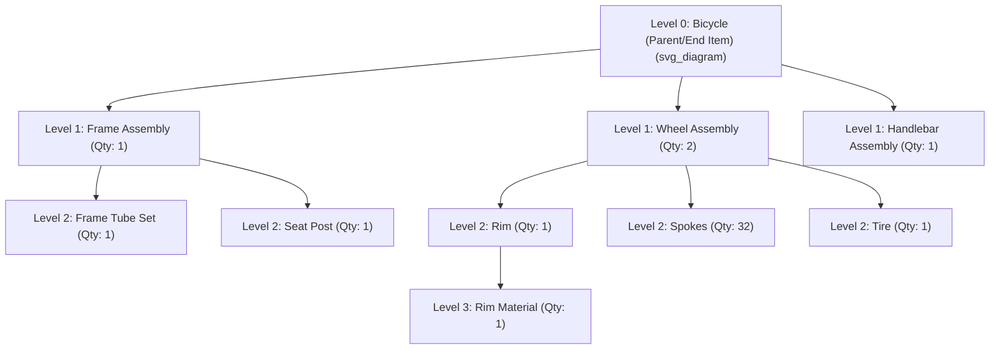

## Bill of Materials Structure

### Definition and Purpose

A Bill of Materials (BOM) is a structured, hierarchical listing of all raw materials, components, subassemblies, and quantities required to manufacture one unit of a parent item. It serves as the foundational data structure connecting product design/engineering to production planning and execution — every downstream planning process that operates at the component level, most directly Material Requirements Planning (MRP), depends on an accurate BOM to translate a finished-item schedule into the specific quantities and timing of every underlying component.

The BOM answers three essential questions for each parent item: what components are needed, how many of each component are needed per unit of parent, and how those components relate to one another structurally (which subassemblies contain which lower-level components). Without an accurate BOM, MRP cannot correctly explode a master production schedule into valid component requirements, making BOM accuracy a widely recognized prerequisite for reliable MRP output.

### The Hierarchical (Multi-Level) Structure

A BOM is organized as a multi-level hierarchy, commonly visualized as a product structure tree, in which each parent item at one level is composed of one or more child items (components) at the level immediately below it. This structure can extend across several levels, particularly for complex, engineered products.

**Key structural terminology:**

- **Level 0**: the end item (finished product) itself, by convention
- **Parent item**: any item that has components beneath it in the structure (e.g., the Wheel Assembly is a parent of Rim, Spokes, and Tire)
- **Child item / component**: an item that is used to build a parent item at the level above it
- **Low-level code**: the lowest level at which a given item appears anywhere across the entire BOM structure for all products; this is a critical MRP planning concept, since an item must be planned only after all its uses at every level have been netted, and the low-level code ensures the item is processed at the correct point in the MRP netting sequence (an item appearing at Level 1 in one product's BOM and Level 3 in another's is assigned Level 3 as its low-level code)

### The Bill of Materials Record: Key Data Fields

| Field | Description |
| --- | --- |
| **Parent Item Number** | Identifier for the item being built |
| **Component Item Number** | Identifier for each item required to build the parent |
| **Quantity Per** | Number of units of the component required per single unit of the parent |
| **Unit of Measure** | The measurement unit for the quantity per (each, meters, liters, kilograms, etc.) |
| **Effective Date Range** | The date range during which this component relationship is valid (supports engineering changes, phased component substitutions) |
| **Scrap/Yield Factor** | An adjustment factor accounting for expected scrap loss or yield variance in the component's use, inflating the gross quantity required |

### Types of Bills of Materials

| BOM Type | Structure | Primary Use |
| --- | --- | --- |
| **Single-Level BOM** | Lists only the immediate (Level 1) components of a parent item, without further explosion into sub-components | Simple products, or as a display view of one level of a larger multi-level structure |
| **Multi-Level (Indented) BOM** | Displays the full hierarchical structure, with each level indented beneath its parent, showing the complete component tree | Standard format for MRP explosion and engineering documentation |
| **Modular BOM (Planning BOM)** | Groups components into common modules/options shared across product variants, used to plan at a higher, option-level granularity rather than every specific end-item configuration | High-variety, configure-to-order products (e.g., a computer with selectable memory, storage, and processor options) |
| **Phantom BOM** | Represents a subassembly that is never physically stocked as an independent item — it exists only as a structural grouping in the BOM, with its components flowing directly into the next level up during MRP explosion, bypassing separate lead-time offsetting and inventory tracking for the phantom item itself | Subassemblies built and consumed immediately on the production line, never held in inventory |
| **Where-Used / Indented "Where-Used" Report** | The inverse of a standard BOM — rather than listing a parent's components, it lists every parent item (and higher-level assembly) in which a given component is used | Impact analysis for engineering changes or component substitutions; identifying which end products would be affected if a component becomes unavailable |

### Worked Example: BOM Explosion and Gross Requirement Calculation

A furniture manufacturer's BOM for a dining chair (Level 0) is structured as follows:

| Level | Item | Quantity Per Parent |
| --- | --- | --- |
| 0 | Dining Chair | — |
| 1 | Seat Assembly | 1 |
| 1 | Leg Set | 1 (set of 4 legs) |
| 2 | Seat Cushion | 1 (component of Seat Assembly) |
| 2 | Seat Frame | 1 (component of Seat Assembly) |
| 2 | Wood Leg | 4 (component of Leg Set) |

If the Master Production Schedule calls for **500 Dining Chairs**, the BOM explosion (before netting against existing inventory, and before applying any scrap factors) calculates gross component requirements as follows:

**Level 1 requirements:**

$$\text{Seat Assembly Required} = 500 \times 1 = 500 \text{ units}$$

$$\text{Leg Set Required} = 500 \times 1 = 500 \text{ sets}$$

**Level 2 requirements (exploded from Level 1 parent requirements):**

$$\text{Seat Cushion Required} = 500 \text{ (Seat Assembly)} \times 1 = 500 \text{ units}$$

$$\text{Seat Frame Required} = 500 \times 1 = 500 \text{ units}$$

$$\text{Wood Leg Required} = 500 \text{ (Leg Sets)} \times 4 = 2{,}000 \text{ units}$$

**Applying a scrap factor:** if Wood Leg production/handling has a historical scrap rate of 3%, the gross requirement is inflated accordingly:

$$\text{Adjusted Wood Leg Requirement} = \frac{2{,}000}{1 - 0.03} = \frac{2{,}000}{0.97} \approx 2{,}062 \text{ units}$$

This illustrates the core mechanic of **BOM explosion**: a single top-level requirement (500 chairs) cascades multiplicatively down through each level of the structure, with quantities compounding at each successive level (note that Wood Leg's final requirement of ~2,062 reflects both the "quantity per" multiplication across two levels — Leg Set to Dining Chair, and Wood Leg to Leg Set — and the scrap adjustment).

### The Low-Level Code and Its Role in MRP Processing

If "Wood Leg" is also used directly (at Level 1) in a different product — for example, a simple stool that uses Wood Leg directly without an intervening Leg Set assembly — the item's **low-level code** is set to the *lowest* level at which it appears across all BOMs (in this case, Level 2, from the Dining Chair's structure), not Level 1 from the stool. This ensures that when MRP processes items level by level, Wood Leg's requirements from *all* parent items (both the Dining Chair's Leg Set and the Stool) are fully aggregated before Wood Leg's own net requirement and planned orders are calculated — preventing the common error of under-planning a shared component whose full multi-product demand has not yet been completely netted at the point it is processed.

### Benefits

- Provides the essential structural data enabling MRP explosion, translating end-item schedules into accurate component-level requirements
- The modular/planning BOM variant allows efficient forecasting and planning for high-variety, configure-to-order products without needing to forecast every individual end-item configuration separately
- Phantom BOMs avoid unnecessary inventory-tracking and lead-time-offsetting overhead for subassemblies that are never actually stocked
- The where-used report supports rapid impact analysis when a component must be substituted, discontinued, or is affected by a supply disruption

### Limitations and Considerations

- BOM accuracy is a widely cited prerequisite for MRP reliability; an outdated or incorrect BOM (e.g., reflecting a superseded engineering revision) propagates errors directly into planned component and purchase order quantities
- Maintaining BOM accuracy becomes progressively more challenging as product complexity, the number of engineering change orders, and the number of product variants increase, particularly in industries with frequent design revisions
- The distinction between a "component" that should be modeled as a phantom BOM item versus one that should be modeled as a normally stocked/planned item requires judgment specific to actual production practice (whether the subassembly is ever built ahead and stored, even temporarily)
- [Unverified] The specific scrap/yield factors, effective-date practices, and BOM maintenance governance processes used vary considerably across industries and ERP system implementations; the mechanics presented here reflect standard, widely taught BOM conventions rather than a single universal implementation.

### Key Points

- A Bill of Materials is a hierarchical structure specifying the components, quantities, and relationships required to build a parent item, forming the essential data foundation for MRP
- Multi-level BOMs explode top-level requirements down through successive levels, with quantities compounding multiplicatively at each level
- The low-level code ensures a shared component's demand from all parent items across the entire product range is fully aggregated before its own requirements are calculated in MRP
- Specialized BOM types — modular/planning BOMs, phantom BOMs, and where-used reports — address specific planning and product-variety challenges beyond the basic multi-level structure

### Related Topics

- Material requirements planning (MRP) explosion logic
- Master production scheduling
- Rough-cut capacity planning
- Engineering change management and BOM revision control
- Lead-time offsetting and planned order release timing
- Configure-to-order and mass customization product structures
- Low-level coding and MRP processing sequence