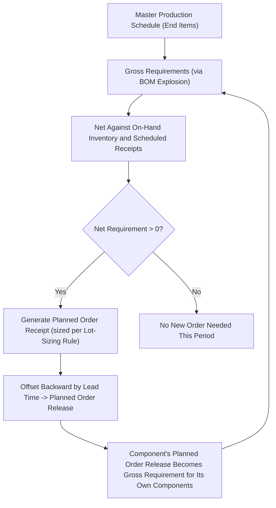

## MRP Logic and Net Requirements Calculation

### Definition and Purpose

Material Requirements Planning (MRP) logic is the systematic, time-phased calculation process by which a Master Production Schedule for end items is exploded—via the Bill of Materials—into specific, dated requirements for every component, subassembly, and raw material needed to support production, while simultaneously netting those gross requirements against existing inventory and scheduled receipts, and offsetting the result by lead time to determine when purchase or production orders must actually be released.

MRP logic directly answers four fundamental questions for every item in the product structure: what is needed, how much is needed, when is it needed, and when must an order be placed to have it available on time. This is the core computational engine that operationalizes the Bill of Materials structure and the Master Production Schedule into an executable, item-level, time-phased plan.

### The MRP Record: Core Rows and Their Definitions

MRP calculations are organized into a standardized time-phased record for each item, structured across sequential time periods (commonly weeks):

| Row | Definition |
| --- | --- |
| **Gross Requirements (GR)** | Total demand for the item in each period, derived either directly from the MPS (for end items) or from the exploded, lead-time-offset requirements of parent items (for components) |
| **Scheduled Receipts (SR)** | Open orders (purchase orders or production orders) already placed and expected to arrive in a given period |
| **Projected On-Hand (POH)** | The running inventory balance projected for each period, calculated from the prior period's balance plus receipts minus gross requirements |
| **Net Requirements (NR)** | The actual shortfall that must be covered by a new order, after netting gross requirements against on-hand inventory and scheduled receipts |
| **Planned Order Receipt (POR)** | The quantity and timing of a new order needed to cover net requirements, sized according to the item's lot-sizing rule |
| **Planned Order Release (POL)** | The planned order receipt, offset backward in time by the item's lead time — this is the actual date an order must be placed |

### Core MRP Calculation Formulas

**Projected On-Hand Balance:**

$$POH_t = POH_{t-1} + SR_t + POR_t - GR_t$$

**Net Requirements** (the shortfall requiring a new planned order):

$$NR_t = \max\left(0,\ GR_t - SR_t - POH_{t-1}\right)$$

A net requirement arises in period $t$ only when gross requirements exceed the sum of scheduled receipts and the inventory carried over from the prior period; if on-hand inventory and scheduled receipts are sufficient to cover gross requirements, no new planned order is needed in that period.

**Planned Order Release timing** (lead-time offset):

$$\text{POL Period} = \text{POR Period} - \text{Lead Time}$$

### Worked Example: Single-Level MRP Record

A manufacturer plans component "Bracket-X" over a 6-week horizon, with the following starting conditions:

- Beginning on-hand inventory = 100 units
- Scheduled receipt of 150 units already on order, arriving Week 2
- Lead time = 2 weeks
- Lot-sizing rule: lot-for-lot (order exactly the net requirement quantity each period, no batching)

**Gross requirements** (derived from the parent item's exploded, lead-time-offset planned order releases):

| Week | 1 | 2 | 3 | 4 | 5 | 6 |
| --- | --- | --- | --- | --- | --- | --- |
| Gross Requirements | 80 | 120 | 90 | 200 | 60 | 100 |
| Scheduled Receipts | — | 150 | — | — | — | — |

**Step-by-step calculation:**

**Week 1:**

$$POH_0 = 100 \text{ (beginning inventory)}$$

$$NR_1 = \max(0, 80 - 0 - 100) = \max(0, -20) = 0$$

$$POH_1 = 100 + 0 + 0 - 80 = 20$$

**Week 2:**

$$NR_2 = \max(0, 120 - 150 - 20) = \max(0, -50) = 0$$

$$POH_2 = 20 + 150 + 0 - 120 = 50$$

**Week 3:**

$$NR_3 = \max(0, 90 - 0 - 50) = \max(0, 40) = 40$$

Since a net requirement exists, a **Planned Order Receipt of 40 units** (lot-for-lot) is scheduled for Week 3:

$$POH_3 = 50 + 0 + 40 - 90 = 0$$

**Week 4:**

$$NR_4 = \max(0, 200 - 0 - 0) = 200$$

**Planned Order Receipt of 200 units** in Week 4:

$$POH_4 = 0 + 0 + 200 - 200 = 0$$

**Week 5:**

$$NR_5 = \max(0, 60 - 0 - 0) = 60$$

**Planned Order Receipt of 60 units** in Week 5:

$$POH_5 = 0 + 0 + 60 - 60 = 0$$

**Week 6:**

$$NR_6 = \max(0, 100 - 0 - 0) = 100$$

**Planned Order Receipt of 100 units** in Week 6:

$$POH_6 = 0 + 0 + 100 - 100 = 0$$

**Complete MRP record:**

|  | Week 1 | Week 2 | Week 3 | Week 4 | Week 5 | Week 6 |
| --- | --- | --- | --- | --- | --- | --- |
| Gross Requirements | 80 | 120 | 90 | 200 | 60 | 100 |
| Scheduled Receipts | — | 150 | — | — | — | — |
| Projected On-Hand | 20 | 50 | 0 | 0 | 0 | 0 |
| Net Requirements | 0 | 0 | 40 | 200 | 60 | 100 |
| Planned Order Receipt | — | — | 40 | 200 | 60 | 100 |
| Planned Order Release | 40 | 200 | 60 | 100 | — | — |

**Applying the lead-time offset:** with a 2-week lead time, each Planned Order Receipt is offset backward by 2 weeks to determine the Planned Order Release date — the Week 3 receipt of 40 units requires a **planned order release in Week 1**; the Week 4 receipt of 200 units requires release in **Week 2**; and so on. This offset row is the critical output that tells purchasing or production control exactly when to place each order so that it arrives precisely when needed, no earlier and no later.

### How Planned Order Releases Become Gross Requirements at the Next Level

The Planned Order Release row calculated above is not merely informational — it is the direct source of gross requirements for Bracket-X's own components at the next lower BOM level. If Bracket-X requires 2 units of a raw material ("Steel Rod") per unit, the Week 1 planned order release of 40 units of Bracket-X becomes a gross requirement of $40 \times 2 = 80$ units of Steel Rod in Week 1 (before Steel Rod's own lead-time offset is applied). This is the mechanic by which MRP "explodes" a single top-level schedule down through every level of the BOM, level by level, in strict low-level-code sequence (as introduced in the Bill of Materials Structure topic), ensuring each component's full aggregated demand from all its parent items is captured before its own net requirements are calculated.

### Lot-Sizing Rules Affecting the Planned Order Receipt Quantity

The worked example above uses **lot-for-lot** (ordering exactly the net requirement each period), but several other lot-sizing rules are commonly applied, changing the Planned Order Receipt quantity (though not the underlying net-requirement logic):

| Lot-Sizing Rule | Description |
| --- | --- |
| **Lot-for-Lot (L4L)** | Order exactly the net requirement quantity each period; minimizes holding cost but maximizes number of orders/setups |
| **Fixed Order Quantity (FOQ)** | Always order a predetermined fixed quantity (e.g., the EOQ) whenever a net requirement exists, potentially creating surplus inventory in some periods |
| **Periodic Order Quantity (POQ)** | Order enough to cover net requirements across a fixed number of future periods (e.g., 3 weeks' worth) in a single order, balancing setup and holding cost |
| **Economic Order Quantity (EOQ)** | Applies the EOQ formula (covered in Inventory Management) to determine order size, treating the MRP-derived net requirement as the trigger rather than a continuous reorder point |

[Inference] Lot-for-lot is commonly used for expensive, low-volume, or highly variable-demand items (since it avoids holding excess inventory), while fixed or periodic order quantities are more commonly used for lower-cost, high-volume items where setup/ordering cost reduction is prioritized over minimizing holding cost — this pattern generally parallels the same logic underlying the EOQ vs. lot-sizing trade-off discussed under Inventory Management, applied here within the MRP netting process rather than a continuous-review context.

### MRP System Nervousness and Its Relationship to Net Requirements Recalculation

Because net requirements are recalculated based on the current gross requirements, on-hand balance, and scheduled receipts each time MRP is run, small changes in any of these inputs (e.g., a Master Production Schedule change, or a scheduled receipt being delayed) can cause the calculated net requirements — and therefore planned order releases — to shift, sometimes substantially, even for periods relatively far in the future. This is the mechanical origin of the **MRP nervousness** phenomenon introduced under Master Production Scheduling: because planned orders cascade through multiple BOM levels, a small change at a high level can produce disproportionately large recalculated requirements at lower levels, particularly when lot-sizing rules like FOQ or POQ create batching effects that amplify small input changes into large output changes.

### Benefits

- Provides a systematic, auditable method for translating a single top-level production schedule into precise, dated component-level requirements across an arbitrarily complex, multi-level product structure
- The netting logic (against on-hand inventory and scheduled receipts) prevents unnecessary over-ordering of components that are already sufficiently covered by existing stock or open orders
- The lead-time offset explicitly calculates the correct order-release timing, rather than leaving this determination to manual judgment
- Different lot-sizing rules can be applied per item, allowing the system to reflect each item's specific cost trade-offs (setup/ordering cost vs. holding cost) individually

### Limitations and Considerations

- MRP's output is entirely dependent on the accuracy of its inputs: Bill of Materials accuracy, correct lead-time data, accurate on-hand inventory records, and a valid Master Production Schedule; errors in any of these propagate directly into incorrect net requirements and mistimed planned orders
- The classical MRP logic presented here assumes **infinite capacity** — it calculates what is materially required and when, without checking whether the required production capacity actually exists in each period; this is why Rough-Cut Capacity Planning and Capacity Requirements Planning exist as separate, complementary capacity-feasibility checks
- Lead times are typically treated as fixed, known constants in standard MRP logic, whereas actual lead times can vary due to supplier performance, queue time at work centers, or batch-size effects — a limitation that more advanced planning systems (e.g., those incorporating finite-capacity scheduling) attempt to address
- [Unverified] The specific choice of lot-sizing rule appropriate for a given item is influenced by numerous factors (demand variability, holding cost, setup cost, supplier minimum order quantities) whose relative weighting is context-specific; no single lot-sizing rule is universally optimal across all items or industries.

### Key Points

- MRP logic nets gross requirements (derived from the MPS or from parent items' exploded, lead-time-offset planned orders) against on-hand inventory and scheduled receipts to calculate net requirements
- A planned order receipt is generated only when net requirements are positive, sized according to the item's lot-sizing rule (lot-for-lot, FOQ, POQ, or EOQ)
- The planned order release is the planned order receipt offset backward by the item's lead time, representing the actual date an order must be placed
- Planned order releases at one BOM level become gross requirements for that item's own components at the next lower level, driving the multi-level explosion process in strict low-level-code sequence

### Related Topics

- Bill of materials structure
- Master production scheduling
- Rough-cut capacity planning
- Lot-sizing rules and economic order quantity in MRP contexts
- Capacity requirements planning (CRP)
- MRP system nervousness and planning stability
- ERP system architecture and MRP module integration