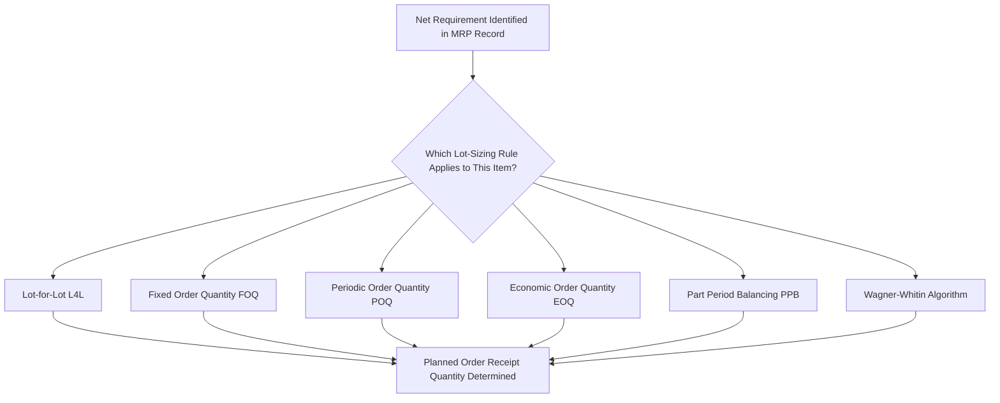

## Lot-Sizing Techniques

### Definition and Purpose

Lot-sizing techniques are the set of rules used within Material Requirements Planning (MRP) to determine the quantity of a Planned Order Receipt whenever a net requirement is identified for an item, converting the raw net-requirement shortfall calculated in the MRP netting process into an actual order quantity. While the MRP net-requirements calculation determines *whether and how much* is needed in a given period, lot-sizing determines *how that need is packaged into orders* — whether exactly matching each period's shortfall, batching several periods together, or applying a fixed economic quantity — and this choice directly affects the balance between ordering/setup cost and inventory holding cost for each item.

Lot-sizing decisions are made independently for each item in the product structure, since different items warrant different rules depending on their cost structure, demand pattern, and criticality — a high-value, highly variable-demand component may use a different lot-sizing rule than a low-cost, steadily consumed raw material, even within the same Bill of Materials.

### The Lot-Sizing Decision in Context

### Lot-for-Lot (L4L)

**Rule:** Order exactly the net requirement quantity for each period in which a shortfall occurs — no more, no less.

**Cost characteristic:** minimizes holding cost (no excess inventory is ever carried forward, since each order exactly matches its period's need) but maximizes the number of orders/setups, since a new order is placed every period a net requirement exists.

**Best suited for:** expensive, low-volume, or highly variable-demand items where carrying excess inventory is costly relative to the cost of placing frequent orders; also common for make-to-order or highly customized components where batching offers little practical benefit.

### Fixed Order Quantity (FOQ)

**Rule:** Whenever a net requirement exists, order a predetermined, constant quantity — regardless of the actual size of that period's specific shortfall. If the fixed quantity exceeds the net requirement, the surplus carries forward as inventory into subsequent periods (reducing or eliminating net requirements in those periods).

**Cost characteristic:** the fixed quantity is often set based on a supplier minimum order quantity, a container/pallet quantity, a production batch-size constraint, or a previously calculated EOQ — in any case, it is treated as a constant across all order occasions rather than recalculated per order.

**Best suited for:** items with a supplier-imposed minimum order quantity, a fixed production batch size (e.g., a chemical batch reactor with a fixed capacity), or standard packaging/shipping quantities that make ordering in other quantities impractical.

### Periodic Order Quantity (POQ)

**Rule:** Rather than ordering a fixed quantity, order enough to cover net requirements across a predetermined, fixed *number of future periods* (e.g., every order covers 3 weeks' worth of requirements), with the actual order quantity varying based on demand across those periods.

**Cost characteristic:** balances setup/ordering cost against holding cost by fixing the *ordering frequency* rather than the *order size*, allowing the order quantity to flex with actual demand while still consolidating multiple periods' worth of requirements into a single order.

**Best suited for:** items with moderate demand variability where consolidating several periods into a single order meaningfully reduces the number of setups/orders relative to lot-for-lot, without the potential mismatch between fixed order size and actual period-by-period need that FOQ can produce.

### Economic Order Quantity (EOQ) Applied Within MRP

**Rule:** Apply the standard EOQ formula (covered under Inventory Management) — $Q^* = \sqrt{2DS/H}$ — using the item's average periodic demand (annualized) to calculate a single, fixed order quantity, then use this calculated quantity in the same manner as an FOQ rule within the MRP netting process.

**Cost characteristic:** theoretically minimizes the combined ordering and holding cost under the assumption of relatively level, continuous demand — but this assumption is frequently violated in an MRP context, since MRP-derived gross requirements are often lumpy (concentrated in specific periods due to batch production of parent items) rather than smooth and continuous, which is the condition under which EOQ's underlying derivation is most valid.

[Inference] Because MRP-derived demand for components is frequently "lumpy" (driven by batch-sized parent-item production runs rather than steady end-customer demand), applying a classical EOQ calculated from average demand can produce suboptimal results compared to lot-sizing rules explicitly designed for lumpy, discrete demand patterns (such as Part Period Balancing or the Wagner-Whitin algorithm below) — this is a widely recognized limitation of applying continuous-demand EOQ logic within a discrete, time-phased MRP netting process.

### Part Period Balancing (PPB)

**Rule:** A heuristic technique that seeks to balance the total ordering (setup) cost against total holding cost more precisely than a simple fixed rule, by combining net requirements from consecutive periods into a single order up to the point where the accumulated holding cost of carrying the combined quantity forward approximately equals the fixed ordering cost — the "part-period" concept refers to one unit held in inventory for one period.

**Mechanism (simplified):** the **Economic Part Period (EPP)** is calculated as the ratio of ordering cost to per-unit-per-period holding cost:

$$EPP = \frac{S}{H_{per\ unit\ per\ period}}$$

Net requirements from successive periods are accumulated into a single order until the cumulative part-periods (quantity multiplied by the number of periods it will be held) most closely approaches the EPP value, at which point a new order is started for the next period's requirement.

**Best suited for:** items with lumpy, irregular demand where neither a fixed quantity nor a fixed period count captures the actual cost-minimizing batching pattern as well as a period-by-period cost comparison can.

### Wagner-Whitin Algorithm

**Rule:** A dynamic-programming-based optimization technique that evaluates all possible combinations of ordering periods across the entire planning horizon and identifies the theoretically cost-minimizing lot-sizing solution — the only technique among those listed here that is mathematically guaranteed to produce the globally optimal solution for the given horizon and cost inputs, rather than a heuristic approximation.

**Cost characteristic:** computationally more intensive than the heuristic methods above, since it must evaluate a substantially larger number of possible ordering-pattern combinations, though modern computing power has made this less of a practical constraint than when the algorithm was first developed.

**Best suited for:** high-value items where the cost of a suboptimal lot-sizing decision is significant enough to justify the additional computational complexity, or for stable planning environments where the requirement horizon does not change frequently enough to make repeated re-optimization prohibitively expensive.

### Worked Example: Comparing Lot-Sizing Rules on the Same Net Requirements

Using a 6-week net requirements pattern with ordering cost $S = \$100$ per order and holding cost $H = \$2$ per unit per week:

| Week | 1 | 2 | 3 | 4 | 5 | 6 |
| --- | --- | --- | --- | --- | --- | --- |
| Net Requirements | 50 | 0 | 80 | 0 | 0 | 60 |

**Lot-for-Lot (L4L):**

| Week | 1 | 2 | 3 | 4 | 5 | 6 |
| --- | --- | --- | --- | --- | --- | --- |
| Order Quantity | 50 | 0 | 80 | 0 | 0 | 60 |

Number of orders = 3; Ordering cost = $3 \times \$100 = \$300$; Holding cost = $0 (no inventory ever carried, since each order matches its period exactly). **Total cost = $300.**

**Fixed Order Quantity (FOQ = 100 units):**

| Week | 1 | 2 | 3 | 4 | 5 | 6 |
| --- | --- | --- | --- | --- | --- | --- |
| Order Quantity | 100 | 0 | 100 (since 50 carried from Wk1 + new 80 exceeds 100, actually requires re-ordering logic) | — | — | — |

[Note: with FOQ = 100, Week 1's order of 100 covers the 50 required, leaving 50 in inventory; Week 3's requirement of 80 is covered by the 50 carried forward plus a partial draw from a new order of 100 (leaving 70 carried to Week 6); Week 6's requirement of 60 is covered by the 70 carried forward, leaving 10 remaining.]

Number of orders = 2; Ordering cost = $2 \times \$100 = \$200$; Holding cost: 50 units held from Week 1 to Week 3 (2 weeks) = $50 \times 2 \times \$2 = \$200$; plus 70 units held from Week 3 to Week 6 (3 weeks) minus the 80 consumed in week 3 nets to 70 units carried = $70 \times 3 \times \$2 = \$420$. **Approximate total cost = $200 + $200 + $420 = $820** (illustrative; exact period-by-period holding cost accounting can vary slightly by convention).

**Economic Part Period Balancing (EPP = S/H = 100/2 = 50 part-periods):**

Combining Week 1 (50 units) alone yields 0 part-periods held beyond its own period (ordered exactly when needed) — but testing whether to combine Week 1 and Week 3 together: holding 80 units from Week 1 to Week 3 (2 periods) = 160 part-periods, which exceeds the EPP of 50, so the periods are *not* combined; each net requirement is instead ordered separately, similar to L4L in this specific instance. Number of orders = 3 (matching L4L in this case); **Total cost = $300** (same as L4L for this particular demand pattern, since no combination proved cost-effective under the EPP threshold).

**Comparison:** in this specific numeric example, both L4L and PPB arrive at $300 (avoiding costly, unnecessary batching), while the arbitrary FOQ = 100 rule produces a substantially higher total cost (≈$820) because its fixed batch size does not align well with the actual lumpy demand pattern — illustrating why FOQ is best reserved for cases where the fixed quantity is externally imposed (e.g., a supplier minimum) rather than freely chosen, and why heuristics like PPB (or the fully optimal Wagner-Whitin algorithm) generally outperform an arbitrarily chosen fixed quantity when demand is genuinely lumpy.

### Lot-Sizing Rule Comparison Table

| Rule | Order Quantity Logic | Ordering Cost | Holding Cost | Complexity | Best Fit |
| --- | --- | --- | --- | --- | --- |
| Lot-for-Lot | Exact net requirement each period | Highest (most frequent orders) | Lowest (no excess carried) | Very Low | Expensive, low-volume, or highly variable items |
| Fixed Order Quantity | Constant, predetermined quantity | Depends on quantity chosen | Depends on quantity chosen | Low | Supplier minimums, fixed batch sizes |
| Periodic Order Quantity | Covers a fixed number of future periods | Moderate | Moderate | Low-Moderate | Moderate, fairly regular demand variability |
| EOQ (applied in MRP) | Classical EOQ formula, applied as a fixed quantity | Moderate (theoretically balanced) | Moderate (theoretically balanced) | Moderate | Items with relatively smooth, continuous demand even within MRP |
| Part Period Balancing | Combines periods until part-periods approximate EPP | Near-optimal (heuristic) | Near-optimal (heuristic) | Moderate-High | Lumpy demand, moderate item value |
| Wagner-Whitin | Dynamic programming, globally optimal | Optimal (mathematically minimized) | Optimal (mathematically minimized) | Highest | High-value items, stable planning horizons justifying computational cost |

### Benefits

- Allows lot-sizing policy to be tailored per item, reflecting each item's specific cost structure (setup/ordering cost relative to holding cost) rather than applying a one-size-fits-all rule across an entire product structure
- Heuristic methods (PPB) and optimal methods (Wagner-Whitin) explicitly address the lumpy, discrete-period demand pattern typical of MRP-derived component requirements, which the classical continuous-demand EOQ formula does not fully account for
- Fixed-quantity rules (FOQ) accommodate real-world external constraints (supplier minimums, batch-process capacity limits) that a pure cost-minimization approach cannot always override

### Limitations and Considerations

- Every heuristic and optimal lot-sizing technique relies on accurate ordering-cost and holding-cost estimates, which — as with EOQ generally — are often difficult to estimate precisely in practice, particularly for shared or allocated overhead costs
- More sophisticated techniques (Part Period Balancing, Wagner-Whitin) introduce computational and data-maintenance complexity that may not be justified for low-value, low-criticality items, motivating the common practice of applying simpler rules (L4L, FOQ) to Class C items and more sophisticated rules only to Class A items — directly paralleling the ABC classification logic covered under Inventory Management
- Lot-sizing choices interact with MRP nervousness: rules that batch multiple periods together (FOQ, POQ, PPB) can amplify the disruptive effect of a small input change on the resulting order pattern, compared to lot-for-lot's more directly traceable, period-specific order logic
- [Unverified] The relative prevalence of each lot-sizing technique across different industries and ERP system implementations is not something that should be asserted with specific statistics absent a cited industry-specific source; the selection guidance above reflects standard operations management pedagogy rather than a specific empirical survey.

### Key Points

- Lot-sizing techniques determine the actual order quantity once a net requirement is identified in the MRP netting process, each representing a different trade-off between ordering/setup cost and holding cost
- Lot-for-lot minimizes holding cost at the expense of order frequency; fixed and periodic order quantities consolidate multiple periods' requirements at the cost of potential inventory mismatch
- Part Period Balancing and the Wagner-Whitin algorithm are specifically designed to handle the lumpy, discrete-period demand pattern typical of MRP-derived component requirements, with Wagner-Whitin guaranteeing a mathematically optimal solution
- Lot-sizing rule selection is commonly differentiated by item value/criticality, paralleling ABC classification logic from inventory management

### Related Topics

- MRP logic and net requirements calculation
- Economic Order Quantity (EOQ) model
- ABC classification analysis
- Bill of materials structure
- MRP system nervousness and planning stability
- Master production scheduling
- Dynamic programming methods in operations research