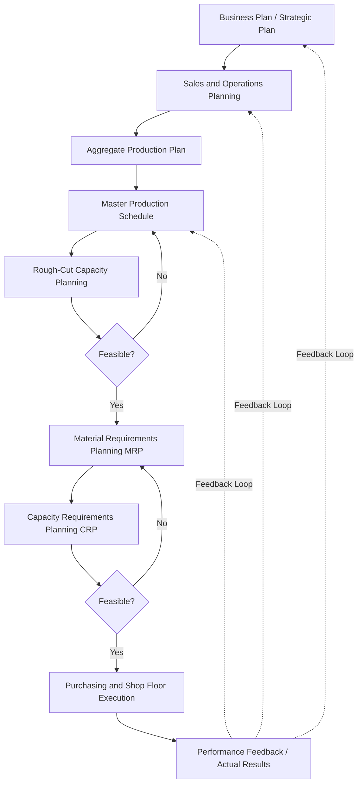

## Manufacturing Resource Planning

### Definition and Purpose

Manufacturing Resource Planning (MRP II) is the extension of Material Requirements Planning (MRP) into a comprehensive, closed-loop planning and control system that integrates production planning with financial, capacity, and business-wide functions. Where the original MRP (sometimes retrospectively called "MRP I" or "little MRP" to distinguish it) focused narrowly on calculating material requirements from a Master Production Schedule, MRP II broadens this scope to encompass the full planning hierarchy — from long-range business and sales planning down through aggregate production planning, master scheduling, material and capacity planning, and execution — while also translating the resulting operational plan into financial terms (cost, revenue, and profitability projections) that other business functions can use directly.

The term and concept were developed by Oliver Wight in the early 1980s as the recognized next evolutionary step beyond basic MRP, explicitly incorporating feedback loops that allow deviations at any level of the plan to be recognized and used to adjust plans at other levels — the defining "closed-loop" characteristic that distinguishes MRP II from the earlier, more narrowly computational MRP I.

### The Closed-Loop MRP II Hierarchy

The "closed-loop" characteristic refers specifically to the feedback arrows shown above: actual performance data (production output, capacity utilization, inventory accuracy) flows back to inform and adjust plans at every level of the hierarchy, rather than the plan flowing only downward from strategic business planning to shop-floor execution in a single, one-way direction as in earlier, open-loop MRP implementations.

### MRP II's Core Integrated Modules

| Module | Function | Relationship to Previously Covered Topics |
| --- | --- | --- |
| **Business/Strategic Planning** | Sets overall organizational direction, revenue and growth targets | Highest level, feeds S&OP |
| **Sales and Operations Planning (S&OP)** | Reconciles demand and supply plans at the product-family level | Directly covered under Aggregate Planning and S&OP |
| **Demand Management** | Consolidates forecasts, customer orders, and other demand sources | Feeds the Master Production Schedule |
| **Master Production Scheduling (MPS)** | Item-level, time-phased production schedule | Directly covered under Aggregate Planning and S&OP |
| **Rough-Cut Capacity Planning (RCCP)** | Approximate capacity feasibility check on the MPS | Directly covered under Aggregate Planning and S&OP |
| **Material Requirements Planning (MRP)** | Explodes MPS through the BOM into time-phased component requirements | Directly covered in this chapter |
| **Capacity Requirements Planning (CRP)** | Detailed capacity validation of MRP-generated planned orders against work-center capacity | Complementary to RCCP, more granular |
| **Shop Floor Control / Execution** | Dispatches, sequences, and tracks actual production against planned orders | Downstream execution layer |
| **Purchasing** | Converts MRP-generated planned purchase orders into actual supplier orders | Downstream execution layer |
| **Financial Interface** | Translates the operational plan (production volumes, material costs, labor costs) into financial projections (cost of goods sold, inventory valuation, cash flow implications) | The distinguishing integration that extends MRP into MRP II |

### The Defining Feature: Financial Integration ("One Set of Numbers")

The single most consequential distinguishing characteristic of MRP II relative to basic MRP is the direct translation of the operational plan into financial terms, using the same underlying data and assumptions across both operational and financial reporting — commonly summarized in MRP II literature as achieving "one set of numbers" across the organization. This means that a change to the Master Production Schedule (e.g., increasing planned production of an item) automatically and consistently updates the associated material cost projections, labor cost projections, and inventory valuation — rather than requiring finance to maintain a separate, independently reconciled financial model.

[Inference] This financial-integration capability is what allows MRP II (and its subsequent evolution into full ERP systems) to function as a genuine business-management tool rather than purely a production-scheduling tool — a distinction commonly emphasized in operations management literature to explain why MRP II represented a significant conceptual advance over basic MRP, beyond simply adding more calculation modules.

### MRP vs. MRP II: Key Distinctions

| Dimension | MRP (Material Requirements Planning) | MRP II (Manufacturing Resource Planning) |
| --- | --- | --- |
| **Primary scope** | Material/component requirements calculation only | Full manufacturing planning and control, plus financial integration |
| **Capacity consideration** | Assumes infinite capacity (no capacity check) | Incorporates capacity planning (RCCP and CRP) as integral components |
| **Financial integration** | None — purely a materials-planning calculation | Direct, consistent translation of operational plans into financial figures |
| **Feedback loops** | Limited or none (largely one-directional calculation) | Explicit closed-loop feedback from execution back to planning at all levels |
| **Organizational scope** | Primarily a production/materials planning tool | Extends to sales, finance, and executive decision-making (via S&OP integration) |
| **Historical development** | Developed and popularized in the 1960s–1970s | Developed as the recognized extension in the early 1980s |

### Worked Example: How MRP II's Closed Loop Operates in Practice

A mid-sized manufacturer of industrial pumps operates an MRP II system.

1. **Business Plan**: leadership sets an annual revenue growth target of 8%, translated into a required increase in unit shipments across product families.
2. **S&OP**: the monthly S&OP cycle translates this target into a specific aggregate production plan for the Pump Family, allocating expected volume across the year with attention to seasonal demand patterns.
3. **MPS**: the aggregate plan is disaggregated into specific pump models and their production timing over the next 13 weeks.
4. **RCCP**: a rough-cut check confirms the proposed MPS is feasible against critical machining and assembly capacity.
5. **MRP**: the MPS is exploded through the Bill of Materials, generating planned orders for castings, bearings, seals, and electric motors — with net requirements calculated against current on-hand inventory and scheduled receipts.
6. **CRP**: a detailed capacity check at the work-center level confirms the MRP-generated planned orders are executable given current shop-floor conditions and existing open orders.
7. **Execution**: purchasing releases orders for the required castings and motors; shop floor control sequences and tracks assembly operations.
8. **Feedback (closing the loop)**: during execution, a key motor supplier reports a two-week delay. This information feeds back into the MRP record (updating the scheduled receipt date), which recalculates downstream net requirements and may trigger an MPS adjustment if the delay threatens a firm customer commitment — and if the delay is significant enough, it is escalated back to the next S&OP cycle as a capacity/supply risk requiring executive-level trade-off decisions (e.g., expediting an alternate motor supplier at a cost premium, or delaying affected customer shipments).
9. **Financial translation**: the revised plan automatically updates projected material cost, projected inventory valuation, and projected revenue timing, giving finance a consistent, currently accurate view without requiring a separately maintained financial model.

This example illustrates the defining closed-loop characteristic: information generated at the execution level (the supplier delay) flows back up through multiple planning levels, potentially reaching all the way to the S&OP/business-planning level, rather than remaining isolated within a single planning module.

### MRP II's Relationship to Modern ERP Systems

MRP II is widely regarded as the direct conceptual and functional predecessor to modern Enterprise Resource Planning (ERP) systems. ERP systems extended the MRP II concept beyond manufacturing-specific functions to encompass enterprise-wide processes including human resources, customer relationship management, and broader financial accounting — but the core closed-loop planning hierarchy (business planning → S&OP → MPS → MRP → execution, with financial integration and feedback loops throughout) that originated in MRP II remains recognizable as the manufacturing-planning core within most modern ERP systems' production-planning modules.

### Benefits

- Provides financial visibility directly derived from the same operational plan used for production scheduling, eliminating the risk of disconnected, independently maintained financial projections
- The closed-loop feedback structure allows deviations discovered at execution (supplier delays, capacity shortfalls, quality issues) to systematically inform adjustments at higher planning levels, rather than remaining isolated
- Integrates capacity feasibility checks (RCCP and CRP) directly into the planning hierarchy, addressing the "infinite capacity" limitation of basic MRP
- Establishes a single, consistent set of numbers across sales, operations, and finance functions, supporting the cross-functional alignment that S&OP is specifically designed to achieve

### Limitations and Considerations

- MRP II's effectiveness depends on data accuracy and discipline across every module in the hierarchy (BOM accuracy, inventory record accuracy, lead-time accuracy); errors anywhere in this integrated system can propagate more broadly than in a narrower, standalone MRP implementation, given the tighter cross-module integration
- Implementing a full MRP II system historically required substantial organizational change management and process discipline, since it requires cross-functional data consistency (sales, operations, finance) that may not previously have existed
- [Unverified] The specific degree to which contemporary organizations still operate distinct "MRP II" systems versus having fully absorbed these capabilities into broader modern ERP platforms varies by organization size, industry, and system vintage; general prevalence claims should be sourced from a specific, current industry survey rather than assumed.
- The closed-loop feedback mechanism, while conceptually powerful, requires sufuciently disciplined organizational processes (accurate, timely reporting of execution-level deviations) to function as intended; a poorly disciplined implementation may retain the software's feedback capability without the organizational practice of actually acting on that feedback.

### Key Points

- MRP II extends basic MRP into a closed-loop system integrating business planning, S&OP, master scheduling, capacity planning, material planning, and execution, with explicit feedback loops connecting all levels
- The defining distinguishing feature of MRP II relative to MRP is direct financial integration — translating the operational plan into consistent financial projections using the same underlying data ("one set of numbers")
- MRP II incorporates capacity feasibility checks (RCCP and CRP) as integral components, addressing basic MRP's infinite-capacity assumption
- MRP II is widely regarded as the direct conceptual predecessor to modern ERP systems, with its closed-loop planning hierarchy remaining recognizable within most current ERP production-planning modules

### Related Topics

- MRP logic and net requirements calculation
- The sales and operations planning process
- Rough-cut capacity planning
- Master production scheduling
- Capacity requirements planning (CRP)
- Bill of materials structure
- Enterprise Resource Planning (ERP) system architecture