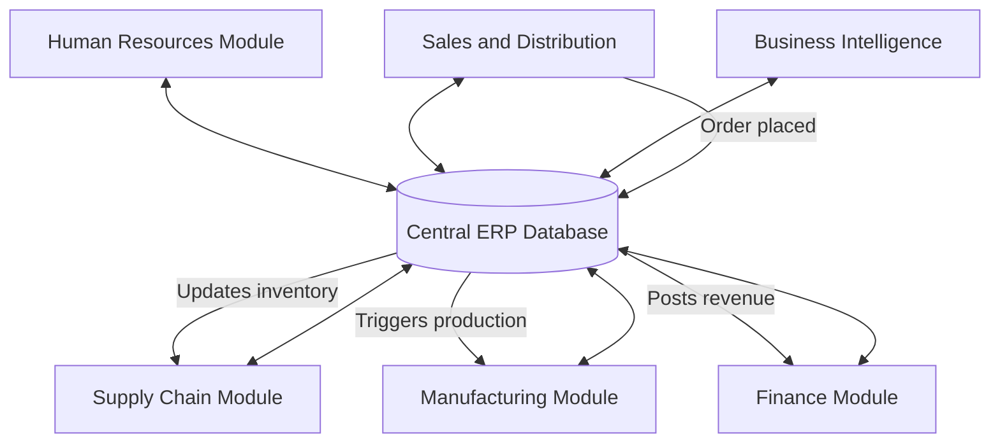

## Enterprise Resource Planning Systems

### Definition and Core Concept

Enterprise Resource Planning (ERP) systems are integrated software platforms that consolidate core business processes — including finance, manufacturing, procurement, inventory, human resources, sales, and distribution — into a single unified database and application architecture. The defining characteristic of ERP is data integration: a transaction entered in one functional module (e.g., a sales order) automatically updates related data across other modules (inventory availability, production scheduling, financial accounts receivable) without manual re-entry or reconciliation between separate systems.

ERP systems evolved as the natural extension of earlier manufacturing planning systems, expanding their scope from production and materials planning to encompass the entire enterprise.

### Historical Evolution

| Era | System | Scope |
| --- | --- | --- |
| 1960s | Inventory management/control systems | Basic reorder point tracking |
| 1970s | Material Requirements Planning (MRP) | Production scheduling and material planning |
| 1980s | Manufacturing Resource Planning (MRP II) | MRP plus capacity planning, finance, and shop floor integration |
| 1990s | Enterprise Resource Planning (ERP) | Enterprise-wide integration including HR, finance, sales, distribution |
| 2000s | Extended ERP / ERP II | Integration with supply chain management (SCM), customer relationship management (CRM), e-commerce |
| 2010s–present | Cloud ERP / SaaS ERP | Cloud-hosted, subscription-based, with mobile access and analytics embedded |

The term "ERP" was coined by the Gartner Group in the early 1990s to describe this expanded, integrated scope beyond manufacturing-centric MRP II systems.

### Core Functional Modules

**Key Points**

- **Financial management**: General ledger, accounts payable/receivable, fixed assets, budgeting, and financial reporting.
- **Manufacturing/production**: Material Requirements Planning (MRP), capacity requirements planning (CRP), shop floor control, bill of materials (BOM) management.
- **Supply chain management**: Procurement, supplier management, inventory control, warehouse management, logistics.
- **Human capital management (HCM/HR)**: Payroll, benefits administration, recruitment, performance management.
- **Sales and distribution**: Order management, pricing, customer master data, shipping.
- **Customer relationship management (CRM)**: Often integrated or tightly coupled with ERP in extended suites, covering sales pipeline, service requests, and customer history.
- **Business intelligence/analytics**: Embedded reporting and dashboards drawing on the unified transactional data.

### Architectural Principles

ERP systems are built around several foundational architectural concepts:

1. **Single database, single source of truth**: All modules read from and write to a common data model, eliminating data silos and duplicate master data (e.g., one customer record, one item master, one chart of accounts).
2. **Modular but integrated design**: Functional modules can typically be implemented incrementally, but they share common master data structures (item masters, customer masters, vendor masters, general ledger accounts) so that data entered once flows automatically to dependent modules.
3. **Real-time (or near-real-time) transaction processing**: Transactions post immediately to affected modules, allowing management visibility into current operational status rather than relying on periodic batch reconciliation.
4. **Configurable business rules and workflows**: ERP systems are typically configured (parameterized) rather than custom-coded to fit specific organizational processes, using built-in configuration tables (though customization/extension capability also typically exists).
5. **Standardized business processes**: ERP implementation often requires organizations to adopt the "best practice" process flows embedded in the software, which can require significant business process reengineering (BPR) during implementation.

### Deployment Models

| Model | Description | Characteristics |
| --- | --- | --- |
| On-premises | Hosted on company-owned servers/data centers | High upfront capital cost, full control, longer implementation, internal IT burden |
| Cloud/SaaS (Software as a Service) | Vendor-hosted, subscription (OpEx) model | Lower upfront cost, automatic updates, faster deployment, less customization flexibility |
| Hybrid | Some modules on-premises, others cloud-hosted | Used during phased migrations or where data residency/regulatory constraints apply |
| Two-tier ERP | Corporate-level ERP at headquarters, lighter ERP at subsidiaries/divisions | Common in multinational organizations with varying subsidiary complexity |

### Major ERP Vendors and Platforms

- **SAP** (S/4HANA, SAP Business One, SAP Business ByDesign) — widely used in large enterprises and manufacturing.
- **Oracle** (Oracle Cloud ERP, NetSuite, JD Edwards, Oracle E-Business Suite) — spans large enterprise to mid-market.
- **Microsoft** (Dynamics 365 Finance and Operations, Dynamics 365 Business Central) — mid-market to enterprise, strong integration with Microsoft ecosystem.
- **Infor** — industry-specific ERP suites (e.g., CloudSuite Industrial for manufacturing).
- **Epicor** — mid-market manufacturing-focused ERP.
- **Odoo** — open-source/modular ERP popular with small and mid-sized businesses.

[Inference: specific vendor market share rankings shift over time and vary by source methodology; the above reflects general industry recognition rather than a specific benchmarked ranking.]

### ERP and Material Requirements Planning (MRP) Integration

Within the manufacturing module, ERP systems typically retain and extend classical MRP logic:

$$\text{Net Requirements} = \text{Gross Requirements} - \text{Scheduled Receipts} - \text{On-Hand Inventory}$$

The ERP system automates this calculation across the full bill of materials (BOM) explosion, cross-referencing:

- Master Production Schedule (MPS) demand
- Current on-hand inventory levels (fed live from warehouse/inventory transactions)
- Open purchase orders and scheduled receipts (fed live from procurement module)
- Lead times and lot-sizing rules stored in item master records

Because inventory, procurement, and production modules share the same live database, MRP recalculations in an ERP system can reflect real-time transaction data rather than periodically-refreshed batch extracts, which was a common limitation of earlier standalone MRP systems.

### Implementation Process

**Next Steps** (typical ERP implementation lifecycle)

1. **Project preparation**: Define scope, budget, executive sponsorship, and project governance structure.
2. **Business process analysis and blueprinting**: Map current ("as-is") processes and design target ("to-be") processes aligned to the ERP's standard workflows.
3. **System configuration**: Configure modules, master data structures, chart of accounts, and workflow rules to match blueprinted processes.
4. **Data migration**: Cleanse, map, and migrate legacy data (customer records, item masters, historical transactions) into the new system.
5. **Integration and customization**: Build interfaces to any retained legacy systems and develop necessary custom extensions (reports, workflows not covered by standard configuration).
6. **Testing**: Unit testing, integration testing, and user acceptance testing (UAT) across all configured processes.
7. **Training and change management**: Train end users and manage organizational change, given that ERP adoption typically requires significant shifts in how employees perform daily tasks.
8. **Go-live and stabilization**: Cut over from legacy systems, monitor for issues, and provide hypercare support immediately following launch.
9. **Post-implementation optimization**: Ongoing tuning, additional module rollout, and periodic system upgrades.

### Benefits

- **Data integration and single source of truth**: Eliminates redundant data entry and reconciliation between disparate systems.
- **Improved decision-making**: Real-time visibility into inventory, financial, and operational data supports faster, better-informed management decisions.
- **Process standardization**: Enforces consistent business processes across departments or across multiple facilities/subsidiaries.
- **Regulatory compliance and auditability**: Centralized transaction records support financial audit trails and regulatory reporting requirements.
- **Scalability**: Modular architecture allows organizations to add functionality (e.g., CRM, warehouse management) as they grow.

### Risks and Implementation Challenges

- **High implementation cost and duration**: Large ERP implementations can span 12–36+ months and involve substantial consulting, licensing, and internal resource costs [Inference — actual timelines and costs vary widely by organization size, scope, and vendor].
- **Business process disruption**: Standardizing processes to fit ERP's built-in workflows can require significant organizational change and may face internal resistance.
- **Data migration risk**: Legacy data quality issues (duplicate records, inconsistent coding) can cause significant problems if not addressed before go-live.
- **Customization trade-offs**: Heavy customization increases cost and complicates future upgrades, while insufficient customization may fail to support unique competitive processes.
- **Change management and user adoption**: Insufficient training or change management is a commonly cited factor in ERP implementations that fail to achieve expected benefits [Unverified — cited frequently in case study literature, but figures vary by source and are difficult to independently verify].
- **Vendor lock-in**: Once implemented, switching ERP vendors is costly and disruptive, creating long-term dependency on the chosen platform.

### Example: Manufacturing Order-to-Cash Cycle in an ERP System

**Example**

A discrete manufacturer using an integrated ERP system processes a customer order as follows:

1. Sales enters a customer order in the Sales module; the ERP checks available-to-promise (ATP) inventory in real time.
2. If insufficient finished-goods inventory exists, the system automatically flags a production requirement, which feeds the Master Production Schedule.
3. The Manufacturing module runs MRP against the bill of materials, generating planned orders for components and raw materials.
4. The Procurement module automatically identifies shortages against on-hand raw material inventory and generates purchase requisitions for approval.
5. As production is completed and reported on the shop floor, inventory quantities update automatically, which the Sales module reflects instantly in ATP calculations for other pending orders.
6. Upon shipment, the system automatically generates the invoice in the Finance module and updates accounts receivable — without manual re-entry of shipment data into the financial system.

This illustrates the central ERP value proposition: a single transaction (the customer order) automatically cascades updates across production planning, procurement, inventory, and finance without manual reconciliation between separate systems.

### Relationship to Other Operations Management Concepts

- **Material Requirements Planning (MRP)**: ERP systems incorporate and extend MRP logic as their manufacturing planning engine.
- **Manufacturing Resource Planning (MRP II)**: ERP is the direct successor and expansion of MRP II's integrated planning scope.
- **Supply Chain Management (SCM)**: Modern ERP systems typically integrate or interface with SCM functionality for supplier collaboration and logistics optimization.
- **Just-in-Time (JIT) and Lean systems**: Some ERP configurations support pull-based/kanban signals alongside traditional push-based MRP planning, allowing hybrid planning approaches.
- **Business Process Reengineering (BPR)**: ERP implementation projects frequently trigger BPR initiatives to align organizational processes with system capabilities.
- **Data warehousing and business intelligence**: ERP transactional data commonly feeds downstream analytics and reporting platforms for strategic decision support.

### Related Topics

- Material Requirements Planning (MRP) and MRP II
- Bill of Materials (BOM) structures and management
- Cloud ERP vs. on-premises ERP decision criteria
- ERP implementation methodologies (e.g., ASAP, Agile ERP rollout)
- Supply Chain Management (SCM) system integration
- Master Production Scheduling (MPS)
- Business Process Reengineering (BPR)
- Change management in enterprise system implementations
- Two-tier ERP strategies for multinational organizations