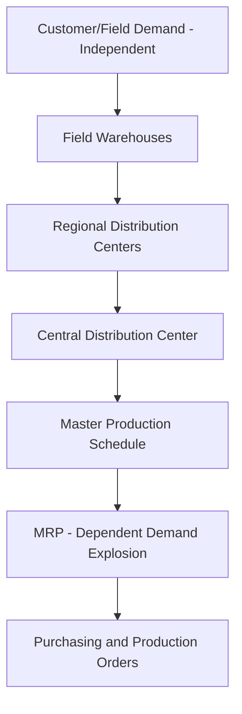
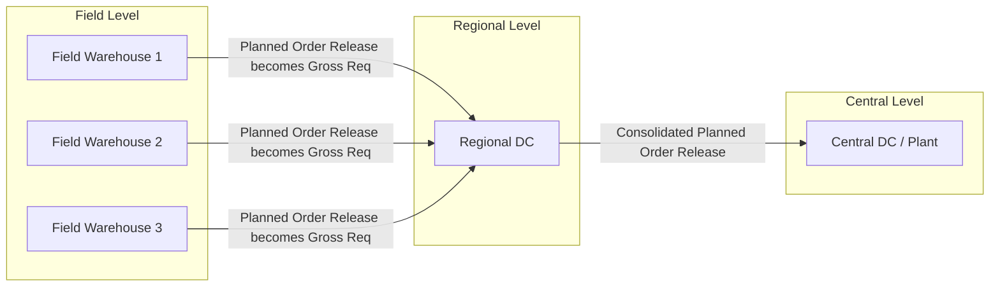
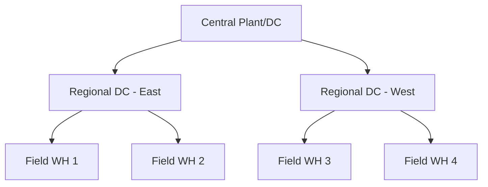

## Distribution Requirements Planning

### Definition and Purpose

Distribution Requirements Planning (DRP) is a method used to plan the replenishment of inventory across a multi-echelon distribution network — typically flowing from a central supply source (factory or central warehouse) down through regional distribution centers (RDCs) to field warehouses and ultimately to customers. DRP applies the same time-phased, dependent-demand logic used in Material Requirements Planning (MRP), but instead of exploding a bill of materials, it explodes a **distribution network structure** to determine what quantities of finished goods are needed where, and when.

DRP answers three central questions for each location in the network:

- What is needed?
- How much is needed?
- When is it needed?

It converts independent customer demand at the field level into a time-phased schedule of planned orders that cascade upward, ultimately becoming the input to the master production schedule (MPS) at the supplying plant.

### Position in the MRP/ERP Hierarchy

DRP sits at the interface between **demand-side logistics** and **supply-side manufacturing planning**. In an integrated ERP environment, DRP output feeds directly into MRP as a source of dependent demand for finished goods.

This structure mirrors MRP's bill-of-materials explosion, except the "parent-component" relationship is replaced by a "supplying-location/receiving-location" relationship.

### Core Inputs

- **Forecasted or actual customer demand** at each field warehouse (independent demand)
- **Current on-hand inventory** at each location in the network
- **Scheduled receipts** (orders already in transit or in process)
- **Lead times** for replenishment between each pair of locations (transportation and order processing time)
- **Lot-sizing rules** (fixed order quantity, lot-for-lot, periodic order quantity, etc.)
- **Safety stock requirements** per location
- **Network/distribution structure** (which locations supply which)

### The DRP Logic: Time-Phased Record

The heart of DRP is the time-phased order point record, calculated identically to an MRP record at each location:

$$\text{Net Requirements}_t = \text{Gross Requirements}_t - \text{Projected On-Hand}_{t-1} - \text{Scheduled Receipts}_t$$

Projected on-hand inventory is then rolled forward:

$$\text{Projected On-Hand}_t = \text{Projected On-Hand}_{t-1} + \text{Scheduled Receipts}_t + \text{Planned Order Receipts}_t - \text{Gross Requirements}_t$$

A planned order is generated when projected on-hand inventory (before considering the new order) would fall below the safety stock threshold. This planned order is then offset backward by the lead time to determine when it must be released.

**Example**

Field Warehouse A — planning horizon in weeks, safety stock = 20 units, lead time = 1 week.

| Week | 1 | 2 | 3 | 4 | 5 |
| --- | --- | --- | --- | --- | --- |
| Gross Requirements | 50 | 50 | 50 | 50 | 50 |
| Scheduled Receipts | 100 | 0 | 0 | 0 | 0 |
| Projected On-Hand | 70 | 20 | 70 | 20 | 70 |
| Planned Order Receipt | 0 | 0 | 100 | 0 | 100 |
| Planned Order Release | 0 | 100 | 0 | 100 | 0 |

Starting on-hand = 20. In Week 1: $20 + 100 - 50 = 70$. In Week 2: $70 - 50 = 20$ (exactly at safety stock, no order needed). In Week 3, without an order, on-hand would drop to $20 - 50 = -30$, so a planned order receipt of 100 is scheduled to keep the balance at or above safety stock, giving $20 + 100 - 50 = 70$. That order must be released one week earlier (Week 2) because lead time = 1 week.

This planned order **release** of 100 units in Week 2 at Warehouse A becomes a **gross requirement** at the supplying Regional Distribution Center in Week 2 — this is the mechanism by which demand cascades upstream through the network.

### Network Explosion (Multi-Echelon Consolidation)

Where DRP differs most from single-location reorder-point systems is in **consolidation**: a Regional DC's gross requirements are the sum of planned order releases from every field warehouse it supplies. This aggregated, time-phased demand signal is far more informative to upstream planning than isolated reorder points because it reflects true timing and magnitude of need across the whole network, not just a statistical reorder trigger at one node.

### Key Outputs

- **Planned order releases** at each network node, time-phased by period
- **Recommended replenishment schedules** for transportation and warehouse planning
- **Projected inventory levels** at every echelon, supporting proactive shortage/surplus identification
- **Input to MPS** — the aggregated requirement at the central DC becomes a demand line for the manufacturing plant

### Relationship to Distribution Resource Planning (DRP II)

DRP (Requirements Planning) is often extended into **Distribution Resource Planning (DRP II)**, analogous to how MRP extended into MRP II. DRP II adds capacity-oriented resources into the plan:

- Warehouse space/capacity
- Transportation fleet and carrier capacity
- Labor availability for handling/loading
- Financial budgeting for distribution costs

This creates closed-loop feedback similar to MRP II's capacity requirements planning (CRP), validating that the material plan is also feasible given physical and financial resource constraints.

### Advantages

- Provides **visibility** across the entire distribution network rather than location-by-location isolation
- Reduces total network inventory by **coordinating replenishment timing**, avoiding the "bullwhip"-style overreaction common with independent reorder-point systems at each echelon
- Supports proactive planning of transportation and warehouse capacity because future requirements are known in advance
- Enables **better allocation** during shortage situations, since planners can see requirements across all locations simultaneously
- Improves the accuracy of demand signals passed to manufacturing, since it reflects time-phased real requirements rather than smoothed reorder-point averages

### Limitations and Challenges

- Highly sensitive to **forecast accuracy** at the field level; errors compound as they cascade upstream [Inference — the degree of amplification depends on specific network parameters and lot-sizing rules used]
- Requires accurate, consistently maintained **lead time and inventory data** across all nodes; data quality issues degrade plan reliability network-wide
- Can suffer from the same **nervousness** problem as MRP — small changes in field-level demand can trigger cascading replan of orders throughout the network
- Assumes a relatively stable network structure; frequent changes to sourcing relationships between DCs complicate the bill-of-distribution setup
- Does not inherently account for capacity constraints unless extended to DRP II

### DRP vs. Traditional Reorder Point Systems

| Aspect | DRP | Reorder Point (ROP) |
| --- | --- | --- |
| Demand basis | Time-phased, dependent, projected | Statistical, based on demand during lead time |
| Visibility | Full network, multi-period | Single location, point-in-time |
| Reaction to demand changes | Anticipatory | Reactive (after stock hits reorder point) |
| Coordination across echelons | Explicit | None (each location independent) |
| Best suited for | Networks with known/forecastable demand patterns | Simple, low-value, stable-demand items |

### Bill of Distribution

Analogous to a bill of materials, a **bill of distribution** defines the network structure — which locations replenish from which sources, along with the associated lead times. This is the master data structure DRP explodes against.

### Role in ERP Systems

In modern ERP and supply chain planning suites, DRP functionality is typically embedded within **supply chain planning (SCP) or advanced planning and scheduling (APS) modules**, integrated with:

- Demand planning/forecasting modules (source of gross requirements)
- Transportation management systems (execution of planned shipments)
- Warehouse management systems (execution of receipts)
- MRP/MPS modules (upstream consumption of consolidated requirements)

[Unverified] Specific module names, screen layouts, and configuration steps vary significantly by ERP vendor (e.g., SAP APO/IBP, Oracle SCM Cloud, Infor) and by version, so implementation details should be confirmed against the specific system's current documentation.

**Related Topics**

- Material Requirements Planning (MRP) fundamentals
- Master Production Schedule (MPS)
- Bullwhip effect in supply chains
- Safety stock determination methods
- Lot-sizing techniques (EOQ, lot-for-lot, periodic order quantity)
- Distribution network design
- Sales and Operations Planning (S&OP)
- Vendor-Managed Inventory (VMI)
- Transportation and warehouse capacity planning (DRP II)