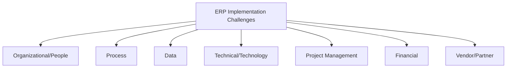

## ERP Implementation Challenges

### Overview

ERP implementation is the process of configuring, customizing, testing, and deploying an integrated enterprise resource planning system across an organization's business functions (finance, manufacturing, inventory, procurement, HR, sales). Despite mature methodologies and decades of vendor experience, ERP implementations continue to have high rates of delay, cost overrun, and outright failure. [Inference — commonly cited failure/overrun statistics vary considerably by study, industry, and definition of "failure," so specific percentages are not asserted here as fixed facts.] Understanding the categories of challenge is more durable than memorizing any single statistic, since root causes recur across industries and vendors.

### Categories of Implementation Challenges

### Organizational and People Challenges

**Resistance to Change**

Employees accustomed to legacy systems or manual workarounds often resist new standardized processes. Resistance can manifest as passive non-compliance (continuing to use shadow spreadsheets), active pushback, or disengagement from training. This is frequently cited as the single most damaging category of risk because technically sound systems fail when users don't adopt them as designed.

**Insufficient Executive Sponsorship**

ERP implementations cut across departmental boundaries and require authority to resolve cross-functional conflicts (e.g., whose process "wins" when sales and finance disagree on how to handle a transaction type). Without visible, sustained sponsorship from senior leadership, these conflicts stall the project or get resolved in ways that undermine the system's integrity.

**Inadequate Training**

Training that is rushed, generic, or delivered too early (before the system is stable) leaves users unable to perform their jobs post go-live, leading to errors, workarounds, and helpdesk overload.

**Loss of Institutional Knowledge**

Key personnel who understand legacy processes may leave during the long implementation timeline, or may not be adequately consulted, resulting in configuration that doesn't reflect actual operational needs.

### Process Challenges

**Business Process Reengineering vs. Customization**

A central tension: should the organization change its processes to fit the ERP's standard ("vanilla") functionality, or customize the ERP to match existing processes? Excessive customization increases cost, extends timelines, and creates maintenance burden for future upgrades. Excessive forced standardization can eliminate processes that provided genuine competitive advantage.

$$\text{Total Cost of Ownership} = \text{License/Subscription} + \text{Implementation} + \text{Customization} + \text{Ongoing Maintenance/Upgrades}$$

Customization disproportionately inflates the second and fourth terms.

**Scope Creep**

As stakeholders see the system taking shape, requests to add functionality ("while we're in there, let's also...") accumulate, extending timeline and budget beyond original projections.

**Poor Requirements Definition**

If current-state (as-is) and future-state (to-be) processes are not clearly mapped before configuration begins, the implementation team configures against ambiguous or shifting requirements.

### Data Challenges

**Data Migration Complexity**

Legacy data is often inconsistent, duplicated, incomplete, or stored in incompatible formats across multiple source systems. Migrating this data into the new ERP's data model requires:

- Data cleansing (deduplication, standardization)
- Data mapping (translating legacy fields/codes to new schema)
- Validation and reconciliation post-migration

**Master Data Governance**

Item masters, bills of materials, customer/vendor records, and chart of accounts must be standardized across business units before go-live. Divergent coding conventions across legacy systems (e.g., different plants using different part-numbering schemes) are a common root cause of post-go-live data integrity problems.

**Data Migration Testing**

Insufficient testing of migrated data (spot-checking rather than full reconciliation) allows errors to surface only after go-live, when they are more costly to fix.

### Technical Challenges

**Integration with Existing Systems**

ERP rarely replaces every system in an organization; interfaces to legacy systems, EDI networks, e-commerce platforms, or specialized tools (e.g., a warehouse control system on the shop floor) must be built and maintained. Integration complexity grows non-linearly with the number of connected systems.

**Infrastructure Readiness**

For on-premise or hybrid deployments, hardware sizing, network bandwidth (especially for multi-site or global rollouts), and disaster recovery infrastructure must support the new system's performance requirements.

**System Performance and Scalability**

Under-provisioned environments or poorly optimized configurations can cause slow transaction processing, particularly during peak periods (e.g., month-end close, order surges).

**Version/Upgrade Management**

For cloud/SaaS ERP, vendors push periodic updates that can change functionality; for on-premise systems, staying on an unsupported version creates security and support risk. [Behavior may vary by specific ERP vendor and deployment model.]

### Project Management Challenges

**Unrealistic Timelines and Budgets**

Timelines are frequently set based on vendor sales estimates or executive mandates rather than bottom-up scoping, leading to compressed testing and training phases when deadlines approach.

**Inadequate Change Management Planning**

Change management (communication, training, process documentation) is sometimes treated as an afterthought rather than a parallel workstream with its own budget and timeline.

**Weak Governance Structure**

Without a clear steering committee, decision rights, and escalation path, cross-functional conflicts (e.g., competing configuration requirements from different departments) delay progress.

**Testing Shortfalls**

Compressed timelines often cut testing first — insufficient unit testing, integration testing, and user acceptance testing (UAT) allow defects to reach production.

### Financial Challenges

**Hidden and Ongoing Costs**

Beyond license/subscription fees, organizations frequently underestimate:

- Data migration and cleansing labor
- Custom report and interface development
- Post-go-live stabilization support
- Ongoing system administration and upgrade costs

**Opportunity Cost of Internal Resources**

Subject matter experts pulled into the implementation team are unavailable for their normal operational duties, creating a hidden cost often absent from project budgets.

### Vendor and Implementation Partner Challenges

**Vendor/Consultant Capability Mismatch**

Implementation partners with limited experience in the client's specific industry may configure standard functionality that doesn't reflect industry-specific operational nuances (e.g., process manufacturing vs. discrete manufacturing).

**Misaligned Incentives**

Time-and-materials contracts can incentivize extended engagements; fixed-price contracts can incentivize corner-cutting on testing and configuration quality. [Speculation — actual incentive effects depend heavily on contract structure and the specific relationship, not a universal rule.]

### Common Root-Cause Framework

Many of the specific challenges above trace back to a smaller number of underlying failure patterns:

| Root Cause | Downstream Symptom |
| --- | --- |
| Weak executive sponsorship | Unresolved cross-functional conflicts, scope creep |
| Underinvestment in change management | User resistance, low adoption, workaround culture |
| Poor data governance | Data migration errors, reporting inaccuracy post go-live |
| Compressed timeline | Inadequate testing, incomplete training |
| Excessive customization | Cost overrun, difficult future upgrades |
| Inadequate requirements definition | Rework, scope creep, missed functionality |

### Mitigation Approaches

**Key Points**

- Secure and maintain visible executive sponsorship throughout the full project lifecycle, not just at kickoff
- Invest in change management as a formal, budgeted workstream parallel to technical configuration
- Favor standard ("vanilla") configuration where feasible; reserve customization for genuine competitive differentiators
- Begin data cleansing and governance early, well before the technical migration phase
- Build realistic timelines based on bottom-up scoping rather than top-down mandates, with contingency buffer
- Conduct phased or pilot rollouts (e.g., one site or business unit first) rather than a single "big bang" cutover across the entire organization, where feasible
- Plan for a post-go-live stabilization/hypercare period with dedicated support resources
- Establish clear governance with defined decision rights and an escalation path for cross-functional conflicts

### Implementation Approach Comparison

| Approach | Description | Risk Profile |
| --- | --- | --- |
| Big Bang | All modules/sites go live simultaneously | Higher risk, shorter overall timeline, cross-functional issues surface at once |
| Phased | Modules or business processes rolled out sequentially | Lower risk per phase, longer overall timeline, integration gaps between phases possible |
| Pilot/Parallel | One site or unit implemented first as a template, then rolled out | Allows lessons-learned before full rollout, but delays organization-wide benefits |
| Parallel Run | Legacy and new systems run simultaneously for a period | Reduces cutover risk, but doubles operational workload during overlap |

### Relationship to Operations Management

ERP implementation challenges are directly relevant to operations management because the ERP system typically becomes the backbone for MRP, capacity planning, inventory control, and production scheduling. A poorly implemented ERP can undermine otherwise sound operations strategies — for example, inaccurate on-hand inventory data (a data governance failure) will produce unreliable MRP net requirements calculations regardless of how well the MRP logic itself is designed.

**Related Topics**

- Business Process Reengineering (BPR)
- Change management frameworks (e.g., Kotter's 8-step model, ADKAR)
- Master data management (MDM)
- MRP and MRP II fundamentals
- Project governance and steering committees
- Total Cost of Ownership (TCO) analysis
- Go-live cutover strategies (big bang vs. phased)
- User Acceptance Testing (UAT) methodology