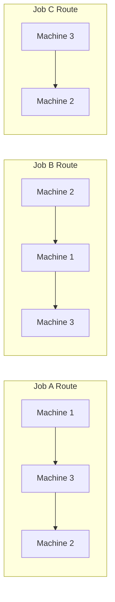

## Job Shop Scheduling and Dispatching Rules

### Overview

Job shop scheduling addresses the sequencing of jobs through a set of work centers (machines/resources) where different jobs follow different routes and require different processing times. Unlike flow shops, where all jobs pass through the same sequence of stations, a job shop's routing flexibility makes scheduling combinatorially complex — the number of possible sequences grows factorially with the number of jobs and machines, making exhaustive optimization computationally intractable for realistic problem sizes. This is why dispatching rules (simple heuristic priority rules applied in real time) are used extensively in practice instead of globally optimal schedules.

### Job Shop Environment Characteristics

- **Variable routings**: each job may visit machines in a different sequence
- **Variable processing times**: jobs differ in the time required at each operation
- **Multiple jobs competing for the same resource** at any given time, creating queues
- **Dynamic arrivals**: new jobs can enter the system continuously (open shop) rather than all being known in advance (static/closed shop)

### The Scheduling Problem Formally

For $n$ jobs and $m$ machines, the number of possible sequences (if each machine's queue could be ordered independently) is:

$$(n!)^m$$

For even modest values (e.g., $n=10$, $m=5$), this number vastly exceeds what can be evaluated exhaustively, which is why job shop scheduling problems are classified as NP-hard in general, and why heuristic dispatching rules dominate real-world practice over exact optimization.

### Common Scheduling Objectives

Different objectives can produce different "best" sequences, and objectives frequently conflict with one another:

| Objective | Description |
| --- | --- |
| Minimize makespan | Complete the full set of jobs as quickly as possible |
| Minimize mean flow time | Minimize average time a job spends in the system |
| Minimize mean lateness/tardiness | Minimize how far jobs finish past due dates |
| Minimize number of tardy jobs | Minimize count of jobs missing due dates, regardless of degree |
| Maximize machine utilization | Keep resources busy, minimizing idle time |
| Minimize work-in-process (WIP) inventory | Reduce the number of jobs waiting in queues |

### Key Scheduling Terminology

- **Processing time ($t_i$)**: time required to complete operation for job $i$ at a given machine
- **Due date ($d_i$)**: date by which job $i$ should be completed
- **Flow time ($F_i$)**: time between a job's arrival and its completion
- **Lateness ($L_i$)**: $L_i = C_i - d_i$ (completion time minus due date; can be negative if early)
- **Tardiness ($T_i$)**: $T_i = \max(0, C_i - d_i)$ (lateness only counted when positive)
- **Slack time**: $d_i - (\text{current time} + \text{remaining processing time})$

### Dispatching Rules

Dispatching rules are priority heuristics applied at each machine whenever it becomes free, selecting the next job from the queue based on a simple rule rather than a globally optimized sequence.

**First Come, First Served (FCFS)**

Jobs are processed in the order they arrive at the machine/queue. Simple and perceived as fair, but does not account for processing time or due date, often resulting in poor overall flow time performance.

**Shortest Processing Time (SPT)**

The job with the shortest processing time at that machine is selected next.

**Key Points**

- SPT is provably optimal for minimizing **mean flow time** and **mean number of jobs in the system** in a single-machine environment
- Its major drawback: long jobs can be repeatedly bumped by shorter ones, leading to excessive tardiness for long jobs ("job starvation")
- Widely used as a baseline rule in scheduling research due to its strong average-case performance across many objectives

**Earliest Due Date (EDD)**

Jobs are sequenced by due date, earliest first.

**Key Points**

- EDD is provably optimal for minimizing **maximum lateness** in a single-machine environment
- Does not consider processing time, so it can still produce significant tardiness for jobs with a due date close to the current time but a long processing time

**Critical Ratio (CR)**

$$CR = \frac{d_i - \text{current date}}{\text{remaining processing time}}$$

Jobs are prioritized by lowest critical ratio (most time-constrained relative to remaining work first). A ratio less than 1 indicates the job is already behind schedule; a ratio greater than 1 indicates slack remains. Critical ratio dynamically recalculates as time passes, making it more responsive than static rules like EDD, at the cost of needing continuous recalculation.

**Slack Time Remaining (STR / Least Slack)**

Jobs with the least slack (due date minus remaining work) are prioritized. Similar intent to critical ratio but expressed as a difference rather than a ratio.

**Slack per Remaining Operation (S/RO)**

$$S/RO = \frac{d_i - \text{current date} - \text{remaining processing time}}{\text{number of remaining operations}}$$

Distributes slack across remaining operations, useful when jobs have differing numbers of remaining steps.

**Longest Processing Time (LPT)**

The job with the longest processing time is selected next. Counterintuitively useful in parallel-machine environments for balancing load and minimizing makespan, since scheduling long jobs early avoids leaving them stranded at the end.

**Rush/Priority Order Rule**

Jobs are flagged with a priority code (e.g., rush orders, key customer orders) that overrides other sequencing logic. Useful operationally but can disrupt the performance of other rules if overused.

**Random Selection**

Used primarily as a benchmark/baseline in simulation studies to evaluate the relative benefit of other rules.

### Dispatching Rule Comparison

| Rule | Optimizes For | Weakness |
| --- | --- | --- |
| FCFS | Perceived fairness, simplicity | Poor average flow time and tardiness |
| SPT | Mean flow time, WIP, machine utilization | Long-job starvation, poor max tardiness |
| EDD | Maximum lateness | Ignores processing time, no WIP benefit |
| Critical Ratio | Dynamic due-date pressure | Requires continuous recalculation |
| S/RO | Multi-operation slack balancing | More complex to compute and maintain |
| LPT | Makespan in parallel-machine settings | Poor for due-date-sensitive environments |

### Sequencing on a Single Machine: Worked Example

Four jobs waiting at a single machine, current date = day 0:

| Job | Processing Time (days) | Due Date (day) |
| --- | --- | --- |
| A | 4 | 10 |
| B | 2 | 6 |
| C | 6 | 15 |
| D | 3 | 8 |

**SPT sequence**: B (2) → D (3) → A (4) → C (6)

Completion times: B=2, D=5, A=9, C=15

Mean flow time: $(2+5+9+15)/4 = 7.75$ days

**EDD sequence**: B (due 6) → D (due 8) → A (due 10) → C (due 15)

In this particular case, EDD and SPT happen to produce the same sequence because processing times and due dates are positively correlated here — this is not generally true.

Lateness under this sequence: B: $2-6=-4$; D: $5-8=-3$; A: $9-10=-1$; C: $15-15=0$. Maximum lateness = 0 (no job is late), which is the EDD-optimal outcome for this instance.

### Two-Machine Sequencing: Johnson's Rule

For the special case of $n$ jobs through exactly 2 machines in the same order (a flow-shop case sometimes discussed alongside job shop scheduling), **Johnson's Rule** provides an optimal makespan-minimizing sequence:

**Next Steps (Algorithm)**

1. List processing times for all jobs on both machines
2. Find the shortest processing time across all remaining jobs and both machines
3. If that shortest time is on Machine 1, schedule that job as early as possible in the sequence
4. If that shortest time is on Machine 2, schedule that job as late as possible in the sequence
5. Remove the scheduled job and repeat with remaining jobs until all are sequenced

This rule guarantees a minimum makespan for the two-machine flow shop case but does not generalize directly to job shops with more than two machines or arbitrary routings.

### Finite Capacity Scheduling and Bottleneck Focus

In practice, many job shops apply **Theory of Constraints (TOC)**-influenced logic, focusing scheduling attention on the bottleneck resource (the machine with the least available capacity relative to demand), since the bottleneck's schedule determines overall system throughput. Non-bottleneck resources have slack capacity and are scheduled to support the bottleneck's pace rather than optimized independently.

$$\text{System Throughput} \leq \text{Bottleneck Capacity}$$

### Simulation and Rule Selection

Because no single dispatching rule dominates across all objectives and shop configurations, organizations frequently use **discrete-event simulation** to test candidate rules against historical or representative job mixes before committing to a rule for live operation. [Inference — the specific rule that performs best is highly dependent on shop configuration, job mix, and due-date tightness, so simulation-based validation is standard practice rather than relying on generic rule rankings.]

### Practical Implementation Considerations

- **Rule stability**: rules that are recalculated too frequently (e.g., critical ratio updated every few minutes) can cause excessive job reshuffling on the shop floor, creating confusion and setup inefficiency
- **Combination approaches**: many real systems apply a primary rule (e.g., SPT) with an override for rush orders or jobs approaching a hard due date
- **Integration with MRP/ERP**: dispatching rules are often executed through the ERP's shop floor control or advanced planning and scheduling (APS) module, using due dates and priorities generated upstream by MRP

### Illustration: Priority Queue at a Work Center (svg_diagram)

<svg xmlns="http://www.w3.org/2000/svg" viewBox="0 0 640 260">
<text x="20" y="25" font-size="16" font-weight="bold">Work Center Queue and Dispatching Rule Selection (svg_diagram)</text>
<rect x="20" y="60" width="100" height="50" fill="none" stroke="black" stroke-width="2" />
<text x="70" y="90" font-size="12" text-anchor="middle">Job A (t=4)</text>
<rect x="130" y="60" width="100" height="50" fill="none" stroke="black" stroke-width="2" />
<text x="180" y="90" font-size="12" text-anchor="middle">Job B (t=2)</text>
<rect x="240" y="60" width="100" height="50" fill="none" stroke="black" stroke-width="2" />
<text x="290" y="90" font-size="12" text-anchor="middle">Job C (t=6)</text>
<rect x="350" y="60" width="100" height="50" fill="none" stroke="black" stroke-width="2" />
<text x="400" y="90" font-size="12" text-anchor="middle">Job D (t=3)</text>
<text x="235" y="140" font-size="13" text-anchor="middle">Dispatching Rule Applied (e.g., SPT)</text>
<line x1="235" y1="150" x2="235" y2="180" stroke="black" stroke-width="2" marker-end="url(#arrow)" />
<rect x="150" y="185" width="170" height="45" fill="none" stroke="black" stroke-width="2" />
<text x="235" y="212" font-size="13" text-anchor="middle">Machine Selects: Job B</text>
</svg>

### Relationship to Operations Management

Job shop scheduling directly supports operational objectives of on-time delivery, resource utilization, and inventory/WIP minimization. It represents the execution-level counterpart to higher-level planning performed by MRP and capacity requirements planning (CRP) — while MRP determines what and when at a planning level, dispatching rules determine the actual real-time sequence executed at each individual work center.

**Related Topics**

- Flow shop scheduling and Johnson's Rule extensions
- Theory of Constraints and bottleneck-based scheduling (Drum-Buffer-Rope)
- Finite capacity scheduling and Advanced Planning and Scheduling (APS) systems
- Discrete-event simulation for shop floor design
- Gantt chart scheduling visualization
- Capacity Requirements Planning (CRP)
- Little's Law and WIP/flow time relationships
- Lean manufacturing and pull-based scheduling (Kanban) as an alternative to dispatch-rule-based push scheduling