## Sequencing on Single and Multiple Machines

### Overview

Sequencing determines the order in which a set of waiting jobs should be processed on one or more machines to optimize a chosen performance measure. It is a core sub-problem within production scheduling: given jobs with known processing times (and sometimes due dates), what order minimizes flow time, tardiness, makespan, or another objective? This topic builds directly on dispatching-rule logic by examining exact, provably optimal sequencing methods for specific, well-structured cases.

### Fundamental Notation

- $n$ = number of jobs
- $t_i$ = processing time of job $i$
- $d_i$ = due date of job $i$
- $C_i$ = completion time of job $i$
- $F_i$ = flow time of job $i$ = $C_i$ (time from start of schedule to completion, assuming all jobs available at time 0)
- $L_i$ = lateness = $C_i - d_i$
- $T_i$ = tardiness = $\max(0, C_i - d_i)$

### Single-Machine Sequencing

**Assumptions for Classical Single-Machine Rules**

- All jobs are available at time zero (static arrival)
- One machine processes one job at a time, no preemption
- Processing times are known and fixed
- Setup times are either negligible or included in processing time

**Shortest Processing Time (SPT) Rule**

Sequencing jobs in ascending order of processing time minimizes mean flow time and mean number of jobs in the system.

$$\text{Mean Flow Time} = \frac{1}{n}\sum_{i=1}^{n} F_i$$

**Key Points**

- SPT is a mathematically proven optimal rule for this specific objective under the static, single-machine assumptions — this is established scheduling theory, not an approximation
- The proof relies on an exchange argument: swapping any two adjacent jobs so the shorter one goes first can only reduce or maintain total flow time, never increase it
- SPT does not consider due dates, so while average performance improves, individual long jobs can be delayed indefinitely if arrivals continue (queue starvation)

**Worked Example — SPT Sequencing**

| Job | Processing Time |
| --- | --- |
| A | 6 |
| B | 2 |
| C | 8 |
| D | 3 |

SPT order: B(2) → D(3) → A(6) → C(8)

Completion times: B=2, D=5, A=11, C=19

Mean flow time = $(2+5+11+19)/4 = 9.25$

Compare to an arbitrary sequence A-B-C-D: completion times A=6, B=8, C=16, D=19; mean flow time = $(6+8+16+19)/4 = 12.25$. SPT's mean flow time is lower, illustrating the optimality property.

**Earliest Due Date (EDD) Rule**

Sequencing jobs in ascending order of due date minimizes **maximum lateness** ($L_{max}$) among all jobs.

**Key Points**

- EDD's optimality is specifically for minimizing maximum lateness, not mean lateness or mean tardiness
- EDD can still produce poor total/mean flow time performance compared to SPT

**Minimizing Number of Tardy Jobs — Moore's Algorithm (Hodgson's Algorithm)**

When the objective is to minimize the *count* of late jobs (not the degree of lateness), Moore's algorithm applies:

**Next Steps (Algorithm)**

1. Sequence all jobs by EDD
2. Scan through the sequence; if a job would be completed late given the current partial sequence, identify it
3. Among all jobs scheduled so far (including the newly late one), remove the job with the **longest processing time**
4. Set that removed job aside to be scheduled at the end (out of due-date order), and continue scanning
5. Repeat until all jobs are checked; the final sequence minimizes the number of tardy jobs

This reflects the intuition that if a job must be late, it is best to "sacrifice" the longest job, since removing it frees the most time to keep other jobs on schedule.

### Two-Machine Flow Shop Sequencing: Johnson's Rule

For $n$ jobs that must be processed on exactly two machines, in the same order (Machine 1 then Machine 2) for every job, **Johnson's Rule** produces the makespan-minimizing sequence — makespan being the time from the start of the first job to the completion of the last.

**Next Steps (Johnson's Rule Algorithm)**

1. List the processing time for every job on both Machine 1 ($t_{i1}$) and Machine 2 ($t_{i2}$)
2. Find the single smallest processing time remaining across all jobs and both machines
3. If the smallest time belongs to Machine 1, place that job as early as possible in the sequence
4. If the smallest time belongs to Machine 2, place that job as late as possible in the sequence
5. Remove that job from consideration and repeat with the remaining jobs until all are sequenced

**Worked Example — Johnson's Rule**

| Job | Machine 1 | Machine 2 |
| --- | --- | --- |
| 1 | 5 | 2 |
| 2 | 3 | 6 |
| 3 | 8 | 4 |
| 4 | 4 | 7 |

Step by step:

- Smallest time overall = 2 (Job 1, Machine 2) → place Job 1 **last**
- Remaining: Job 2 (3,6), Job 3 (8,4), Job 4 (4,7). Smallest = 3 (Job 2, Machine 1) → place Job 2 **first**
- Remaining: Job 3 (8,4), Job 4 (4,7). Smallest = 4, tied between Job 3/Machine 2 and Job 4/Machine 1
  - Job 4's 4 is on Machine 1 → place Job 4 as early as possible (next available front slot)
  - Job 3's 4 is on Machine 2 → place Job 3 as late as possible (next available end slot)

Final sequence: **Job 2 → Job 4 → Job 3 → Job 1**

**Gantt Calculation**

| Job | M1 Start | M1 End | M2 Start | M2 End |
| --- | --- | --- | --- | --- |
| 2 | 0 | 3 | 3 | 9 |
| 4 | 3 | 7 | 9 | 16 |
| 3 | 7 | 15 | 16 | 20 |
| 1 | 15 | 20 | 20 | 22 |

Makespan = 22 (Job 1's completion on Machine 2). Machine 2 start times reflect both machine availability and the requirement that a job cannot start on Machine 2 until it has finished on Machine 1.

```mermaid
gantt
    dateFormat X
    axisFormat %s
    section Machine 1
    Job2 :0, 3
    Job4 :3, 7
    Job3 :7, 15
    Job1 :15, 20
    section Machine 2
    Job2 :3, 9
    Job4 :9, 16
    Job3 :16, 20
    Job1 :20, 22
```

### Three-Machine Extension of Johnson's Rule

Johnson's Rule can be extended to three machines under a restrictive special condition: either the minimum processing time on Machine 1 is greater than or equal to the maximum processing time on Machine 2, **or** the minimum processing time on Machine 3 is greater than or equal to the maximum processing time on Machine 2. When this condition holds, two pseudo-machines are created:

$$t_{i,\text{pseudo1}} = t_{i1} + t_{i2}$$

$$t_{i,\text{pseudo2}} = t_{i2} + t_{i3}$$

Johnson's Rule is then applied to these pseudo-machine times. [Unverified — this extension only guarantees optimality when the stated condition on Machine 2's processing times holds; outside that condition it functions as a heuristic without the same optimality guarantee.]

### Multiple/Parallel Machine Sequencing

When $m$ identical machines operate in parallel (rather than jobs flowing sequentially through different machines), the objective is typically to balance load and minimize makespan.

**Longest Processing Time (LPT) Rule**

Jobs are sorted in descending order of processing time and assigned, one at a time, to whichever machine currently has the least accumulated workload.

**Key Points**

- LPT does not guarantee a globally optimal makespan for parallel-machine scheduling (an NP-hard problem in general) but provides a strong, easily computed heuristic
- LPT has a known worst-case performance bound: the makespan produced is guaranteed to be no worse than $\frac{4}{3} - \frac{1}{3m}$ times the optimal makespan for $m$ identical parallel machines [this bound reflects established scheduling theory results for the LPT heuristic]

**Worked Example — LPT on 2 Parallel Machines**

Jobs: 8, 7, 6, 5, 4 (minutes)

LPT order: 8, 7, 6, 5, 4. Assign greedily to the least-loaded machine:

- Job 8 → Machine 1 (load 8)
- Job 7 → Machine 2 (load 7)
- Job 6 → Machine 2 (load 7, so goes to Machine 2 → load 13)...

Recomputing correctly: after Job 8→M1(8), Job 7→M2(7), next job 6 goes to the lesser-loaded machine (M2 at 7 < M1 at 8) → M2 becomes 13. Job 5 goes to M1 (8 < 13) → M1 becomes 13. Job 4 goes to whichever is lower; both at 13, assign to M1 → M1 = 17, M2 = 13.

Final loads: M1 = 17, M2 = 13. Makespan = 17.

### Sequencing with Setup Times

When setup times are **sequence-dependent** (the time to change over depends on which job precedes which), the problem becomes analogous to the classic Traveling Salesman Problem, since setup time forms a matrix rather than a fixed per-job value. Exact solutions become computationally expensive beyond small job counts, so heuristics (nearest-neighbor setup minimization, genetic algorithms, or commercial APS solvers) are typically used in practice.

### Comparison of Sequencing Objectives and Applicable Rules

| Objective | Machine Environment | Optimal/Recommended Rule |
| --- | --- | --- |
| Minimize mean flow time | Single machine | SPT |
| Minimize maximum lateness | Single machine | EDD |
| Minimize number of tardy jobs | Single machine | Moore's/Hodgson's Algorithm |
| Minimize makespan | Two-machine flow shop | Johnson's Rule |
| Minimize makespan | Parallel identical machines | LPT (heuristic) |
| Minimize sequence-dependent setup time | Any | Heuristic/metaheuristic (TSP-analogous) |

### Practical Considerations and Limitations

- Classical single- and two-machine rules assume **static, deterministic** conditions (all jobs known and available at time zero, fixed processing times); real shop floors are dynamic, with jobs arriving continuously and processing time variability
- As machine count and routing complexity increase beyond these special structured cases, exact optimization becomes computationally intractable, and organizations shift toward dispatching rules or simulation-based heuristic scheduling (see Job Shop Scheduling and Dispatching Rules)
- Sequencing decisions interact with **lot-sizing and setup reduction** efforts (e.g., SMED) — reducing setup times reduces the penalty for sequence changes and can shift the optimal sequencing strategy entirely [Inference — the degree of interaction depends on the specific ratio of setup time to processing time in a given environment]

### Relationship to Operations Management

Sequencing theory provides the mathematical foundation underlying more heuristic, real-time dispatching approaches used on actual shop floors. Understanding provably optimal solutions for simplified cases (single machine, two-machine flow shop) helps operations managers evaluate how far a practical heuristic's performance likely deviates from the theoretical best case, and informs decisions about when investment in more sophisticated scheduling systems (e.g., APS software) is justified by the complexity of the actual production environment.

**Related Topics**

- Job shop scheduling and dispatching rules
- Flow shop vs. job shop production environments
- Gantt chart construction and interpretation
- Theory of Constraints and Drum-Buffer-Rope scheduling
- Single Minute Exchange of Die (SMED) and setup time reduction
- NP-hard combinatorial optimization in operations
- Advanced Planning and Scheduling (APS) software
- Little's Law and queueing relationships in production systems