## Gantt Chart Applications

### Overview

A Gantt chart is a horizontal bar chart used to visually represent a schedule over time, showing the start and finish of discrete activities, jobs, or tasks against a time axis. Developed in the early 20th century (most commonly associated with Henry Gantt, though similar chart forms predate him), it remains one of the most widely used visual tools in production scheduling and project management because it makes sequencing, duration, overlap, and resource loading immediately visible without requiring interpretation of numerical tables.

### Basic Structure

- **Horizontal axis**: represents time (hours, days, weeks depending on context)
- **Vertical axis**: lists activities, jobs, or resources (machines, workers)
- **Horizontal bars**: represent the duration of each activity, positioned according to start and finish time
- **Bar position and length**: convey both timing and duration simultaneously — something a text-based schedule table does not do as intuitively

```mermaid
gantt
    dateFormat X
    axisFormat %s
    title Basic Gantt Chart Structure
    section Machine A
    Job 1 :0, 4
    Job 3 :4, 9
    section Machine B
    Job 2 :0, 3
    Job 4 :3, 8
```

### Types of Gantt Charts in Operations Management

**Machine/Resource Loading Chart**

Shows what is scheduled on each machine or resource over time. Vertical axis lists machines; bars show which job occupies each machine during which time interval. Useful for identifying resource conflicts (double-booking) and idle time.

**Job/Order Progress Chart**

Vertical axis lists jobs or orders instead of machines; bars show the planned and actual progress of each job across its full routing. Useful for tracking whether specific customer orders are on schedule.

**Project Scheduling Gantt Chart**

Used in project management contexts (including large-scale operations projects like facility setup or ERP implementation) to show task dependencies, critical path elements, and milestones alongside duration bars.

### Key Points — Core Applications in Operations Management

- **Machine loading and capacity visualization**: quickly reveals which machines are overloaded (back-to-back bars, no idle time) versus underutilized (frequent gaps)
- **Sequence and dispatch visualization**: after applying a dispatching rule (SPT, EDD, etc.), a Gantt chart displays the resulting sequence, making it easy to communicate the plan to shop floor supervisors
- **Progress tracking against plan**: many Gantt implementations show a planned bar and an actual/progress bar together, so variances between planned and actual completion are visually apparent
- **Bottleneck identification**: a machine's Gantt row that has no idle gaps across the horizon, while other rows show slack, visually flags the bottleneck resource
- **Communication tool**: because it requires no specialized numerical literacy to interpret, it functions well as a shared reference between planners, supervisors, and operators

### Reading a Machine Loading Gantt Chart — Worked Example

Given the Johnson's Rule sequencing result from a prior example (Job 2 → Job 4 → Job 3 → Job 1 across two machines):

| Job | M1 Start | M1 End | M2 Start | M2 End |
| --- | --- | --- | --- | --- |
| 2 | 0 | 3 | 3 | 9 |
| 4 | 3 | 7 | 9 | 16 |
| 3 | 7 | 15 | 16 | 20 |
| 1 | 15 | 20 | 20 | 22 |

```mermaid
gantt
    dateFormat X
    axisFormat %s
    title Machine Loading Chart from Johnson's Rule Sequence
    section Machine 1
    Job2 :0, 3
    Job4 :3, 7
    Job3 :7, 15
    Job1 :15, 20
    section Machine 2
    Job2 :3, 9
    Job4 :9, 16
    Job3 :16, 20
    Job1 :20, 22
```

Reading this chart: Machine 1 has continuous utilization from time 0 to 20 with no idle gaps, while Machine 2 has a gap from 0 to 3 (waiting for Job 2 to clear Machine 1) — this idle gap is immediately visible as white space at the start of Machine 2's row, something that would require calculation to notice in tabular form.

### Gantt Charts for Progress Control

A common operations application layers **planned** and **actual** bars for the same job:

```mermaid
gantt
    dateFormat X
    axisFormat %s
    title Planned vs Actual Progress Tracking
    section Job 101 Planned
    Planned Duration :0, 10
    section Job 101 Actual
    Actual Progress :0, 7
```

In practice (outside the text-based rendering constraints here), this is often shown as two bars in the same row — a light/outline bar for planned duration and a solid/filled bar for actual progress — with a **vertical "today" line** cutting across the chart. Any actual bar not reaching the today line by its planned endpoint visually signals a delay, letting a supervisor spot at-risk jobs at a glance without checking individual job records.

### Gantt Charts and Dependencies (Project Scheduling Context)

In project-oriented Gantt applications, bars can be connected with dependency arrows (finish-to-start, start-to-start, etc.), and a **critical path** — the longest chain of dependent tasks determining overall project duration — can be highlighted, typically in a distinct color or bold outline.

```mermaid
gantt
    dateFormat X
    axisFormat %s
    title Project Gantt with Dependencies
    section Phase 1
    Design :0, 5
    section Phase 2
    Procurement :5, 12
    section Phase 3
    Installation :12, 20
    section Phase 4
    Testing :20, 24
```

### Advantages

- Intuitive visual communication requiring minimal training to interpret
- Simultaneously conveys sequence, duration, and resource assignment
- Easily updated for short-term rescheduling (in software implementations, bars can be dragged to new positions)
- Effective for both machine-centric (loading) and job-centric (progress) views of the same underlying schedule data
- Useful across multiple organizational levels — shop floor supervisors, production planners, and executives can all read the same chart at their relevant level of detail

### Limitations

- Does not inherently show *why* a schedule is sequenced a certain way (the underlying dispatching rule or logic is not visible on the chart itself)
- Can become visually cluttered and difficult to read as the number of jobs/machines grows large, especially in dense job shop environments with many concurrent orders
- Static Gantt charts (paper or simple spreadsheet-based) do not automatically reflect real-time changes; they require manual updating, which introduces lag and risk of the chart becoming outdated
- Does not natively capture resource capacity constraints beyond what is manually reflected in bar placement — it visualizes a schedule but does not itself generate an optimized one
- Interdependencies between many jobs across many machines (as in true job shops) are harder to represent cleanly compared to simpler project task dependencies

### Software Implementation

Modern ERP and APS systems generate Gantt charts dynamically from underlying scheduling data, often supporting:

- **Drag-and-drop rescheduling**, where moving a bar automatically recalculates downstream schedule dependencies
- **Color coding** by job status (on schedule, at risk, late), priority level, or customer
- **Drill-down** from a summary Gantt view into detailed operation-level data for a specific job
- **What-if simulation**, allowing planners to test the effect of rescheduling before committing changes to the live schedule

[Unverified — specific Gantt module features, terminology, and interaction patterns vary by ERP/APS vendor and version, so implementation details should be confirmed against the specific system's current documentation.]

### Gantt Chart vs. Other Scheduling Visualization Tools

| Tool | Primary Strength | Primary Limitation |
| --- | --- | --- |
| Gantt chart | Intuitive time/sequence/duration visualization | Doesn't show sequencing logic or optimize automatically |
| PERT/network diagram | Shows task dependencies and critical path explicitly | Less intuitive time-scale visualization than Gantt |
| Dispatch list (text) | Precise, easily sorted/filtered data | No visual sense of overlap or idle time |
| Load profile chart | Shows aggregate capacity utilization over time | Doesn't show individual job sequence detail |

### Relationship to Operations Management

Gantt charts serve as the visualization layer connecting scheduling theory (dispatching rules, sequencing algorithms like SPT/EDD/Johnson's Rule) to practical shop floor execution and control. While sequencing rules determine *what order* jobs should run in, the Gantt chart is the primary tool through which that sequence is communicated, monitored, and adjusted in response to real-world disruptions (machine breakdowns, rush orders, material delays).

**Related Topics**

- Job shop scheduling and dispatching rules
- Sequencing on single and multiple machines
- Critical Path Method (CPM) and PERT networks
- Capacity Requirements Planning (CRP) and load profiles
- Advanced Planning and Scheduling (APS) software
- Shop floor control systems
- Project management scheduling techniques