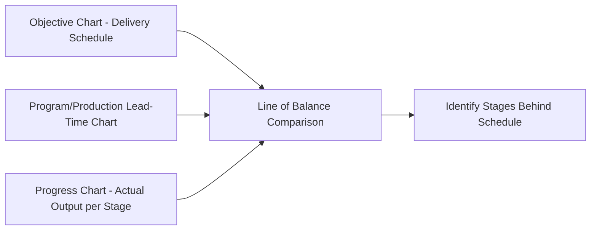
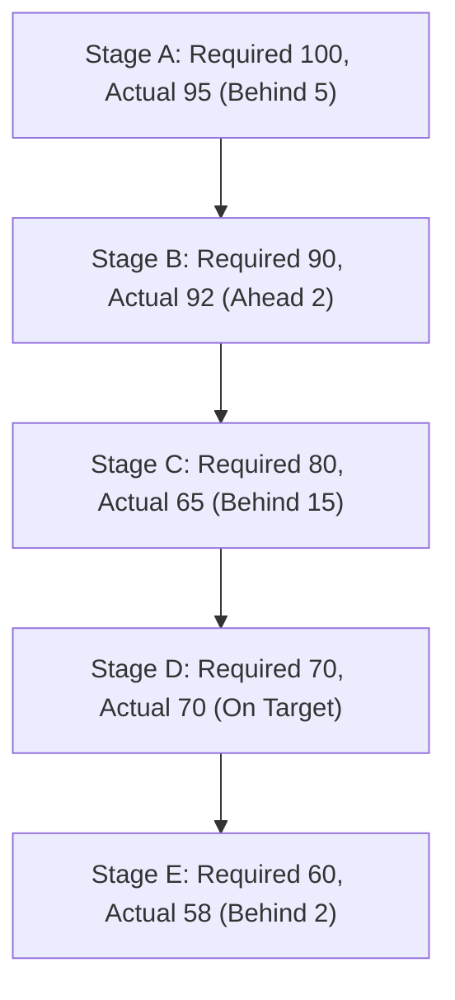

## The Line-of-Balance Technique

### Overview

Line of Balance (LOB) is a scheduling and control technique used for planning and monitoring the production of repetitive units — a batch of identical or similar items passing through the same sequence of operations. It was originally developed for tracking progress against delivery schedules for repetitive manufacturing programs and is applied where a quantity of identical items must move through multiple sequential stages, and management needs to verify that production at each stage is proceeding fast enough to meet a final delivery schedule.

Unlike a single-item Gantt chart, LOB is specifically built for **quantities of units flowing through a multi-stage process over time**, making it well suited to repetitive manufacturing, batch production, and long-cycle assembly (e.g., construction of similar housing units, aircraft assembly programs, or equipment produced in a series).

### Core Concept

LOB compares, at a given point in control (the "study date"), the actual cumulative quantity completed at each stage of production against the quantity that **should have been completed** by that date according to the delivery schedule. Where actual output falls behind the required output at a given stage, that stage is flagged as a control point requiring management attention.

### The Three Component Charts

LOB analysis is built from three linked charts.

**1. Objective Chart (Delivery Schedule)**

Plots the cumulative number of units to be delivered over time, based on customer or program delivery commitments. This becomes an S-curve or step function showing planned cumulative deliveries.

$$\text{Cumulative Planned Deliveries}(t) = \sum_{k=0}^{t} \text{Planned Deliveries in Period } k$$

**2. Production/Program Lead-Time Chart**

Shows the sequence of operations/stages a unit passes through from start to finished delivery, along with the lead time (in days or weeks) required at each stage, counted backward from the delivery point. This chart establishes how far in advance each stage's work must be completed relative to the final delivery date.

**3. Progress Chart**

Shows the actual cumulative quantity completed at each intermediate stage as of the current study date, plotted as a bar for each stage.

### Constructing the Line of Balance

**Next Steps (Construction Procedure)**

1. Build the **Objective Chart**: plot cumulative planned deliveries against time based on the contracted/target delivery schedule
2. Build the **Lead-Time Chart**: list every stage of the production process with its lead time (how many days/weeks before final delivery that stage's output must be completed)
3. Select the **study date** (the current date at which progress is being evaluated)
4. For each stage, look ahead on the Objective Chart by that stage's lead time to determine the **cumulative quantity that should have been completed at that stage by the study date** to stay on schedule
5. Plot these calculated quantities as a stepped line across all stages — this stepped line is the **Line of Balance**
6. Overlay the **actual cumulative quantity completed** at each stage (from the Progress Chart) as bars
7. Compare: any stage whose actual bar falls below the Line of Balance is behind schedule and requires attention; any stage above the line is ahead

### Worked Example

A production program has 5 sequential stages (A through E, with E being final assembly/delivery) and must deliver 100 units by the end of week 20, at a planned rate of 5 units/week starting week 1.

Lead times (weeks before delivery each stage must be completed):

| Stage | Lead Time Before Delivery (weeks) |
| --- | --- |
| A (raw material prep) | 8 |
| B (sub-assembly 1) | 6 |
| C (sub-assembly 2) | 4 |
| D (final assembly) | 2 |
| E (delivery) | 0 |

Study date = end of week 12.

**Step 1 — Objective Chart value at study date:**

At week 12, planned cumulative deliveries = $12 \times 5 = 60$ units.

**Step 2 — Determine required cumulative completion per stage at study date:**

Each stage's required cumulative quantity is read from the Objective Chart at (study date + that stage's lead time), because that stage's output must be ready that many weeks ahead of delivery.

| Stage | Lead Time | Look-Ahead Point (week) | Required Cumulative Qty (Line of Balance) |
| --- | --- | --- | --- |
| A | 8 | 12+8=20 | $20 \times 5 = 100$ |
| B | 6 | 12+6=18 | $18 \times 5 = 90$ |
| C | 4 | 12+4=16 | $16 \times 5 = 80$ |
| D | 2 | 12+2=14 | $14 \times 5 = 70$ |
| E | 0 | 12+0=12 | $12 \times 5 = 60$ |

**Step 3 — Compare against actual progress:**

| Stage | Line of Balance (Required) | Actual Completed | Status |
| --- | --- | --- | --- |
| A | 100 | 95 | Behind by 5 |
| B | 90 | 92 | Ahead by 2 |
| C | 80 | 65 | Behind by 15 |
| D | 70 | 70 | On target |
| E | 60 | 58 | Behind by 2 |

**Interpretation**: Stage C shows the most significant shortfall (15 units behind the line of balance), making it the priority control point for management action — even though the final delivery stage (E) shows only a small deficit today, the large backlog at Stage C signals that E's shortfall will worsen in upcoming weeks unless corrected, since C directly feeds D and E downstream.

### Key Points

- LOB's core value is **early warning**: because it looks ahead at intermediate stages using their lead-time offset, it identifies bottleneck stages *before* the shortfall reaches final delivery, giving management lead time to react
- The technique is inherently comparative and diagnostic, not prescriptive — it identifies *where* a problem exists but management must still determine *why* and how to correct it
- LOB assumes a relatively stable, well-defined sequential production process; it is less suited to highly dynamic job shop environments with variable routings (see Job Shop Scheduling)
- Best suited to **programs with a defined, quantifiable delivery target** over time (a specific total quantity by specific dates), rather than continuous, unbounded production

### Advantages

- Provides a **multi-stage view** of an entire production pipeline in a single control mechanism, rather than tracking each stage independently
- Surfaces the bottleneck stage as the one contributing most to eventual final-delivery shortfall, guiding where corrective resources should be focused
- Well suited for **long-cycle repetitive production programs** (aerospace, defense, shipbuilding, and other programs involving batches of similar, complex, multi-stage products) where completion visibility at intermediate stages matters as much as final output
- Relatively simple to construct and interpret once the objective and lead-time charts are established, since the arithmetic is straightforward cumulative-quantity comparison

### Limitations

- Requires accurate, stable lead-time data per stage; if actual lead times vary significantly in practice, the calculated Line of Balance become unreliable [Inference — the degree of unreliability scales with the size and volatility of lead-time estimation error, which is context-specific]
- Not well suited to make-to-order environments with highly variable routings and non-repetitive processes
- Provides a snapshot at the study date; it must be reconstructed or updated periodically to remain useful, unlike continuously updated digital dashboards
- Does not inherently account for resource capacity constraints — it shows quantity shortfalls but not necessarily *why* (labor shortage, machine downtime, material delay) without supplementary investigation

### Line of Balance vs. Related Scheduling Tools

| Tool | Primary Use Case | Distinguishing Feature |
| --- | --- | --- |
| Gantt Chart | Individual job/task sequencing and duration | Time-scaled bars for discrete tasks |
| Line of Balance | Repetitive/batch production progress control | Cumulative quantity comparison across stages |
| PERT/CPM | Project task dependency and critical path | Network diagram of task precedence |
| MRP | Material and component requirement timing | Time-phased dependent demand explosion |

### Relationship to Operations Management

Line of Balance complements MRP and shop-floor scheduling techniques by providing a **program-level, quantity-based control mechanism** for situations where a fixed quantity of similar units must be delivered against a schedule. While MRP determines *what materials are needed when*, and dispatching rules determine *sequence at individual machines*, LOB answers a higher-level operational question: **is the overall multi-stage production pipeline keeping pace with the delivery commitment**, and if not, *at which stage* is the shortfall originating.

**Related Topics**

- Gantt chart applications
- Job shop scheduling and dispatching rules
- Master Production Schedule (MPS)
- Distribution Requirements Planning (DRP)
- Repetitive/batch manufacturing systems
- Critical Path Method (CPM) and PERT networks
- Bottleneck identification and Theory of Constraints