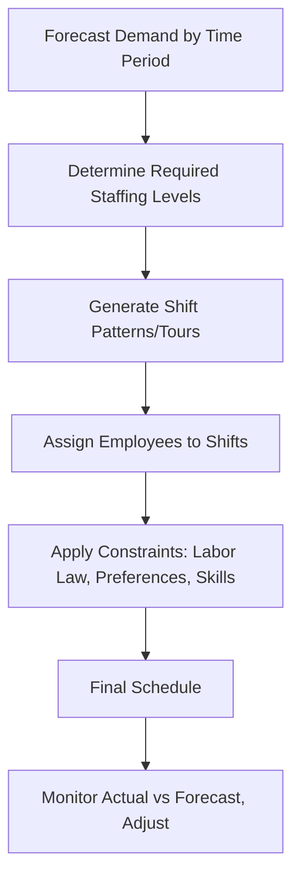

## Employee and Shift Scheduling

### Overview

Employee and shift scheduling is the process of assigning available staff to time periods (shifts, days, tasks) to meet predicted demand for labor while satisfying constraints such as labor laws, employee preferences, skill requirements, and cost targets. Unlike machine scheduling, this domain must simultaneously balance **service-level/coverage requirements**, **cost minimization**, **regulatory compliance**, and **workforce satisfaction/fairness** — making it a distinct branch of operations scheduling with its own techniques.

### The Core Workforce Scheduling Problem

The fundamental challenge is matching staffing levels to a demand pattern that varies by time of day, day of week, and season, while minimizing labor cost and satisfying coverage constraints.

$$\text{Staffing Gap}(t) = \text{Required Staff}(t) - \text{Scheduled Staff}(t)$$

The objective is typically to minimize total labor cost subject to the constraint that the staffing gap does not fall below zero (understaffing) during any time period, while also avoiding excessive overstaffing (idle labor cost).

### Step 1: Demand Forecasting

Workforce scheduling begins with forecasting the volume of work (customer arrivals, call volume, production orders, patient visits) by time period, typically using historical data, seasonality patterns, and trend analysis. This determines the **required staffing level** for each period, often via a service-level or queueing-based calculation (e.g., Erlang C formulas in call center staffing) to translate expected workload into the number of staff needed to meet a target wait time or service level.

### Step 2: Shift Pattern (Tour) Design

Once required staffing by period is known, the next step is designing **shift patterns** (also called "tours") — the specific start time, end time, and break structure of a work shift — that collectively cover the demand curve.

**Days-Off Scheduling**

A classic sub-problem: given that each employee works a fixed number of days per week (e.g., 5 days on, 2 days off) and total staffing must meet a 7-day coverage requirement, which specific days off should be assigned to each employee? A well-known heuristic is the **Tibrewala, Philippe, and Browne algorithm**, which sequentially assigns days off to minimize the total number of employees needed while satisfying the requirement that consecutive days off are typically preferred.

**Shift-Design/Set-Covering Approach**

The problem of choosing which shift start times and lengths to offer (e.g., 6am-2pm, 2pm-10pm, 10pm-6am, or various overlapping patterns) to cover a variable demand curve is a classic **set-covering problem** in operations research:

$$\text{Minimize} \sum_{j} c_j x_j \quad \text{subject to} \quad \sum_{j} a_{ij} x_j \geq r_i \; \forall i$$

Where $x_j$ is the number of employees assigned to shift pattern $j$, $c_j$ is the cost of that shift pattern, $a_{ij}$ indicates whether shift pattern $j$ covers time period $i$, and $r_i$ is the required staffing in period $i$. This is typically solved using integer programming or heuristic approximations for larger problems.

### Worked Example — Basic Shift Coverage

A retail store's required staffing by 4-hour block:

| Time Block | Required Staff |
| --- | --- |
| 8am-12pm | 3 |
| 12pm-4pm | 5 |
| 4pm-8pm | 6 |
| 8pm-12am | 2 |

Available shift patterns (8-hour shifts, overlapping):

| Shift | Covers |
| --- | --- |
| Shift 1 | 8am-4pm |
| Shift 2 | 12pm-8pm |
| Shift 3 | 4pm-12am |

To cover the 4pm-8pm peak requirement of 6, while also meeting the 12pm-4pm requirement of 5 and 8pm-12am requirement of 2:

- Shift 2 (12pm-8pm) contributes to both the 12pm-4pm and 4pm-8pm blocks
- Shift 3 (4pm-12am) contributes to both the 4pm-8pm and 8pm-12am blocks

A feasible allocation: 3 on Shift 1 (covers 8am-12pm requirement), 3 more needed for 12pm-4pm (2 already covered by Shift 1 employees still working — assuming shift 1 ends at 4pm, they cover through end of their shift), so additional Shift 2 employees needed to reach 5 total in 12pm-4pm, and Shift 3 employees to cover the 4pm-8pm peak of 6 and the 8pm-12am tail of 2. [Inference — actual optimal integer allocation requires solving the full covering formulation; this illustrates the logic rather than presenting a certified optimal solution for this specific numeric instance.]

### Step 3: Employee Assignment (Rostering)

After shift patterns are determined, individual employees must be assigned to specific shifts, which introduces additional constraints:

**Key Points**

- **Skill/qualification matching**: certain shifts may require employees with specific certifications or skill levels (e.g., a licensed machine operator, a certified nurse)
- **Labor law compliance**: maximum consecutive hours, mandatory rest periods between shifts, overtime thresholds, minor-labor restrictions where applicable
- **Union contract rules**: seniority-based shift bidding, guaranteed minimum hours, shift differential pay rules
- **Employee preferences**: many organizations incorporate preference bidding or self-scheduling to improve satisfaction and reduce turnover, subject to coverage requirements taking priority
- **Fairness/equity**: distributing undesirable shifts (weekends, nights, holidays) equitably across the workforce over time, often tracked via rotation schedules

### Common Shift Scheduling Patterns

| Pattern | Description | Typical Use Case |
| --- | --- | --- |
| Fixed shifts | Employee always works the same shift (e.g., always day shift) | Stable, predictable environments |
| Rotating shifts | Employees cycle through different shifts (day/evening/night) over weeks | 24/7 operations requiring equitable night-shift distribution |
| Compressed workweek | Fewer, longer days (e.g., 4×10-hour days) | Reduces commuting frequency, common in manufacturing |
| Split shifts | Two separate work periods in one day with a substantial unpaid gap | Matching bimodal demand peaks (e.g., breakfast and dinner rushes) |
| On-call/flexible | Staff called in as needed within availability windows | Variable/unpredictable demand, healthcare, emergency services |
| Self-scheduling | Employees select shifts from a published set within constraints | Environments prioritizing employee autonomy and retention |

### Handling Variability: Buffer and Flexibility Strategies

- **Cross-training**: employees qualified across multiple roles/stations can be reassigned as demand shifts within a shift, reducing the total headcount buffer needed
- **Part-time/flexible workforce**: a mix of full-time (stable, cost-predictable) and part-time or on-call staff (flexible, used to cover peaks) is a common strategy to match variable demand without overstaffing during troughs
- **Overtime as a buffer**: using scheduled overtime for short-term peaks rather than hiring additional permanent staff, though this carries higher marginal labor cost per hour and potential fatigue/quality risk if overused
- **Float pools**: a pool of staff not assigned to a fixed unit/department, deployable wherever demand is highest that day — common in healthcare staffing

### Trade-offs in Workforce Scheduling

| Priority | Benefit | Risk if Overemphasized |
| --- | --- | --- |
| Minimize labor cost | Lower operating expense | Understaffing, service failures, employee burnout |
| Maximize coverage/service level | Better customer service, less overtime risk | Overstaffing cost, idle labor |
| Maximize employee preference satisfaction | Lower turnover, higher morale | Coverage gaps if preferences conflict with demand patterns |
| Strict fairness/equity in rotation | Perceived fairness, reduced grievances | Less optimal cost/coverage fit for any single period |

### Illustration: Weekly Coverage vs. Demand Curve (svg_diagram)

<svg xmlns="http://www.w3.org/2000/svg" viewBox="0 0 640 260">
<text x="20" y="25" font-size="16" font-weight="bold">Staffing Level vs Demand Curve (svg_diagram)</text>
<line x1="50" y1="220" x2="600" y2="220" stroke="black" stroke-width="2" />
<line x1="50" y1="220" x2="50" y2="40" stroke="black" stroke-width="2" />
<text x="30" y="225" font-size="10">0</text>
<text x="10" y="45" font-size="10">Staff</text>
<text x="580" y="235" font-size="10">Time</text>
<polyline points="50,180 130,160 210,90 290,60 370,70 450,100 530,150 600,190" fill="none" stroke="blue" stroke-width="2" />
<text x="450" y="55" font-size="11" fill="blue">Demand</text>
<polyline points="50,175 130,155 210,110 290,80 370,80 450,110 530,145 600,185" fill="none" stroke="red" stroke-width="2" stroke-dasharray="6,3" />
<text x="450" y="130" font-size="11" fill="red">Scheduled Staff</text>
</svg>

The dashed "Scheduled Staff" line tracks the solid "Demand" curve, with small deliberate gaps illustrating typical minor over/understaffing that occurs even in well-designed schedules due to discrete shift-length constraints (shifts cannot be added or removed in perfectly continuous increments to match a continuously varying demand curve).

### Technology and Software Support

Modern workforce management (WFM) systems automate much of this process, typically combining:

- **Demand forecasting engines** (statistical/time-series models applied to historical volume data)
- **Optimization/scheduling engines** (integer programming, constraint programming, or metaheuristics such as genetic algorithms or simulated annealing to solve the shift-assignment problem at scale)
- **Self-service employee portals** for shift bidding, swap requests, and availability submission
- **Compliance rule engines** that automatically flag or prevent schedules violating labor law or contract terms

[Unverified — specific WFM software capabilities, algorithms used, and terminology vary significantly by vendor and are not detailed here as fixed facts; current vendor documentation should be consulted for implementation-specific features.]

### Relationship to Operations Management

Employee and shift scheduling is the labor-resource counterpart to machine scheduling and capacity planning — just as MRP and CRP determine material and machine capacity needs over time, workforce scheduling determines labor capacity needs and translates them into an executable roster. It is particularly critical in service operations (retail, healthcare, call centers, hospitality) where labor is often the dominant cost driver and directly determines service capacity, unlike manufacturing environments where machine capacity may be the binding constraint.

**Related Topics**

- Demand forecasting techniques
- Capacity planning and capacity requirements planning (CRP)
- Queueing theory and service-level staffing models (e.g., Erlang C)
- Job shop scheduling and dispatching rules
- Line of Balance technique
- Labor productivity measurement
- Lean staffing and cross-training strategies