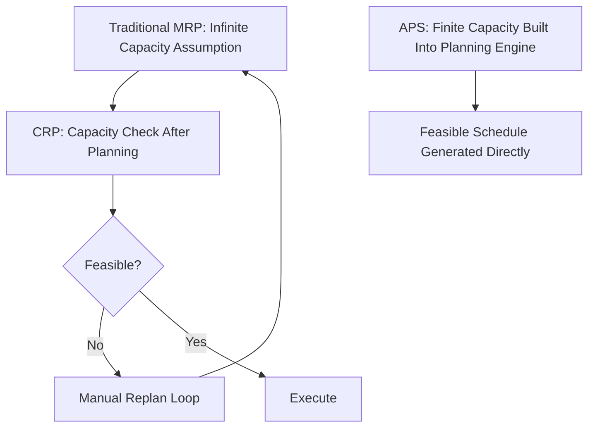
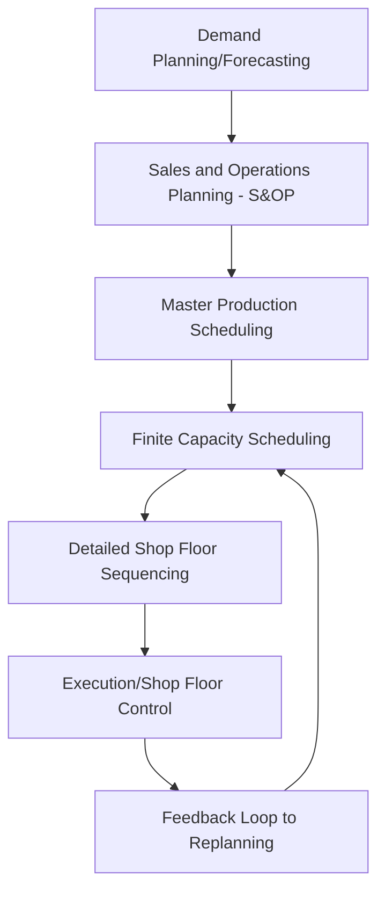
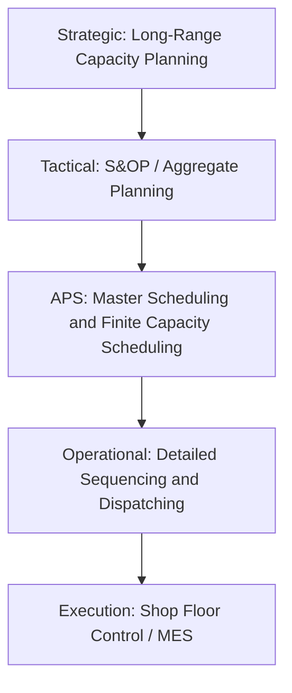

## Advanced Planning and Scheduling Systems

### Overview

Advanced Planning and Scheduling (APS) systems are software applications that use mathematical optimization, constraint-based modeling, and simulation to generate feasible and near-optimal production plans and schedules that respect finite capacity, material availability, and other real-world constraints simultaneously. APS emerged to address a fundamental limitation of traditional MRP: MRP assumes **infinite capacity** at every work center, generating planned orders based purely on material and time logic without verifying that the required capacity actually exists when needed. APS closes this gap by scheduling against real, finite resource constraints.

### Why APS Emerged: The Infinite Capacity Problem

Traditional MRP performs a straightforward time-phased explosion of requirements without checking whether a work center can actually process the resulting planned orders in the time allotted.

$$\text{MRP Planned Order Release} \neq \text{Feasible Schedule (unless capacity is separately verified)}$$

Capacity Requirements Planning (CRP) was historically layered on top of MRP to check capacity **after the fact**, often resulting in an iterative, manual replanning loop when infeasibilities were discovered. APS integrates capacity constraints directly into the planning/scheduling engine itself, generating schedules that are feasible by construction rather than checked after the fact.

### Core Architecture of an APS System

**Key Points**

- **Optimization/algorithmic engine**: the computational core, using techniques such as linear/mixed-integer programming, constraint programming, genetic algorithms, or discrete-event simulation to generate schedules
- **Finite capacity model**: represents real, bounded capacity at each resource (machine, labor, tooling) rather than assuming unlimited availability
- **Material constraint model**: incorporates actual material availability and lead times, similar to MRP logic, but integrated with capacity rather than calculated independently
- **Rules and constraints engine**: encodes business rules such as sequence-dependent setup times, minimum/maximum batch sizes, shift patterns, and due-date priorities
- **What-if simulation interface**: allows planners to model alternative scenarios (e.g., "what if we expedite this order," "what if this machine goes down") before committing changes to the live schedule
- **Integration layer**: connects to the ERP system for master data (BOMs, routings, inventory, orders) and pushes finalized schedules back for execution

### APS vs. Traditional MRP/CRP

| Dimension | Traditional MRP/CRP | APS |
| --- | --- | --- |
| Capacity assumption | Infinite (checked separately via CRP) | Finite, built into planning logic |
| Planning approach | Sequential time-phased explosion | Simultaneous, constraint-based optimization |
| Replanning speed | Full regeneration often required (batch, overnight) | Often near real-time or rapid incremental replanning |
| Handling of conflicts | Surfaced after planning, resolved manually | Resolved or flagged during schedule generation |
| Optimization objective | None inherent (rule-based logic) | Explicit objective functions (minimize cost, tardiness, changeover time) |
| Scenario testing | Limited, typically requires full replan | Built-in what-if simulation |

### Optimization Techniques Used in APS

**Mathematical Programming (Linear/Mixed-Integer Programming)**

Formulates scheduling as an objective function subject to linear constraints, solved via algorithms such as branch-and-bound. Well suited to problems with clear linear cost structures but can become computationally expensive as problem size grows, particularly with many integer/binary decision variables (e.g., sequence-dependent setup decisions).

**Constraint Programming (CP)**

Models scheduling as a set of constraints (precedence, resource capacity, time windows) and searches for any solution satisfying all constraints, optionally optimizing a secondary objective. CP is often more effective than pure mathematical programming for highly constrained, combinatorial scheduling problems (e.g., complex job shop routings) because it can exploit constraint propagation to prune the search space efficiently. [Inference — the relative performance of CP versus mixed-integer programming depends heavily on the specific problem structure; neither approach dominates universally across all scheduling problem types.]

**Metaheuristics (Genetic Algorithms, Simulated Annealing, Tabu Search)**

Used when problem size or complexity makes exact optimization computationally impractical within required planning timeframes. These methods search for good (though not provably optimal) solutions by iteratively improving candidate schedules, often used in commercial APS systems as a practical compromise between solution quality and computation time.

**Discrete-Event Simulation**

Models the dynamic, stochastic behavior of a production system (variable processing times, machine breakdowns, random arrivals) to evaluate how a candidate schedule or dispatching rule set would actually perform under realistic uncertainty, complementing the more deterministic optimization approaches above.

### Typical APS Functional Modules

**Demand Planning**: statistical forecasting combined with collaborative input from sales/marketing to project future demand.

**Sales and Operations Planning (S&OP) Support**: reconciles aggregate demand and supply plans at a tactical level, often the entry point where APS interfaces with executive/cross-functional planning decisions.

**Finite Capacity Scheduling**: the core scheduling engine that sequences and assigns specific jobs to specific resources within actual capacity limits, generating the executable detailed schedule.

**Available-to-Promise (ATP) / Capable-to-Promise (CTP)**: allows sales/customer service to check real inventory and production capacity before committing to a customer delivery date — CTP specifically checks whether production *capacity* exists to make the promised date, not just whether inventory exists.

### Worked Example — Finite Capacity Conflict Resolution

Consider two orders competing for the same bottleneck machine, both due the same week:

| Order | Required Machine Hours | Due Date | MRP-Suggested Start (Infinite Capacity) |
| --- | --- | --- | --- |
| Order X | 30 hours | Week 5 | Week 4 |
| Order Y | 25 hours | Week 5 | Week 4 |

If the bottleneck machine has only 40 hours of capacity available in Week 4, traditional MRP would generate both planned orders for Week 4 without flagging the conflict — total required hours (55) exceed available capacity (40). An APS system, using finite capacity logic, would recognize this infeasibility during schedule generation and either:

- Sequence Order X first (if higher priority/earlier due date within the week) and push Order Y's start earlier into Week 3 if slack exists there, or
- Flag both orders as at risk and surface the conflict to a planner for a business decision (e.g., expedite, split the order, or negotiate a new due date with the customer)

This capacity-aware conflict detection at the planning stage — rather than discovering the shortfall only when Week 4 arrives — is the central value proposition of APS over MRP/CRP.

### Benefits of APS

- **Feasible schedules by construction**, reducing the frequency of post-hoc firefighting caused by capacity conflicts discovered too late
- **Faster replanning cycles**, enabling more responsive reaction to disruptions (rush orders, machine breakdowns, material shortages) compared to batch-oriented MRP regeneration
- **Explicit optimization objectives** (minimize tardiness, minimize changeover cost, maximize throughput) rather than relying solely on heuristic dispatching rules
- **What-if scenario analysis**, letting planners evaluate trade-offs before committing to a schedule change
- **Improved visibility into bottlenecks and capacity constraints** across the full planning horizon, not just at the current period

### Limitations and Implementation Challenges

- **Data quality dependency**: APS optimization is only as good as the underlying master data (accurate routings, realistic processing times, correct BOMs); poor data quality undermines schedule feasibility regardless of algorithmic sophistication
- **Computational complexity**: very large-scale, highly combinatorial scheduling problems may still require heuristic approximation rather than guaranteed-optimal solutions, particularly under tight replanning time windows
- **Organizational change management**: planners accustomed to manual scheduling or simple MRP-driven planning may resist trusting or adopting an automated optimization engine's recommendations
- **Integration complexity**: APS must maintain tight, often real-time or near-real-time data synchronization with the ERP system's transactional data (inventory, order status, machine status), which can be a significant technical integration undertaking
- **Model maintenance**: constraints, routings, and business rules must be kept current as the actual production environment evolves; a stale constraint model produces schedules that look feasible on paper but are not achievable on the floor [Behavior may vary by specific system and how rigorously the underlying model is maintained.]

### APS in the Broader Planning Hierarchy

APS typically sits between tactical S&OP-level planning and operational-level detailed dispatching, translating aggregate plans into detailed, resource-feasible schedules, and in turn providing constraint feedback upward when aggregate plans prove infeasible at the detailed level.

### Relationship to Operations Management

APS represents the technological evolution of core operations management scheduling concepts — sequencing rules (SPT, EDD), Johnson's Rule, Gantt chart visualization, and capacity requirements planning — combined into an integrated, computationally driven planning engine. It directly addresses the theoretical gap between MRP's infinite-capacity assumption and the practical reality that machines, labor, and tooling are finite resources, making it a natural extension of the material requirements planning and capacity planning concepts covered elsewhere in this chapter sequence.

**Related Topics**

- Capacity Requirements Planning (CRP)
- Material Requirements Planning (MRP) fundamentals
- Job shop scheduling and dispatching rules
- Sequencing on single and multiple machines
- Sales and Operations Planning (S&OP)
- Theory of Constraints and bottleneck management
- Manufacturing Execution Systems (MES)
- Available-to-Promise (ATP) and Capable-to-Promise (CTP)