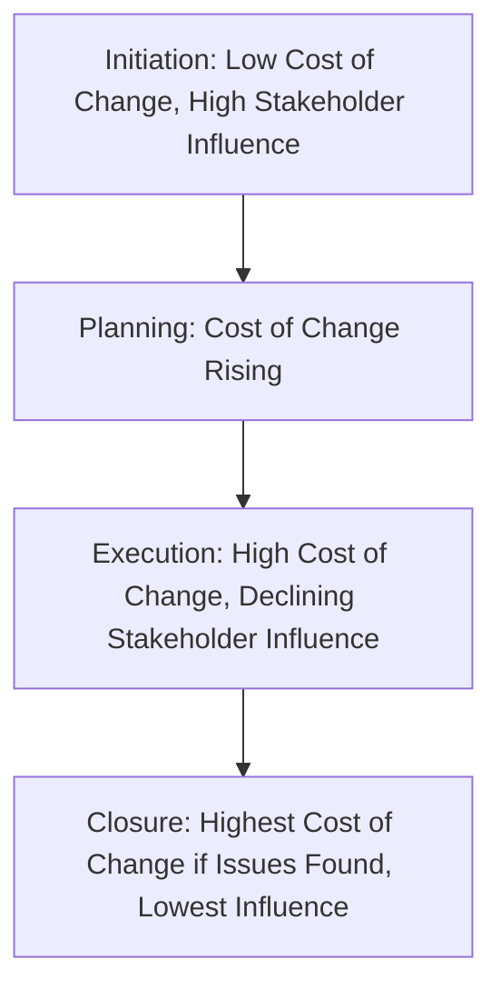
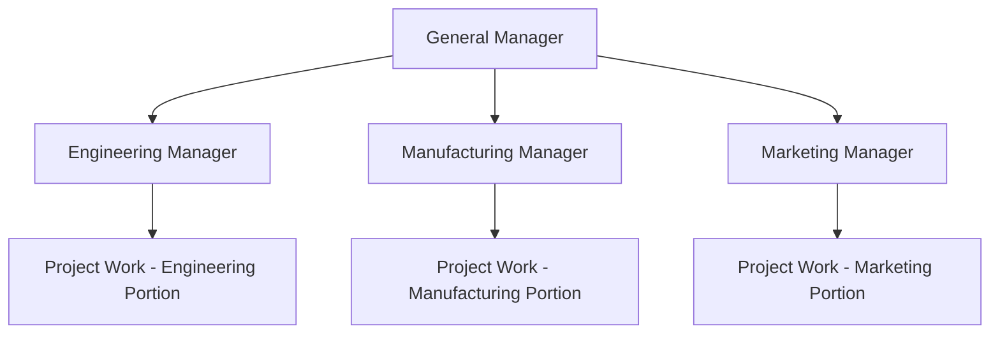
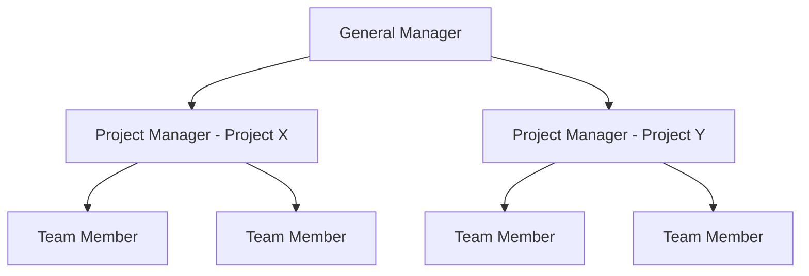
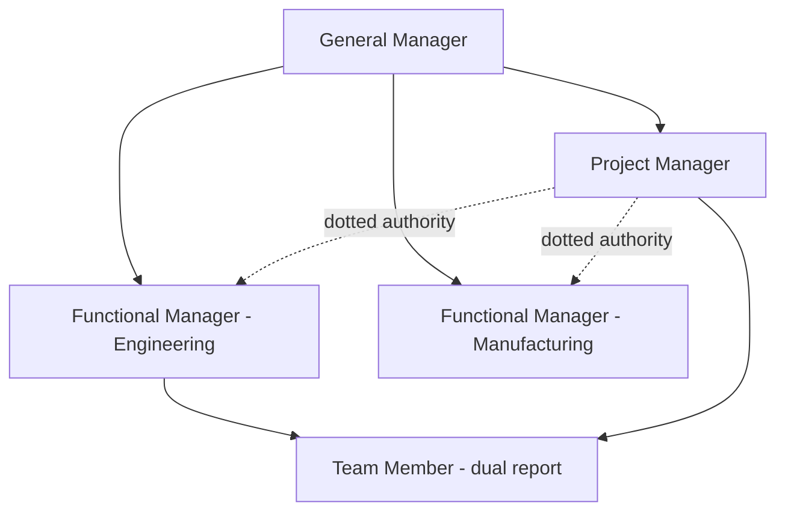

## Project Life Cycle and Organization

### Overview

Every project — regardless of industry or size — progresses through a recognizable sequence of phases from initiation to closure, known as the project life cycle. Alongside this temporal structure, organizations must choose how to structure authority, reporting lines, and resource allocation for project work relative to ongoing functional operations. These two dimensions — life cycle phases and organizational structure — together determine how effectively a project is planned, executed, and controlled.

### The Generic Project Life Cycle

**Initiation/Conception Phase**

The project is formally recognized and authorized. Key activities include defining the business need or opportunity, developing a project charter, identifying high-level objectives, and conducting initial feasibility assessment. A project sponsor is typically identified, and a project manager may be assigned.

**Planning Phase**

Detailed scope, schedule, budget, resource, quality, risk, and communication plans are developed. This phase produces the baseline documents against which project performance will later be measured, including the Work Breakdown Structure (WBS), network diagrams, and resource plans.

**Execution Phase**

The actual work defined in the plan is carried out. Resources are mobilized, deliverables are produced, and the project team executes according to the plans established in the prior phase. This phase typically consumes the largest share of project budget and time.

**Monitoring and Controlling Phase**

Performed concurrently with execution (not strictly sequential), this involves tracking actual progress against the plan, managing changes, and taking corrective action when variances arise. This phase continues in parallel until the project nears completion.

**Closure Phase**

Final deliverables are handed over, contracts are closed, resources are released, and lessons learned are documented. Formal acceptance from the customer or sponsor is obtained, and the project is administratively closed.

### Effort and Cost Distribution Across the Life Cycle

**Key Points**

- Resource/staffing levels typically follow a low-high-low pattern: low at initiation, rising through planning into execution, peaking during execution, then declining through closure
- The **cost of making changes** increases sharply as the project progresses — a change identified during planning is inexpensive to incorporate, while the same change discovered during execution or after deliverables are complete can be far more costly to implement
- **Stakeholder influence and risk** are typically highest at the start of the project (when the most is unknown and the most can still be changed) and decrease as the project progresses, while the cost of changes moves in the opposite direction

### Predictive vs. Adaptive Life Cycles

| Life Cycle Type | Description | Typical Use Case |
| --- | --- | --- |
| Predictive (Waterfall) | Scope, schedule, and cost are determined early; phases proceed largely sequentially | Well-understood requirements, construction, regulated industries |
| Iterative | Project scope is generally set early, but estimates and plans are revised as understanding improves through repeated cycles | Product development with some uncertainty |
| Incremental | Deliverables are produced in successive increments, each adding functionality | Software modules delivered progressively |
| Adaptive (Agile) | Detailed scope is defined and re-prioritized just before each iteration; high responsiveness to change | Software development, environments with high uncertainty/volatility |

[Inference — the choice between these life cycle types depends on the specific balance of requirement stability, risk tolerance, and stakeholder involvement needs in a given project context; no single life cycle type is universally superior.]

### Project Organizational Structures

The organizational structure determines how project authority, resource control, and reporting relationships are arranged relative to the existing functional hierarchy of the organization.

**Functional Organization**

The project is managed within existing functional department boundaries; there is no dedicated project manager with cross-functional authority. Each functional manager oversees the portion of project work relevant to their department.

**Key Points**

- Advantages: leverages existing functional expertise and career paths; resource flexibility within a department; clear technical supervision
- Disadvantages: no single point of accountability for overall project success; cross-functional coordination is difficult; project work often takes lower priority than functional/departmental priorities

**Projectized (Project-Based) Organization**

The organization is structured primarily around projects; project managers have full authority over resources dedicated to their project, and team members report directly to the project manager for the project's duration.

**Key Points**

- Advantages: clear authority and accountability for the project manager; strong team cohesion and fast decision-making; full-time dedicated resources
- Disadvantages: potential duplication of resources/facilities across projects; less efficient resource sharing across the organization; team members may face uncertainty about their role once the project ends

**Matrix Organization**

Team members report both to a functional manager (for technical/career supervision) and to a project manager (for project-specific work direction), creating dual reporting lines. Matrix structures are further subdivided by the relative balance of authority:

| Matrix Type | Project Manager Authority | Functional Manager Authority |
| --- | --- | --- |
| Weak Matrix | Low — acts more as a coordinator/expediter | High — retains most control over resources |
| Balanced Matrix | Moderate — shares authority relatively evenly | Moderate |
| Strong Matrix | High — closer to projectized authority levels | Lower, though functional home remains |

**Key Points**

- Advantages: balances resource efficiency (staff shared across projects) with project focus (dedicated project management attention); preserves functional expertise and career development paths
- Disadvantages: dual reporting can create conflicting priorities and confusion over authority; requires more sophisticated conflict-resolution and communication mechanisms; power struggles between functional and project managers are a common failure mode

### Organizational Structure Comparison

| Dimension | Functional | Weak Matrix | Balanced Matrix | Strong Matrix | Projectized |
| --- | --- | --- | --- | --- | --- |
| PM Authority | Little/None | Limited | Low to Moderate | Moderate to High | High to Almost Total |
| Resource Availability | Little/None | Limited | Low to Moderate | Moderate to High | High to Almost Total |
| Who Manages Budget | Functional Manager | Functional Manager | Mixed | Project Manager | Project Manager |
| PM Role | Part-time | Part-time | Full-time | Full-time | Full-time |
| PM Administrative Staff | Part-time | Part-time | Part-time | Full-time | Full-time |

[Unverified — specific authority splits vary across organizations even within the same nominal category (e.g., two "balanced matrix" organizations may differ in practice); this table reflects typical/generalized characterizations rather than a fixed universal standard.]

### Project Management Office (PMO)

Many organizations, particularly those running multiple concurrent projects, establish a **Project Management Office** to standardize project governance, methodology, templates, and reporting across the organization. PMO types generally range from:

- **Supportive**: provides templates, best practices, training, and access to information — low control
- **Controlling**: requires compliance with specific frameworks, methodologies, and governance — moderate control
- **Directive**: directly manages projects by providing project managers and taking direct control — high control

### Selecting an Appropriate Organizational Structure

**Next Steps (Decision Considerations)**

1. Assess the **size and duration** of the project — larger, longer projects favor projectized or strong matrix structures to justify dedicated resources
2. Evaluate **resource sharing needs** across the broader organization — if specialized resources must serve multiple concurrent projects, functional or matrix structures preserve flexibility
3. Consider the **complexity and cross-functional scope** of the work — highly cross-functional projects benefit from a dedicated project manager with clear authority (matrix or projectized)
4. Evaluate the organization's **existing culture and structure** — a rigid functional culture may resist projectized authority; readiness for dual reporting affects matrix viability
5. Weigh the **need for technical/functional career development** for staff — functional and matrix structures preserve functional "home" and career paths better than projectized structures

### Relationship to Operations Management

Project organization and life cycle concepts underpin the execution of many operations initiatives that are themselves structured as projects — ERP implementations, new facility rollouts, product launches, and process improvement initiatives (e.g., Six Sigma projects) all follow this life cycle and require a deliberate organizational structure choice. Operations managers frequently operate within matrix structures, balancing ongoing functional/operational responsibilities against project-specific commitments (e.g., serving on an ERP implementation team while retaining departmental operational duties).

**Related Topics**

- Work Breakdown Structure (WBS) development
- Critical Path Method (CPM) and PERT networks
- Project risk management
- ERP implementation challenges
- Stakeholder management and communication planning
- Agile and adaptive project management frameworks
- Project Management Office (PMO) design and governance