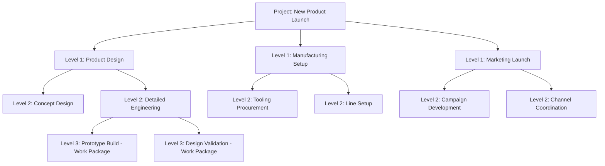
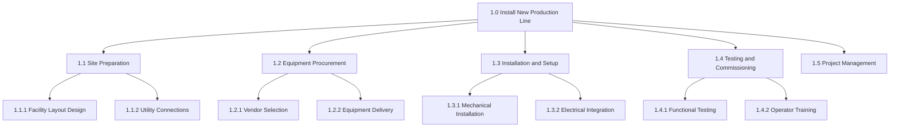

## Work Breakdown Structure

### Overview

A Work Breakdown Structure (WBS) is a hierarchical decomposition of the total scope of work required to complete a project into progressively smaller, more manageable components. It organizes and defines project scope by breaking deliverables down until work is specified at a level small enough to be reliably estimated, scheduled, assigned, and controlled. The WBS is deliverable-oriented — it decomposes what must be produced, not the chronological sequence of activities — which distinguishes it from a project schedule or network diagram.

### Core Purpose and Principles

**Key Points**

- The WBS decomposes **deliverables/outcomes**, not actions — nodes are typically named as nouns (e.g., "Foundation," "User Interface Module") rather than verbs (e.g., "Pour concrete")
- The **100% Rule** is the foundational principle: the WBS must capture 100% of the work defined by the project scope, including project management work itself, with no work falling outside the structure and no overlapping/duplicated work across branches
- Decomposition continues until reaching the **work package** level — the lowest level of the WBS, small enough to reliably estimate cost, duration, and resource needs, and to assign clear ownership
- The WBS is **not a schedule**; it contains no sequencing, dependencies, or start/end dates — those are added later when building the project network diagram and schedule

### Hierarchical Structure

The number of levels is not fixed; it varies by project size and complexity. Larger, more complex projects typically require more decomposition levels to reach an appropriately sized work package; smaller projects may need only two or three levels.

### WBS Terminology

| Term | Definition |
| --- | --- |
| WBS Element | Any single node/box within the hierarchy at any level |
| Control Account | A management control point where scope, budget, and schedule are integrated and compared to earned value, typically above the work package level |
| Work Package | The lowest-level WBS element, representing a discrete, assignable, estimable unit of work |
| WBS Dictionary | A companion document providing detailed descriptions, acceptance criteria, resource requirements, and responsible party for each WBS element |
| Code of Accounts | A numbering system uniquely identifying each WBS element (e.g., 1.2.3) for cost tracking and reporting |

### Approaches to Decomposition

**Deliverable-Based Decomposition**

Organizes the WBS around major deliverables or outcomes of the project (e.g., "Foundation," "Electrical System," "Interior Finishing" for a construction project). This is the most common and generally recommended approach because it keeps the structure aligned with the 100% Rule and with what the customer is actually paying for.

**Phase-Based Decomposition**

Organizes the top level of the WBS around project life-cycle phases (e.g., "Initiation," "Design," "Construction," "Closeout"), with deliverables nested beneath each phase. This can blur the line between a WBS and a schedule if not handled carefully, since phases inherently imply sequencing.

**Organizational/Responsibility-Based Decomposition**

Organizes the top level around the responsible organizational unit or department. This approach is generally discouraged as a primary structure because it tends to violate the deliverable-orientation principle and can obscure cross-functional dependencies, though it is sometimes used as a secondary view (see Organizational Breakdown Structure below).

### Worked Example — Constructing a WBS

**Project**: Install a new production line

**Next Steps (Construction Procedure)**

1. Start with the project's overall objective/deliverable as the top-level (Level 0) node
2. Identify the major deliverables required to achieve the objective (Level 1) — these should collectively satisfy the 100% Rule
3. For each Level 1 deliverable, decompose into sub-deliverables or components (Level 2)
4. Continue decomposing until each branch reaches a work package small enough to estimate reliably — a common guideline is that a work package should represent an amount of effort manageable within a single reporting period (though this varies by organization and project)
5. Verify the 100% Rule at every level: children of a node must completely and exclusively represent the parent's scope, with no gaps or overlaps
6. Assign a unique code of accounts identifier to each element
7. Develop a WBS dictionary entry for each work package, defining scope, acceptance criteria, and responsible owner

Example structure:

Note that "1.5 Project Management" is included explicitly — this reflects the 100% Rule requirement that project management effort itself (planning, status reporting, meetings) is part of total project scope and must appear in the WBS, not be treated as overhead outside it.

### The 8/80 Rule and Other Sizing Guidelines

A commonly cited heuristic for work package sizing is the **8/80 rule**: a work package should represent no less than 8 hours and no more than 80 hours of effort. [Unverified — this specific numeric heuristic is a widely referenced rule of thumb in project management practice rather than a universally mandated standard; actual appropriate sizing varies by organization, industry, and reporting cadence.] Other organizations use a **reporting period rule**, sizing work packages to be completable within a single status reporting cycle (e.g., one or two weeks), which achieves a similar practical effect of keeping progress tracking granular and timely.

### WBS Dictionary

Each work package in the WBS should have a corresponding entry in the WBS Dictionary, typically including:

- WBS code/identifier
- Description of work and scope boundaries
- Responsible organization/individual
- Acceptance criteria
- Resource requirements
- Cost estimate
- Milestones or key dates (if applicable at this level, though the WBS itself remains deliverable-oriented rather than schedule-oriented)

| WBS Code | Element Name | Description | Responsible | Est. Hours |
| --- | --- | --- | --- | --- |
| 1.3.1 | Mechanical Installation | Physical placement and mechanical connection of production line equipment | Facilities Engineering | 60 |
| 1.3.2 | Electrical Integration | Wiring, control system connection, and power-up verification | Electrical Contractor | 45 |
| 1.4.1 | Functional Testing | Verify line operates per design specification under test conditions | QA/Engineering | 30 |

### Organizational Breakdown Structure (OBS) and Responsibility Assignment

While the WBS itself should remain deliverable-oriented, organizations often cross-reference it against an **Organizational Breakdown Structure** (mapping the organization's departments/units) using a **Responsibility Assignment Matrix (RAM)**, commonly implemented as a RACI chart (Responsible, Accountable, Consulted, Informed), to clarify who does what for each work package without corrupting the WBS's own deliverable-based structure.

### Uses of the WBS Beyond Initial Planning

**Key Points**

- **Cost estimation and budgeting**: costs are estimated at the work package level and rolled up through the hierarchy to produce the total project budget
- **Schedule development**: work packages become the basis for identifying activities in the project network diagram (CPM/PERT), though sequencing is added at that later stage, not within the WBS itself
- **Resource planning**: resource requirements are estimated per work package and aggregated to determine total project resource needs
- **Risk identification**: risks are often identified and assessed at the work package level, since risks are more concretely definable for specific, bounded scopes of work than for the project as a whole
- **Earned Value Management (EVM)**: control accounts (typically one or more levels above work packages) serve as the integration points where planned value, earned value, and actual cost are measured and compared

### Common WBS Development Pitfalls

| Pitfall | Consequence |
| --- | --- |
| Decomposing by verb/activity instead of deliverable/noun | WBS starts to resemble a task list or schedule rather than a scope decomposition |
| Violating the 100% Rule (gaps) | Scope is missed and discovered late, often during execution |
| Violating the 100% Rule (overlaps) | Duplicate effort, ambiguous ownership, cost double-counting |
| Excessive decomposition (too many levels) | Administrative burden exceeds the value of granularity; management overhead becomes disproportionate |
| Insufficient decomposition (work packages too large) | Poor estimating accuracy, difficult progress tracking, delayed problem detection |
| Omitting project management work | Underestimates true total project cost and effort |

### Relationship to Operations Management

The WBS is the foundational scope-definition tool that precedes and enables subsequent project scheduling techniques covered elsewhere in this chapter, including network diagramming (CPM/PERT) and resource-loaded Gantt charts. In an operations management context, the WBS is routinely applied to structure large operational initiatives such as ERP implementations, new facility commissioning, and major process improvement projects, ensuring that the full scope of cross-functional operational work is captured before scheduling and resource commitments are made.

**Related Topics**

- Project life cycle and organization
- Critical Path Method (CPM) and PERT networks
- Earned Value Management (EVM)
- Responsibility Assignment Matrix (RACI)
- Project cost estimating techniques
- Project risk management
- Gantt chart applications