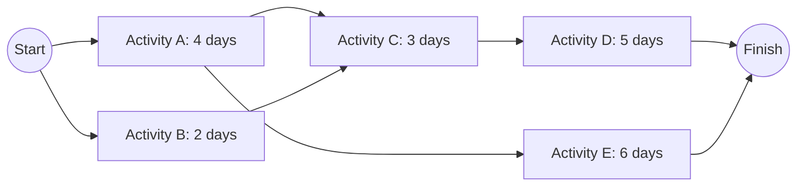
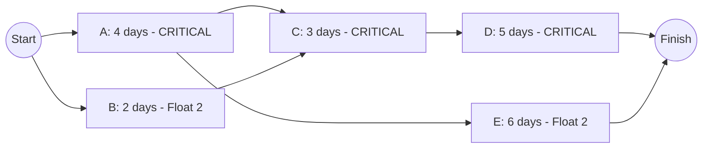

## Critical Path Method

### Overview

The Critical Path Method (CPM) is a network-based project scheduling technique used to determine the shortest possible project duration by identifying the sequence of dependent activities — the critical path — that determines the minimum time in which the project can be completed. Any delay to an activity on the critical path directly delays the entire project, while activities not on the critical path possess slack (float) and can be delayed within limits without affecting the overall completion date.

### Core Concepts

**Key Points**

- CPM assumes **deterministic activity durations** (a single known duration per activity), distinguishing it from PERT, which uses probabilistic three-point estimates
- The **critical path** is the longest path through the network in terms of total duration — not necessarily the path with the most activities
- **Total Float (Slack)** is the amount of time an activity can be delayed without delaying the project finish date
- Activities on the critical path have **zero total float** by definition
- A project can have **more than one critical path** if multiple paths tie for the longest duration

### Network Diagram Fundamentals

CPM represents a project as a network of nodes (activities) and arrows (dependencies), most commonly using the **Activity-on-Node (AON)** convention in modern practice.

### Dependency Types

| Dependency Type | Description | Example |
| --- | --- | --- |
| Finish-to-Start (FS) | Successor cannot start until predecessor finishes (most common) | Foundation must finish before framing starts |
| Start-to-Start (SS) | Successor cannot start until predecessor starts | Excavation and site fencing can start together |
| Finish-to-Finish (FF) | Successor cannot finish until predecessor finishes | Final inspection can't finish until construction finishes |
| Start-to-Finish (SF) | Successor cannot finish until predecessor starts (rare) | New shift can't end until relief shift starts |

Dependencies can also include **lead** (overlap, allowing a successor to start before its predecessor fully finishes) and **lag** (imposed delay between predecessor and successor beyond the basic dependency relationship).

### The Forward Pass: Calculating Early Start and Early Finish

The forward pass moves through the network from start to finish, calculating the earliest possible start (ES) and finish (EF) for each activity.

$$EF_i = ES_i + \text{Duration}_i$$

$$ES_i = \max(EF_{\text{of all predecessors}})$$

For an activity with no predecessors, $ES = 0$ (or the project start date).

### The Backward Pass: Calculating Late Start and Late Finish

The backward pass moves from finish to start, calculating the latest an activity can start (LS) and finish (LF) without delaying the overall project.

$$LS_i = LF_i - \text{Duration}_i$$

$$LF_i = \min(LS_{\text{of all successors}})$$

For the final activity/activities, $LF$ = the project's overall EF (assuming no imposed deadline different from the calculated minimum duration).

### Calculating Float

$$\text{Total Float} = LS_i - ES_i = LF_i - EF_i$$

Activities with Total Float = 0 lie on the critical path.

### Worked Example

Using the network above:

| Activity | Duration | Predecessors |
| --- | --- | --- |
| A | 4 | Start |
| B | 2 | Start |
| C | 3 | A, B |
| D | 5 | C |
| E | 6 | A |

**Forward Pass:**

| Activity | ES | EF |
| --- | --- | --- |
| A | 0 | 4 |
| B | 0 | 2 |
| C | 4 (max of A's EF=4, B's EF=2) | 7 |
| D | 7 | 12 |
| E | 4 | 10 |

Project completion = $\max(EF_D, EF_E) = \max(12, 10) = 12$ days

**Backward Pass** (starting from project finish = 12):

| Activity | LF | LS |
| --- | --- | --- |
| D | 12 | 7 |
| E | 12 | 6 |
| C | 7 (min of D's LS=7) | 4 |
| A | min(C's LS=4, E's LS=6) = 4 | 0 |
| B | 4 (C's LS) | 2 |

**Float Calculation:**

| Activity | ES | EF | LS | LF | Total Float | Critical? |
| --- | --- | --- | --- | --- | --- | --- |
| A | 0 | 4 | 0 | 4 | 0 | Yes |
| B | 0 | 2 | 2 | 4 | 2 | No |
| C | 4 | 7 | 4 | 7 | 0 | Yes |
| D | 7 | 12 | 7 | 12 | 0 | Yes |
| E | 4 | 10 | 6 | 12 | 2 | No |

**Critical Path: A → C → D**, with total project duration = 12 days. Activities B and E each have 2 days of float and can be delayed by up to 2 days without affecting the overall 12-day completion.

### Free Float vs. Total Float

- **Total Float**: the amount an activity can be delayed without delaying the *project* finish date
- **Free Float**: the amount an activity can be delayed without delaying the *early start* of its immediate successor activity

$$\text{Free Float}_i = \min(ES_{\text{successors}}) - EF_i$$

Free float is always less than or equal to total float, and this distinction matters when an activity's flexibility must be assessed relative to its immediate downstream neighbor rather than the whole project.

### Crashing the Critical Path

**Crashing** is the technique of shortening the critical path's duration by adding resources to critical activities, typically at increased cost. Since only critical-path activities affect overall project duration, crashing non-critical activities produces no schedule benefit and simply wastes resources.

$$\text{Crash Cost Slope} = \frac{\text{Crash Cost} - \text{Normal Cost}}{\text{Normal Duration} - \text{Crash Duration}}$$

**Next Steps (Crashing Procedure)**

1. Identify the current critical path(s)
2. Determine which critical activities have the lowest crash cost slope (cheapest cost per day saved)
3. Crash that activity by the desired amount, but only up to the point where either its maximum crash limit is reached or the float of the next-shortest path is exhausted (creating a new or parallel critical path)
4. Recalculate the network after each crashing decision, since crashing can shift which path is critical
5. Repeat until the target duration is reached or crashing becomes uneconomical (crash cost exceeds the value of time saved)

**Important consideration**: once a non-critical path's float is fully consumed by crashing the original critical path, that path becomes critical too — further schedule compression then requires crashing activities on **both** paths simultaneously, increasing cost sharply.

### CPM vs. PERT

| Aspect | CPM | PERT |
| --- | --- | --- |
| Duration estimates | Single deterministic estimate per activity | Three-point estimate (optimistic, most likely, pessimistic) |
| Primary use case | Well-understood, repetitive projects (e.g., construction) | Novel, uncertain projects (e.g., R&D) |
| Output | Single critical path and duration | Expected duration and probability distribution of completion |
| Handles uncertainty | No, implicitly | Yes, explicitly via statistical variance |

PERT's expected duration for an activity is calculated as:

$$t_e = \frac{t_o + 4t_m + t_p}{6}$$

where $t_o$ = optimistic, $t_m$ = most likely, and $t_p$ = pessimistic duration estimates. [This weighted-average formula reflects a Beta-distribution approximation standard to the PERT technique.] Modern practice often blends CPM's network logic with PERT's probabilistic estimation rather than treating them as entirely separate methods.

### Illustration: Critical Path Highlighted on Gantt Chart (svg_diagram)

<svg xmlns="http://www.w3.org/2000/svg" viewBox="0 0 640 220">
<text x="20" y="25" font-size="16" font-weight="bold">Critical Path Highlighted on Gantt Timeline (svg_diagram)</text>
<rect x="60" y="50" width="80" height="30" fill="none" stroke="red" stroke-width="3" />
<text x="100" y="70" font-size="11" text-anchor="middle">A (Critical)</text>
<rect x="60" y="100" width="40" height="30" fill="none" stroke="black" stroke-width="1" />
<text x="80" y="120" font-size="11" text-anchor="middle">B</text>
<rect x="140" y="50" width="60" height="30" fill="none" stroke="red" stroke-width="3" />
<text x="170" y="70" font-size="11" text-anchor="middle">C (Critical)</text>
<rect x="200" y="50" width="100" height="30" fill="none" stroke="red" stroke-width="3" />
<text x="250" y="70" font-size="11" text-anchor="middle">D (Critical)</text>
<rect x="140" y="100" width="120" height="30" fill="none" stroke="black" stroke-width="1" />
<text x="200" y="120" font-size="11" text-anchor="middle">E</text>
<text x="20" y="180" font-size="11" fill="red">Red border = critical path activity (zero float)</text>
<text x="20" y="200" font-size="11" fill="black">Black border = non-critical activity (has float)</text>
</svg>

### Practical Applications and Limitations

**Key Points**

- CPM is widely applied in construction, engineering, and any project with well-defined, relatively stable activity durations and dependencies
- Its central practical value is **focus**: it tells management exactly which activities require the tightest monitoring, since delays there directly delay the project, while float on non-critical activities provides legitimate scheduling flexibility
- CPM does not inherently account for **resource constraints** — the calculated schedule may be infeasible if it requires more of a shared resource (labor, equipment) at a given time than is actually available; resource leveling is a separate, subsequent step
- Real-world duration estimates carry uncertainty that pure CPM does not capture; **behavior of the actual critical path may shift during execution** as activities finish earlier or later than estimated, requiring periodic network recalculation throughout the project life cycle

### Relationship to Operations Management

CPM builds directly on the Work Breakdown Structure by sequencing the work packages identified there into a logical network, and its output — the critical path and float values — informs resource allocation priorities, crashing/cost trade-off decisions, and progress monitoring throughout project execution. In operations contexts, CPM is commonly applied to structure and control large initiatives such as facility installations, equipment commissioning, and ERP implementations, complementing the WBS's scope definition with explicit timing and dependency logic.

**Related Topics**

- Work Breakdown Structure (WBS)
- Program Evaluation and Review Technique (PERT) in depth
- Project crashing and time-cost trade-off analysis
- Resource leveling in project scheduling
- Gantt chart applications
- Project life cycle and organization
- Earned Value Management (EVM)