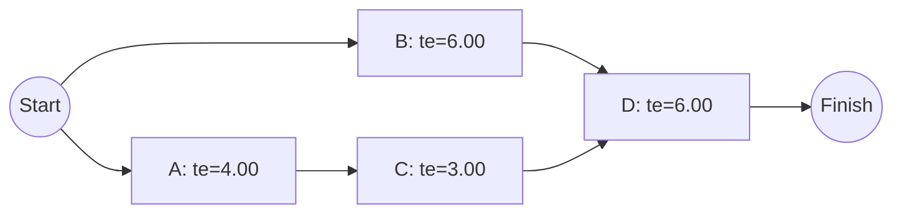

## Program Evaluation and Review Technique

### Overview

The Program Evaluation and Review Technique (PERT) is a network-based project scheduling method that explicitly incorporates uncertainty in activity duration estimates, in contrast to the deterministic single-estimate approach of the Critical Path Method (CPM). PERT was originally developed for large-scale programs involving significant technical uncertainty, where a single confident duration estimate per activity was not realistic. Rather than assuming activity durations are known with certainty, PERT uses three-point estimation and probability theory to characterize a range of possible project completion dates and the likelihood of meeting specific target dates.

### The Three-Point Estimate

For each activity, PERT requires three duration estimates instead of one:

- **Optimistic time ($t_o$)**: the shortest time the activity could reasonably take if everything goes better than expected
- **Most Likely time ($t_m$)**: the duration expected under normal conditions
- **Pessimistic time ($t_p$)**: the longest time the activity could reasonably take if significant problems occur

These three estimates are combined into a single **expected duration** using a weighted average based on an assumed Beta probability distribution for activity duration:

$$t_e = \frac{t_o + 4t_m + t_p}{6}$$

The weighting (four times the most-likely estimate relative to the two extremes) reflects the assumption that the most likely estimate is the modal value of the distribution, while the optimistic and pessimistic estimates represent the tails.

### Estimating Variance and Standard Deviation

PERT also estimates the uncertainty (variance) associated with each activity's duration:

$$\sigma^2 = \left(\frac{t_p - t_o}{6}\right)^2$$

$$\sigma = \frac{t_p - t_o}{6}$$

A wider gap between optimistic and pessimistic estimates produces a larger variance, reflecting greater uncertainty about that activity's actual duration.

### Worked Example — Three-Point Estimates for a Small Project

| Activity | Predecessor | $t_o$ | $t_m$ | $t_p$ | $t_e$ | $\sigma$ | $\sigma^2$ |
| --- | --- | --- | --- | --- | --- | --- | --- |
| A | — | 2 | 4 | 6 | 4.00 | 0.667 | 0.444 |
| B | — | 3 | 5 | 13 | 6.00 | 1.667 | 2.778 |
| C | A | 2 | 3 | 4 | 3.00 | 0.333 | 0.111 |
| D | B, C | 4 | 6 | 8 | 6.00 | 0.667 | 0.444 |

Calculation for Activity A: $t_e = \frac{2 + 4(4) + 6}{6} = \frac{24}{6} = 4.00$; $\sigma = \frac{6-2}{6} = 0.667$

Calculation for Activity B: $t_e = \frac{3 + 4(5) + 13}{6} = \frac{36}{6} = 6.00$; $\sigma = \frac{13-3}{6} = 1.667$ — note Activity B has a much larger pessimistic-optimistic spread, producing substantially higher variance/uncertainty than the other activities despite having the same expected duration as Activity D.

### Building the Network and Identifying the Critical Path

Once expected durations ($t_e$) are calculated for every activity, the network is built and the forward/backward pass is performed exactly as in CPM, using $t_e$ values in place of single deterministic durations.

**Forward Pass:**

| Activity | ES | EF |
| --- | --- | --- |
| A | 0 | 4.00 |
| B | 0 | 6.00 |
| C | 4.00 | 7.00 |
| D | 7.00 (max of B's EF=6.00, C's EF=7.00) | 13.00 |

Expected project duration = 13.00 time units, with the critical path being **A → C → D** (since C's path produces the later EF of 7.00 feeding into D, versus B's EF of 6.00).

### Calculating Project Variance and Standard Deviation

A key PERT principle: the **variance of the overall project duration** is the sum of the variances of only the activities lying on the **critical path** (non-critical activity variance does not directly contribute to the project's overall completion-date uncertainty, since those activities have float absorbing their variability up to a point).

$$\sigma^2_{\text{project}} = \sum (\sigma^2_{\text{critical path activities}})$$

For the critical path A → C → D:

$$\sigma^2_{\text{project}} = 0.444 + 0.111 + 0.444 = 0.999 \approx 1.00$$

$$\sigma_{\text{project}} = \sqrt{1.00} = 1.00$$

### Calculating Probability of Meeting a Target Date

PERT assumes the overall project duration is approximately normally distributed (by the Central Limit Theorem, since it is a sum of multiple independent activity durations), allowing calculation of the probability of completing by a specific target date using the Z-score formula:

$$Z = \frac{T_{\text{target}} - T_{\text{expected}}}{\sigma_{\text{project}}}$$

**Example**: What is the probability of completing the project above by day 15, given expected duration = 13.00 and $\sigma_{\text{project}} = 1.00$?

$$Z = \frac{15 - 13.00}{1.00} = 2.00$$

Looking up $Z = 2.00$ in the standard normal distribution table gives a cumulative probability of approximately 0.9772, meaning there is roughly a 97.7% probability of completing the project by day 15 under the model's assumptions.

**Example**: What is the probability of completing by exactly the expected duration of day 13?

$$Z = \frac{13 - 13.00}{1.00} = 0$$

A Z-score of 0 corresponds to a cumulative probability of 0.50 — reflecting the property of a symmetric normal distribution that there is a 50% chance of finishing earlier and 50% chance of finishing later than the mean/expected value itself.

### Illustration: Normal Distribution of Project Completion (svg_diagram)

<svg xmlns="http://www.w3.org/2000/svg" viewBox="0 0 640 240">
<text x="20" y="25" font-size="16" font-weight="bold">Probability Distribution of Project Completion Time (svg_diagram)</text>
<line x1="50" y1="200" x2="600" y2="200" stroke="black" stroke-width="2" />
<path d="M 80 200 Q 200 40 320 200 Q 440 40 560 200" fill="none" stroke="blue" stroke-width="2" />
<line x1="320" y1="200" x2="320" y2="60" stroke="black" stroke-width="1" stroke-dasharray="4,3" />
<text x="320" y="220" font-size="11" text-anchor="middle">Expected = 13.0</text>
<line x1="440" y1="200" x2="440" y2="120" stroke="red" stroke-width="1" stroke-dasharray="4,3" />
<text x="440" y="220" font-size="11" text-anchor="middle" fill="red">Target = 15.0</text>
<text x="440" y="105" font-size="10" fill="red">Z = 2.0, P ≈ 97.7%</text>
</svg>

### PERT vs. CPM Comparison

| Aspect | PERT | CPM |
| --- | --- | --- |
| Duration input | Three-point estimate (optimistic, most likely, pessimistic) | Single deterministic estimate |
| Output | Expected duration plus probability distribution | Single fixed duration and critical path |
| Handles schedule risk explicitly | Yes | No (implicitly assumes certainty) |
| Best suited for | Novel, uncertain, R&D-type projects | Repetitive, well-understood projects (construction, standard manufacturing) |
| Computational approach | Statistical (expected value, variance, normal approximation) | Deterministic forward/backward pass |

[Inference — in contemporary practice, the strict historical distinction between PERT and CPM has substantially blurred; many organizations use a single network-based method that optionally incorporates three-point estimation when uncertainty is significant, rather than treating them as two categorically separate techniques.]

### Key Assumptions and Their Limitations

**Key Points**

- PERT assumes activity durations follow a **Beta distribution**, and the $\frac{t_o + 4t_m + t_p}{6}$ formula is a commonly used approximation of that distribution's mean — this is a modeling assumption, not a certainty about any specific real activity's true distribution
- PERT assumes the overall project duration is **approximately normally distributed**, which relies on the Central Limit Theorem holding reasonably well — this approximation is generally more reliable when the critical path includes a reasonably large number of activities with comparable variance contributions
- The technique assumes the **critical path remains fixed** throughout the calculation; in reality, if a non-critical path has high variance, it has some probability of becoming the actual critical path during execution — a limitation sometimes addressed through Monte Carlo simulation as a more robust (though more computationally intensive) alternative
- **Merge bias**: PERT's standard calculation can understate the true expected project duration when multiple paths converge at a single activity (a "merge event"), because the expected value of the maximum of several random variables is generally greater than the maximum of their individual expected values [Unverified as a universal correction factor — this is a recognized theoretical limitation of the basic PERT formula, though the practical magnitude of the bias depends on the specific network structure and variance levels involved]

### Practical Applications

- **R&D and new product development projects**, where activity durations involve genuine technical uncertainty (e.g., "how long will it take to solve this engineering problem" cannot be estimated with the same confidence as "how long does it take to pour a foundation")
- **Risk communication to stakeholders**: expressing project timelines as a probability ("85% confidence of completion by [date]") rather than a single deterministic date can more honestly represent genuine uncertainty and support better contingency planning
- **Contract and milestone negotiation**: understanding the probability distribution of completion helps set realistic contractual commitment dates with appropriate risk buffers

### Relationship to Operations Management

PERT extends the network scheduling foundation established by CPM (which itself builds on the Work Breakdown Structure) by adding explicit treatment of schedule risk and uncertainty — a capability particularly relevant to operations projects with significant technical or execution uncertainty, such as new product development, novel process implementation, or first-of-a-kind facility commissioning, where deterministic CPM durations would understate the genuine risk to project timelines.

**Related Topics**

- Critical Path Method (CPM)
- Work Breakdown Structure (WBS)
- Monte Carlo simulation in project scheduling
- Project risk management
- Project crashing and time-cost trade-off analysis
- Earned Value Management (EVM)
- Project life cycle and organization