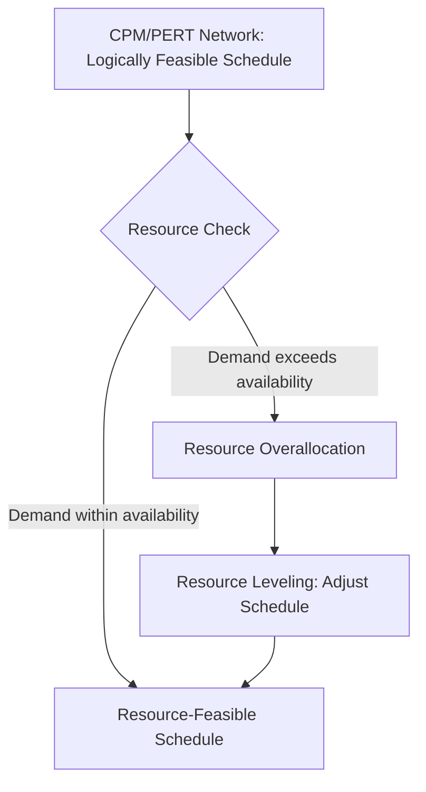
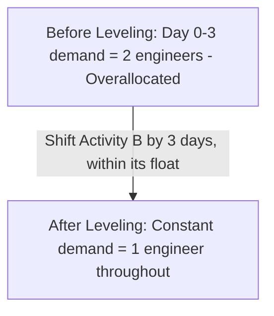

## Resource Leveling and Allocation

### Overview

Resource leveling and allocation addresses a fundamental gap in basic network scheduling techniques like CPM and PERT: those methods calculate the earliest and latest possible timing for activities based purely on logical dependencies, without checking whether the resources (labor, equipment, specialized skills) required to perform those activities are actually available in the quantities needed at the times calculated. Resource allocation assigns available resources to scheduled activities, while resource leveling adjusts the schedule itself to smooth resource demand and resolve overallocation, often at the cost of extending the project timeline.

### The Core Problem: Resource Overallocation

A CPM/PERT network may be logically and temporally feasible (all dependencies satisfied, critical path calculated) while simultaneously being **resource-infeasible** — requiring more of a given resource in a given period than actually exists.

$$\text{Resource Overallocation}(t) = \text{Resource Demand}(t) - \text{Resource Availability}(t) > 0$$

### Worked Example — Detecting Overallocation

Consider a small project where a single specialized engineer (1 unit of capacity available per day) is required by two activities:

| Activity | Duration | ES | EF | Resource Required |
| --- | --- | --- | --- | --- |
| A | 3 days | 0 | 3 | 1 engineer |
| B | 4 days | 0 | 4 | 1 engineer |
| C | 2 days | 4 | 6 | 1 engineer |

Both A and B are scheduled to start at day 0 based on the CPM forward pass (assuming they have no dependency on each other), but only one engineer is available. If both are scheduled at their early start dates simultaneously, resource demand = 2 engineers during days 0–3, exceeding availability of 1 — an overallocation requiring resolution.

| Day | 0 | 1 | 2 | 3 | 4 | 5 |
| --- | --- | --- | --- | --- | --- | --- |
| Demand (Engineers) | 2 | 2 | 2 | 1 | 1 | 1 |
| Available | 1 | 1 | 1 | 1 | 1 | 1 |
| Overallocation | 1 | 1 | 1 | 0 | 0 | 0 |

### Resource Allocation vs. Resource Leveling

**Key Points**

- **Resource allocation** is the process of assigning specific available resources to specific activities, typically respecting the schedule as calculated, and identifying where conflicts exist
- **Resource leveling** actively modifies the schedule (shifting activity start times within available float, or beyond float if necessary) to eliminate overallocation, generally smoothing peaks and valleys in resource demand over time
- Leveling that stays within existing float does not affect the project finish date; leveling that must extend beyond available float **will extend the project's critical path and overall duration**

### Resource Leveling Techniques

**Leveling Within Float**

If a non-critical activity has slack (float), delaying its start to avoid a resource conflict does not affect the project finish date. This is the preferred first approach whenever sufficient float exists.

**Resource Leveling Example — Using Float**

Returning to the earlier example, suppose Activity B actually has 3 days of float (its LS = day 3, not day 0). The scheduler can delay Activity B's start from day 0 to day 3, resolving the overallocation without extending the project:

| Day | 0 | 1 | 2 | 3 | 4 | 5 | 6 |
| --- | --- | --- | --- | --- | --- | --- | --- |
| Activity A | 1 | 1 | 1 | 0 | 0 | 0 | 0 |
| Activity B (shifted) | 0 | 0 | 0 | 1 | 1 | 1 | 1 |
| Total Demand | 1 | 1 | 1 | 1 | 1 | 1 | 1 |

Demand is now level at 1 engineer throughout, fully within the 1-engineer availability constraint, and since Activity B's shift stayed within its float, the project finish date is unaffected.

**Leveling Beyond Float (Schedule Extension)**

When float is insufficient to resolve a conflict, the schedule itself must extend — one or more activities are delayed beyond their late finish dates, pushing back the overall project completion date. This is a direct trade-off: resource feasibility is gained at the cost of schedule length.

**Resource Smoothing**

A related but distinct technique: resource smoothing adjusts activities strictly within their available float to reduce peaks and valleys in resource usage, explicitly **without ever extending the project finish date**. If smoothing alone cannot resolve overallocation without violating this constraint, the remaining conflict must be addressed through leveling (which may extend the schedule) or through resource allocation strategies (adding capacity) instead.

| Technique | Definition | Effect on Project Finish Date |
| --- | --- | --- |
| Resource Allocation | Assigning available resources to activities | No inherent schedule change (may reveal conflicts) |
| Resource Smoothing | Adjusting timing within existing float only | Never extends finish date; may not fully resolve severe conflicts |
| Resource Leveling | Adjusting timing, extending beyond float if necessary | May extend finish date if float is insufficient |

### Strategies for Resolving Resource Conflicts

**Next Steps (Resolution Options When Overallocation Occurs)**

1. **Delay non-critical activities** within their available float first, since this carries no schedule cost
2. **Extend the schedule** by delaying activities beyond float if leveling within float cannot fully resolve the conflict, accepting a longer project duration
3. **Add resource capacity** — bring in additional staff, subcontract work, authorize overtime, or rent additional equipment to meet peak demand without delaying the schedule
4. **Fast-track or re-sequence** non-critical work to reduce concurrent demand for the constrained resource
5. **Split activities**, performing part of the work, pausing, and resuming later when the resource becomes available — though this can introduce inefficiency from setup/teardown or loss of momentum
6. **Substitute resources** where feasible (e.g., a differently skilled but adequately capable resource) to relieve pressure on the specifically constrained resource

### Resource Histograms

A **resource histogram** is a bar chart showing resource demand over time, commonly used to visualize overallocation before and after leveling.

### Illustration: Resource Histogram Before/After Leveling (svg_diagram)

<svg xmlns="http://www.w3.org/2000/svg" viewBox="0 0 640 260">
<text x="20" y="25" font-size="16" font-weight="bold">Resource Histogram Before and After Leveling (svg_diagram)</text>
<text x="20" y="55" font-size="12" font-weight="bold">Before Leveling</text>
<line x1="50" y1="120" x2="300" y2="120" stroke="black" stroke-width="1" />
<line x1="50" y1="60" x2="50" y2="120" stroke="black" stroke-width="1" />
<rect x="60" y="80" width="30" height="40" fill="none" stroke="red" stroke-width="2" />
<rect x="90" y="80" width="30" height="40" fill="none" stroke="red" stroke-width="2" />
<rect x="120" y="80" width="30" height="40" fill="none" stroke="red" stroke-width="2" />
<rect x="150" y="100" width="30" height="20" fill="none" stroke="black" stroke-width="1" />
<rect x="180" y="100" width="30" height="20" fill="none" stroke="black" stroke-width="1" />
<line x1="50" y1="100" x2="300" y2="100" stroke="blue" stroke-width="1" stroke-dasharray="4,3" />
<text x="305" y="103" font-size="10" fill="blue">Capacity: 1</text>
<text x="20" y="150" font-size="12" font-weight="bold">After Leveling (shifted within float)</text>
<line x1="50" y1="220" x2="300" y2="220" stroke="black" stroke-width="1" />
<line x1="50" y1="160" x2="50" y2="220" stroke="black" stroke-width="1" />
<rect x="60" y="200" width="30" height="20" fill="none" stroke="green" stroke-width="2" />
<rect x="90" y="200" width="30" height="20" fill="none" stroke="green" stroke-width="2" />
<rect x="120" y="200" width="30" height="20" fill="none" stroke="green" stroke-width="2" />
<rect x="150" y="200" width="30" height="20" fill="none" stroke="green" stroke-width="2" />
<rect x="180" y="200" width="30" height="20" fill="none" stroke="green" stroke-width="2" />
<line x1="50" y1="200" x2="300" y2="200" stroke="blue" stroke-width="1" stroke-dasharray="4,3" />
</svg>

### Resource-Constrained Scheduling vs. Time-Constrained Scheduling

| Approach | Priority | Outcome |
| --- | --- | --- |
| Time-Constrained (Time-Limited) | Meeting the project deadline is fixed and non-negotiable | Resources are added/reassigned as needed to hit the date, even at added cost |
| Resource-Constrained (Resource-Limited) | Available resource levels are fixed and non-negotiable | The schedule extends as needed to stay within actual resource availability |

Most real projects fall somewhere between these two extremes, requiring a negotiated trade-off between schedule length and resource cost/availability rather than a purely one-sided solution. [Inference — the appropriate balance point is highly context- and organization-specific, depending on the relative cost of schedule delay versus the cost/feasibility of acquiring additional resources.]

### Multi-Project Resource Allocation

In organizations running multiple concurrent projects, resource conflicts often occur **across** projects rather than only within a single project's network — a specialized engineer, a piece of equipment, or a particular team may be needed simultaneously by several active projects. This typically requires:

- Portfolio-level resource capacity planning, aggregating demand across all active projects against total organizational capacity
- Prioritization frameworks to determine which project's needs take precedence when a genuine resource conflict cannot be resolved through leveling alone
- Often supported by Project Management Office (PMO) governance and, in more complex environments, Advanced Planning and Scheduling (APS)-style tools that formally model resource constraints across the full project portfolio

### Practical Considerations and Limitations

- Resource leveling algorithms in scheduling software generally use heuristics rather than provably optimal solutions, since resource-constrained project scheduling is a combinatorially complex (NP-hard) problem in general, similar in character to job shop scheduling
- Leveling decisions should account for the **priority and criticality** of the resource-consuming activities, not purely mechanical float availability — a strictly float-based algorithm may deprioritize a strategically important activity simply because it has technical slack
- Over-reliance on adding resource capacity (rather than leveling/scheduling adjustments) to resolve conflicts can increase project cost significantly, so the two strategies are typically weighed together rather than treating capacity expansion as a default solution [Behavior and outcomes may vary depending on the specific resource market, cost structure, and urgency of the given project.]
- Frequent, ad hoc resource reallocation across a portfolio of projects can create scheduling instability and reduce the reliability of any individual project's committed dates

### Relationship to Operations Management

Resource leveling and allocation extends the network scheduling logic of CPM and PERT by connecting project timing decisions to the same finite-capacity reality addressed by Capacity Requirements Planning (CRP) and Advanced Planning and Scheduling (APS) in the manufacturing scheduling context. In both domains, the underlying challenge is identical in structure: a logically valid time-phased plan is not automatically a feasible one, and reconciling schedule logic with finite resource capacity requires either adjusting the schedule, adjusting the resource base, or negotiating an explicit trade-off between the two.

**Related Topics**

- Critical Path Method (CPM)
- Program Evaluation and Review Technique (PERT)
- Capacity Requirements Planning (CRP)
- Advanced Planning and Scheduling (APS) systems
- Project crashing and time-cost trade-off analysis
- Project Management Office (PMO) and portfolio management
- Job shop scheduling and dispatching rules