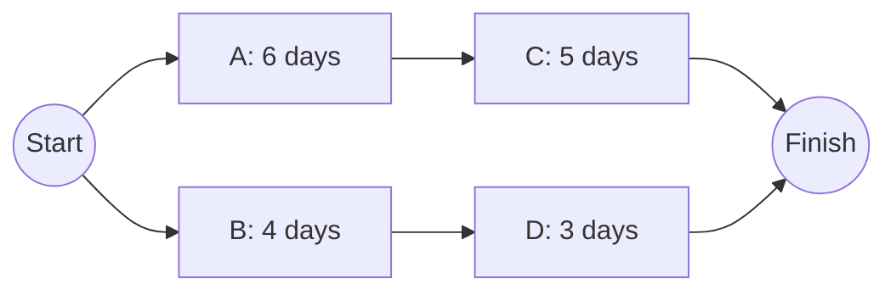
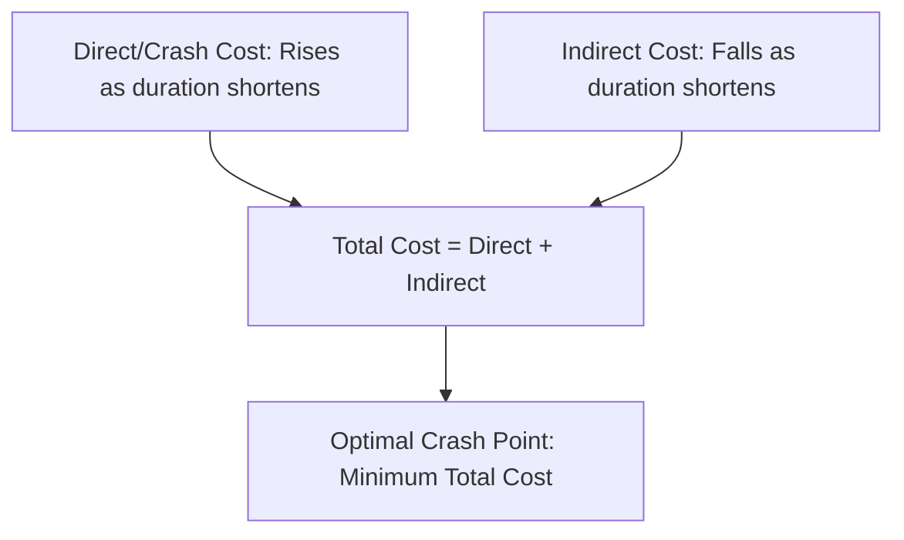

## Project Crashing and Cost Trade-offs

### Overview

Project crashing is the deliberate compression of a project's schedule by shortening the duration of one or more activities, typically by adding resources (overtime, additional labor, expedited materials, or additional equipment), in order to complete the project faster than its normal planned duration. Crashing always involves a cost trade-off: shortening an activity's duration below its normal time generally increases the direct cost of performing that activity, so crashing decisions require systematically comparing the cost of time saved against the value or necessity of that time savings.

### Normal Time, Crash Time, and Cost

Each activity has two duration/cost pairs relevant to crashing analysis:

- **Normal Time ($NT$)**: the duration under normal working conditions and normal resource levels
- **Normal Cost ($NC$)**: the cost associated with completing the activity in normal time
- **Crash Time ($CT$)**: the shortest possible duration achievable for the activity, using maximum feasible resources (the practical minimum, beyond which further compression is not possible regardless of cost)
- **Crash Cost ($CC$)**: the cost associated with completing the activity in crash time

### The Cost Slope

The **crash cost slope** represents the additional cost incurred per unit of time saved for a given activity, assuming a linear relationship between time and cost within the normal-to-crash range:

$$\text{Cost Slope} = \frac{CC - NC}{NT - CT}$$

This linear assumption is a simplification — real cost-time relationships can be non-linear — but it is the standard basis for classical crashing analysis. [Inference — actual cost-time relationships for a specific activity may deviate from strict linearity, particularly near the crash-time limit where diminishing returns or premium overtime rates often apply; the linear model is a widely used approximation rather than a guaranteed real-world behavior.]

### Worked Example — Calculating Cost Slopes

| Activity | Normal Time | Normal Cost | Crash Time | Crash Cost | Cost Slope |
| --- | --- | --- | --- | --- | --- |
| A | 6 days | $1,000 | 4 days | $1,800 | $400/day |
| B | 4 days | $800 | 2 days | $1,600 | $400/day |
| C | 5 days | $1,200 | 3 days | $2,000 | $400/day |
| D | 3 days | $600 | 2 days | $1,000 | $400/day |

Calculation for Activity A: $\text{Cost Slope} = \frac{1800 - 1000}{6 - 4} = \frac{800}{2} = \$400$ per day saved

(Note: identical slopes across activities are used here for illustrative simplicity; in practice, different activities typically have different cost slopes, which is precisely what drives the prioritization logic below.)

### The Crashing Procedure

**Next Steps (Systematic Crashing Algorithm)**

1. Construct the project network and identify the current **critical path(s)** using CPM forward/backward pass calculations
2. Calculate the **cost slope** for every activity on the critical path (only critical-path activities affect overall project duration, so crashing non-critical activities wastes money without shortening the project)
3. Select the critical-path activity with the **lowest cost slope** (cheapest cost per day saved) as the first candidate to crash
4. Crash that activity by one time unit at a time, up to the smaller of: (a) its crash-time limit, or (b) the amount of float available on the next-longest parallel path, since crashing beyond that point would create a **new** critical path without further reducing overall duration
5. Recalculate the network after each crashing step — crashing can cause a different path to become critical, or can create **multiple concurrent critical paths**
6. When multiple paths become critical simultaneously, activities on **all** critical paths must be crashed together to achieve further schedule compression, which increases the combined cost slope significantly
7. Continue until either the target duration is reached, or crashing becomes uneconomical — that is, the marginal cost of crashing exceeds the marginal benefit (value) of the time saved

### Worked Example — Applying the Crashing Procedure

Network with two paths: Path 1 (A → C, critical, 11 days) and Path 2 (B → D, non-critical, 7 days), using the cost data above.

Path 1 (A+C) = 11 days; Path 2 (B+D) = 7 days. Path 1 is critical with 4 days of float advantage over Path 2.

**Crashing Path 1**: Since A and C both have a $400/day cost slope (tied), crash either — suppose Activity A is crashed by 2 days (its full crash limit, 6→4 days) at a cost of $2 \times \$400 = \$800$. New Path 1 duration = $4 + 5 = 9$ days. Path 2 remains at 7 days — Path 1 is still critical, and its float advantage over Path 2 has narrowed from 4 days to 2 days.

**Continuing to crash**: Crash Activity C by up to 2 days (its crash limit, 5→3) at $400/day. If crashed by 2 full days, new Path 1 duration = $4 + 3 = 7$ days — but this would tie Path 2 at 7 days, meaning **both paths become critical simultaneously** at that point. Crashing Activity C by only the 2 days needed to reach the tie point (rather than further) avoids wasted cost, since further compression below 7 days would require crashing both paths together.

**Total crash cost so far**: $\$800 (\text{Activity A}) + \$800 (\text{Activity C, 2 days}) = \$1,600$, achieving a schedule reduction from 11 days to 7 days (4 days saved) — noting that both paths are now tied at 7 days as dual critical paths.

### The Time-Cost Trade-off Curve

Plotting cumulative project duration against cumulative crash cost produces the **time-cost trade-off curve**, which typically shows increasing marginal cost as the schedule is compressed further — early compression is achieved using the cheapest available cost slopes, while later compression requires crashing multiple concurrent critical paths simultaneously, sharply increasing the cost per day saved.

**Key Points**

- The **first units of crashing are typically the cheapest**, since only a single critical path exists and the lowest-cost-slope activities can be selected freely
- As paths converge to become simultaneously critical, **further compression requires crashing multiple paths at once**, and the effective cost slope for each additional day saved becomes the **sum** of the cost slopes across all currently-critical paths
- This produces the characteristic **convex (upward-curving) time-cost trade-off**: cost per day saved increases as the project is compressed further, reflecting genuinely diminishing returns

### Direct Cost vs. Indirect Cost and the Optimal Crash Point

Crashing decisions should weigh **direct costs** (the crashing costs calculated above) against **indirect costs** (costs proportional to project duration, such as overhead, financing/carrying costs, and any contractual penalty or incentive clauses tied to completion date).

$$\text{Total Project Cost} = \text{Direct Cost (including crash cost)} + \text{Indirect Cost (proportional to duration)}$$

Since direct/crash cost rises as duration shortens, while indirect cost falls as duration shortens, there is generally an **optimal crash point** where total cost is minimized — crashing beyond that point saves less in indirect cost than it adds in direct crash cost, becoming uneconomical.

### Reasons to Crash a Project

- **Contractual incentives or penalties**: a bonus for early completion or a liquidated-damages penalty for late completion can justify crash costs that would otherwise be uneconomical on direct cost grounds alone
- **Market/competitive timing**: getting a product to market faster can generate revenue that outweighs the direct crash cost
- **Recovering from delays**: correcting an earlier schedule slip to preserve an original committed completion date
- **Resource release requirements**: freeing key personnel or equipment sooner for another committed project

### Fast-Tracking as an Alternative Compression Technique

**Fast-tracking** compresses schedule by performing activities that were originally planned sequentially **in parallel** instead (e.g., beginning detailed design before conceptual design is fully finished), rather than by adding resources to shorten individual activity durations.

| Technique | Method | Primary Trade-off |
| --- | --- | --- |
| Crashing | Add resources to shorten activity duration | Increased direct cost |
| Fast-Tracking | Perform sequential activities in parallel/overlapping | Increased risk of rework if the overlapped predecessor activity changes after the successor has already begun |

[Inference — the relative appropriateness of crashing versus fast-tracking depends on the specific activities involved; fast-tracking is generally more viable when dependency relationships have genuine flexibility for overlap, while crashing is more viable when additional resources can be effectively absorbed without diminishing returns from coordination overhead.]

### Limitations and Practical Considerations

- The linear cost-slope model is a simplification; in practice, some crash costs escalate non-linearly as an activity approaches its absolute crash-time limit (e.g., overtime premium rates, diminishing productivity from overcrowding a work area — sometimes called the "Mythical Man-Month" effect in software/knowledge work contexts)
- Crashing decisions must be **recalculated iteratively** as the critical path shifts; a static, one-time crashing analysis can miss the point at which a previously non-critical path becomes critical
- Crashing increases coordination complexity and risk of quality problems if performed under significant schedule pressure, an effect not directly captured in the direct-cost crash figures themselves
- Not all activities can be crashed at all — some have a fixed minimum duration regardless of resources applied (e.g., concrete curing time, regulatory approval waiting periods), and crashing analysis must exclude or appropriately constrain such activities

### Relationship to Operations Management

Project crashing directly extends the Critical Path Method by adding an explicit cost-optimization layer on top of the pure schedule-logic network, and it interacts closely with resource leveling/allocation decisions, since crashing typically requires acquiring additional resource capacity in the same way that resolving resource overallocation does. In operations contexts, crashing analysis is commonly applied to major initiatives such as facility commissioning, product launches, or ERP implementations when business conditions create genuine value in accelerating completion beyond the schedule's normal, cost-efficient duration.

**Related Topics**

- Critical Path Method (CPM)
- Program Evaluation and Review Technique (PERT)
- Resource leveling and allocation
- Work Breakdown Structure (WBS)
- Project life cycle and organization
- Earned Value Management (EVM)
- Direct and indirect cost analysis in project management