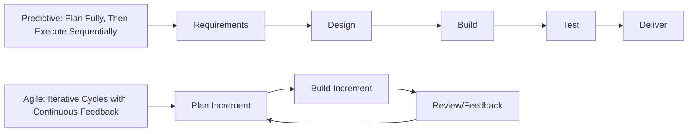
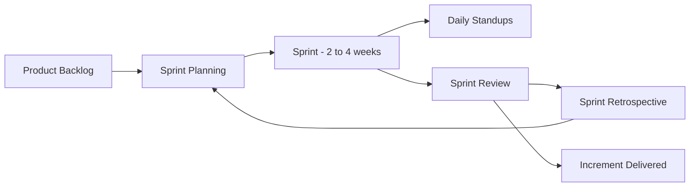
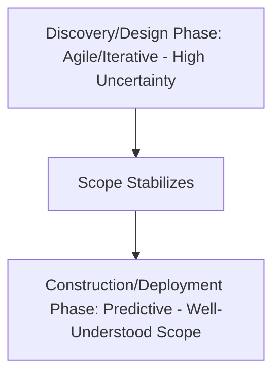

## Agile and Hybrid Project Management Approaches

### Overview

Agile project management is an adaptive, iterative approach to delivering project work that prioritizes flexibility, incremental delivery, and continuous stakeholder feedback over the fully predetermined, sequential planning characteristic of traditional predictive (waterfall) approaches. Hybrid approaches deliberately combine elements of both predictive and agile methods, applying each where it fits best within a single project or program. These approaches have become increasingly relevant to operations management as organizations apply iterative delivery principles beyond software development into process improvement, product development, and operational transformation initiatives.

### Predictive vs. Agile: Core Philosophical Difference

| Dimension | Predictive (Waterfall) | Agile |
| --- | --- | --- |
| Scope definition | Defined in detail upfront | Defined progressively, refined each iteration |
| Change | Managed through formal change control | Expected and embraced as normal |
| Delivery | Single delivery at project end (or defined phase gates) | Incremental delivery every iteration |
| Planning horizon | Full project planned in detail early | Detailed planning only for the near-term iteration; longer-term planning stays high-level |
| Customer/stakeholder involvement | Concentrated at initiation and milestone reviews | Continuous, embedded throughout |
| Best suited for | Stable, well-understood requirements | High uncertainty, evolving requirements |

### The Agile Manifesto Values

Agile approaches trace back to a foundational set of four value statements (from the Agile Manifesto for software development, subsequently generalized to broader project contexts):

- **Individuals and interactions** over processes and tools
- **Working deliverables** over comprehensive documentation
- **Customer collaboration** over contract negotiation
- **Responding to change** over following a fixed plan

**Key Points**

- These value statements express relative emphasis, not the elimination of the items on the right — processes, documentation, contracts, and plans still matter in agile approaches; they are simply subordinated to the items on the left when tension arises
- This value framework underlies most specific agile frameworks (Scrum, Kanban, etc.) rather than prescribing a single specific method itself

### Common Agile Frameworks

**Scrum**

An iterative framework organizing work into fixed-length iterations called **sprints** (commonly two to four weeks), with defined roles, ceremonies, and artifacts.

**Key Points**

- **Roles**: Product Owner (prioritizes and owns the backlog of work), Scrum Master (facilitates the process and removes impediments), Development Team (self-organizing group that delivers the work)
- **Artifacts**: Product Backlog (prioritized list of all desired work), Sprint Backlog (subset of backlog committed to the current sprint), Increment (the working, potentially shippable output of a sprint)
- **Ceremonies**: Sprint Planning (selecting and planning sprint work), Daily Standup (brief daily synchronization), Sprint Review (demonstrating completed work to stakeholders), Sprint Retrospective (reflecting on process improvement)

**Kanban**

A visual, flow-based approach emphasizing continuous delivery rather than fixed-length iterations, using a visual board with columns representing workflow stages (e.g., To Do, In Progress, Review, Done) and explicit **Work-in-Progress (WIP) limits** to prevent overloading any stage of the process.

$$\text{Cycle Time} \times \text{Throughput} = \text{Average WIP} \quad \text{(Little's Law applied to Kanban flow)}$$

Kanban's WIP-limiting discipline is directly related to Little's Law from queueing theory: limiting work-in-progress at each stage helps control and predict cycle time, mirroring the same underlying principle used in lean manufacturing pull systems.

**Lean/Extreme Programming (XP) and Other Frameworks**

Additional agile frameworks (Extreme Programming, Feature-Driven Development, Crystal, and others) share the core iterative, adaptive philosophy while differing in specific practices (e.g., XP's emphasis on technical practices like pair programming and test-driven development in software contexts).

### Hybrid Project Management Approaches

Hybrid approaches deliberately blend predictive and agile elements within a single project, recognizing that different components of a project may have different levels of requirement stability and benefit from different management approaches.

**Common Hybrid Patterns**

| Pattern | Description |
| --- | --- |
| Predictive overall, Agile execution | Overall project phases, milestones, and budget are planned predictively, while detailed execution within each phase uses agile/iterative methods |
| Agile overall, Predictive components | Project runs primarily agile, but specific well-understood, fixed-scope components (e.g., regulatory compliance deliverables) are planned and executed predictively within the agile cadence |
| Phase-based hybrid | Early phases (discovery, design) run agile/iterative to manage uncertainty; later phases (construction, deployment) shift to predictive once scope stabilizes |

**Key Points**

- Hybrid approaches are common in practice because most real projects contain a mix of well-understood, stable elements and uncertain, evolving elements — forcing a single methodology across the entire project can create unnecessary friction with either type of work
- Selecting where to apply predictive versus agile treatment is typically driven by the relative **requirement stability and uncertainty** of each specific work component, not by an organization-wide, one-size-fits-all mandate
- Hybrid approaches require deliberate integration planning — how agile sprint outputs feed into predictive milestone reporting, how governance and stakeholder reporting reconcile the two paradigms' different terminology and cadences

### Choosing Between Predictive, Agile, and Hybrid Approaches

**Next Steps (Selection Considerations)**

1. Assess **requirement stability** — how well is the final deliverable understood at project outset, and how likely is it to change significantly during execution?
2. Assess **stakeholder involvement capacity** — agile approaches require sustained, frequent stakeholder engagement (e.g., regular sprint reviews); if stakeholders cannot commit to this cadence, predictive approaches may be more practical
3. Evaluate **regulatory or contractual constraints** — some contexts (e.g., fixed-price contracts with detailed upfront specifications, heavily regulated industries) favor predictive structure for accountability and traceability
4. Consider the **cost of change** at different points — if late-stage changes are extremely costly or physically infeasible (e.g., large capital construction), predictive upfront planning reduces risk; if late-stage changes are cheap and iteration is valuable (e.g., software features, process redesign), agile approaches capture more value
5. Evaluate **organizational readiness and culture** — agile approaches require different team autonomy, management style, and reporting structures than traditional predictive project governance; a mismatch with organizational culture can undermine agile adoption regardless of the approach's theoretical fit

[Inference — the "correct" choice among predictive, agile, and hybrid approaches is context-dependent rather than universal; a framework well-suited to software feature development is not automatically well-suited to, for example, a large capital construction project, and vice versa.]

### Applying Agile Concepts to Operations Management

**Key Points**

- **Iterative process improvement**: Kaizen and continuous improvement approaches in lean operations share philosophical similarities with agile's iterative, feedback-driven cycles, even though they originate from distinct traditions
- **New product development**: agile/hybrid approaches are increasingly applied to physical product development, particularly in the earlier, more uncertain design and prototyping phases, before shifting to more predictive management once designs stabilize for manufacturing scale-up
- **ERP and systems implementation**: some organizations apply hybrid approaches to ERP implementations — predictive governance and milestone structure at the program level, with agile/iterative configuration and testing cycles within individual modules or workstreams
- **Service operations improvement**: Kanban-style visual workflow management, with WIP limits, is directly applicable to service and administrative process improvement (e.g., managing a customer service ticket queue), independent of any software development context

### Common Misconceptions

| Misconception | Clarification |
| --- | --- |
| "Agile means no planning" | Agile still plans, but at a more granular, rolling level (e.g., sprint planning) rather than a single comprehensive upfront plan |
| "Agile is faster in every case" | Agile optimizes for adaptability and reduced risk of building the wrong thing under uncertainty; it does not guarantee faster raw execution speed for well-understood, stable scope |
| "Hybrid is just 'agile with some documentation'" | Hybrid deliberately applies different methodologies to different components based on their actual characteristics, not merely adding predictive artifacts on top of an otherwise agile process |
| "Predictive and agile are mutually exclusive" | Most real organizations use hybrid approaches in practice, even if not formally labeled as such |

### Relationship to Operations Management

Agile and hybrid approaches represent an evolution of the project life cycle and organizational concepts covered elsewhere in this chapter, offering an alternative to the purely predictive, sequential model implicit in classical WBS/CPM/PERT-based planning. As operations management increasingly intersects with rapidly evolving technology implementations, product development, and process transformation initiatives, understanding when and how to apply agile or hybrid structures — rather than defaulting to a purely predictive model — has become a core project management competency alongside the traditional network-scheduling techniques.

**Related Topics**

- Project life cycle and organization
- Work Breakdown Structure (WBS)
- Kaizen and continuous improvement (Lean)
- Kanban systems in lean manufacturing
- ERP implementation challenges
- Critical Path Method (CPM) and PERT networks
- New product development processes