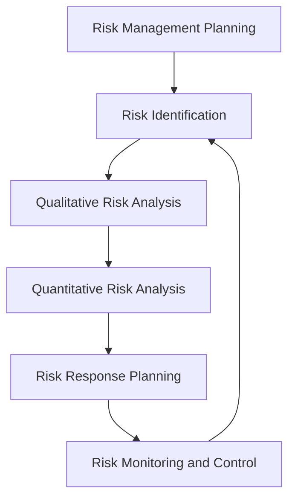
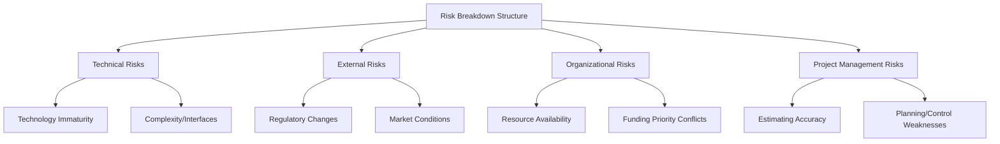

## Project Risk Management

### Overview

Project risk management is the systematic process of identifying, analyzing, and responding to uncertain events or conditions that, if they occur, could have a positive or negative effect on project objectives (scope, schedule, cost, or quality). Effective risk management shifts a project team from a reactive posture — responding to problems only after they occur — to a proactive one, anticipating potential issues and preparing appropriate responses in advance.

### Definition of Risk

A **risk** is an uncertain event or condition that, if it occurs, has a positive or negative effect on one or more project objectives. This definition explicitly includes both **threats** (negative risks) and **opportunities** (positive risks), though in practice most project risk management effort is directed at identifying and mitigating threats.

$$\text{Risk Exposure} = \text{Probability of Occurrence} \times \text{Impact if It Occurs}$$

### The Risk Management Process

### Step 1: Risk Management Planning

Establishes how risk management activities will be conducted throughout the project, including methodology, roles and responsibilities, risk categories, and the organization's risk tolerance/appetite. This step produces the **Risk Management Plan**, which defines the ground rules the rest of the process will follow.

### Step 2: Risk Identification

The process of determining which risks may affect the project and documenting their characteristics. Common identification techniques include:

- **Brainstorming** with the project team and relevant stakeholders
- **Checklists** derived from historical/lessons-learned data from similar past projects
- **SWOT analysis** (Strengths, Weaknesses, Opportunities, Threats)
- **Expert interviews and Delphi technique** (structured, iterative expert consultation, often anonymized to reduce groupthink)
- **Assumption and constraint analysis**, examining project assumptions for validity and constraints for hidden risk
- **Risk Breakdown Structure (RBS)**, a hierarchical categorization of potential risk sources (e.g., Technical, External, Organizational, Project Management), analogous in structure to the WBS but organizing sources of risk rather than deliverables

The output of identification is the **Risk Register**, a document listing each identified risk along with its description, category, potential causes, and (as later steps proceed) analysis results and response plans.

### Step 3: Qualitative Risk Analysis

Prioritizes identified risks for further analysis or action by assessing their **probability of occurrence** and **impact on objectives**, typically using a Probability-Impact Matrix.

**Probability-Impact Matrix Example**

| Probability \ Impact | Low | Medium | High |
| --- | --- | --- | --- |
| High | Medium | High | Critical |
| Medium | Low | Medium | High |
| Low | Low | Low | Medium |

Risks falling in the "Critical" or "High" zones are prioritized for detailed response planning and quantitative analysis; risks in the "Low" zone may simply be logged and monitored without dedicated response development.

**Worked Example**

| Risk | Probability | Impact | Priority (from matrix) |
| --- | --- | --- | --- |
| Key supplier delivery delay | High | High | Critical |
| Minor scope clarification needed | Medium | Low | Low |
| Regulatory approval delay | Medium | High | High |
| Team member reassigned mid-project | Low | Medium | Low |

### Step 4: Quantitative Risk Analysis

Numerically analyzes the effect of identified, prioritized risks on overall project objectives, often producing probabilistic outputs rather than the categorical (High/Medium/Low) results of qualitative analysis.

**Expected Monetary Value (EMV) Analysis**

$$EMV = \text{Probability} \times \text{Impact (in monetary terms)}$$

EMV is commonly used to compare risk response options or to build contingency reserves.

**Worked Example — EMV Calculation**

| Risk | Probability | Impact if Occurs | EMV |
| --- | --- | --- | --- |
| Key supplier delay | 30% | -$50,000 | -$15,000 |
| Weather delay (construction) | 20% | -$20,000 | -$4,000 |
| Early completion bonus opportunity | 15% | +$10,000 | +$1,500 |

Sum of EMVs = $-15{,}000 - 4{,}000 + 1{,}500 = -\$17{,}500$, suggesting a contingency reserve in this range may be appropriate to cover the net expected risk exposure across these three risks. [Inference — EMV provides an expected-value estimate, not a guarantee of any specific project's actual outcome; a specific project may experience an outcome quite different from this average, especially when risk probabilities are based on limited historical data.]

**Decision Tree Analysis**

Used when a risk response involves a genuine decision point with multiple paths, each with its own subsequent probabilities and outcomes — helpful for comparing, for example, the EMV of an early technology investment against the EMV of a wait-and-see approach.

**Monte Carlo Simulation**

Runs the project model (typically the schedule network with probabilistic activity durations, similar to PERT's three-point estimates) many times with randomly sampled inputs, producing a probability distribution of overall project outcomes (e.g., "there is an 80% probability the project will finish within 45 days") rather than a single expected value. This addresses some of PERT's simplifying assumptions (such as the merge-event bias) by directly simulating the full network's variability rather than relying on a single closed-form calculation.

### Step 5: Risk Response Planning

Develops options and actions to enhance opportunities and reduce threats to project objectives. Response strategies differ for threats versus opportunities.

**Strategies for Negative Risks (Threats)**

| Strategy | Description | Example |
| --- | --- | --- |
| Avoid | Eliminate the threat by changing the project plan | Change a supplier known to have unreliable delivery history |
| Mitigate | Reduce the probability or impact of the risk | Add quality checkpoints to reduce defect risk |
| Transfer | Shift the risk (and often its financial consequence) to a third party | Purchase insurance, use a fixed-price contract with a vendor |
| Accept | Acknowledge the risk without proactive action, typically for low-priority risks | Document the risk and monitor; take no specific mitigating action |

**Strategies for Positive Risks (Opportunities)**

| Strategy | Description | Example |
| --- | --- | --- |
| Exploit | Ensure the opportunity is realized with certainty | Assign the best available resources to guarantee an efficiency gain occurs |
| Enhance | Increase the probability or impact of the opportunity | Add resources to increase the chance of early completion |
| Share | Allocate ownership of the opportunity to a third party better able to capitalize on it | Partner with a specialist firm to jointly pursue an emerging opportunity |
| Accept | Take advantage of the opportunity if it arises, without actively pursuing it | Note the possibility but take no proactive investment |

### Contingency and Management Reserves

- **Contingency Reserve**: funds or time set aside for **identified** risks that remain after response planning (the "known unknowns"), typically calculated from quantitative analysis (e.g., EMV sums)
- **Management Reserve**: funds or time set aside for **unidentified** risks (the "unknown unknowns"), typically determined as a percentage of total project budget/duration based on organizational policy and overall project uncertainty, rather than tied to any specific identified risk

$$\text{Total Project Budget} = \text{Cost Baseline} + \text{Contingency Reserve} + \text{Management Reserve}$$

### Step 6: Risk Monitoring and Control

An ongoing activity throughout project execution, involving tracking identified risks, monitoring residual risks, identifying new risks as they emerge, and evaluating the effectiveness of the risk response process.

**Key Points**

- **Risk triggers/warning signs** should be defined in advance for high-priority risks, giving the team an early indicator that a risk event is becoming more likely, before it fully materializes
- **Risk audits** and periodic risk reassessment ensure the risk register remains current as the project evolves, since new information and changing conditions can raise, lower, or eliminate previously identified risks
- **Variance and trend analysis** (e.g., via Earned Value Management data) can reveal emerging risk patterns not captured in the original qualitative risk assessment

### Illustration: Risk Probability-Impact Matrix (svg_diagram)

<svg xmlns="http://www.w3.org/2000/svg" viewBox="0 0 500 320">
<text x="20" y="25" font-size="16" font-weight="bold">Probability-Impact Risk Matrix (svg_diagram)</text>
<rect x="80" y="60" width="120" height="70" fill="none" stroke="green" stroke-width="2" />
<text x="140" y="100" font-size="11" text-anchor="middle">Low</text>
<rect x="200" y="60" width="120" height="70" fill="none" stroke="orange" stroke-width="2" />
<text x="260" y="100" font-size="11" text-anchor="middle">Medium</text>
<rect x="320" y="60" width="120" height="70" fill="none" stroke="red" stroke-width="2" />
<text x="380" y="100" font-size="11" text-anchor="middle">High</text>
<rect x="80" y="130" width="120" height="70" fill="none" stroke="green" stroke-width="2" />
<text x="140" y="170" font-size="11" text-anchor="middle">Low</text>
<rect x="200" y="130" width="120" height="70" fill="none" stroke="orange" stroke-width="2" />
<text x="260" y="170" font-size="11" text-anchor="middle">Medium</text>
<rect x="320" y="130" width="120" height="70" fill="none" stroke="red" stroke-width="2" />
<text x="380" y="170" font-size="11" text-anchor="middle">High</text>
<rect x="80" y="200" width="120" height="70" fill="none" stroke="orange" stroke-width="2" />
<text x="140" y="240" font-size="11" text-anchor="middle">Medium</text>
<rect x="200" y="200" width="120" height="70" fill="none" stroke="red" stroke-width="2" />
<text x="260" y="240" font-size="11" text-anchor="middle">High</text>
<rect x="320" y="200" width="120" height="70" fill="none" stroke="darkred" stroke-width="3" />
<text x="380" y="240" font-size="11" text-anchor="middle">Critical</text>
<text x="20" y="100" font-size="10">Low Prob.</text>
<text x="20" y="170" font-size="10">Med Prob.</text>
<text x="20" y="240" font-size="10">High Prob.</text>
<text x="140" y="290" font-size="10" text-anchor="middle">Low Impact</text>
<text x="260" y="290" font-size="10" text-anchor="middle">Med Impact</text>
<text x="380" y="290" font-size="10" text-anchor="middle">High Impact</text>
</svg>

### Common Risk Categories in Operations-Related Projects

| Category | Examples |
| --- | --- |
| Technical | Technology immaturity, integration complexity, undefined specifications |
| Schedule | Optimistic estimating, resource unavailability, dependency delays |
| Cost | Inaccurate estimates, scope creep, currency/material price volatility |
| External | Regulatory changes, supplier reliability, market shifts, weather (construction) |
| Organizational | Competing priorities across projects, funding continuity, key personnel turnover |
| Quality | Inadequate testing, unclear acceptance criteria, defect rates |

### Relationship to Operations Management

Project risk management complements the deterministic and probabilistic scheduling techniques covered elsewhere in this chapter — PERT's variance calculations and Monte Carlo simulation are direct applications of quantitative risk analysis to schedule risk specifically. In operations contexts, robust risk management is particularly critical for large initiatives such as ERP implementations (where technical, organizational, and data risks are well documented as common failure points), new facility commissioning, and supply chain disruptions, where the cost of an unmanaged risk materializing can be substantially higher than the cost of proactive risk management effort.

**Related Topics**

- Program Evaluation and Review Technique (PERT)
- Project crashing and cost trade-offs
- ERP implementation challenges
- Earned Value Management (EVM)
- Monte Carlo simulation in project scheduling
- Work Breakdown Structure (WBS) and Risk Breakdown Structure
- Supply chain risk management