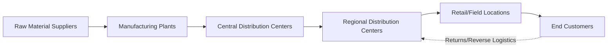
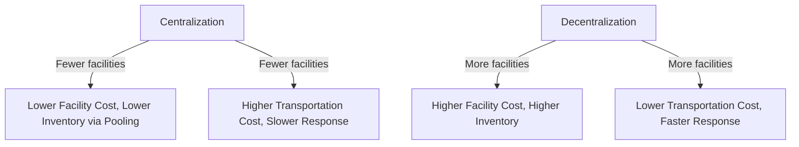

## Supply Chain Structure and Network Design

### Overview

Supply chain structure and network design refers to the strategic determination of the number, location, capacity, and configuration of facilities — suppliers, manufacturing plants, distribution centers, and retail/customer touchpoints — that together move materials and products from raw material sources to end customers. Network design decisions are among the most consequential and difficult-to-reverse decisions in supply chain management, since they involve significant capital investment and constrain operational flexibility for years after implementation.

### Supply Chain Network Components

**Key Points**

- **Tier 1, 2, 3 suppliers**: Tier 1 suppliers provide directly to the manufacturer; Tier 2 suppliers supply Tier 1 suppliers; this nested structure can extend many levels back through raw material extraction
- **Nodes** represent physical facilities (plants, warehouses, stores); **links/arcs** represent transportation flows connecting them
- The overall structure is often visualized as a network diagram, but in practice forms a complex, sometimes many-to-many web rather than a strictly linear chain — hence the more accurate but less intuitive term "supply network" is sometimes preferred over "supply chain"

### Strategic Network Design Decisions

**Facility Location**

Where to physically locate plants, warehouses, and distribution centers. Location decisions weigh:

- Proximity to raw materials or suppliers
- Proximity to customer markets (affecting delivery time and transportation cost)
- Labor availability and cost
- Infrastructure quality (transportation, utilities, telecommunications)
- Government incentives, taxation, and regulatory environment
- Currency and political risk (for international locations)

**Facility Capacity**

How much production or throughput capacity to build at each location, balancing economies of scale (larger facilities often have lower per-unit fixed cost) against the flexibility and risk-diversification benefits of smaller, more numerous, geographically distributed facilities.

**Number of Echelons (Network Tiers)**

How many distinct levels the network should have between plant and customer — for example, whether to use a single central distribution center or a two-tier structure with central and regional distribution centers (see Distribution Requirements Planning). Adding echelons generally increases responsiveness (goods positioned closer to customers) at the cost of additional inventory carrying cost and facility overhead across the network.

**Sourcing Strategy**

Whether to source from a single supplier per component/region (simplicity, potential volume discounts, but higher disruption risk) or multiple suppliers (redundancy and negotiating leverage, but higher coordination complexity and potentially higher per-unit cost).

### The Fundamental Network Design Trade-off

$$\text{Total Network Cost} = \text{Facility Fixed Cost} + \text{Inventory Carrying Cost} + \text{Transportation Cost} + \text{Responsiveness/Service Cost}$$

**Key Points**

- **Fewer, larger, more centralized facilities**: lower facility fixed cost per unit (economies of scale) and lower total inventory (risk pooling — see below), but higher transportation cost and longer delivery lead times to distant customers
- **More, smaller, more distributed facilities**: higher total facility fixed cost and typically higher aggregate inventory (less pooling benefit), but lower transportation cost and faster delivery/response times to nearby customers

### Risk Pooling

A central concept justifying centralization: combining (pooling) demand from multiple locations into a single facility reduces the relative variability of aggregate demand compared to the sum of variability at each individual location, because random demand fluctuations at different locations partially offset one another. This allows a centralized facility to hold less **total** safety stock than the sum of safety stock that would be required at multiple decentralized locations serving the same aggregate demand — a mathematical consequence of how variance combines across independent (or imperfectly correlated) demand streams.

$$\sigma_{\text{combined}} = \sqrt{\sigma_1^2 + \sigma_2^2 + \ldots + \sigma_n^2} \quad (\text{assuming independence})$$

Since $\sigma_{\text{combined}}$ grows only with the square root of the sum of variances (rather than linearly with the sum of individual standard deviations), pooling multiple independent demand streams reduces relative variability and the resulting safety stock requirement — this is the core statistical justification for centralized inventory positioning. [Inference — the magnitude of the pooling benefit depends heavily on the correlation between demand at different locations; if demand across locations is highly positively correlated, the pooling benefit diminishes substantially compared to the fully independent case assumed in the formula above.]

### Network Design Modeling Approaches

**Center of Gravity Method**

A simplified location technique that calculates an optimal single facility location by weighting candidate customer/supplier locations by their volume:

$$X_{\text{center}} = \frac{\sum_i (X_i \times W_i)}{\sum_i W_i} \qquad Y_{\text{center}} = \frac{\sum_i (Y_i \times W_i)}{\sum_i W_i}$$

Where $X_i, Y_i$ are the coordinates of demand point $i$ and $W_i$ is the volume/weight (e.g., demand quantity or shipping tonnage) associated with that point.

**Worked Example — Center of Gravity**

| Location | X-coordinate | Y-coordinate | Demand Volume |
| --- | --- | --- | --- |
| City A | 100 | 200 | 500 |
| City B | 300 | 100 | 300 |
| City C | 150 | 400 | 200 |

$$X_{\text{center}} = \frac{(100 \times 500) + (300 \times 300) + (150 \times 200)}{500+300+200} = \frac{50000+90000+30000}{1000} = \frac{170000}{1000} = 170$$

$$Y_{\text{center}} = \frac{(200 \times 500) + (100 \times 300) + (400 \times 200)}{1000} = \frac{100000+30000+80000}{1000} = \frac{210000}{1000} = 210$$

The suggested facility location is at coordinates (170, 210), minimizing aggregate weighted transportation distance across the three demand points under the method's straight-line distance assumption.

**Mixed-Integer Programming (Facility Location Models)**

More rigorous network design uses optimization models (e.g., the classic fixed-charge facility location problem) that simultaneously determine which facilities to open, their capacities, and the flow assignments between facilities and customers, minimizing total network cost subject to capacity, demand-satisfaction, and service-level constraints. These are typically solved with commercial optimization software given the combinatorial complexity of realistic network sizes.

**Simulation-Based Network Evaluation**

Discrete-event or Monte Carlo simulation can evaluate how a candidate network design performs under demand uncertainty, disruption scenarios, and variable lead times — complementing the more deterministic optimization approaches by testing robustness rather than only average-case cost.

### Push vs. Pull Network Positioning (Decoupling Point)

A key network design decision is the **decoupling point** — the point in the supply chain where production shifts from forecast-driven (push) to order-driven (pull).

| Strategy | Decoupling Point Position | Characteristic |
| --- | --- | --- |
| Make-to-Stock | Late — finished goods held in inventory | Fast delivery, higher finished-goods inventory risk |
| Assemble-to-Order | Middle — components/subassemblies held, final assembly on order | Balances responsiveness and inventory risk |
| Make-to-Order | Early — raw materials/components only held | Low finished-goods risk, longer customer lead time |
| Engineer-to-Order | Earliest — design begins only on order | Maximum customization, longest lead time |

Network design (specifically, where inventory is positioned and held across the network's echelons) is directly shaped by which of these strategies a company adopts for a given product line.

### Network Design and Globalization Considerations

**Key Points**

- **Total landed cost** (not just unit production cost) must guide global sourcing/location decisions — landed cost includes freight, duties/tariffs, currency risk, and inventory carrying cost associated with longer international lead times, which can offset apparent labor or production cost advantages
- **Reshoring/nearshoring trends**: some organizations have shifted network design toward geographically closer sourcing to reduce lead time risk and transportation cost volatility, trading off potentially higher unit production costs for improved responsiveness and reduced disruption exposure [Inference — the extent and permanence of such trends vary by industry and time period and should not be treated as a fixed, universal directional shift]
- **Trade agreements and tariffs** materially affect the relative cost attractiveness of different facility locations and must be periodically reassessed as trade policy evolves

### Network Resilience and Redundancy

Modern network design increasingly balances traditional cost-efficiency optimization against **resilience** — the network's ability to continue functioning or recover quickly after a disruption (natural disaster, supplier failure, geopolitical event, pandemic-related disruption).

**Key Points**

- **Single-sourcing** a critical component minimizes cost but creates a single point of failure; **dual or multi-sourcing** trades some cost efficiency for reduced disruption risk
- **Geographic diversification** of suppliers and facilities reduces the chance that a single regional event (natural disaster, political instability) disrupts the entire network simultaneously
- **Buffer inventory and capacity** positioned strategically within the network can absorb disruption shocks, though this directly trades against lean, low-inventory cost objectives
- Network resilience assessment increasingly uses **scenario planning and stress testing** to evaluate how a candidate network design would perform under specific disruption scenarios, rather than relying solely on average-case cost optimization

### Relationship to Operations Management

Supply chain network design provides the strategic physical structure within which the more operational/tactical techniques covered elsewhere in this course operate — Distribution Requirements Planning (DRP) plans replenishment flows through a network whose structure is determined here; MRP and capacity planning determine what happens within individual plant nodes of this broader network. Network design decisions set the constraints (facility locations, capacities, echelon structure) within which these operational planning techniques must subsequently work.

**Related Topics**

- Distribution Requirements Planning (DRP)
- Supplier selection and evaluation
- Inventory management and safety stock
- Total landed cost analysis
- Make-to-order vs. make-to-stock strategies
- Supply chain risk management and resilience
- Global sourcing and reshoring strategies