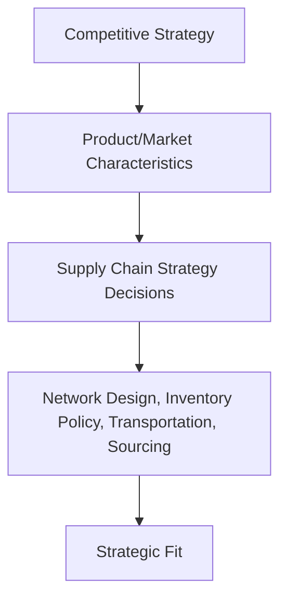
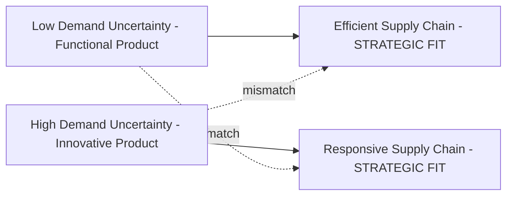
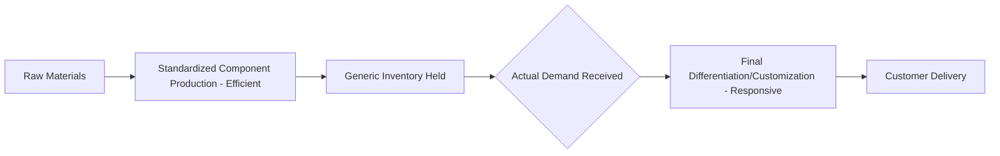

## Supply Chain Strategy and Alignment

### Overview

Supply chain strategy defines the overarching approach an organization takes to structure and operate its supply chain in support of its competitive strategy. Alignment refers to the critical requirement that the supply chain's strategic characteristics — efficiency, responsiveness, flexibility — genuinely match the nature of the product and the market it serves. A supply chain can be well-designed in isolation yet still fail if its fundamental orientation is mismatched with what the business and its customers actually need.

### Competitive Strategy and Supply Chain Strategy Linkage

A company's competitive strategy defines the set of customer needs it seeks to satisfy through its products and services (e.g., low cost, high customization, fast delivery, broad variety). Supply chain strategy must be derived from and support this competitive strategy — it is not developed independently.

### Demand Uncertainty and Supply Chain Responsiveness: The Core Framework

A foundational framework for supply chain strategy (most closely associated with the work of Marshall Fisher and later extended by Hau Lee) classifies products by their **demand uncertainty** and matches them to an appropriate supply chain orientation.

**Functional Products**

Products with stable, predictable demand, long life cycles, low profit margins, and low variety (e.g., staple grocery items, basic commodities).

**Innovative Products**

Products with unpredictable demand, short life cycles, high profit margins, and high variety (e.g., fashion apparel, new technology products, seasonal/trend-driven goods).

| Product Type | Demand Uncertainty | Appropriate Supply Chain Focus |
| --- | --- | --- |
| Functional | Low | Efficient (cost-minimizing) supply chain |
| Innovative | High | Responsive (flexibility/speed-oriented) supply chain |

### Efficient vs. Responsive Supply Chains

| Dimension | Efficient Supply Chain | Responsive Supply Chain |
| --- | --- | --- |
| Primary goal | Minimize cost | Respond quickly to demand, maximize service/flexibility |
| Manufacturing focus | High utilization, economies of scale | Flexible, excess buffer capacity |
| Inventory strategy | Minimize inventory to reduce cost | Maintain buffer inventory to guard against uncertainty |
| Lead time focus | Minimize lead time without increasing cost | Aggressively reduce lead time, even at added cost |
| Supplier selection criteria | Cost and quality | Speed, flexibility, quality |
| Product design approach | Maximize performance, minimize cost | Modular design enabling postponement/customization |

### The Strategic Fit Concept

**Key Points**

- **Strategic fit** exists when the supply chain's efficiency-responsiveness positioning matches the demand uncertainty characteristics of the product it serves
- A **mismatch** occurs when, for example, a highly innovative, uncertain-demand product is supported by a purely cost-minimizing, low-flexibility efficient supply chain (leading to stockouts, lost sales, and missed demand spikes), or conversely, when a stable, predictable functional product is supported by an unnecessarily expensive, over-flexible responsive supply chain (incurring cost the market does not require or reward)
- Achieving strategic fit is a **continuous process**, not a one-time decision — as products move through their life cycle (e.g., an innovative product's demand uncertainty typically decreases as it matures and its market becomes better understood), the appropriate supply chain positioning may need to evolve accordingly

### The Uncertainty Spectrum and Zone of Strategic Fit

Rather than a strict binary (efficient vs. responsive), most frameworks describe a **spectrum** of positioning, with the "zone of strategic fit" representing the range of supply chain responsiveness levels appropriate for a given level of implied demand uncertainty.

$$\text{Implied Uncertainty} \propto f(\text{Demand Variability, Lead Time Requirements, Service Level, Variety, Innovation Rate})$$

A company's actual supply chain positioning should fall within this zone; positioning too far toward efficiency for a given uncertainty level creates responsiveness gaps, while positioning too far toward responsiveness creates unnecessary cost.

### Postponement (Delayed Differentiation)

A key strategic technique for reconciling the efficiency-responsiveness tension: delaying product differentiation (customization, final configuration, or packaging) as late as possible in the supply chain, keeping upstream stages standardized and efficient while pushing variety-creating steps closer to the point of actual customer demand.

**Key Points**

- Standardized components/subassemblies can be produced efficiently in advance and held as generic inventory, while final differentiation (assembly, labeling, configuration) occurs only once actual demand is known, reducing the forecast risk associated with holding finished, differentiated inventory
- Classic examples include paint mixed to a specific color only at the retail point of sale, or electronics assembled to regional power/language specifications only after order receipt
- Postponement effectively shifts part of the supply chain toward efficiency (upstream, standardized) while preserving responsiveness (downstream, customized-on-demand) — reconciling the trade-off rather than forcing an all-or-nothing choice

### Drivers of Supply Chain Performance

Supply chain strategic fit is achieved and adjusted through decisions across several major performance drivers:

| Driver | Strategic Role |
| --- | --- |
| Facilities | Where production and storage occur; affects both efficiency (scale) and responsiveness (proximity to customer) |
| Inventory | Buffer against uncertainty; higher inventory increases responsiveness but increases cost |
| Transportation | Speed vs. cost trade-off in moving goods through the network |
| Information | Enables better demand visibility and coordination, reducing the need for physical buffers (inventory) to manage uncertainty |
| Sourcing | Determines which functions are performed by whom, affecting both cost structure and flexibility |
| Pricing | Can be used to shape/shift demand patterns, indirectly influencing required supply chain responsiveness |

**Key Points**

- Improved **information sharing** across supply chain partners can substitute for physical inventory buffers as a way to manage uncertainty — better demand visibility upstream reduces the need for safety stock to guard against that same uncertainty (see also the Bullwhip Effect)
- These drivers must be adjusted **jointly and consistently** with the target level of responsiveness — for example, a responsive strategy typically requires decisions across facilities (flexible, possibly more numerous), inventory (higher buffers), transportation (faster, often more expensive modes), and sourcing (flexible, possibly multiple suppliers) that are mutually reinforcing rather than adopted in isolation

### Worked Example — Strategic Fit Assessment

| Company/Product Scenario | Demand Uncertainty | Current Supply Chain Orientation | Assessment |
| --- | --- | --- | --- |
| Commodity grocery staple | Low | Lean, cost-minimized, high-volume distribution | Good fit |
| Fast-fashion apparel line | High | Long lead-time, low-cost overseas sourcing only | Mismatch — likely lost sales from inability to respond to trend shifts |
| New consumer electronics launch | High | Flexible manufacturing, air freight capability, buffer inventory | Good fit |
| Mature commodity electronics component | Low (post-maturity) | Still using premium air freight established during launch phase | Mismatch — likely excess cost relative to now-low uncertainty |

The last example illustrates that strategic fit must be **periodically reassessed** as a product matures — a supply chain strategy appropriate at product launch (high uncertainty, responsive orientation) can become misaligned and unnecessarily costly once the product matures and its demand becomes predictable.

### Supply Chain Strategy and the Bullwhip Effect

Poor alignment and lack of information sharing across supply chain tiers can produce the **bullwhip effect** — the amplification of demand variability as orders move upstream through the supply chain, where small fluctuations in end-customer demand produce increasingly exaggerated order swings at each successive upstream tier (distributor, manufacturer, supplier). This phenomenon is a direct consequence of poor strategic alignment and information flow, and mitigating it (through better information sharing, shorter lead times, stable pricing/promotion practices, and collaborative forecasting) is a core objective of coherent supply chain strategy design.

### Relationship to Operations Management

Supply chain strategy and alignment provides the conceptual foundation that determines *how* the network design, inventory policy, and distribution planning techniques covered elsewhere in this chapter should actually be configured for a specific business — a network design or DRP implementation that is technically well-executed but built for the wrong strategic orientation (efficient when responsive is needed, or vice versa) will underperform regardless of its operational execution quality. Establishing strategic fit is therefore a prerequisite consideration that should precede detailed network design and operational planning decisions.

**Related Topics**

- Supply chain structure and network design
- Distribution Requirements Planning (DRP)
- Bullwhip effect and information sharing
- Postponement and mass customization strategies
- Demand forecasting and uncertainty management
- Make-to-order vs. make-to-stock strategies
- Supplier relationship management