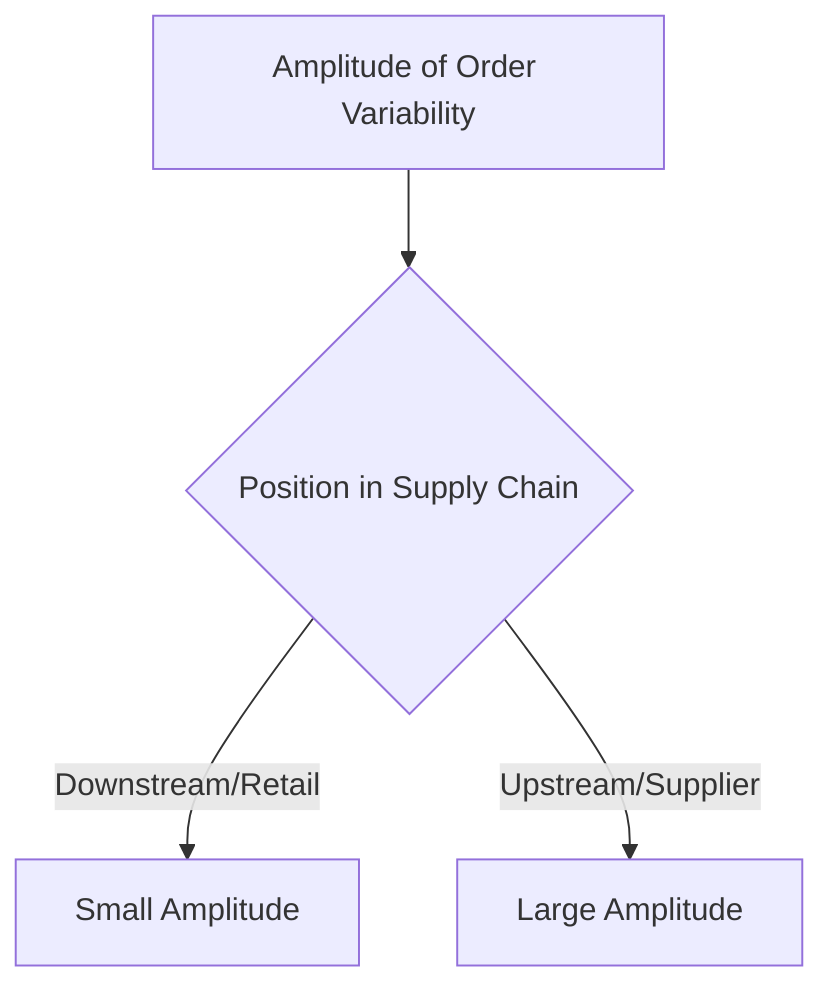
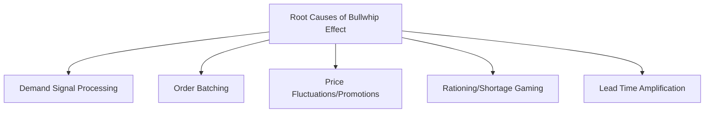
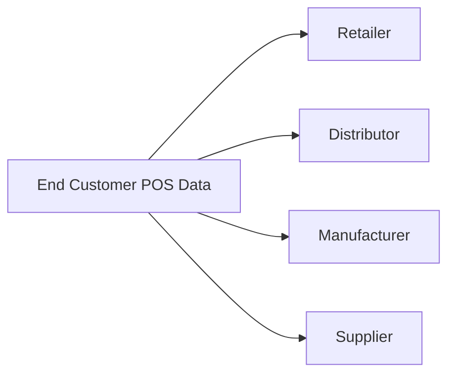

## The Bullwhip Effect and Mitigation

### Overview

The bullwhip effect describes the phenomenon in which small fluctuations in end-customer demand become progressively amplified into much larger swings in orders as information moves upstream through a supply chain — from retailer to distributor to manufacturer to raw material supplier. The name derives from the visual analogy of a whip: a small flick of the wrist at one end (the handle, representing end-customer demand) produces a much larger, more violent motion at the far end (the tip, representing upstream orders). The effect was formally studied and popularized through analysis of Procter & Gamble's diaper supply chain and subsequent MIT Beer Game simulations, which demonstrated the effect arises from structural and behavioral causes inherent to multi-tier supply chains rather than requiring any actual increase in true end-customer demand variability.

### Visualizing the Effect

### Illustrative Worked Example

Suppose actual end-customer weekly demand for a product fluctuates only modestly around an average of 100 units:

| Week | Customer Demand | Retailer Order (with buffer/rounding) | Distributor Order (batching to distributor) | Manufacturer Order (batching + lead-time buffer) |
| --- | --- | --- | --- | --- |
| 1 | 95 | 100 | 100 | 100 |
| 2 | 110 | 130 | 150 | 200 |
| 3 | 90 | 60 | 20 | 0 |
| 4 | 105 | 130 | 150 | 200 |

Even though customer demand varies only between roughly 90 and 110 units (a modest ±10% range), the manufacturer's order swings between 0 and 200 units — a vastly amplified range — despite the underlying true demand pattern being relatively stable. This illustrates the core bullwhip phenomenon: variability compounds and grows at each successive upstream tier, even without any genuine increase in the underlying customer demand volatility.

### Root Causes of the Bullwhip Effect

**Demand Signal Processing (Forecast Updating)**

Each tier in the supply chain forecasts its own future orders based on the orders it receives from the tier immediately downstream, rather than on true end-customer demand. When a downstream tier's order increases, the upstream tier interprets this as a signal of rising demand and adjusts its own order upward — often overreacting because the incoming order already reflects the downstream tier's own buffer and safety stock adjustments, compounding the signal at each step.

**Order Batching**

Downstream tiers often place orders in batches (e.g., weekly, monthly, or in fixed lot sizes) rather than continuously, to reduce ordering and transportation costs. This batching converts a relatively smooth, continuous customer demand stream into a lumpy, intermittent order pattern that appears far more variable to the upstream supplier than the underlying demand actually is.

**Price Fluctuations and Promotions**

Trade promotions, volume discounts, and periodic price reductions encourage customers and retailers to buy in advance of anticipated need ("forward buying"), creating artificial demand spikes around promotional periods followed by troughs in subsequent periods as accumulated inventory is worked down — variability that has nothing to do with true underlying consumption patterns.

**Rationing and Shortage Gaming**

When a supplier faces a shortage and rations available product proportionally to orders received, downstream customers learn to inflate their orders artificially during anticipated shortage periods to secure a larger allocation, further distorting the true demand signal the supplier observes — sometimes called the "shortage gaming" behavior.

**Lead Time Amplification**

Longer lead times require larger safety stock buffers to protect against the same relative level of demand uncertainty (since more demand variability must be absorbed during a longer replenishment cycle). Longer lead times therefore amplify the sensitivity of order quantities to any given change in perceived demand, compounding the other causes above.

$$\text{Safety Stock} \propto \sigma_{\text{demand}} \times \sqrt{\text{Lead Time}}$$

This relationship shows why longer lead times mechanically increase the safety stock (and therefore order size sensitivity) required to maintain a given service level, independent of any behavioral cause.

### Consequences of the Bullwhip Effect

**Key Points**

- **Excess inventory** across the supply chain as upstream tiers overbuild safety stock in response to amplified, misleading order signals
- **Poor customer service** during actual demand spikes, since capacity and inventory planning based on distorted upstream signals may not align well with true end-customer needs when it matters most
- **Inefficient production scheduling**, with manufacturers experiencing exaggerated swings between overtime/expedited production and idle capacity, driving higher unit costs than a stable production rate would require
- **Increased transportation costs** from expediting shipments during perceived shortages and inefficient shipment sizes during perceived surpluses
- **Reduced forecast accuracy** at upstream tiers, since the order data they use as their forecasting input is itself distorted by the amplification occurring at each downstream tier

### Mitigation Strategies

**Information Sharing**

Sharing actual point-of-sale (POS) and end-customer demand data directly with upstream supply chain partners, rather than relying solely on the orders passed between adjacent tiers, allows every tier to forecast based on true demand rather than a distorted derivative signal.

**Vendor-Managed Inventory (VMI)**

The supplier takes direct responsibility for managing and replenishing inventory at the customer's location, using the customer's actual consumption/sales data rather than waiting for the customer to place discrete orders — directly eliminating the demand-signal-processing distortion that occurs when orders (rather than raw consumption data) are the only visible signal.

**Reducing Order Batch Sizes**

Encouraging smaller, more frequent order quantities (enabled by reduced ordering costs through EDI/electronic ordering systems, or reduced transportation costs through consolidated/mixed-load shipments) smooths the order pattern seen by upstream tiers, reducing the lumpiness that order batching otherwise introduces.

**Stabilizing Pricing (Everyday Low Pricing)**

Reducing the frequency and magnitude of trade promotions and price fluctuations (an "everyday low price" strategy rather than periodic deep discounting) reduces forward-buying behavior and the resulting artificial demand spikes and troughs.

**Eliminating Shortage Gaming**

Allocating scarce product based on historical actual sales/usage patterns rather than proportional to current order size removes the incentive for customers to inflate orders artificially during anticipated shortage periods.

**Lead Time Reduction**

Shortening replenishment lead times throughout the supply chain reduces the safety stock amplification effect mathematically driven by the $\sqrt{\text{Lead Time}}$ relationship above, directly dampening the bullwhip amplification mechanism tied to lead time.

**Collaborative Planning, Forecasting, and Replenishment (CPFR)**

A structured, formal process in which supply chain partners jointly develop a single shared demand forecast and replenishment plan, rather than each tier independently forecasting based on the signals it receives from its immediate neighbor — directly targeting the demand-signal-processing root cause through coordinated planning rather than isolated, sequential forecasting.

### Mitigation Strategy Summary

| Root Cause | Primary Mitigation |
| --- | --- |
| Demand signal processing | Shared POS/demand data, CPFR |
| Order batching | Smaller/more frequent orders, EDI, consolidated shipping |
| Price fluctuations/promotions | Everyday low pricing, promotion frequency reduction |
| Rationing/shortage gaming | Allocation based on historical usage, not current order size |
| Lead time amplification | Lead time reduction initiatives |

### Illustration: Order Variability Amplification Across Tiers (svg_diagram)

<svg xmlns="http://www.w3.org/2000/svg" viewBox="0 0 640 260">
<text x="20" y="25" font-size="16" font-weight="bold">Bullwhip Amplitude Growth Across Supply Chain Tiers (svg_diagram)</text>
<line x1="50" y1="220" x2="600" y2="220" stroke="black" stroke-width="2" />
<polyline points="60,150 100,145 140,155 180,148 220,152" fill="none" stroke="green" stroke-width="2" />
<text x="60" y="130" font-size="10" fill="green">Customer Demand</text>
<polyline points="230,170 270,120 310,180 350,110 390,190" fill="none" stroke="orange" stroke-width="2" />
<text x="230" y="100" font-size="10" fill="orange">Retailer Orders</text>
<polyline points="400,200 440,80 480,210 520,60 560,215" fill="none" stroke="red" stroke-width="2" />
<text x="400" y="55" font-size="10" fill="red">Manufacturer Orders</text>
</svg>

### Relationship to Operations Management

The bullwhip effect provides the behavioral and structural explanation for why supply chain strategy and alignment, distribution requirements planning, and network design decisions covered elsewhere in this chapter must explicitly account for information flow, not just physical material flow. DRP's time-phased, network-wide visibility approach directly counters one dimension of the bullwhip problem by making true downstream requirements visible upstream rather than relying purely on independent reorder signals at each node; similarly, supply chain strategy's emphasis on information sharing as a driver reflects the same underlying insight that better information reduces the physical inventory buffers otherwise needed to absorb amplified, distorted demand signals.

**Related Topics**

- Distribution Requirements Planning (DRP)
- Supply chain strategy and alignment
- Vendor-Managed Inventory (VMI)
- Collaborative Planning, Forecasting, and Replenishment (CPFR)
- Demand forecasting techniques
- Safety stock determination methods
- Supply chain structure and network design