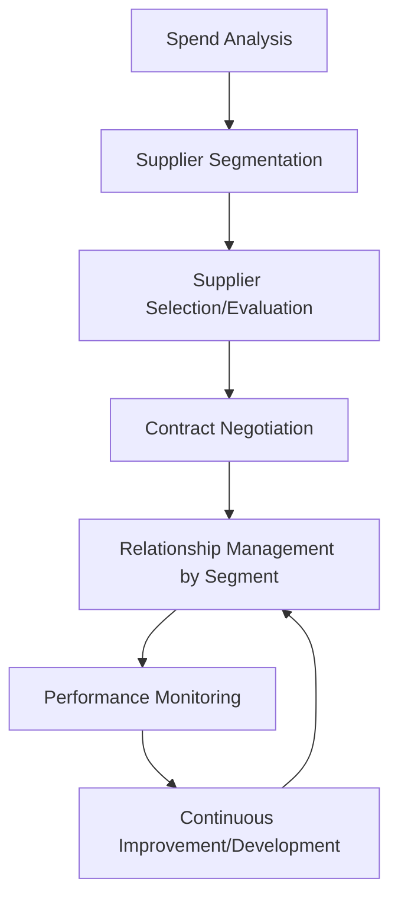
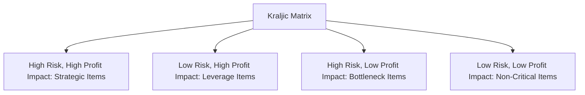

## Supplier Relationship Management

### Overview

Supplier Relationship Management (SRM) is the systematic approach to evaluating, developing, and managing interactions with suppliers, with the goal of maximizing the value derived from those relationships while managing associated risks. SRM extends beyond transactional purchasing to encompass strategic segmentation of the supply base, collaborative development activities, and ongoing performance management, recognizing that different suppliers warrant fundamentally different management approaches depending on their strategic importance and the risk they represent.

### SRM in the Broader Procurement Process

### Supplier Segmentation: The Kraljic Matrix

A foundational framework for segmenting suppliers/purchased items, classifying them along two dimensions: **profit impact** (or supply value) and **supply risk** (complexity/scarcity of the supply market).

| Quadrant | Characteristics | Recommended Approach |
| --- | --- | --- |
| Strategic Items | High profit impact, high supply risk | Deep, collaborative partnership; joint development; long-term contracts |
| Leverage Items | High profit impact, low supply risk | Competitive bidding; leverage purchasing volume for best price/terms |
| Bottleneck Items | Low profit impact, high supply risk | Ensure supply continuity; qualify alternative sources; hold buffer stock |
| Non-Critical Items | Low profit impact, low supply risk | Simplify/automate procurement (e.g., purchasing cards, e-procurement); minimize administrative effort |

**Key Points**

- The matrix explicitly rejects a one-size-fits-all supplier management approach — a supplier of a low-value, easily substitutable item should not receive the same relationship investment as a supplier of a critical, hard-to-source strategic component
- Positioning within the matrix can shift over time as market conditions, technology, and the item's role in the business change, requiring periodic reassessment rather than a one-time classification

### Supplier Selection and Evaluation Criteria

**Key Points**

- **Cost/Price**: total cost of ownership, not just unit purchase price — including transportation, quality-related costs, and inventory carrying costs associated with the supplier's typical lead time and reliability
- **Quality**: historical defect rates, certifications (e.g., ISO 9001), quality management system maturity
- **Delivery reliability**: on-time delivery performance, lead time consistency, flexibility to accommodate demand changes
- **Financial stability**: supplier's financial health, since a financially distressed supplier represents a significant continuity risk regardless of current performance
- **Capacity and scalability**: whether the supplier can grow with the buyer's future volume needs
- **Technical/innovation capability**: particularly relevant for strategic items, where a supplier's R&D and engineering capability can contribute to the buyer's own product development
- **Sustainability and compliance**: environmental practices, labor standards, and regulatory compliance, increasingly weighted in supplier evaluation frameworks

### Weighted Scoring Model for Supplier Evaluation

A common quantitative evaluation approach assigns weights to criteria based on their relative importance, then scores each candidate supplier against each criterion.

**Worked Example**

| Criterion | Weight | Supplier A Score (1-10) | Supplier A Weighted | Supplier B Score (1-10) | Supplier B Weighted |
| --- | --- | --- | --- | --- | --- |
| Price | 0.30 | 7 | 2.10 | 9 | 2.70 |
| Quality | 0.30 | 9 | 2.70 | 6 | 1.80 |
| Delivery Reliability | 0.25 | 8 | 2.00 | 7 | 1.75 |
| Financial Stability | 0.15 | 9 | 1.35 | 5 | 0.75 |
| **Total** | 1.00 |  | **8.15** |  | **7.00** |

Despite Supplier B offering a better price score, Supplier A's higher total weighted score (8.15 vs. 7.00) reflects its stronger overall performance across quality, delivery reliability, and financial stability — illustrating why price-only comparison can favor an option that scores worse when evaluated holistically.

### Supplier Relationship Types Across a Spectrum

| Relationship Type | Characteristics | Typical Use Case |
| --- | --- | --- |
| Transactional/Arm's-Length | Short-term, price-focused, minimal ongoing engagement | Non-critical, readily substitutable items |
| Preferred Supplier | Ongoing relationship, some collaboration, but not deeply integrated | Leverage items with a track record of good performance |
| Strategic Partnership | Deep collaboration, shared risk/reward, joint development, information sharing, often long-term contracts | Strategic items critical to competitive advantage |
| Vertical Integration/Ownership | Buyer owns or controls the supplying entity directly | Extremely critical inputs where market-based relationships carry unacceptable risk |

### Supplier Development

For strategic and bottleneck suppliers, buyers may proactively invest in **supplier development** — working directly with a supplier to improve their capability, quality, or capacity rather than simply switching to an alternative source.

**Key Points**

- Common activities include joint process improvement projects, technical training, capital or equipment investment support, and embedding buyer personnel at the supplier's facility
- Supplier development is most justified for strategic items where switching suppliers carries high cost or risk, and where the potential improvement benefit clearly outweighs the investment of buyer resources into a third-party's operations
- Requires a genuine collaborative relationship and mutual trust, since it involves the buyer sharing information, expertise, and sometimes capital with an external organization

### Performance Monitoring and Scorecards

Ongoing supplier performance is typically tracked through a **supplier scorecard**, combining quantitative and qualitative measures across the same categories used in initial selection.

| Metric Category | Example Metrics |
| --- | --- |
| Quality | Defect rate (PPM), first-pass yield, corrective action responsiveness |
| Delivery | On-time delivery percentage, order fill rate, lead time variability |
| Cost | Price competitiveness/trend, cost reduction contribution over time |
| Responsiveness | Communication quality, flexibility to expedite or adjust orders |
| Risk/Compliance | Audit results, regulatory compliance status, financial health indicators |

$$\text{On-Time Delivery Rate} = \frac{\text{Orders Delivered On Time}}{\text{Total Orders}} \times 100\%$$

Regular scorecard review (often quarterly or annually depending on the criticality of the supplier) supports both relationship management conversations and, where necessary, decisions to adjust sourcing strategy.

### Risk Management in Supplier Relationships

**Key Points**

- **Single-source risk**: relying on one supplier for a critical item creates vulnerability to disruption from that supplier's own operational, financial, or geopolitical issues; qualifying alternate sources (dual/multi-sourcing) mitigates this at some cost to the leverage/economies-of-scale benefit of consolidated volume
- **Supplier financial health monitoring**: ongoing tracking of a critical supplier's financial condition provides early warning of potential supply continuity risk before an actual disruption occurs
- **Geographic/geopolitical risk**: dependence on suppliers concentrated in a single region exposes the buyer to correlated disruption risk from natural disasters, political instability, or trade policy changes affecting that region
- **Contractual risk mitigation**: service level agreements (SLAs), penalty clauses for non-performance, and force majeure provisions define the formal risk-sharing arrangement between buyer and supplier

### Technology in SRM

Modern SRM is typically supported by dedicated software modules (often integrated within or connected to the ERP system) that provide:

- Centralized supplier master data and qualification/certification tracking
- Automated scorecard generation from transactional (delivery, quality) data
- Collaborative portals for shared forecasting, order status visibility, and document exchange
- Supplier risk monitoring, sometimes incorporating third-party financial and geopolitical risk data feeds

[Unverified — specific SRM software features, vendor offerings, and integration patterns vary considerably and change over time; current vendor documentation should be consulted for implementation-specific details.]

### SRM and Total Cost of Ownership

**Key Points**

- Evaluating suppliers purely on unit purchase price frequently misrepresents the true cost of a sourcing decision — a lower-priced supplier with poor quality or unreliable delivery can generate substantially higher downstream costs (rework, expediting, safety stock, production disruption) than a higher-priced but more reliable alternative
- **Total Cost of Ownership (TCO)** analysis attempts to capture this full cost picture, incorporating price, quality-related costs, delivery-related costs, and administrative/relationship management costs into a single comparative basis

$$TCO = \text{Purchase Price} + \text{Quality Costs} + \text{Delivery/Logistics Costs} + \text{Administrative Costs} + \text{Risk-Adjusted Contingency Costs}$$

### Relationship to Operations Management

Supplier relationship management directly supports the effective execution of MRP and DRP by ensuring that the material availability and lead-time assumptions those planning systems depend on are reliable in practice — a well-managed strategic supplier relationship reduces the lead-time variability and supply risk that would otherwise force larger safety stock buffers throughout the planning system. SRM segmentation logic (Kraljic Matrix) also directly informs supply chain network design and sourcing strategy decisions, connecting supplier-level relationship management to the broader strategic network structure of the organization's supply chain.

**Related Topics**

- Supply chain structure and network design
- Supply chain strategy and alignment
- Material Requirements Planning (MRP) fundamentals
- The bullwhip effect and mitigation
- Total Cost of Ownership (TCO) analysis
- Vendor-Managed Inventory (VMI)
- Supply chain risk management and resilience