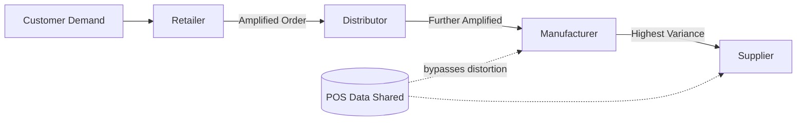
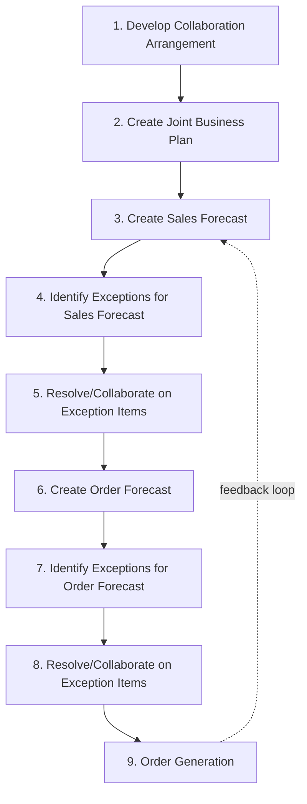
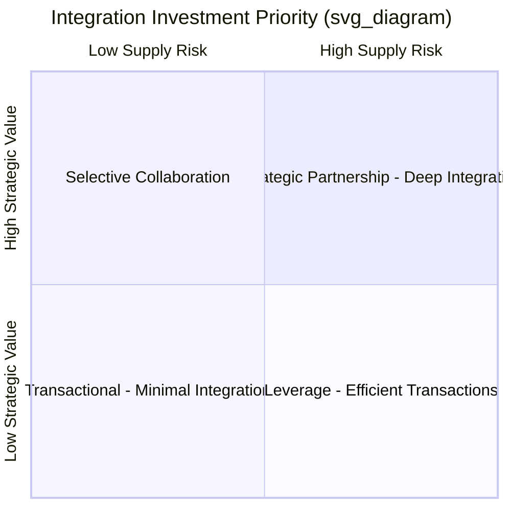

## Supply Chain Integration and Collaboration

### Definition and Scope

Supply chain integration is the degree to which a firm strategically collaborates with its supply chain partners and manages intra- and inter-organizational processes to achieve effective and efficient flows of products, services, information, money, and decisions, with the objective of providing maximum value to the end customer at low cost and high speed. It spans three primary dimensions:

- **Internal integration** — cross-functional coordination between procurement, operations, logistics, marketing, and finance within a single firm
- **Supplier (upstream) integration** — collaborative relationships with tier-1 and tier-n suppliers
- **Customer (downstream) integration** — collaborative relationships with distributors, retailers, and end customers

**Key Points**

- Integration is a continuum, not a binary state — firms range from arm's-length transactional relationships to deep strategic partnerships
- Higher integration generally correlates with improved performance, but also raises coordination costs and dependency risk
- Integration must be selective; not every supplier or customer relationship warrants the same investment (see segmentation under Kraljic-style portfolio approaches)

---

### The Bullwhip Effect as the Core Motivating Problem

A central rationale for integration is mitigating the **bullwhip effect** — the amplification of demand variability as orders move upstream through the supply chain.

$$\text{Var}(Q_i) \geq \text{Var}(D)$$

where $Q_i$ is the order variance at echelon $i$ and $D$ is end-customer demand variance, with variance typically increasing as $i$ increases (moving upstream).

Four documented causes:

1. **Demand signal processing** — each echelon updates forecasts based on immediate downstream orders rather than true demand, over-reacting to noise
2. **Order batching** — economies of scale in ordering (EOQ, truckload consolidation) cause lumpy rather than smooth orders
3. **Price fluctuations** — trade promotions and forward buying cause demand to be pulled forward artificially
4. **Rationing and shortage gaming** — when supply is constrained, buyers inflate orders anticipating rationing, then cancel

Integration and information sharing directly counteract causes 1 and 4 by giving upstream echelons visibility into actual point-of-sale (POS) demand rather than distorted order signals.

---

### Levels and Mechanisms of Integration

#### 1. Information Integration

Sharing data across organizational boundaries to reduce information asymmetry.

- **Point-of-sale (POS) data sharing** — retailers expose real-time sell-through data to upstream partners
- **Demand forecasts and production schedules** — shared via EDI (Electronic Data Interchange), APIs, or portals
- **Inventory visibility** — real-time stock levels visible across echelons
- **Order status and shipment tracking** — ASN (Advance Shipping Notice), EDI 856

#### 2. Coordination/Process Integration

Jointly managed business processes rather than independently optimized silos.

- **Vendor-Managed Inventory (VMI)** — the supplier monitors the customer's inventory levels (via shared data feeds) and makes replenishment decisions on the customer's behalf, subject to agreed min/max thresholds
- **Continuous Replenishment Programs (CRP)** — automatic, frequent replenishment triggered by actual usage/POS data rather than periodic manual reorders
- **Collaborative Planning, Forecasting, and Replenishment (CPFR)** — a structured, multi-step process (endorsed by VICS/GS1) in which trading partners jointly develop a single shared forecast and exception-based collaboration around it
- **Co-managed inventory** — a hybrid where both parties jointly own replenishment decisions

#### 3. Relational/Organizational Integration

Structural and behavioral mechanisms that sustain long-term collaboration.

- Cross-functional and cross-firm teams (e.g., joint S&OP — Sales and Operations Planning — meetings)
- Shared performance metrics and gain-sharing contracts
- Long-term contracts and relationship-specific investments (e.g., dedicated tooling, co-located staff)
- Trust-building governance mechanisms (transparent cost structures, joint problem-solving forums)

---

### CPFR Process Model (Nine-Step VICS Framework)

The process is deliberately **exception-based**: partners only intervene manually when forecasts diverge beyond a pre-agreed tolerance band (e.g., ±20%), which keeps the collaboration scalable across thousands of SKUs.

---

### Vendor-Managed Inventory: Mechanics and Example

**Example**

A beverage manufacturer supplies a regional grocery chain under VMI. The retailer shares daily POS and current on-hand inventory via EDI. The manufacturer's planning system compares on-hand stock against an agreed min/max band per SKU per store:

$$\text{Reorder Trigger: } I_t \leq s \implies Q_{order} = S - I_t$$

where $I_t$ is current inventory, $s$ is the reorder point (min), and $S$ is the order-up-to level (max).

Benefits realized:

- Retailer eliminates manual reordering labor and reduces stockouts
- Manufacturer gains demand visibility, smooths production, and reduces the bullwhip effect at its own echelon
- Both parties typically see inventory reduction of 15–30% [Inference — magnitude is context-dependent and varies by industry, SKU velocity, and baseline process maturity; commonly cited in supply chain literature but not universally guaranteed]

**Trade-offs**

- Supplier bears increased planning burden and working-capital risk
- Requires significant trust and data-sharing infrastructure investment
- Contractual clarity needed on service-level agreements (fill rate, stockout penalties) since the retailer cedes control

---

### Technology Enablers

| Mechanism | Primary Function | Typical Standard/Protocol |
| --- | --- | --- |
| EDI | Structured transactional data exchange (POs, invoices, ASNs) | ANSI X12, EDIFACT |
| API/Web Services | Real-time, flexible data integration | REST, SOAP |
| ERP Systems | Internal process integration, single data backbone | SAP, Oracle |
| Supply Chain Control Towers | End-to-end visibility dashboard across partners | Varies by vendor |
| Blockchain (emerging) | Immutable, shared transaction ledger for provenance/traceability | Hyperledger, Ethereum-based |
| IoT/RFID | Real-time physical asset and inventory tracking | EPCglobal, GS1 standards |

[Unverified] Blockchain adoption for mainstream supply chain integration remains largely pilot-stage in most industries as of general industry reporting; claims of widespread production deployment should be treated with caution and verified against current sources for any specific industry claim.

---

### Barriers to Integration

- **Information asymmetry and distrust** — fear that shared data will be used opportunistically (e.g., to negotiate harder on price)
- **Incompatible IT systems** — legacy ERP/EDI mismatches raising integration costs
- **Misaligned incentives** — functional silos measured on local KPIs (e.g., purchasing rewarded for unit cost, not total landed cost) that conflict with system-wide optimization
- **Power asymmetry** — dominant channel members (e.g., large retailers) may impose integration demands unilaterally without reciprocal investment
- **Cultural and organizational differences** — especially in cross-border or cross-industry partnerships

---

### Measuring Integration Performance

Common metrics used to evaluate the effectiveness of integration initiatives:

- **Perfect Order Rate** — percentage of orders delivered complete, on time, undamaged, and correctly invoiced
- **Cash-to-Cash Cycle Time** — $\text{DIO} + \text{DSO} - \text{DPO}$ (Days Inventory Outstanding + Days Sales Outstanding − Days Payables Outstanding), where shorter cycles often indicate tighter coordination
- **Forecast Accuracy / MAPE** (Mean Absolute Percentage Error) between collaborative forecast and actual demand
- **Inventory turns** across the extended supply chain, not just within one firm
- **Fill rate** and **stockout frequency** at the point of collaboration

---

### Strategic Framework: When to Integrate

Not all relationships justify deep integration. A simplified decision lens based on supply risk and relationship value:

High strategic value + high supply risk items (e.g., custom components, sole-sourced materials) justify CPFR, VMI, and joint planning investments. Low-value, low-risk (commodity) items are typically managed through efficient transactional processes rather than deep integration, since the coordination cost outweighs the benefit.

---

### Common Pitfalls

- Treating integration as a one-time IT project rather than an ongoing relational process
- Sharing data without redesigning decision rights and processes around it (data visibility alone does not eliminate the bullwhip effect if planning logic isn't also changed)
- Applying uniform integration intensity across all suppliers/customers regardless of strategic importance
- Underestimating the organizational change management required for cross-functional S&OP adoption

---

**Related Topics**

- Bullwhip effect quantification and mitigation strategies
- Sales and Operations Planning (S&OP) processes
- Supplier relationship management and Kraljic portfolio matrix
- Enterprise Resource Planning (ERP) system architecture
- Supply chain risk management and resilience
- Digital supply chain twins and control towers
- Contract design and incentive alignment in supply chains (revenue-sharing, buyback contracts)
- Total Cost of Ownership (TCO) analysis