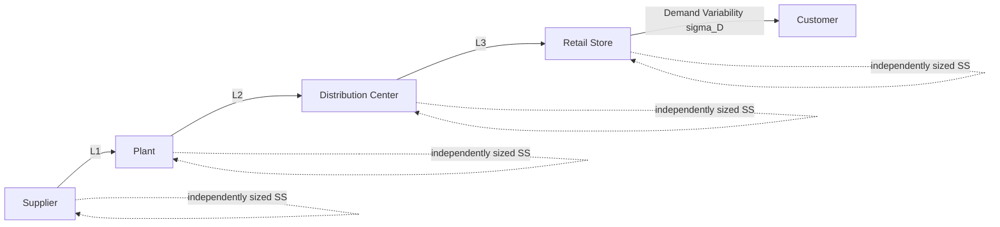
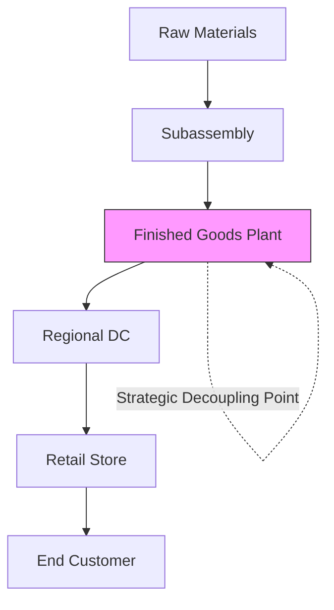
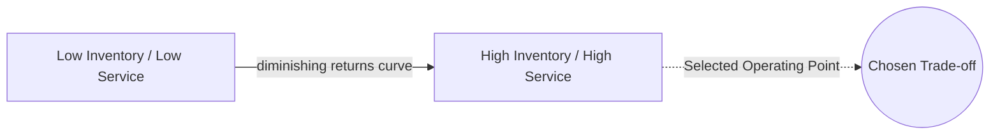

## Multi-Echelon Inventory Optimization

### Definition and Scope

Multi-Echelon Inventory Optimization (MEIO) is the practice of setting inventory targets (safety stock, reorder points, order-up-to levels) **simultaneously across multiple interconnected stages** of a supply chain — e.g., suppliers, plants, distribution centers, and retail locations — rather than optimizing each stage independently. It explicitly accounts for the network structure, lead-time dependencies, and demand/supply variability propagation between echelons.

$$\text{Total Network Inventory Cost} = \sum_{e=1}^{E} \left[ h_e I_e + \pi_e B_e \right]$$

where $E$ is the number of echelons, $h_e$ is holding cost, $I_e$ is inventory level, $\pi_e$ is shortage/backorder penalty, and $B_e$ is backorders at echelon $e$ — minimized jointly rather than echelon-by-echelon.

**Key Points**

- Single-echelon (local) optimization treats each stage's demand as independent and ignores that downstream stockouts and orders are the actual demand signal for upstream stages
- MEIO explicitly models how variability, lead times, and service levels compound as you move from customer-facing echelons back to raw material suppliers
- The goal is to decide **where** in the network safety stock should be held (strategic stock positioning) to achieve target service levels at minimum total cost

---

### Why Single-Echelon Optimization Fails

Independently setting safety stock at each node using classical formulas:

$$SS_e = z \cdot \sigma_{D_e} \cdot \sqrt{L_e}$$

(where $z$ is the service level factor, $\sigma_{D_e}$ is demand standard deviation, $L_e$ is lead time) leads to double-counting of safety stock across echelons, because each echelon buffers against variability that a downstream or upstream echelon is already buffering against. This results in:

- Excess total network inventory (redundant safety stock at multiple tiers)
- Suboptimal service levels despite high inventory investment
- Amplification of the bullwhip effect, since each echelon reacts to distorted order variance rather than true end demand

---

### Core Theoretical Foundations

#### 1. Guaranteed Service Model (GSM)

Assumes each stage guarantees a service time to its downstream customer regardless of upstream variability, provided demand stays within a bounded range. Developed originally by Simpson (1958) and extended by Graves and Willems.

- Each stage $j$ has a **net replenishment time** $NRT_j = SI_j + T_j - S_j$, where $SI_j$ is inbound service time from suppliers, $T_j$ is processing/replenishment lead time, and $S_j$ is the outbound service time promised downstream
- Safety stock at stage $j$:

$$SS_j = z \cdot \sigma_j \cdot \sqrt{NRT_j}$$

- The optimization problem is to choose $S_j$ (service times) across the network to minimize total safety stock cost while satisfying $S_j \geq 0$ and end-customer service time commitments
- This is typically solved as a dynamic program over the supply chain's Bill-of-Materials/network graph (Graves-Willems algorithm)

#### 2. Stochastic Service Model (SSM)

Does not assume bounded demand; instead models each echelon's stockout/backorder probability probabilistically, propagating variability using recursive convolution or approximations (e.g., Clark-Scarf model, 1960). More mathematically rigorous for genuinely unbounded demand but computationally harder to scale across large networks.

- The classic **Clark-Scarf serial system** result shows that an echelon base-stock policy is optimal for a serial (linear chain) multi-echelon system under periodic review
- Extending exact optimality results to general (non-serial, arborescent/network) topologies is analytically intractable in most practical cases, so heuristics and simulation are used in practice [Inference — this reflects long-standing operations research literature; specific solver claims should be verified against current vendor documentation]

**Key Points**

- GSM is more tractable and widely used in commercial MEIO software due to computational scalability
- SSM better reflects real-world unbounded/uncapped demand variability but is harder to scale to large SKU networks
- Most enterprise MEIO tools (e.g., SAP IBP, o9, Blue Yonder, Kinaxis) use GSM or hybrid approximations rather than pure SSM

---

### The Strategic Safety Stock Placement Problem

A central output of MEIO is deciding **which nodes** in the network should hold decoupling/safety stock, not just how much.

Placing safety stock further downstream (closer to the customer) improves responsiveness but multiplies holding cost (value-added is higher). Placing it upstream (raw materials, common components) is cheaper per unit but risks longer response times. The GSM/SSM optimization identifies the cost-minimizing placement given the network's lead times, demand variability, and holding cost gradient (which typically increases downstream due to accumulated value).

**Example**

A consumer electronics manufacturer sources a common circuit board used in three different final products. Holding safety stock of the *finished products* downstream requires triple the buffer (one per SKU variant) to hedge the same variability. Holding safety stock of the *common circuit board* upstream — and postponing final configuration until closer to actual demand (a form of **postponement**) — achieves the same service level with substantially less total inventory, because variability pooling reduces the required buffer:

$$\sigma_{pooled} = \sqrt{\sum_{i=1}^{n} \sigma_i^2} < \sum_{i=1}^{n} \sigma_i \quad \text{(assuming imperfect correlation)}$$

---

### Key Inputs Required for MEIO

| Input | Description |
| --- | --- |
| Network topology (BOM/distribution structure) | Nodes, arcs, lead times between every echelon pair |
| Demand statistics per SKU-location | Mean, variance, and distributional assumptions of end-customer demand |
| Lead time variability | Not just mean lead time but its variance at each stage |
| Holding cost per node | Cost of capital, storage, obsolescence risk — typically increases downstream |
| Target service levels | Fill rate or cycle service level per SKU-location, often tiered by product criticality (ABC classification) |
| Review policy | Periodic review (R, S) or continuous review (s, S) assumptions per node |

---

### Solution Approaches in Practice

1. **Analytical/algorithmic (GSM-based)** — dynamic programming over the network graph; scalable to tens of thousands of SKU-locations; used by most commercial MEIO platforms
2. **Simulation-based optimization** — Monte Carlo simulation of the network under different safety stock policies, with optimization (e.g., gradient search, genetic algorithms) layered on top; more flexible for capturing real-world constraints (capacity limits, minimum order quantities) but computationally expensive
3. **Heuristic decomposition** — approximate the network as a series of simpler sub-problems (e.g., treat each node's upstream supply as a fixed lead time distribution) and iterate

**Output** of a MEIO run typically includes, per SKU-location:

- Recommended safety stock level (units or days of supply)
- Recommended reorder point / order-up-to level
- Expected service level and inventory investment trade-off curve (efficient frontier)

---

### Efficient Frontier and Trade-off Analysis

MEIO tools commonly present results as an efficient frontier plotting total inventory investment against achieved network-wide service level, allowing planners to select a target operating point:

Because the relationship between service level and required safety stock is **non-linear** (approaching asymptotically as service level nears 100%), small increases in target service level near the high end require disproportionately large inventory increases:

$$SS \propto z(\alpha)$$

where $z(\alpha)$ (the inverse normal CDF for target cycle service level $\alpha$) grows steeply as $\alpha \to 1$.

---

### Common Pitfalls

- Running MEIO once as a project rather than re-optimizing periodically as demand patterns, lead times, and network structure change
- Feeding inaccurate lead-time variance data (often the most underestimated input, especially for offshore/international suppliers)
- Ignoring capacity, MOQ (minimum order quantity), and batching constraints, producing theoretically optimal but operationally infeasible targets
- Failing to align MEIO outputs with actual planning system parameters (reorder points/safety stock fields in the ERP/APS), causing recommendations to sit unused
- Treating all SKUs uniformly instead of tiering optimization effort by value/criticality (ABC/XYZ segmentation)

[Unverified] Reported inventory reduction benchmarks (commonly cited in vendor literature as 10–30% reduction with maintained or improved service levels) vary substantially by starting process maturity, network complexity, and data quality; treat any specific percentage as directional rather than guaranteed, and verify against current case studies for the relevant industry.

---

**Related Topics**

- Guaranteed Service Model vs. Stochastic Service Model — deeper mathematical treatment
- Safety stock formulas and service level (cycle service level vs. fill rate)
- Supply chain network design and distribution center location optimization
- Postponement and variability pooling strategies
- Bullwhip effect and information sharing (CPFR, VMI)
- Advanced Planning Systems (APS) and commercial MEIO software architecture
- ABC/XYZ inventory classification and differentiated service policies
- Sales and Operations Planning (S&OP) integration with inventory policy