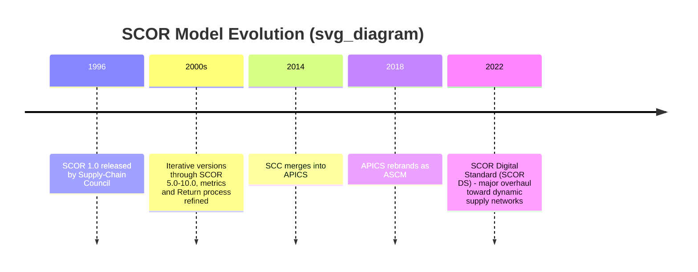
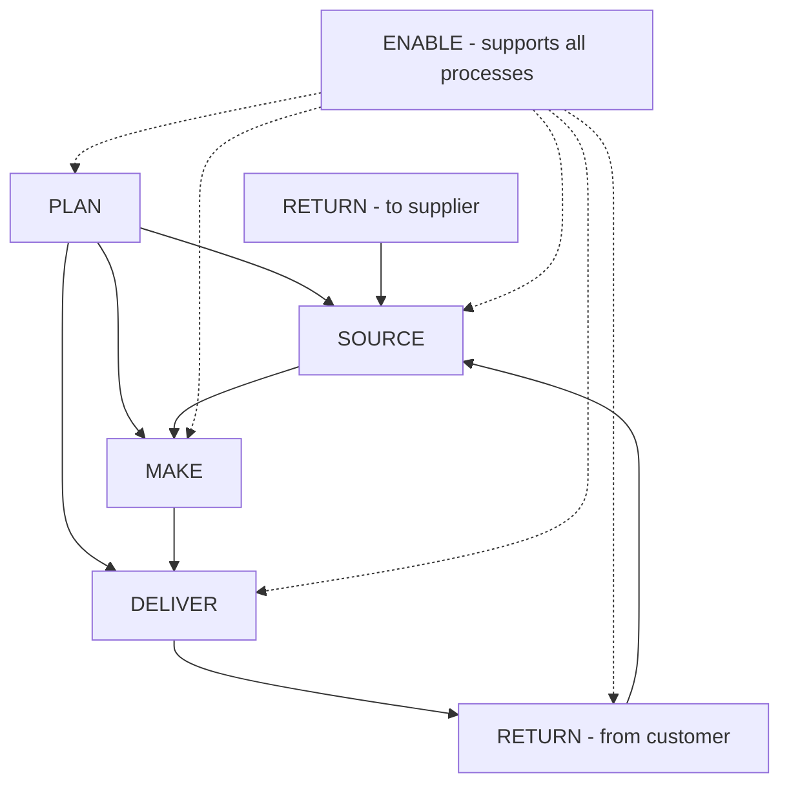
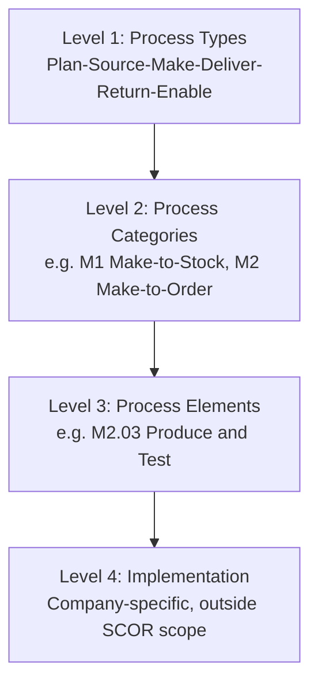

## The SCOR Performance Model

### Definition and Scope

The **Supply Chain Operations Reference (SCOR)** model is a **process reference model** — a standardized framework that integrates business process reengineering, benchmarking, and process measurement into a single cross-functional structure for describing, measuring, and improving supply chain performance. It was originally developed in 1996 by the Supply-Chain Council (SCC), which merged into APICS in 2014, subsequently rebranded as the **Association for Supply Chain Management (ASCM)** in 2018. The first version of SCOR was released in 1996, and early adopters claimed significant benefits, including improved operational control, performance measurement and meaningful bottom-line improvements.

**Key Points**

- SCOR is **industry-agnostic and non-prescriptive** — it describes the business activities associated with satisfying a customer's demand, but does not mandate that every listed sub-process must be executed by every organization [Wikipedia](https://en.wikipedia.org/wiki/Supply_chain_operations_reference)
- The model's use includes analyzing the current state of a company's processes and goals, quantifying operational performance, and comparing that performance against benchmark data [Wikipedia](https://en.wikipedia.org/wiki/Supply_chain_operations_reference)
- SCOR contains more than 150 key performance indicators for measuring supply chain operations performance, derived from ASCM member experience and contribution [Wikipedia](https://en.wikipedia.org/wiki/Supply_chain_operations_reference)
- In 2022, ASCM released the **SCOR Digital Standard (SCOR DS)**, described as the most significant update since SCOR's 1996 inception, modernizing the framework to include resilience, economic, and sustainability metrics and benchmarks, along with process changes supporting retail, omnichannel, and strategic sourcing. [Unverified — exact current version number in active use varies by source; verify the specific SCOR DS or numbered version your organization licenses via scor.ascm.org, since ASCM continues to iterate the framework] [sdcexec](https://www.sdcexec.com/software-technology/news/22458032/association-for-supply-chain-management-ascm-ascm-releases-new-scor-digital-standard)

---

### Evolution and Versioning

Version 5.0 reflected major changes to metrics, performance attributes, process-specific changes, and the development of the Return process, illustrating the model's historical pattern of periodic, substantial revision. SCOR was developed originally by the management consulting firm PRTM (later part of PricewaterhouseCoopers) and AMR Research (later part of Gartner), then endorsed and stewarded by the Supply Chain Council. [assemblymag](https://assemblymag.com/articles/83583-supply-chain-council-updates-scor-version)

A key philosophical shift in the 2022 SCOR DS release: moving end-to-end supply chain thinking from a linear, trading-partner orientation toward a dynamic, asynchronous supply network model focused on market drivers, visibility, and collaboration — reflecting the industry's broader move away from strictly sequential chain thinking toward networked/omnichannel supply models. [sdcexec](https://www.sdcexec.com/software-technology/news/22458032/association-for-supply-chain-management-ascm-ascm-releases-new-scor-digital-standard)

---

### The Building-Block Structure: Five (to Six) Core Management Processes

The SCOR model is built on a set of core management processes, historically five and now commonly extended to six in current documentation:

| Process | Function |
| --- | --- |
| **Plan** | Balancing resources, preparing business rules, and aligning the supply chain plan with the organization's financial plan |
| **Source** | Procuring goods and services to meet planned or actual demand |
| **Make** | Transforming inputs into finished goods/services to meet demand |
| **Deliver** | Order management, warehousing, transportation, and fulfillment to the customer |
| **Return** | Managing reverse flows — returns of raw materials (to suppliers) and finished goods (from customers) |
| **Enable** | Supporting processes: managing business rules, performance, data, resources, contracts, and network configuration that underpin the other five |

This building-block approach allows a supply chain description to be assembled across organizations — internal and external — and across industry segments and geographies, which is what gives SCOR its cross-industry comparability.

---

### Hierarchical Process Decomposition (Levels 1–4)

SCOR structures analysis in a top-down hierarchy of increasing granularity:

- **Level 1 — Process Types**: The top-level scope definition (Plan, Source, Make, Deliver, Return, Enable). Defines the competitive basis of operations and sets high-level performance targets.
- **Level 2 — Process Categories**: Configures the supply chain using process variants (e.g., Make can be decomposed into **Make-to-Stock (M1)**, **Make-to-Order (M2)**, or **Engineer-to-Order (M3)**), reflecting the specific operational strategy in use.
- **Level 3 — Process Elements**: Detailed activity-level decomposition. For a "Make Build to Order" process, the model suggests roughly six more detailed tasks are usually performed, though it is not mandatory that all be executed — this represents typical practice among ASCM's membership base rather than a required standard. Level 3 detail cannot exceed the boundaries set by SCOR's industry-agnostic, industry-standard nature.
- **Level 4 — Implementation**: Company-specific activities (e.g., the detailed steps composing a process like M2.03 "Produce & Test") fall outside SCOR's defined scope entirely and are left to each organization's own process documentation.

---

### The Five Performance Attributes

SCOR defines five generic performance attributes and three levels of measures that analysts can use to structure a balanced scorecard of supply chain performance. These attributes split into **customer-facing** and **internal-facing** categories: [scribd](https://www.scribd.com/document/431197253/SCOR-Model)

**Customer-Facing Attributes**

1. **Reliability** — the ability to perform tasks as expected (e.g., Perfect Order Fulfillment)
2. **Responsiveness** — the speed at which tasks are performed (e.g., Order Fulfillment Cycle Time)
3. **Agility** — the ability to respond to external influences and marketplace changes (e.g., Upside/Downside Supply Chain Adaptability, Overall Value at Risk)

**Internal-Facing Attributes**

4. **Cost** — the cost of operating the supply chain process (e.g., Total Supply Chain Management Cost, Cost of Goods Sold)

5. **Asset Management Efficiency** (sometimes termed "Assets") — the effectiveness of managing assets to support demand satisfaction (e.g., Cash-to-Cash Cycle Time, Return on Supply Chain Fixed Assets)

$$\text{Cash-to-Cash Cycle Time} = DIO + DSO - DPO$$

Note the deliberate trade-off structure: attributes like Cost and Responsiveness are often in tension (faster delivery typically costs more), so SCOR scorecards are meant to be read as a **balanced set**, not optimized independently.

---

### The SCOR Methodology: A Three-Phase Application

SCOR integrates three established methodologies into a single cross-functional framework:

1. **Business Process Reengineering** — capturing the present ("as-is") state of a process and driving toward the desired future ("to-be") state
2. **Benchmarking** — calculating the operational performance of similar companies and setting internal targets based on the best observed results
3. **Process (Best Practice) Measurement** — characterizing the management practices and software solutions that produce best-in-class performance

**Example**

A mid-sized industrial distributor applies SCOR to diagnose poor delivery performance:

- **As-is analysis**: Maps current Deliver (D) processes at Level 2/3, finding they use a generic "Deliver Stocked Product" (D1) category despite actually running significant make-to-order business
- **Benchmarking**: Compares Perfect Order Fulfillment rate (currently 82%) against industry benchmark data segmented by peer companies of similar size/industry (benchmark median found to be ~92%)
- **Best practice identification**: Discovers top performers use automated ATP (Available-to-Promise) checks at order entry — a documented SCOR best practice associated with the D2 (Deliver Make-to-Order) category
- **Gap closure**: Reclassifies the relevant product lines under D2, implements ATP logic, and re-measures Perfect Order Fulfillment against the same metric definition post-implementation

---

### Metrics Hierarchy

SCOR's more than 150 key performance indicators are organized hierarchically, mirroring the process levels:

- **Level 1 (Strategic) metrics** — diagnostic, board/executive-level metrics tied directly to the five performance attributes (e.g., Perfect Order Fulfillment, Total Cost to Serve)
- **Level 2 (Diagnostic) metrics** — decompose Level 1 metrics into contributing factors (e.g., Perfect Order Fulfillment decomposes into % delivered on time, % delivered complete, % delivered damage-free, % correctly invoiced/documented)
- **Level 3 (Diagnostic) metrics** — further decompose Level 2 into root-cause, process-element-level detail useful for operational troubleshooting

$$\text{Perfect Order Rate} = P(\text{On-Time}) \times P(\text{Complete}) \times P(\text{Damage-Free}) \times P(\text{Correctly Documented})$$

assuming approximate independence between the sub-conditions [Inference — the multiplicative decomposition is a standard simplification; in practice these conditions may be correlated, e.g., late orders being more likely to also be incomplete].

---

### Recent Extensions: Sustainability, Resilience, and Digital Orientation

The 2022 SCOR DS update reflects an expanded scope beyond the model's original cost/service/asset focus:

- **Sustainability metrics** — incorporating environmental and social benchmarks into the standard performance framework rather than treating sustainability as a separate initiative [sdcexec](https://www.sdcexec.com/software-technology/news/22458032/association-for-supply-chain-management-ascm-ascm-releases-new-scor-digital-standard)
- **Resilience metrics** — reflecting growing enterprise focus on supply chain risk and disruption recovery capability, particularly following global supply disruptions in the early 2020s
- **Network orchestration** — supporting retail, omnichannel, and strategic sourcing process configurations, and reframing the underlying model conceptually as a dynamic, asynchronous supply network rather than a linear, trading-partner chain [sdcexec](https://www.sdcexec.com/software-technology/news/22458032/association-for-supply-chain-management-ascm-ascm-releases-new-scor-digital-standard)[ascm](https://beta.ascm.org/globalassets/ascm_website_assets/docs/9.19.2022-scor-press-release.pdf)

[Unverified] The precise set of newly codified sustainability/resilience metric definitions and their exact naming conventions should be confirmed directly against the current SCOR Digital Standard documentation (scor.ascm.org), as framework content is periodically revised by ASCM.

---

### SCOR in Practice: Strengths and Limitations

**Strengths**

- Provides a common vocabulary across functions and trading partners, reducing ambiguity in cross-company process discussions
- Enables apples-to-apples benchmarking against industry peers using standardized metric definitions
- Non-prescriptive structure allows adaptation across industries (manufacturing, retail, services) without forcing an ill-fitting process model

**Limitations**

- Level 4 (actual implementation detail) is explicitly out of scope, meaning SCOR alone does not tell an organization *how* to execute — only *what* to measure and benchmark
- Requires disciplined internal process mapping discipline to translate real operations into SCOR's categorical structure (e.g., correctly distinguishing M1/M2/M3 variants)
- Benchmark data quality depends on the breadth and recency of ASCM's member-contributed dataset for a given industry/metric combination
- Historically criticized as more supply/production-centric; the 2022 DS update was explicitly framed to address gaps in omnichannel, sustainability, and network-level (versus linear-chain) thinking

---

**Related Topics**

- Balanced Scorecard and Triple Bottom Line frameworks (comparative performance frameworks)
- Sales and Operations Planning (S&OP) and its relationship to the SCOR "Plan" process
- Benchmarking methodologies in operations management
- Business Process Reengineering (BPR) principles
- Supply chain risk management and resilience metrics
- Perfect Order Fulfillment and order-to-cash cycle metrics
- ASCM certifications (CSCP, SCOR-P) and professional supply chain standards
- Digital Supply Chain Twins and control tower technologies