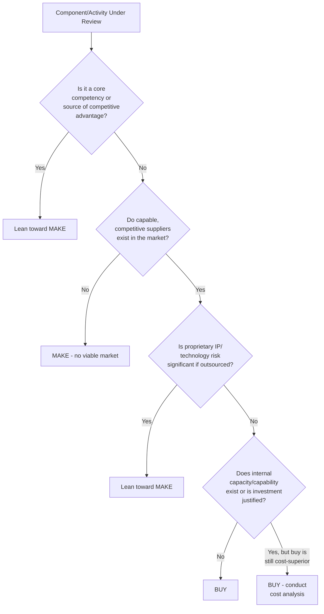
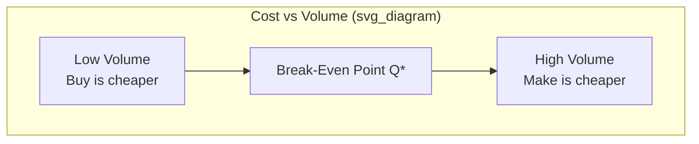
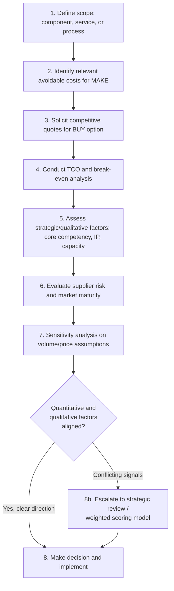

## Make-or-Buy Decision Analysis

### Definition and Scope

Make-or-buy decision analysis is the strategic and financial evaluation process organizations use to determine whether to **produce a good/service internally (make/insource)** or **procure it from an external supplier (buy/outsource)**. It combines quantitative cost analysis with qualitative strategic considerations around core competency, capacity, quality control, and risk.

**Key Points**

- The decision is rarely purely financial — a lower-cost external option may still be rejected on strategic grounds (e.g., loss of proprietary knowledge, supplier dependency risk)
- Make-or-buy is not a one-time decision; capacity changes, technology shifts, and supplier market evolution require periodic reassessment
- The analysis applies at multiple levels: individual components, entire subassemblies, business processes (e.g., payroll, IT support), and even full product lines

---

### Strategic Framework: When to Make vs. Buy

The classic strategic lens, drawn from resource-based view (RBV) theory, argues firms should **make** activities that are a source of sustainable competitive advantage (rare, valuable, difficult to imitate) and **buy** activities that are not core, even if the firm is technically capable of producing them internally.

---

### Quantitative Cost Analysis

#### Total Cost of Ownership (TCO) Framework

A make-or-buy decision should never compare a single unit price against internal variable cost alone; it must account for the full cost structure on both sides.

**Make (Internal Production) Costs**

- Direct materials
- Direct labor
- Variable manufacturing overhead
- Allocated fixed overhead (relevant only if avoidable — see below)
- Capital investment in tooling/equipment (amortized)
- Opportunity cost of capacity used

**Buy (External Sourcing) Costs**

- Purchase price per unit
- Inbound freight and logistics
- Incoming quality inspection
- Supplier management/procurement administrative overhead
- Tariffs, duties, currency risk (for international suppliers)
- Inventory carrying cost for any required buffer stock
- Switching/transition costs

#### Break-Even Analysis

The standard quantitative technique compares total cost curves as a function of volume $Q$:

$$TC_{make} = F_m + V_m \cdot Q$$

$$TC_{buy} = F_b + V_b \cdot Q$$

where $F_m$ is fixed cost of making (equipment, tooling — largely avoided if buying), $V_m$ is variable cost per unit to make, $F_b$ is any fixed cost associated with buying (e.g., supplier qualification, contract setup — typically much lower), and $V_b$ is the purchase price per unit.

The break-even volume $Q^*$ is found by setting $TC_{make} = TC_{buy}$:

$$Q^* = \frac{F_m - F_b}{V_b - V_m}$$

- If projected volume $Q > Q^*$: **Make** is more economical (fixed cost is spread over more units)
- If projected volume $Q < Q^*$: **Buy** is more economical

**Example**

A furniture manufacturer is deciding whether to make or buy a metal bracket component.

- Make: Fixed cost (die/tooling) $F_m = \$50{,}000$; variable cost $V_m = \$2.00$/unit
- Buy: Fixed cost (supplier setup/tooling amortization passed through) $F_b = \$5{,}000$; purchase price $V_b = \$3.50$/unit

$$Q^* = \frac{50{,}000 - 5{,}000}{3.50 - 2.00} = \frac{45{,}000}{1.50} = 30{,}000 \text{ units}$$

At an annual forecast of 50,000 units (above break-even), making is quantitatively favorable by:

$$TC_{buy} - TC_{make} = (5{,}000 + 3.50 \times 50{,}000) - (50{,}000 + 2.00 \times 50{,}000) = 180{,}000 - 150{,}000 = \$30{,}000 \text{ savings by making}$$

**Output**: At forecast volume, making saves approximately $30,000 annually versus buying, before accounting for qualitative factors below.

---

### The Relevant/Avoidable Cost Principle

A critical and frequently misapplied concept: only **avoidable costs** should be included in the "make" side of the comparison. **Sunk costs** and **unavoidable allocated overhead** must be excluded, since they persist regardless of the decision.

$$\text{Relevant Cost of Making} = \text{Total Cost} - \text{Unavoidable/Sunk Costs}$$

**Common Pitfall**

Many organizations incorrectly include fully-allocated overhead (rent, existing salaried supervisor costs that would continue regardless) in the "cost to make," making internal production appear artificially expensive relative to buying. This is a textbook accounting error in make-or-buy analysis: only overhead that would actually be **eliminated** if the item were bought should be counted as a cost of making.

**Example**

A factory currently allocates $8/unit of overhead to a component that costs $15/unit fully-loaded to make internally, versus a supplier quote of $18/unit. If $6 of that $8 overhead (supervisory salary, facility depreciation) would continue whether or not the component is made in-house, the *relevant* make cost is only $9/unit ($15 - 6$), making internal production clearly favorable despite the naive fully-loaded comparison suggesting otherwise ($15 < 18$, but the margin is understated without this correction).

---

### Qualitative and Strategic Factors

| Factor | Favors MAKE | Favors BUY |
| --- | --- | --- |
| Core competency alignment | High — proprietary/differentiating | Low — commodity or non-core |
| Available capacity | Idle capacity exists | Capacity constrained/at capital limit |
| Quality control needs | High precision, hard to specify contractually | Standard, easily specified quality |
| Volume and demand stability | High and stable volume | Low, volatile, or seasonal demand |
| Intellectual property risk | High (design secrets, patents) | Low IP exposure |
| Supplier market maturity | Few/unreliable suppliers | Mature, competitive supplier market |
| Speed to market | Sufficient lead time to build capability | Need for rapid scaling/flexibility |
| Financial capital availability | Capital available for investment | Capital-constrained, prefers opex over capex |
| Switching cost / reversibility | Decision needs to be flexible/reversible | Long-term outsourcing lock-in acceptable |

---

### Risk Considerations

- **Supplier dependency risk** — single-sourcing a critical buy decision creates vulnerability to supplier failure, price increases, or capacity constraints
- **Loss of internal capability** — buying today can foreclose the option to make competitively in the future if internal skills atrophy (a form of capability erosion risk)
- **Quality and IP leakage risk** — sharing proprietary designs/specifications with external suppliers, particularly offshore, carries confidentiality and IP protection risk
- **Hidden transaction costs** (per Transaction Cost Economics/TCE, Williamson) — the cost of writing, monitoring, and enforcing contracts, especially for complex or customized items with **asset specificity**, can make buying more expensive than it initially appears

$$\text{Governance Choice} \propto f(\text{Asset Specificity}, \text{Uncertainty}, \text{Transaction Frequency})$$

Transaction Cost Economics predicts that as asset specificity (how customized/non-redeployable an investment is) and uncertainty increase, firms shift toward vertical integration (make) to avoid opportunistic renegotiation risk from suppliers ("hold-up problem").

---

### Decision Process Workflow

---

### Weighted Scoring Models for Ambiguous Cases

When quantitative and qualitative factors conflict, a weighted decision matrix can formalize the trade-off:

$$\text{Score} = \sum_{i=1}^{n} w_i \cdot s_i$$

where $w_i$ is the importance weight assigned to factor $i$ (e.g., cost, quality control, strategic fit, risk) and $s_i$ is the score (e.g., 1–5) for how well each option (make vs. buy) satisfies that factor. The option with the higher weighted score is favored, though this method should supplement — not replace — the underlying TCO/break-even analysis, since subjective weighting can introduce bias.

**Common Pitfalls**

- Comparing quoted supplier price against fully-allocated (not avoidable) internal cost
- Ignoring capacity opportunity cost — idle capacity used to "make" isn't free if it could be redeployed to a higher-value product
- Underestimating hidden transaction/coordination costs of managing external suppliers, especially for complex or customized items
- Treating the decision as permanent rather than revisiting it as volume, technology, or supplier markets change
- Failing to build in contractual flexibility (volume flexibility clauses, exit terms) when choosing to buy, particularly for volatile-demand items

[Inference — the specific numeric thresholds and weight values in any scoring model are organization-specific judgment calls, not universal standards, and should be calibrated to each firm's risk tolerance and strategic priorities]

---

**Related Topics**

- Total Cost of Ownership (TCO) modeling in procurement
- Transaction Cost Economics and the theory of the firm
- Outsourcing and offshoring strategy
- Supplier selection and qualification processes
- Capacity planning and utilization analysis
- Vertical integration strategy
- Break-even and cost-volume-profit (CVP) analysis
- Core competency and resource-based view (RBV) strategic theory