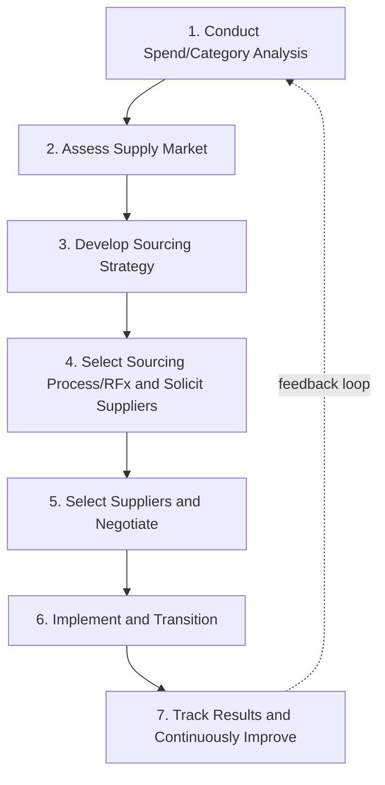
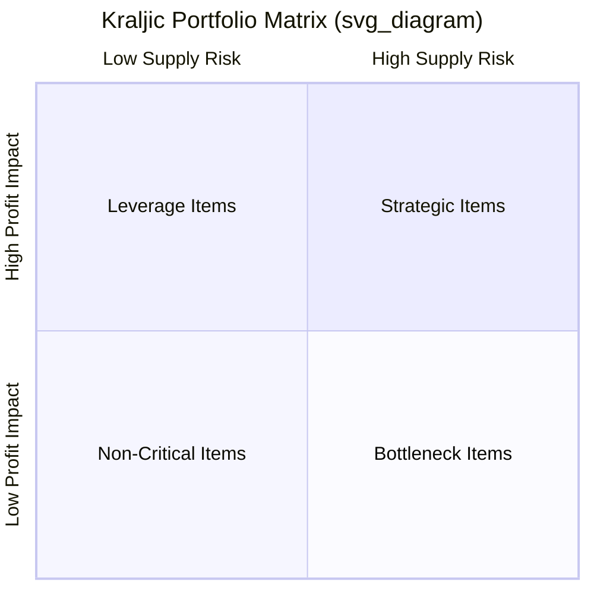

## The Strategic Sourcing Process

### Definition and Scope

Strategic sourcing is a systematic, data-driven procurement methodology that continuously analyzes and re-evaluates an organization's purchasing activities to consolidate spend, optimize supplier relationships, and align sourcing decisions with overall business strategy — as opposed to reactive, transactional purchasing conducted independently by individual departments.

**Key Points**

- Strategic sourcing is cyclical and ongoing, not a one-time event — markets, supplier capabilities, and internal requirements change continuously
- It shifts procurement from a tactical, price-focused function to a strategic function contributing to total cost reduction, risk management, innovation access, and competitive advantage
- The process applies differently across spend categories; not every category warrants the full rigor of a formal sourcing event (see spend segmentation below)

---

### The Seven-Step Strategic Sourcing Process

While variations exist across consulting frameworks (A.T. Kearney's 7-Step model is among the most widely referenced), the process generally follows this structure:

#### Step 1: Spend/Category Analysis

Aggregate and classify historical purchasing data across the organization to understand what is being bought, from whom, at what price, and in what volume.

- Identify spend fragmentation (multiple departments buying the same category from different suppliers)
- Apply **ABC analysis** to prioritize categories by spend magnitude
- Cleanse and normalize data — a persistent practical challenge given inconsistent supplier naming, unit-of-measure discrepancies, and decentralized purchasing records

#### Step 2: Supply Market Assessment

Research the external market for each priority category.

- Identify potential and alternative suppliers, including new entrants
- Assess market structure (fragmented vs. concentrated/oligopolistic), pricing trends, and technology shifts
- Evaluate macro risk factors: geopolitical exposure, currency risk, regulatory changes, raw material commodity trends

#### Step 3: Develop Sourcing Strategy

Combine internal spend analysis with external market intelligence into a category-specific strategy using a portfolio approach (commonly the **Kraljic Matrix** — see below).

- Decide sourcing approach: single vs. multi-sourcing, geographic diversification, contract length, and desired supplier relationship depth
- Set target outcomes: cost reduction targets, risk mitigation goals, innovation/quality objectives

#### Step 4: Select Sourcing Process and Solicit Suppliers (RFx)

Execute the formal solicitation appropriate to category complexity and strategic importance:

| Instrument | Purpose | Typical Use Case |
| --- | --- | --- |
| **RFI** (Request for Information) | Gather general capability/market data | Early-stage market scoping, new category |
| **RFP** (Request for Proposal) | Solicit detailed technical/commercial proposals | Complex, differentiated requirements |
| **RFQ** (Request for Quotation) | Solicit price quotes on tightly specified items | Standardized/commodity items |
| **Reverse Auction** | Competitive real-time bidding to drive price down | High-volume, well-specified commodities with multiple qualified bidders |

#### Step 5: Select Suppliers and Negotiate

Evaluate proposals against pre-defined weighted criteria (price, quality, capacity, financial stability, sustainability, geographic risk) and negotiate final terms.

$$\text{Supplier Score} = \sum_{i=1}^{n} w_i \cdot s_i$$

where $w_i$ is the weight assigned to criterion $i$ (e.g., 40% price, 25% quality, 20% delivery reliability, 15% risk/sustainability) and $s_i$ is the supplier's score on that criterion.

#### Step 6: Implement and Transition

Formalize the contract and operationalize the new sourcing arrangement.

- Onboard new suppliers into ERP/procurement systems
- Communicate transition plans internally to affected stakeholders (engineering, operations, quality)
- Manage any incumbent supplier transition to avoid supply disruption

#### Step 7: Track Results and Continuously Improve

Establish ongoing performance monitoring and feed learnings back into future sourcing cycles.

- Monitor realized savings against forecasted savings (savings tracking/validation)
- Conduct supplier performance reviews (scorecards)
- Reassess category strategy periodically as market conditions evolve

---

### The Kraljic Portfolio Matrix

Developed by Peter Kraljic (1983), this matrix segments purchased items by **profit impact** and **supply risk**, guiding differentiated sourcing strategy per category rather than a one-size-fits-all approach.

| Quadrant | Characteristics | Sourcing Strategy |
| --- | --- | --- |
| **Strategic Items** (high risk, high impact) | Critical, often custom, few suppliers | Deep partnership, joint planning, long-term contracts, dual-sourcing where feasible |
| **Leverage Items** (low risk, high impact) | High spend, many capable suppliers | Competitive bidding, reverse auctions, aggressive negotiation, spend consolidation |
| **Bottleneck Items** (high risk, low impact) | Low spend but few/sole suppliers, hard to substitute | Secure supply via safety stock, alternative sourcing development, longer lead-time planning |
| **Non-Critical Items** (low risk, low impact) | Commodity, many suppliers, low spend | Process efficiency focus — automate/simplify (e.g., P-cards, catalog buying) to reduce transaction cost rather than unit price |

**Example**

A hospital system applies the Kraljic matrix to its purchasing categories:

- **Strategic**: MRI machines and specialized surgical implants (few qualified suppliers, mission-critical) → long-term strategic supplier agreements with joint capacity planning
- **Leverage**: Generic pharmaceuticals, office supplies (high spend, many suppliers) → competitive RFPs and group purchasing organization (GPO) leverage
- **Bottleneck**: A specific single-source diagnostic reagent required for a niche test (low spend but sole-sourced) → qualify a backup supplier and maintain buffer inventory
- **Non-Critical**: Janitorial supplies → shift to automated punch-out catalog ordering via a P-card program to reduce processing overhead rather than negotiating unit price further

---

### Total Cost of Ownership (TCO) in Sourcing Decisions

Strategic sourcing evaluates suppliers on total cost, not unit price alone:

$$TCO = P + T + Q_c + I_c + S_a + R_c$$

where $P$ is purchase price, $T$ is transportation/logistics cost, $Q_c$ is quality/defect cost, $I_c$ is inventory carrying cost, $S_a$ is supplier administration cost, and $R_c$ is risk-adjusted cost (e.g., expected disruption cost weighted by probability).

**Common Pitfall**: Selecting the lowest quoted unit price without accounting for higher downstream costs (defect rework, longer lead times requiring more safety stock, higher freight from a distant low-cost country supplier) can produce a worse total-cost outcome than a higher-priced, more reliable alternative.

---

### Organizational Enablers

- **Category management** — organizing procurement staff around specific spend categories (aligned to Kraljic-style segmentation) rather than purely by requisitioning department, building deep category expertise
- **Cross-functional sourcing teams** — including engineering, quality, finance, and operations stakeholders in sourcing decisions for strategic/bottleneck categories to ensure technical and business alignment
- **e-Sourcing platforms** — software supporting RFx management, reverse auctions, spend analytics, and supplier relationship tracking (e.g., Ariba, Coupa, Jaggaer)
- **Supplier Relationship Management (SRM)** programs — differentiated engagement models based on strategic importance, from transactional monitoring (non-critical items) to joint innovation programs (strategic items)

---

### Common Pitfalls

- Treating strategic sourcing as a one-time cost-cutting exercise rather than an ongoing capability
- Applying the same competitive-bid approach uniformly across all Kraljic quadrants, damaging supplier relationships that should be collaborative (strategic items) or under-leveraging competition where it would help (leverage items)
- Poor spend data quality undermining category analysis accuracy from the outset
- Focusing exclusively on unit price savings while ignoring TCO and risk factors, leading to hidden cost increases elsewhere
- Failing to validate and track realized savings after implementation, so reported "savings" never materialize in the actual P&L
- Under-resourcing supplier transition/onboarding (Step 6), causing service disruptions that erode the credibility of the sourcing initiative

[Inference — the specific process step count (commonly cited as five, seven, or eight steps depending on the consulting framework referenced) is a structural convention rather than a universal standard; organizations and textbooks vary in how finely they subdivide the same underlying activities]

---

**Related Topics**

- Kraljic Portfolio Matrix — detailed category strategy design
- Total Cost of Ownership (TCO) modeling
- Supplier Relationship Management (SRM) and supplier scorecards
- Category management organizational design
- Make-or-buy decision analysis
- e-Procurement and e-Sourcing platform architecture
- Group Purchasing Organizations (GPOs) and consortium buying
- Supply market risk assessment and geopolitical risk in sourcing