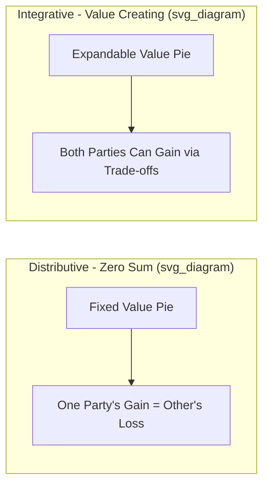
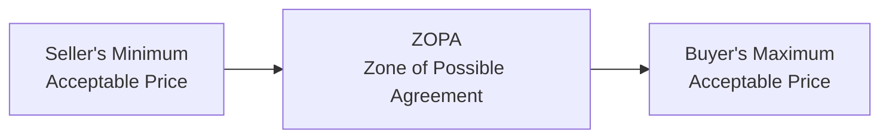
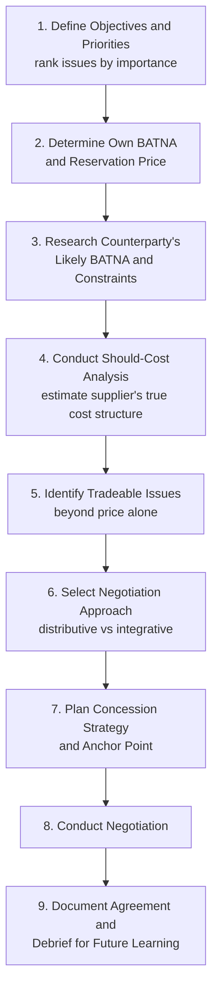

## Negotiation Strategies in Procurement

### Definition and Scope

Procurement negotiation is the structured process by which buyers and suppliers reach mutually acceptable agreement on price, terms, and conditions of a commercial relationship. Effective procurement negotiation combines preparation, leverage analysis, communication tactics, and an understanding of the relationship's long-term strategic value — moving beyond simple price haggling toward value creation and risk allocation.

**Key Points**

- Negotiation strategy should be matched to the strategic importance of the category (Kraljic-style segmentation), not applied uniformly
- Preparation typically determines negotiation outcomes more than in-the-moment tactics — most negotiation advantage is built before the parties sit down
- Effective negotiation distinguishes between **distributive** (win-lose, fixed-pie) and **integrative** (win-win, expanding-pie) approaches, and applies each where appropriate

---

### Distributive vs. Integrative Negotiation

**Distributive negotiation** treats the negotiation as a fixed-value claim over a single variable (typically price), where each party's gain is the other's loss. This is appropriate for:

- Commodity/leverage items with many substitutable suppliers (Kraljic "leverage" quadrant)
- Short-term, transactional relationships with low switching cost
- Situations where the buyer holds clear power/leverage

**Integrative negotiation** seeks to expand the total value available by identifying and trading across multiple issues with different priorities for each party (price, payment terms, volume commitment, exclusivity, innovation access, risk-sharing). This is appropriate for:

- Strategic and bottleneck items (Kraljic quadrants) where long-term relationship value matters
- Complex, multi-issue negotiations where both parties have differentiated priorities
- Situations requiring ongoing collaboration (joint product development, VMI arrangements)

**Example**

A buyer negotiating a strategic component contract discovers the supplier values a 3-year volume commitment (reduces their demand forecasting risk) more than an immediate price concession. In exchange for a firm 3-year purchase commitment, the buyer secures a 5% price reduction plus priority capacity allocation during shortages — a trade that creates more combined value than either party demanding a price-only concession, since the volume commitment costs the buyer little (they intended to keep buying anyway) but is worth significantly more to the supplier's planning certainty.

---

### The ZOPA and BATNA Framework

Two foundational concepts from negotiation theory (Fisher & Ury, *Getting to Yes*) underpin preparation for any procurement negotiation:

#### BATNA (Best Alternative to a Negotiated Agreement)

The course of action a party will take if the current negotiation fails to reach agreement. A buyer's negotiating power is directly proportional to the strength of their BATNA.

- Strong BATNA (e.g., multiple qualified alternative suppliers ready to contract) → greater leverage, can walk away credibly
- Weak BATNA (e.g., sole-source supplier, urgent need) → limited leverage, must negotiate more collaboratively or accept less favorable terms

#### Reservation Price and ZOPA (Zone of Possible Agreement)

Each party has a **reservation price** — the least favorable point at which they will still accept a deal (walk-away point). The ZOPA is the range between the buyer's maximum acceptable price and the seller's minimum acceptable price, if one exists.

$$\text{ZOPA exists if: } P_{buyer,max} \geq P_{seller,min}$$

If no ZOPA exists (buyer's maximum is below seller's minimum), no amount of tactical negotiation skill can produce agreement without one party's underlying constraints changing (e.g., buyer increases budget, seller reduces cost basis, or a different scope/specification is negotiated).

**Common Pitfall**: Entering negotiation without having independently estimated the counterparty's likely reservation price and BATNA — relying solely on one's own constraints leaves a buyer unable to judge whether an offer is genuinely favorable or simply better than their own worst case.

---

### Preparation Framework

#### Should-Cost Modeling

A rigorous procurement negotiation technique that builds an independent estimate of what a product/service *should* cost the supplier to produce, based on raw material costs, labor rates, overhead assumptions, and reasonable margin — used to identify negotiation targets grounded in cost reality rather than the supplier's quoted price alone.

$$\text{Should-Cost} = C_{materials} + C_{labor} + C_{overhead} + \text{Reasonable Margin}$$

This technique is particularly valuable in categories with limited price transparency or where a supplier's quote appears disconnected from underlying cost drivers.

---

### Key Tactical Considerations

#### Anchoring

The first credible offer in a negotiation exerts disproportionate influence on the eventual settlement point (anchoring bias). Buyers who open with a well-justified, aggressive-but-defensible position (backed by should-cost analysis or competitive benchmarks) tend to achieve better outcomes than those who wait for the supplier's opening offer.

#### Concession Strategy

Concessions should be planned in advance — decreasing in size (signaling approach to reservation price) and never given without reciprocity (asking for something in return maintains perceived value and prevents unlimited future demands).

$$\Delta_1 > \Delta_2 > \Delta_3 > \dots$$

where $\Delta_i$ represents the size of the $i$-th concession — a declining concession pattern signals to the counterparty that the limit is being approached.

#### Multi-Issue Bundling

Negotiating multiple issues (price, payment terms, volume, delivery, warranty, exclusivity) simultaneously rather than sequentially allows for value-creating trades, since parties typically place different relative value on different issues.

#### Competitive Tension

Maintaining credible competing options during negotiation (multiple qualified bidders, staged RFP processes) strengthens the buyer's effective BATNA even when the buyer intends to ultimately select one preferred supplier.

---

### Negotiation Approach by Kraljic Category

| Kraljic Quadrant | Recommended Negotiation Approach |
| --- | --- |
| **Leverage** (high spend, low risk) | Distributive; aggressive price-focused tactics; competitive bidding/reverse auctions justified |
| **Strategic** (high spend, high risk) | Integrative; multi-issue, relationship-oriented; joint value creation and risk-sharing |
| **Bottleneck** (low spend, high risk) | Collaborative; focus on supply security and continuity terms over price; avoid antagonizing scarce suppliers |
| **Non-Critical** (low spend, low risk) | Minimal negotiation investment; focus on process efficiency (catalog pricing, standard terms) rather than per-deal negotiation effort |

---

### Contractual and Structural Levers Beyond Price

Effective procurement negotiators expand the negotiation scope beyond unit price to capture value through contract structure:

- **Payment terms** — extending days payable improves buyer working capital without changing headline price
- **Volume-based rebates/tiered pricing** — aligning incentives with actual purchase volume growth
- **Index-linked pricing clauses** — for commodity-exposed inputs, tying price adjustments to a published index reduces both parties' exposure to negotiation disputes over raw material cost pass-through
- **Service level agreements (SLAs) with penalties/incentives** — embedding performance accountability directly into commercial terms
- **Most-favored-customer clauses** — contractual assurance the buyer receives pricing at least as favorable as the supplier's other customers
- **Termination and exit terms** — negotiating favorable off-ramps reduces future switching cost and preserves BATNA strength in subsequent negotiations

---

### Common Pitfalls

- Focusing exclusively on unit price while ignoring total cost of ownership and contractual terms that may carry greater aggregate value
- Failing to establish a credible BATNA before negotiating, resulting in accepting unfavorable terms under perceived pressure
- Treating every negotiation as distributive, damaging long-term strategic supplier relationships that would benefit from integrative, collaborative approaches
- Revealing reservation price or urgency inadvertently through body language, timeline pressure, or incomplete information control
- Neglecting to prepare a should-cost model, leaving the buyer unable to judge whether a quoted price reflects genuine cost drivers or excess margin
- Declaring "final offer" prematurely or repeatedly, eroding credibility if concessions continue afterward

[Inference — the effectiveness of specific tactics (anchoring aggressiveness, concession sequencing) is well-supported in negotiation literature but outcomes are context-dependent on relative power balance, cultural context, and relationship history; treat tactical guidance as generally applicable principles rather than guaranteed outcomes in every negotiation]

---

**Related Topics**

- Kraljic Portfolio Matrix and category-differentiated sourcing strategy
- Should-cost modeling and cost-based pricing analysis
- Contract types and risk allocation (fixed-price, cost-plus, time-and-materials)
- Supplier Relationship Management (SRM) programs
- Total Cost of Ownership (TCO) in procurement decisions
- Behavioral economics and cognitive biases in negotiation
- Cross-cultural negotiation considerations in global sourcing
- Contract lifecycle management (CLM) systems