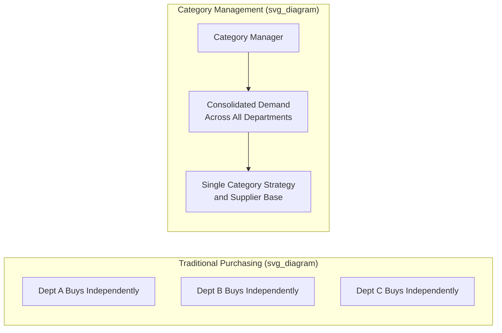
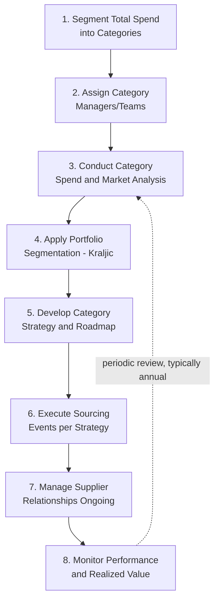
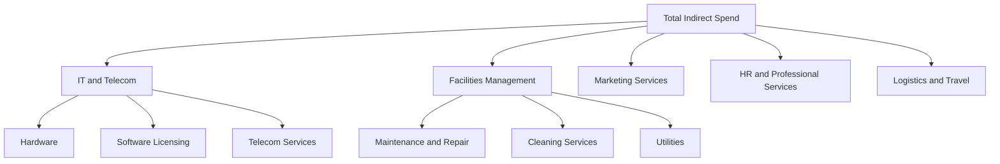

## Category Management

### Definition and Scope

Category management is a strategic procurement approach that organizes an organization's spend into discrete, logically grouped **categories** (e.g., raw materials, IT services, logistics, packaging) and assigns dedicated category managers or teams to develop and execute a tailored sourcing and supplier strategy for each — replacing fragmented, transaction-by-transaction purchasing with proactive, expertise-driven management of entire spend pools.

**Key Points**

- Category management shifts procurement's organizing principle from *who requests* (departmental purchasing) to *what is being bought* (category-based purchasing), consolidating demand and expertise
- It is a continuous, cyclical discipline — category strategies are periodically reassessed as markets, internal needs, and supplier capabilities evolve
- Category managers develop deep market and technical expertise in their assigned category, functioning more like internal consultants and strategists than transactional buyers

---

### Category Management vs. Traditional Purchasing

| Dimension | Traditional/Decentralized Purchasing | Category Management |
| --- | --- | --- |
| Organizing unit | Requesting department | Spend category |
| Focus | Transactional, order fulfillment | Strategic, total value optimization |
| Supplier base | Often fragmented, redundant | Consolidated, rationalized |
| Expertise | Generalist buyers | Deep category-specific specialists |
| Time horizon | Reactive, per-requisition | Proactive, multi-year category roadmap |
| Spend visibility | Siloed by department | Aggregated organization-wide |

---

### The Category Management Process

#### Step 1: Spend Segmentation

Aggregate and classify total organizational spend into logical categories, typically using a hierarchical taxonomy (e.g., UNSPSC — United Nations Standard Products and Services Code) to ensure consistent classification across business units.

#### Step 2: Assign Ownership

Designate category managers or cross-functional category teams responsible for each category's end-to-end strategy, often organized into tiers:

- **Direct spend categories** — materials/components that go directly into the organization's products (e.g., raw materials, components)
- **Indirect spend categories** — goods/services supporting operations but not part of the end product (e.g., IT, facilities, marketing services, travel)

#### Step 3: Category Spend and Market Analysis

For each category, the category manager conducts:

- Internal spend analysis (volume, price trends, supplier fragmentation, demand forecast)
- External market analysis (supplier landscape, pricing trends, innovation trajectory, regulatory factors)
- Stakeholder needs assessment (engaging internal users of the category to understand requirements and pain points)

#### Step 4: Portfolio Segmentation

Categories (and the suppliers within them) are typically further segmented using frameworks such as the **Kraljic Matrix** (profit impact vs. supply risk) to determine differentiated strategic approaches — strategic categories warrant deep partnership investment, while non-critical categories warrant process efficiency focus.

#### Step 5: Category Strategy Development

A formal category strategy document typically specifies:

- Sourcing approach (single/multi/dual sourcing, geographic diversification)
- Supplier relationship model (transactional, preferred, or strategic partnership)
- Cost reduction and value creation targets
- Risk mitigation plans (supply continuity, geopolitical, financial)
- Sustainability/ESG objectives for the category

#### Step 6: Execution

Formal sourcing events (RFI/RFP/RFQ, negotiations) are conducted per the category strategy, informed by the earlier analysis rather than ad hoc per-requisition buying.

#### Step 7: Supplier Relationship Management

Ongoing management of the category's supplier base, differentiated by supplier tier (strategic partners receive joint business reviews and collaborative planning; transactional suppliers receive standard performance monitoring).

#### Step 8: Performance Monitoring and Continuous Improvement

Category performance is tracked against defined KPIs and the strategy is revisited on a cyclical basis (commonly annually, or triggered by significant market shifts).

---

### Category Taxonomy Example

A manufacturing organization's indirect spend category taxonomy might look like:

---

### Key Performance Metrics for Category Management

| Metric | Purpose |
| --- | --- |
| Category spend under management | % of total category spend actively managed via formal category strategy vs. maverick/uncontrolled spend |
| Cost savings/avoidance realized | Tracked and validated savings attributable to category initiatives |
| Supplier consolidation ratio | Reduction in number of suppliers per category over time |
| Contract compliance rate | % of category spend transacted through approved contracts/suppliers |
| Category risk exposure index | Composite score of supply concentration, geographic, and financial risk within the category |
| Stakeholder satisfaction | Internal customer satisfaction with category service levels and responsiveness |

**Example**

An organization's IT hardware category previously had 45 suppliers across business units due to decentralized purchasing, with significant price variance for functionally identical laptops. A category manager consolidates demand, negotiates a master agreement with 3 preferred suppliers, and standardizes specifications across the organization.

**Output**: Supplier count reduced from 45 to 3 (93% consolidation), realized price variance eliminated (single negotiated price tier replacing dozens of independently negotiated prices), and reported annual savings of approximately 12% on total category spend, driven primarily by volume consolidation leverage and reduced administrative overhead per transaction. [Inference — specific savings percentages are illustrative and highly dependent on the starting level of spend fragmentation; actual results vary significantly by organization and category]

---

### Organizational Models for Category Management

- **Centralized** — all category management activity resides in a single corporate procurement function; maximizes spend leverage and consistency but can be slower to respond to local business unit needs
- **Decentralized** — category management embedded within individual business units; more responsive locally but sacrifices cross-organizational leverage and consistency
- **Center-Led (Hybrid)** — a central category management team sets strategy and negotiates major agreements, while execution/operational purchasing is delegated to business units; the most common model in large organizations, balancing leverage with responsiveness [Inference — prevalence of this model reflects widely observed practice in procurement literature rather than a universal standard]

---

### Common Pitfalls

- Defining categories too broadly (losing meaningful strategic focus) or too narrowly (losing consolidation leverage and creating excessive administrative overhead)
- Assigning category managers without adequate market and technical expertise, reducing the function to administrative order processing rather than strategic management
- Failing to secure genuine stakeholder buy-in from internal business units, leading to "maverick spend" (purchases made outside the approved category strategy and contracts)
- Treating category strategy as a static, one-time document rather than a living plan revisited as market and internal conditions change
- Measuring category management success purely on unit cost savings while ignoring total value delivered (risk reduction, quality improvement, innovation access)
- Poor cross-functional engagement — excluding engineering, quality, or end-user stakeholders from category strategy development, producing strategies misaligned with actual operational needs

---

**Related Topics**

- Kraljic Portfolio Matrix and category segmentation strategy
- The strategic sourcing process
- Supplier Relationship Management (SRM) programs
- Spend analysis and UNSPSC classification
- Maverick spend and procurement compliance
- Total Cost of Ownership (TCO) modeling
- Center-led vs. centralized vs. decentralized procurement organization design
- Contract lifecycle management (CLM) systems