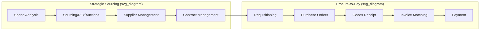
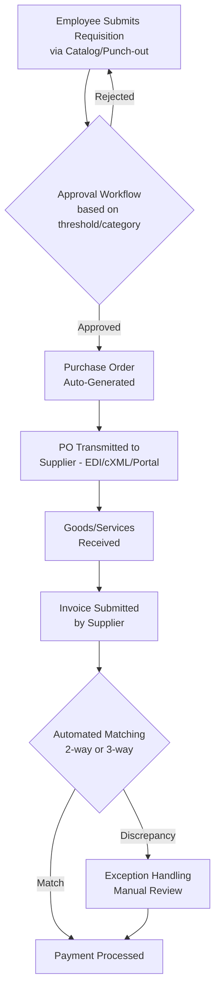

## E-Procurement Systems

### Definition and Scope

E-procurement (electronic procurement) systems are software platforms that digitize and automate the procure-to-pay (P2P) process — from requisitioning and sourcing through purchase order issuance, receiving, invoicing, and payment — replacing manual, paper-based purchasing workflows with integrated, data-driven digital processes.

**Key Points**

- E-procurement spans both the **strategic sourcing** side (RFx events, auctions, supplier selection) and the **operational/tactical** side (requisition-to-pay, catalog buying, invoice processing)
- Modern platforms are increasingly marketed as **Source-to-Pay (S2P)** or **Business Spend Management (BSM)** suites, reflecting end-to-end coverage rather than point-solution tools
- Value drivers include process efficiency, spend visibility/control, maverick spend reduction, supplier risk management, and negotiated savings capture

---

### The Source-to-Pay (S2P) Process Architecture

---

### Core Functional Modules

#### 1. Spend Analysis

Aggregates and classifies purchasing data across the organization (often using UNSPSC or similar taxonomy) to identify consolidation opportunities, spend fragmentation, and category-level trends. Increasingly AI-driven for automated spend classification and anomaly detection.

#### 2. eSourcing (RFx and Auctions)

Digital management of RFI/RFP/RFQ processes and reverse auctions, allowing structured, scored evaluation of supplier responses and real-time competitive bidding for well-specified categories.

#### 3. eRequisitioning and Guided Buying

Enables employees to submit purchase requests through a self-service catalog interface (often modeled on consumer e-commerce UX), routed through configurable approval workflows based on spend thresholds, category, or budget authority. "Guided buying" nudges users toward pre-negotiated contracts and preferred suppliers to reduce maverick spend.

#### 4. Purchase Order (PO) Management

Automated PO generation from approved requisitions, transmitted electronically to suppliers (via EDI, cXML, or supplier portal), with status tracking through fulfillment.

#### 5. Supplier Management

Supplier onboarding, qualification, performance scorecarding, risk monitoring, and diversity/ESG tracking, often supported by a **supplier network** — a shared digital ecosystem connecting the platform's buyer and supplier base.

#### 6. Contract Lifecycle Management (CLM)

Digital repository and workflow for contract drafting, negotiation, approval, execution, and renewal/expiration tracking, often with clause libraries and AI-assisted contract review.

#### 7. Invoice Processing and Matching

Automated **two-way matching** (PO to invoice) or **three-way matching** (PO, goods receipt, and invoice) to validate invoices before payment approval, reducing manual accounts payable effort and fraud/error risk.

$$\text{Three-Way Match: } PO_{qty,price} = GR_{qty} = Invoice_{qty,price}$$

Discrepancies outside a configured tolerance threshold are flagged for manual exception handling rather than blocking the entire invoice queue.

#### 8. Analytics and Reporting

Real-time dashboards covering spend under management, savings realization, supplier performance, contract compliance, and cycle-time metrics.

---

### Procure-to-Pay Workflow

---

### Enterprise Platform Landscape

The enterprise e-procurement/S2P market is dominated by a small set of established and emerging platforms, each with different positioning:

| Platform | Positioning | Best-Fit Profile |
| --- | --- | --- |
| **SAP Ariba** | Deep SAP/S4HANA integration, largest global supplier network | Large enterprises already on SAP ERP, global sourcing needs |
| **Coupa** | Unified Business Spend Management suite, strong analytics/AI | Enterprises wanting a comprehensive single-ecosystem platform |
| **JAGGAER** | Regulated/complex sourcing, industry-specific modules | Higher education, life sciences, government, manufacturing |
| **Ivalua** | Highly configurable, flexible workflow design | Organizations needing tailored, non-standard process configuration |
| **GEP SMART** | Cloud-native, unified sourcing and procurement | Digital-first organizations seeking single-platform simplicity |
| **Oracle Procurement Cloud** | Part of Oracle Fusion suite | Organizations standardized on Oracle ERP |

A 2026 industry review identifies SAP Ariba, Coupa, Jaggaer, Zip, Ivalua, and GEP SMART as the platforms that dominate enterprise procurement, with each serving a different buyer profile, and Coupa topping a 2026 Gartner Magic Quadrant evaluation for Source-to-Pay Suites on ability to execute, while SAP Ariba leads specifically in supplier network scale. Separately, Zip has been described as the fastest-growing disruptor in the category, processing over $355 billion in spend in 2025. [Unverified — vendor rankings, market share claims, and specific spend/revenue figures shift frequently and vary by source methodology; verify current standings directly against recent analyst reports (Gartner, Forrester) before citing in a business context] [Solutions Engineering +2](https://www.sifthub.io/blog/procurement-technology-platform)

**Common Pitfall**: Selecting a platform based primarily on brand recognition or peer adoption rather than fit with existing ERP environment, spend complexity, and configurability needs — implementation timelines for enterprise suites can range from a few weeks for lightweight tools to six to twelve months for large-enterprise-oriented platforms, making platform-fit evaluation a significant upfront decision. [spendflo](https://spendflo.com/blog/procurement-management-software)

---

### Selection Criteria

| Factor | Consideration |
| --- | --- |
| ERP environment | Native integration compatibility (e.g., SAP-native buyers often default to Ariba) |
| Spend complexity | Highly regulated/complex sourcing needs favor configurable platforms (Ivalua, JAGGAER) |
| Company size | Enterprise suites carry higher implementation cost/timeline than mid-market-focused tools |
| Configurability needs | Standardized workflows vs. need for extensive custom process design |
| Implementation timeline | Ranges from weeks (lightweight/mid-market tools) to months for comprehensive enterprise suites |
| AI/automation maturity | Increasing differentiation around AI-driven spend classification, supplier risk alerts, and contract review |

---

### Technology Enablers and Integration Standards

- **EDI (Electronic Data Interchange)** — structured transactional document exchange (POs, ASNs, invoices) using standards like ANSI X12 or EDIFACT
- **cXML (commerce XML)** — widely used protocol for punch-out catalog integration and PO/invoice transmission in procurement platforms
- **Punch-out catalogs** — supplier-hosted catalog interfaces embedded within the buyer's requisitioning experience, allowing real-time pricing/availability while keeping approval workflows centralized in the buyer's system
- **API-based integration** — increasingly replacing batch EDI for real-time data exchange with ERP, financial systems, and supplier networks
- **AI/ML capabilities** — embedded AI for spend analysis and benchmarking, automated supplier risk alerts, and supplier suggestion features are increasingly standard differentiators among leading platforms [Unverified — the specific accuracy, scope, and maturity of AI features vary significantly by vendor and release; evaluate through hands-on demonstration rather than marketing claims alone] [olive](https://olive.app/blog/top-source-to-pay-s2p-software-in-2025/)

---

### Business Benefits

- **Process efficiency** — reduced cycle time for requisition-to-PO and invoice processing through automation and reduced manual touchpoints
- **Spend visibility and control** — real-time, consolidated view of organization-wide spend supporting better category management and negotiation leverage
- **Maverick spend reduction** — guided buying and catalog enforcement steer purchases toward pre-negotiated contracts
- **Compliance and audit trail** — automated documentation of approvals, contract terms, and transaction history supports regulatory and internal audit requirements
- **Supplier risk management** — centralized supplier data enabling proactive monitoring of financial, compliance, and geopolitical risk factors

---

### Common Pitfalls

- Underestimating change management effort — user adoption resistance is a frequent cause of e-procurement implementation failure, particularly when guided buying disrupts established purchasing habits
- Poor master data quality (supplier records, item catalogs, category taxonomy) undermining spend analytics accuracy from day one
- Over-customizing workflows during implementation, increasing cost and complicating future platform upgrades
- Selecting platform capability far exceeding actual organizational process maturity, leading to underutilized (and expensive) functionality
- Insufficient integration testing with existing ERP/financial systems, causing reconciliation issues between procurement and finance records post-go-live
- Treating implementation as purely an IT project rather than a business process transformation requiring procurement, finance, and end-user stakeholder alignment

[Inference — specific vendor pricing, ratings, and feature comparisons change frequently as platforms release new capabilities; the vendor landscape described here reflects publicly available reviews as of this response and should be reverified against current analyst reports before use in an actual platform selection decision]

---

**Related Topics**

- Category management and spend analysis
- The strategic sourcing process (RFx design and execution)
- Supplier selection and evaluation criteria
- Contract lifecycle management (CLM)
- Three-way invoice matching and accounts payable automation
- Maverick spend and procurement compliance
- ERP system architecture and integration
- AI applications in procurement and spend analytics