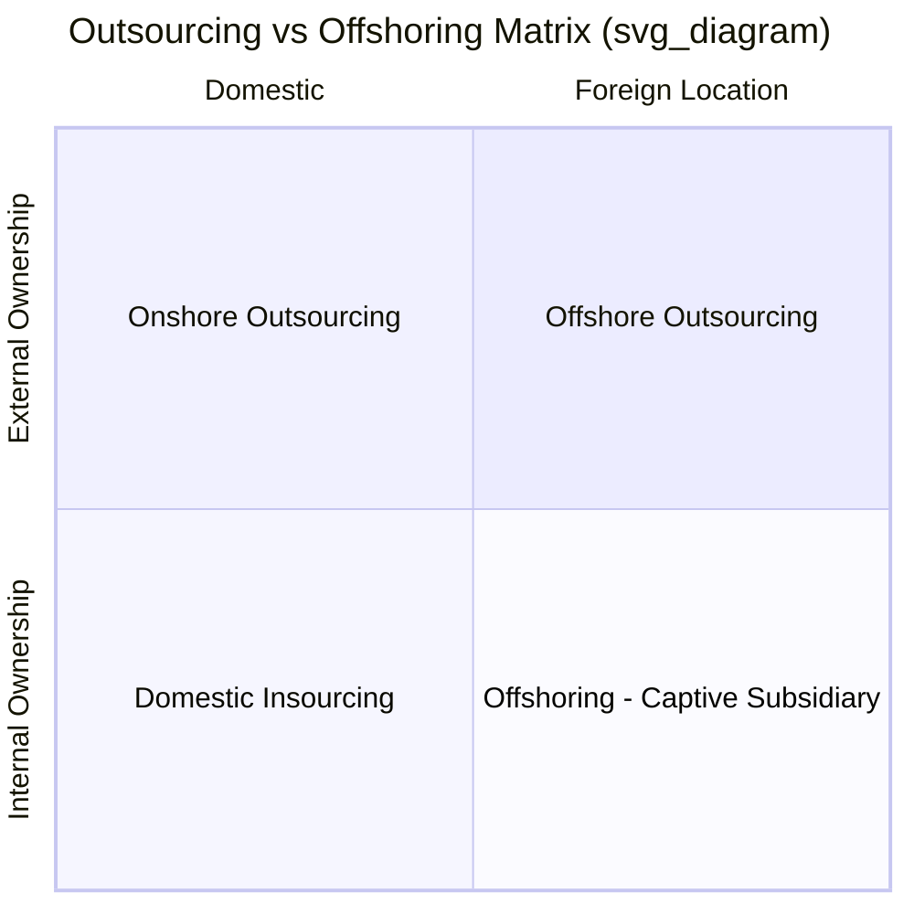
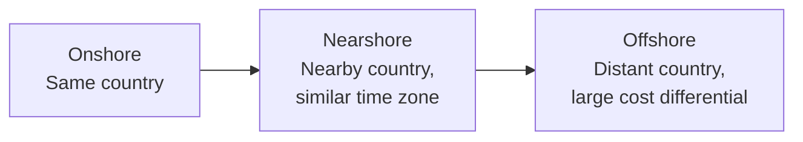
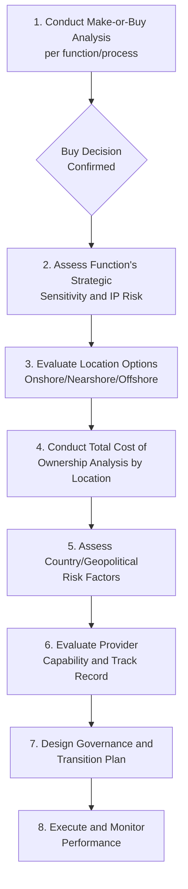

## Outsourcing and Offshoring Strategies

### Definitions and Scope

**Outsourcing** is the contracting of a business function or process to an external, third-party provider — regardless of geographic location — rather than performing it internally. **Offshoring** is the relocation of a business function to a foreign country — regardless of whether the entity performing it is a third party or the firm's own subsidiary. These two dimensions are independent and frequently confused.

**Key Points**

- Outsourcing and offshoring are distinct dimensions (who performs the work vs. where it is performed) that combine into four possible arrangements
- Decisions in this domain should build directly on make-or-buy analysis (the "who" decision) plus a separate location decision (the "where")
- Both are strategic, long-horizon decisions carrying cost, risk, capability, and control trade-offs that extend well beyond simple labor arbitrage

---

### The Four-Quadrant Framework

| Arrangement | Who Performs the Work | Where |
| --- | --- | --- |
| **Domestic Insourcing** | Internal (own employees) | Home country |
| **Onshore/Nearshore Outsourcing** | Third-party provider | Home country or nearby region |
| **Offshoring (Captive)** | Internal (own foreign subsidiary/GCC) | Foreign country |
| **Offshore Outsourcing** | Third-party provider | Foreign country |

**Example**

A US software company evaluating customer support options might consider: (1) keeping support **onshore/insourced** with domestic employees, (2) contracting a US-based third-party call center (**onshore outsourcing**), (3) opening its own support center in the Philippines (**offshoring/captive**), or (4) contracting a Philippines-based BPO firm (**offshore outsourcing**). Each carries a different cost/control/risk profile even though all four could staff an identical function.

---

### Strategic Rationale for Outsourcing

- **Cost reduction** — labor arbitrage, economies of scale at specialized providers, reduced capital investment in non-core infrastructure
- **Focus on core competency** — freeing internal management attention and capital for activities that differentiate the firm competitively
- **Access to specialized expertise** — leveraging a provider's deep domain expertise (e.g., IT security, payroll compliance) without building it internally
- **Flexibility and scalability** — converting fixed internal costs to variable costs, easing capacity scaling up/down with demand
- **Speed to market** — leveraging an established provider's existing capability rather than building from scratch

### Strategic Rationale for Offshoring

- **Labor cost arbitrage** — significant wage differentials for comparable skill levels in different regions
- **Talent access** — accessing specialized skill pools (e.g., software engineering talent concentrations) not sufficiently available domestically
- **Follow-the-sun operations** — leveraging time zone differences for 24/7 coverage (e.g., IT support, software development handoffs)
- **Market proximity** — locating operations near growing foreign markets to better serve local demand and regulatory requirements

---

### Location Strategy Spectrum

| Model | Characteristics | Trade-offs |
| --- | --- | --- |
| **Onshore** | Same country as the buyer | Highest cost, lowest cultural/language/time-zone friction, easiest oversight |
| **Nearshore** | Neighboring or nearby-region country, similar time zone | Moderate cost savings, easier real-time collaboration, reduced travel friction vs. far offshore |
| **Offshore** | Geographically distant, often different time zone | Largest potential cost savings, greatest coordination complexity and time-zone/cultural friction |

---

### Decision Framework

---

### Total Cost of Ownership Beyond Labor Arbitrage

A common strategic error is evaluating offshore outsourcing on headline labor cost differential alone. A full TCO model includes:

$$TCO_{offshore} = C_{labor} + C_{transition} + C_{coordination} + C_{quality\_risk} + C_{travel} + C_{currency\_risk} + C_{IP\_risk}$$

- **Transition costs** — knowledge transfer, process documentation, initial productivity dip during ramp-up
- **Coordination costs** — management overhead for time-zone-separated teams, communication tooling, translation/localization needs
- **Quality risk costs** — potential rework, defect costs, or service failures during the learning curve or from provider capability gaps
- **Travel and oversight costs** — periodic site visits, expatriate management if applicable
- **Currency risk** — exchange rate volatility affecting contracted costs over the relationship's life, particularly for longer-term agreements
- **IP and confidentiality risk** — cost of legal protections, security infrastructure, and the residual risk of intellectual property leakage

**Common Pitfall**: Headline hourly rate comparisons (e.g., "$15/hour offshore vs. $45/hour onshore") frequently overstate the realized savings once coordination overhead, quality/rework costs, and transition investment are fully accounted for — the effective savings margin is often substantially narrower than the raw rate differential suggests. [Inference — the magnitude of this "hidden cost" effect is well-documented directionally in outsourcing literature but varies significantly by function complexity and provider maturity; specific percentage estimates should be validated against the specific engagement rather than assumed universally]

---

### Types of Outsourced/Offshored Functions

| Category | Examples | Typical Model |
| --- | --- | --- |
| **Business Process Outsourcing (BPO)** | Customer service, payroll, HR administration, accounts payable | Offshore outsourcing common (India, Philippines) |
| **IT Outsourcing (ITO)** | Software development, infrastructure management, help desk | Both offshore outsourcing and captive/GCC models common |
| **Knowledge Process Outsourcing (KPO)** | Research, financial analysis, legal process support | Higher-skill offshore locations; growing category |
| **Manufacturing Outsourcing** | Contract manufacturing, component production | Offshore outsourcing to low-cost manufacturing regions |
| **Global Capability Centers (GCCs)** | Captive offshore units performing IT, analytics, or finance functions | Offshoring without outsourcing (owned subsidiary model) |

---

### Governance and Risk Management

#### Service Level Agreements (SLAs)

Formal contractual performance targets (response time, quality/error rate, availability) with associated penalty or incentive structures, essential for maintaining accountability across an arm's-length relationship where direct managerial oversight is reduced.

#### Risk Categories

- **Geopolitical risk** — political instability, trade policy shifts, sanctions exposure in the offshore location
- **Currency risk** — exchange rate volatility affecting long-term contract economics
- **Quality/capability risk** — provider capability gaps, especially during initial engagement stages
- **Data security and compliance risk** — cross-border data transfer regulations (e.g., data residency requirements), cybersecurity exposure
- **Reputational risk** — labor practice concerns or service failures visible to end customers, particularly for customer-facing outsourced functions
- **Concentration risk** — over-dependence on a single provider or single geographic region, creating vulnerability to localized disruption

#### Transition and Knowledge Transfer

A structured transition plan (often phased: knowledge transfer → shadow operation → parallel run → full cutover) reduces the risk of service disruption and quality degradation during handoff from internal or prior-provider operations.

---

### Reshoring and Backsourcing Trends

Organizations periodically reverse outsourcing/offshoring decisions when the original rationale weakens:

- **Reshoring** — returning offshored production/operations to the home country, often driven by narrowing labor cost differentials, rising transportation/logistics costs, quality concerns, or supply chain resilience priorities following disruption events
- **Backsourcing** — bringing a previously outsourced function back in-house, typically driven by dissatisfaction with provider performance, strategic reprioritization of the function as core, or accumulated hidden coordination costs exceeding original savings estimates

[Inference — the relative prevalence and drivers of reshoring trends fluctuate with macroeconomic conditions (labor cost convergence, trade policy, logistics costs) and are actively discussed in current supply chain literature; specific trend magnitude claims should be verified against current industry data given how conditions shift]

---

### Common Pitfalls

- Evaluating offshore outsourcing purely on labor rate differential without a full TCO analysis including coordination, quality, and transition costs
- Outsourcing/offshoring a function that is actually a source of competitive advantage (core competency) purely for short-term cost savings
- Underinvesting in transition planning and knowledge transfer, causing service quality degradation during and after cutover
- Failing to build contractual flexibility (volume adjustment clauses, exit terms) into long-term outsourcing agreements, reducing the ability to reverse the decision if conditions change
- Insufficient attention to data security, IP protection, and regulatory compliance requirements specific to the offshore jurisdiction
- Concentrating critical functions with a single provider or single geographic region without contingency planning for disruption

---

**Related Topics**

- Make-or-buy decision analysis
- Business Process Outsourcing (BPO) and Global Capability Center (GCC) models
- Total Cost of Ownership (TCO) modeling
- Supply chain risk management and geopolitical risk
- Service Level Agreements (SLA) design
- Reshoring and supply chain resilience strategy
- Cross-cultural management in global operations
- Vendor governance and contract management