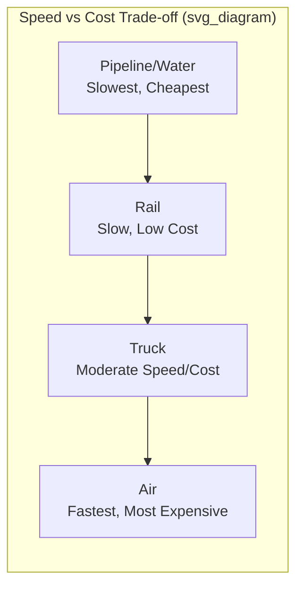

## Transportation Mode Selection and Management

### Definition and Scope

Transportation mode selection is the process of choosing among available shipping methods — road, rail, air, water, pipeline, and intermodal combinations — to move goods between origin and destination, balancing cost, speed, reliability, capacity, and product characteristics. Transportation management extends this into the ongoing operational execution: carrier selection, routing, load consolidation, and performance monitoring.

**Key Points**

- No single mode dominates on all dimensions — mode selection is inherently a multi-criteria trade-off, not a search for a universally "best" option
- The optimal mode often varies by shipment (product value, urgency, volume) even within the same company's network
- Transportation cost is frequently the single largest logistics cost component, making mode and carrier decisions high-leverage for total supply chain cost

---

### The Five Primary Transportation Modes

| Mode | Speed | Cost | Capacity | Flexibility | Typical Use Case |
| --- | --- | --- | --- | --- | --- |
| **Truck (Road)** | Moderate-fast | Moderate | Moderate | Highest — door-to-door | Short-medium haul, flexible scheduling, final-mile |
| **Rail** | Slow-moderate | Low (per ton-mile) | Very high | Low — fixed routes/terminals | Bulk commodities, long-haul, low time-sensitivity |
| **Air** | Fastest | Highest | Low | Moderate | High-value, perishable, urgent/time-critical goods |
| **Water (Ocean/Barge)** | Slowest | Lowest (per ton-mile) | Highest | Lowest — port-to-port only | International bulk trade, low time-sensitivity, high volume |
| **Pipeline** | Continuous/slow | Very low | High (for eligible products) | Very low — fixed infrastructure | Liquids/gases (oil, natural gas, chemicals) only |

---

### Mode Selection Criteria

#### 1. Cost

Transportation cost per unit shipped, typically expressed per ton-mile or per unit-distance, varies by orders of magnitude across modes. Water and pipeline offer the lowest per-unit cost for eligible cargo; air carries the highest premium.

#### 2. Transit Time and Speed

Time-sensitive goods (perishables, high-demand-volatility products, expedited customer commitments) favor faster modes despite cost premium; low-urgency, high-volume goods favor slower, cheaper modes.

#### 3. Reliability and Consistency

Variability in transit time (not just average speed) matters significantly for inventory planning — a mode with a longer but highly consistent transit time may require less safety stock than a faster but variable one.

$$SS_{transport} = z \cdot \bar{D} \cdot \sigma_{LT}$$

where $\bar{D}$ is average demand rate and $\sigma_{LT}$ is the standard deviation of transit lead time — demonstrating that transit time *variability*, not just average duration, directly drives required safety stock.

#### 4. Accessibility/Flexibility

Truck transport offers unmatched door-to-door flexibility; rail, water, and pipeline require fixed terminal/port infrastructure and typically need complementary drayage (short-haul trucking) to complete the origin/destination connection.

#### 5. Capacity and Volume

Bulk commodities (grain, coal, crude oil, ore) favor high-capacity modes (rail, water, pipeline) where available infrastructure exists; smaller or fragmented shipment volumes often favor truck.

#### 6. Product Characteristics

- Perishability (favors speed: air, expedited truck)
- Value density (high value-to-weight ratio can absorb air freight premium; low value-density bulk commodities cannot)
- Hazardous material classification (affects mode eligibility and regulatory requirements)
- Fragility/handling sensitivity

---

### The Cost-Service Trade-off Framework

$$\text{Total Logistics Cost} = C_{transport} + C_{inventory} + C_{stockout}$$

A critical insight in mode selection: minimizing transportation cost alone can increase total logistics cost, because slower/cheaper modes require more safety stock and in-transit inventory to buffer against longer, potentially more variable lead times.

**Example**

An electronics retailer ships from an Asian manufacturing hub to a US distribution center. Comparing ocean freight versus air freight:

| Factor | Ocean | Air |
| --- | --- | --- |
| Freight cost per unit | $2.00 | $18.00 |
| Transit time | 28 days | 3 days |
| In-transit + safety stock carrying cost (25 vs. 3 days buffer) | Higher | Lower |
| Total landed cost per unit (illustrative) | $2.00 + $3.50 inventory carrying = $5.50 | $18.00 + $0.40 inventory carrying = $18.40 |

**Output**: For this steady-demand product, ocean freight remains total-cost-superior despite the inventory carrying cost penalty. However, for a high-demand-volatility, short-product-lifecycle item (e.g., a fashion or seasonal product with high stockout/obsolescence cost), the calculus can reverse — the inventory and stockout cost savings from air's speed may outweigh the freight premium. [Inference — the specific figures above are illustrative for demonstrating the trade-off logic, not universal benchmarks; actual costs vary significantly by lane, carrier, fuel prices, and product]

---

### Intermodal Transportation

Combining two or more modes for a single shipment, typically to capture the cost advantage of long-haul modes (rail, water) while retaining the door-to-door flexibility of trucking for first/last-mile segments.

- **Containerization** enables efficient mode transfer without unpacking/repacking cargo (standardized container dimensions across truck chassis, rail cars, and ocean vessels)
- Intermodal rail-truck combinations are common for long-haul domestic freight, balancing rail's cost efficiency over distance against truck's terminal-to-door flexibility
- International shipments routinely combine ocean (long-haul international leg) with truck or rail drayage on both ends

---

### Carrier Selection and Management

Beyond mode, selecting specific carriers within a chosen mode involves additional criteria:

- **Network coverage** — geographic reach matching the shipper's origin/destination footprint
- **Capacity reliability** — ability to secure space during peak demand periods (particularly relevant in tight freight markets)
- **Rate structure** — contract rates vs. spot market pricing, fuel surcharge terms
- **Technology integration** — EDI/API connectivity for track-and-trace visibility, automated tendering
- **Service performance history** — on-time delivery rate, damage/claims rate, responsiveness

#### Carrier Relationship Models

| Model | Description | Trade-off |
| --- | --- | --- |
| **Asset-based carriers** | Own their own trucks/equipment (private fleet or dedicated contract carriage) | Higher control and reliability; higher fixed cost commitment |
| **Non-asset-based / Freight brokers** | Arrange transportation via third-party carrier networks without owning equipment | Flexibility, capacity access during surges; less direct control |
| **Third-Party Logistics (3PL)** | Outsourced logistics management across multiple functions (transportation, warehousing) | Operational simplification; dependency on provider performance |
| **Fourth-Party Logistics (4PL)** | Non-asset-owning logistics integrator managing multiple 3PLs/carriers on the shipper's behalf | Strategic oversight and optimization; adds a management layer/cost |

---

### Transportation Management Systems (TMS)

Software platforms supporting the operational execution of mode/carrier decisions:

- **Load planning and consolidation** — optimizing shipment groupings to maximize vehicle/container utilization and minimize empty-mile waste
- **Route optimization** — algorithmic routing to minimize distance/time/cost subject to delivery windows and constraints
- **Freight rate management** — carrier rate comparison, contract vs. spot rate optimization, automated tendering to carrier networks
- **Track-and-trace visibility** — real-time shipment status via GPS/telematics integration and EDI updates (e.g., EDI 214 shipment status)
- **Freight audit and payment** — automated invoice reconciliation against contracted rates

---

### Key Performance Metrics

| Metric | Purpose |
| --- | --- |
| On-time delivery (OTD) % | Reliability of the mode/carrier combination |
| Freight cost per unit/ton-mile | Cost efficiency benchmark, often segmented by mode and lane |
| Cargo damage/claims rate | Product integrity during transit |
| Capacity utilization (load factor) | Efficiency of vehicle/container fill, directly affecting per-unit transport cost |
| Transit time variability | Consistency, driving safety stock requirements |
| Carbon emissions per shipment | Increasingly tracked sustainability metric across mode choices |

---

### Sustainability Considerations in Mode Selection

Transportation mode carries substantially different carbon intensity per ton-mile, adding an increasingly weighted criterion alongside cost and service:

$$\text{Emissions Intensity: Pipeline/Water} < \text{Rail} < \text{Truck} < \text{Air}$$

(directionally, from lowest to highest carbon emissions per ton-mile moved) [Inference — precise relative emissions figures vary by specific vehicle/vessel technology, fuel type, and route efficiency; the directional ranking is well-supported in transportation and logistics literature but exact multipliers should be sourced from current lifecycle emissions studies for any specific application]. Organizations with sustainability commitments increasingly incorporate a carbon cost or constraint into mode selection decisions alongside traditional cost/service trade-offs.

---

### Common Pitfalls

- Optimizing transportation cost in isolation without accounting for the resulting inventory carrying cost impact of longer/slower modes (total logistics cost, not transport cost alone, should drive the decision)
- Failing to account for transit time *variability*, not just average transit time, when setting safety stock and service level expectations
- Over-relying on spot market carrier capacity in tight freight markets, exposing the organization to price volatility and service disruption risk
- Under-utilizing load consolidation opportunities, leaving vehicle/container capacity underfilled and inflating per-unit transportation cost
- Selecting mode/carrier purely on cost without adequately weighting reliability, particularly for products where stockout cost is high
- Neglecting to build contractual capacity commitments or diversified carrier relationships, creating single-point-of-failure risk during demand surges or market disruptions

---

**Related Topics**

- Total logistics cost and cost-service trade-off analysis
- Multi-echelon inventory optimization and safety stock modeling
- Third-Party Logistics (3PL) and Fourth-Party Logistics (4PL) models
- Transportation Management Systems (TMS) architecture
- Intermodal and containerization standards
- Freight rate structures and contract vs. spot market dynamics
- Supply chain sustainability and carbon footprint measurement
- Warehouse and distribution center location strategy