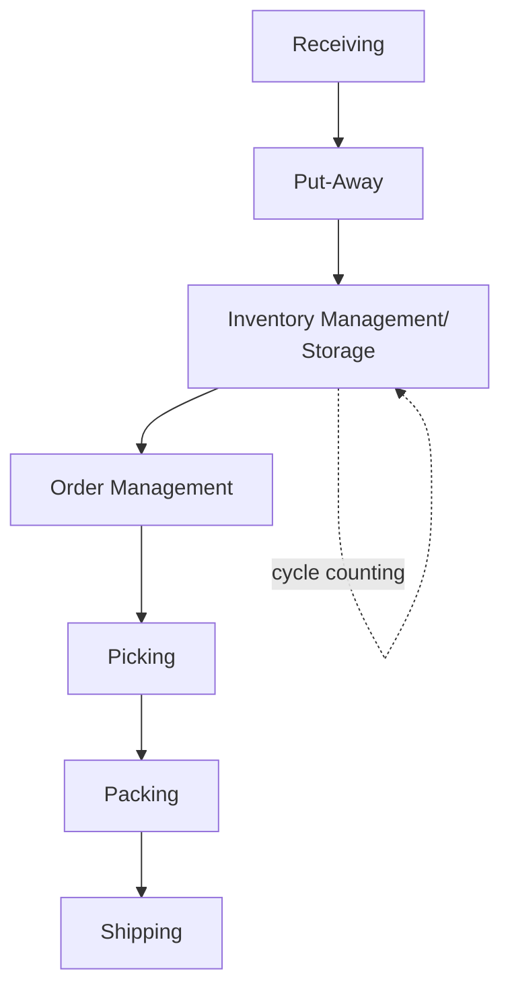
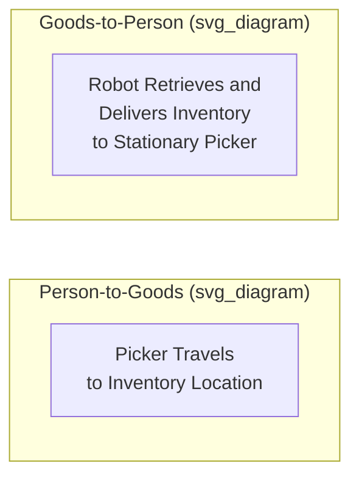
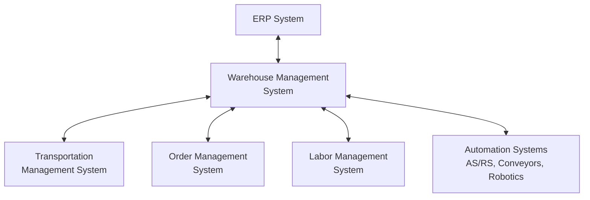

## Warehouse Management Systems

### Definition and Scope

A Warehouse Management System (WMS) is software that controls and optimizes the day-to-day operations of a warehouse or distribution center — governing inventory tracking, receiving, put-away, picking, packing, and shipping processes to maximize space utilization, labor productivity, and order accuracy.

**Key Points**

- A WMS is distinct from a broader ERP inventory module — it operates at a more granular, real-time operational level (bin/location-specific tracking, task-level labor management) rather than aggregate financial/planning inventory records
- Modern WMS platforms increasingly integrate with automation (robotics, conveyor systems) and real-time labor management rather than functioning as passive record-keeping systems
- WMS selection and configuration should be matched to warehouse complexity (SKU count, order profile, automation level) — over-engineering a simple operation wastes investment, while under-provisioning a complex one creates operational bottlenecks

---

### Core Functional Modules

#### 1. Receiving

Manages inbound goods intake — matching against purchase orders/advance shipping notices (ASNs), quality inspection triggers, and system inventory record creation, often using barcode/RFID scanning to eliminate manual data entry errors.

#### 2. Put-Away

Directs incoming inventory to optimal storage locations based on configured logic (e.g., velocity-based slotting, zone restrictions for hazardous materials, FIFO/FEFO lot sequencing requirements).

#### 3. Inventory Management

Maintains real-time, location-specific inventory visibility (bin-level accuracy) and supports **cycle counting** (continuous, rolling physical inventory verification of a subset of locations) as an alternative to disruptive full physical inventory counts.

#### 4. Order Management and Wave Planning

Groups outbound orders into "waves" for efficient batch processing, optimizing the sequence and grouping of picks to minimize travel time and labor.

#### 5. Picking

Directs and tracks the physical retrieval of items for outbound orders using one or more picking methodologies (see below).

#### 6. Packing

Manages carton/pallet building, weight and dimension capture, and packing verification against the order.

#### 7. Shipping

Generates shipping documentation, carrier labels, and manifest data, often integrated directly with a Transportation Management System (TMS) for carrier selection and load planning.

---

### Picking Methodologies

| Method | Description | Best Fit |
| --- | --- | --- |
| **Discrete (single-order) picking** | One picker completes one order at a time, start to finish | Low order volume, high accuracy requirements |
| **Batch picking** | One picker collects items for multiple orders in a single pass | Moderate order volume with overlapping SKUs |
| **Zone picking** | Warehouse divided into zones; each picker works only within their assigned zone | Large warehouses, high SKU diversity |
| **Wave picking** | Orders released in scheduled batches ("waves") aligned to shipping cutoffs | Time-sensitive shipping schedule coordination |
| **Cluster picking** | Picker simultaneously fulfills multiple orders using a cart with multiple totes | High-volume, small-item e-commerce fulfillment |

**Example**

An e-commerce fulfillment center processing 5,000 small-parcel orders daily switches from discrete picking (one picker walks the entire warehouse per order) to cluster batch picking (one picker uses a multi-tote cart to fulfill 12 orders per pass, guided by the WMS's optimized pick path).

**Output**: Reported industry case studies of similar transitions commonly show substantial reductions in picker travel time per order and corresponding increases in orders picked per labor-hour, since travel time — not the physical pick action itself — typically constitutes the majority of picking labor time in manual warehouse operations. [Inference — specific productivity gain percentages are highly dependent on warehouse layout, SKU velocity distribution, and order profile; treat any single case study's improvement figures as illustrative rather than a guaranteed outcome]

---

### Slotting Optimization

Slotting is the strategic assignment of SKUs to specific storage/pick locations to minimize travel time and labor, typically driven by:

- **Velocity-based slotting** — high-velocity (fast-moving) SKUs placed in the most accessible, closest-to-shipping locations
- **ABC analysis** applied to storage location assignment, paralleling its use in inventory classification
- **Affinity slotting** — SKUs frequently ordered together placed in proximity to reduce combined pick travel
- **Size/weight-based slotting** — heavier or bulkier items placed at ergonomically appropriate and structurally suitable locations

$$\text{Travel Time} \propto \sum_{i} d_i \cdot f_i$$

where $d_i$ is the distance to SKU $i$'s location and $f_i$ is its pick frequency — slotting optimization seeks to minimize this sum by placing high-frequency SKUs at minimal-distance locations.

---

### Automation Integration

Modern WMS platforms increasingly serve as the orchestration layer connecting to physical automation systems rather than operating purely as a human-labor-directing system:

- **Automated Storage and Retrieval Systems (AS/RS)** — automated cranes/shuttles retrieving inventory from high-density storage without human travel into the storage area
- **Conveyor and sortation systems** — automated product movement and order-based sortation, reducing manual material handling
- **Pick-to-light / Put-to-light systems** — light-directed guidance reducing picker search time and error rate
- **Autonomous Mobile Robots (AMRs) and Goods-to-Person (G2P) systems** — robots bringing inventory to stationary pickers rather than pickers traveling to inventory, inverting the traditional picker-travels model
- **Voice-directed picking** — hands-free, voice-guided picking instructions improving speed and reducing error versus paper-based picking

---

### Integration Architecture

A WMS typically sits within a broader systems architecture, integrating with:

- **ERP systems** — for financial inventory valuation, procurement, and order management synchronization
- **Transportation Management Systems (TMS)** — for coordinated outbound shipment planning and carrier assignment
- **Order Management Systems (OMS)** — particularly critical in omnichannel retail for unified inventory visibility across fulfillment channels
- **Labor Management Systems (LMS)** — often embedded within or tightly integrated with WMS for engineered labor standards and productivity tracking
- **Automation control systems** — direct integration (via APIs or middleware) with physical automation equipment (AS/RS, conveyors, robotics)

---

### Key Performance Metrics

| Metric | Purpose |
| --- | --- |
| Order accuracy rate | % of orders picked/shipped without error |
| Units picked per labor-hour | Core productivity metric |
| Inventory accuracy | % agreement between system records and physical counts, typically maintained via cycle counting |
| Dock-to-stock time | Time from inbound receipt to available-for-pick inventory status |
| Order cycle time | Time from order release to shipment |
| Storage utilization | % of available storage capacity effectively utilized |
| On-time shipment rate | % of orders shipped by required cutoff |

---

### Selection and Implementation Considerations

- **Warehouse complexity fit** — SKU count, order profile diversity, and automation level should drive WMS tier selection (basic inventory tracking vs. full engineered-labor, automation-orchestrating platform)
- **Cloud vs. on-premise deployment** — cloud-based WMS platforms have become increasingly standard, offering faster deployment and easier scaling versus traditional on-premise installations
- **Configurability vs. complexity trade-off** — highly configurable platforms offer flexibility but require more implementation effort; less configurable platforms deploy faster but may constrain future process changes
- **Integration readiness** — evaluating existing ERP/TMS/automation compatibility before platform selection to avoid costly custom integration work

---

### Common Pitfalls

- Selecting a WMS platform mismatched to actual operational complexity — either over-engineered (unnecessary cost/complexity for a simple operation) or under-provisioned (bottlenecks in a high-volume, high-SKU environment)
- Poor initial data quality (SKU master data, location mapping) undermining system accuracy from go-live
- Underinvesting in slotting optimization, leaving significant unrealized travel-time reduction potential even with a capable WMS platform in place
- Insufficient integration testing with existing ERP/TMS systems, causing inventory record discrepancies between systems post-implementation
- Treating WMS implementation as a pure technology project rather than a process redesign effort requiring warehouse operations stakeholder involvement
- Neglecting ongoing cycle counting discipline, allowing inventory accuracy to degrade over time despite an accurate system at go-live

---

**Related Topics**

- Transportation Management Systems (TMS) and transportation mode selection
- Slotting optimization and warehouse layout design
- Multi-echelon inventory optimization
- ABC/XYZ inventory classification
- Warehouse automation (AS/RS, AMRs, robotics)
- Omnichannel fulfillment and order management systems
- Labor management and engineered labor standards
- Distribution center network design