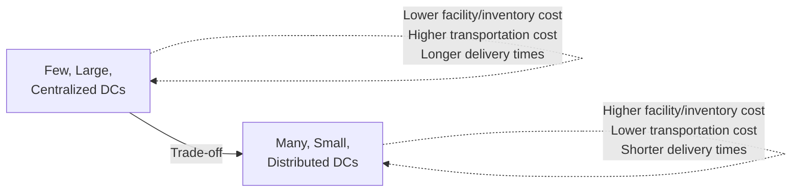
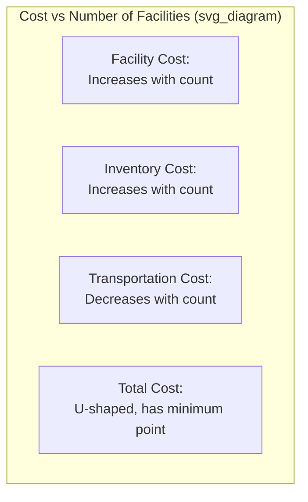
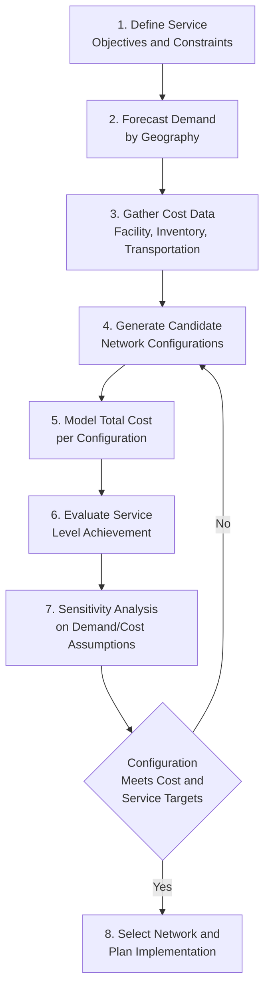
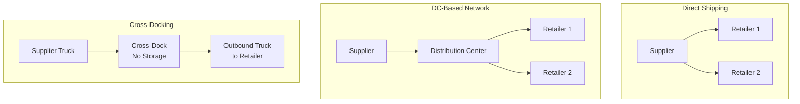

## Distribution Network Design

### Definition and Scope

Distribution network design is the strategic process of determining the optimal number, location, size, and function of facilities (distribution centers, warehouses, cross-dock terminals) within a supply chain, along with the transportation flows connecting them, to balance total cost against customer service objectives.

**Key Points**

- Network design decisions are typically long-horizon and capital-intensive (facility leases/construction, equipment investment), making them costly to reverse — the analysis warrants significant rigor relative to shorter-horizon operational decisions
- The core tension is nearly always between **cost** (fewer, larger, more centralized facilities capture scale economies) and **service** (more, smaller, more distributed facilities reduce delivery time/distance to customers)
- Network design should be revisited periodically as demand geography, transportation costs, and customer service expectations evolve — not treated as a one-time decision

---

### The Cost-Service Trade-off

$$\text{Total Network Cost} = C_{facility} + C_{inventory} + C_{transportation} + C_{stockout/service}$$

As the number of facilities in a network increases:

- **Facility (fixed) costs increase** — more leases, more equipment, more fixed overhead
- **Total inventory increases** — safety stock must be held at each location, and aggregation/risk-pooling benefits diminish (see below)
- **Outbound transportation cost decreases** — shorter last-mile distances to customers
- **Inbound transportation cost may increase** — more locations to replenish from fewer sources
- **Delivery time/customer service improves** — proximity reduces transit time to end customers

The total cost curve is typically U-shaped as a function of facility count, implying an identifiable cost-minimizing network size before diminishing transportation savings are outweighed by rising facility and inventory costs.

---

### The Risk Pooling Principle

A central theoretical justification for facility consolidation: aggregating inventory across a smaller number of larger facilities reduces total required safety stock, because demand variability partially cancels out across pooled demand.

$$\sigma_{pooled} = \sqrt{\sum_{i=1}^{n} \sigma_i^2 + 2\sum_{i<j}\rho_{ij}\sigma_i\sigma_j}$$

For imperfectly correlated demand across regions ($\rho_{ij} < 1$), pooled standard deviation is less than the sum of individual standard deviations, meaning:

$$SS_{pooled} < \sum_{i=1}^{n} SS_i$$

**Example**

A retailer serving five regions independently from five regional DCs, each requiring safety stock of $SS_i = z\sigma_i\sqrt{L}$, consolidates into two larger regional DCs. Assuming demand across regions is imperfectly correlated (e.g., $\rho \approx 0.3$), the consolidated network's total required safety stock is meaningfully lower than the sum of the five independent buffers — the same aggregate service level is achieved with less total inventory investment, precisely because pooled variability is smaller than the sum of individual variabilities. This is the same underlying statistical principle applied in multi-echelon inventory optimization.

**Trade-off**: Risk pooling's inventory savings must be weighed against the resulting increase in average distance (and thus transportation cost and delivery time) to end customers — consolidation is favorable when inventory/facility savings outweigh the transportation/service cost of increased distance, and unfavorable when the reverse holds (e.g., for bulky, low-value, high-transportation-cost products, or markets with strict delivery time requirements).

---

### Network Design Process

---

### Facility Location Modeling Approaches

#### Center-of-Gravity Method

A simplified heuristic for estimating an optimal single-facility location, minimizing weighted transportation distance to demand points.

$$x^* = \frac{\sum_{i} w_i x_i}{\sum_i w_i}, \quad y^* = \frac{\sum_i w_i y_i}{\sum_i w_i}$$

where $(x_i, y_i)$ are the coordinates of demand point $i$ and $w_i$ is its demand volume (weight). This produces a demand-weighted geographic centroid, useful as a starting heuristic but simplified — it does not directly account for actual transportation network routing, rate structures, or multi-facility interactions.

#### Mixed-Integer Programming (MIP) Optimization

The rigorous approach for multi-facility network design, formulated as an optimization problem:

$$\min \sum_{j} F_j y_j + \sum_{i,j} C_{ij} x_{ij}$$

subject to demand satisfaction, capacity, and single-sourcing (or allowed multi-sourcing) constraints, where $F_j$ is the fixed cost of opening facility $j$, $y_j$ is a binary decision variable (1 if facility $j$ is opened), $C_{ij}$ is the cost to serve demand point $i$ from facility $j$, and $x_{ij}$ is the flow/allocation variable.

This is typically solved using commercial network optimization software (e.g., supply chain design modules within tools like Coupa/LLamasoft, AIMMS, or custom solvers), since realistic problems with many candidate locations and demand points exceed manageable manual analysis.

#### Simulation-Based Approaches

Monte Carlo simulation modeling demand variability, lead time variability, and disruption scenarios across candidate network configurations — more computationally intensive than deterministic MIP but better captures stochastic effects and can incorporate service-level distributions rather than only expected-value costs.

---

### Types of Distribution Network Structures

| Structure | Description | Best Fit |
| --- | --- | --- |
| **Direct shipping** | Goods shipped directly from source to destination, bypassing intermediate facilities | Full truckload volumes, simple networks, low SKU complexity |
| **DC-based (traditional warehousing)** | Goods stored at a DC, then distributed to downstream locations | Moderate demand variability, need for inventory buffering |
| **Cross-docking** | Goods transferred directly from inbound to outbound vehicles with minimal/no storage | High-volume, predictable flow, minimizing inventory holding |
| **Milk-run/consolidated pickup** | Single vehicle collects small quantities from multiple suppliers on a fixed route | Frequent, small-volume replenishment from multiple sources |

---

### Key Inputs and Data Requirements

- **Demand data by geography** — historical and forecasted demand disaggregated to sufficient geographic granularity (zip code, region) to support location modeling
- **Facility cost data** — fixed costs (lease/construction, equipment) and variable operating costs by candidate location, which vary significantly by labor market, real estate cost, and utility rates
- **Transportation rate data** — inbound and outbound freight rates by mode and lane, ideally reflecting realistic carrier network rates rather than simplified per-mile estimates
- **Service level requirements** — target delivery time by customer segment/geography, often a binding constraint in the optimization rather than a cost trade-off variable
- **Inventory policy assumptions** — safety stock and cycle stock policies feeding facility-level inventory cost estimates, connecting directly to multi-echelon inventory optimization

---

### Common Pitfalls

- Treating network design as a one-time strategic project rather than a periodically revisited discipline as demand geography and cost structures shift
- Using overly simplified distance/cost models (e.g., straight-line distance) that don't reflect actual transportation network routing, rates, and constraints
- Optimizing purely for cost minimization without adequately constraining or weighting service level requirements, producing a network that is cheap but fails customer expectations
- Underestimating the risk-pooling inventory benefit of consolidation, biasing decisions toward excessive facility proliferation
- Failing to account for facility-level operating cost variation (labor market, real estate, utility costs) across candidate locations, relying only on transportation distance
- Insufficient sensitivity analysis — network designs optimized against a single demand forecast can perform poorly if actual demand patterns diverge meaningfully from the forecast used

[Inference — the magnitude of risk-pooling inventory savings and the specific shape of the cost-service trade-off curve are well-established directionally in operations research literature, but exact quantitative results are highly dependent on the specific demand correlation structure, cost data, and network configuration of each organization; the illustrative example above demonstrates the principle rather than providing a generalizable savings estimate]

---

**Related Topics**

- Multi-echelon inventory optimization and safety stock modeling
- Transportation mode selection and management
- Warehouse management systems
- Center-of-gravity and mixed-integer programming location models
- Risk pooling and demand aggregation strategies
- Cross-docking operations design
- Supply chain network resilience and disruption planning
- Omnichannel fulfillment network strategy