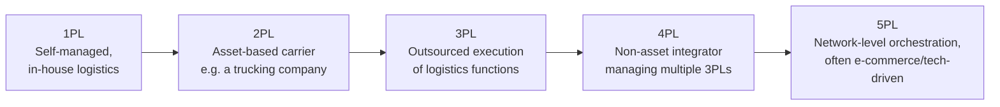
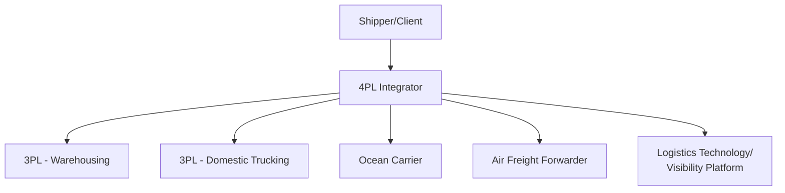
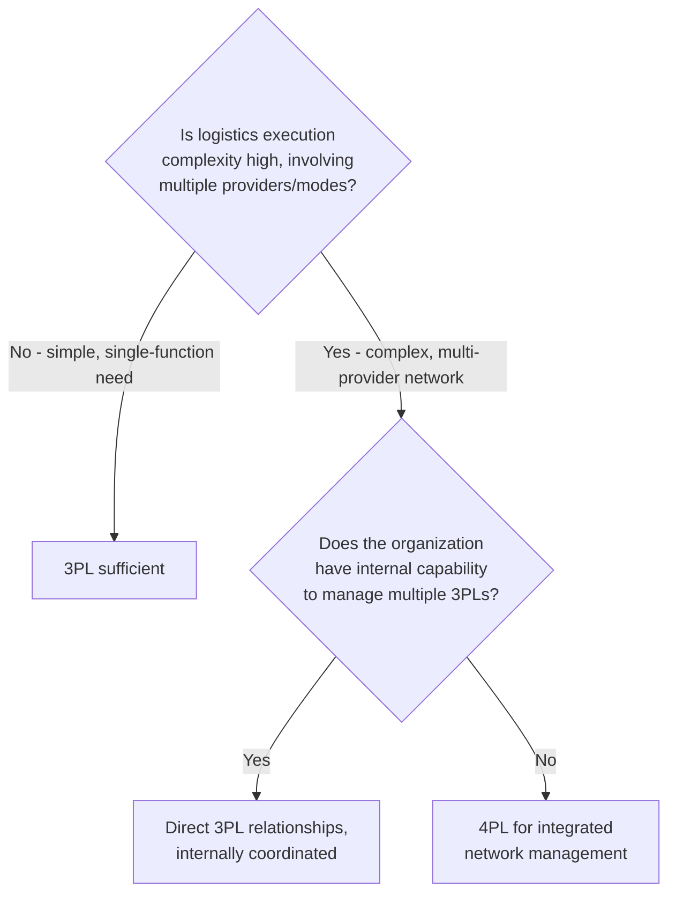

## Third-Party and Fourth-Party Logistics

### Definition and Scope

**Third-Party Logistics (3PL)** refers to outsourcing one or more logistics functions — transportation, warehousing, distribution, freight forwarding — to an external provider that executes these operations on the shipper's behalf. **Fourth-Party Logistics (4PL)** extends this further: a non-asset-owning integrator that manages and coordinates multiple 3PLs and other logistics resources on the shipper's behalf, functioning as a single point of accountability for the entire logistics function rather than executing operations directly.

**Key Points**

- The core distinction is ownership and scope: 3PLs typically own or directly operate physical assets/execution (trucks, warehouses, labor); 4PLs typically own no physical assets and instead provide management, technology, and coordination across multiple providers (which may include 3PLs)
- Both models sit on the outsourcing spectrum introduced in outsourcing/offshoring strategy — logistics-specific application of the broader make-or-buy decision
- Adoption of either model should be evaluated against the same strategic lens as any outsourcing decision: is logistics execution a core competency and source of competitive advantage for this organization, or a supporting function better delegated to a specialist?

---

### The Logistics Outsourcing Spectrum

| Tier | Description | Asset Ownership |
| --- | --- | --- |
| **1PL** | Shipper manages all logistics internally | Owns assets (or none needed — self-managed) |
| **2PL** | A single-mode asset-based carrier (e.g., ocean carrier, trucking company) providing point-to-point transport | Owns transportation assets |
| **3PL** | External provider executing one or more logistics functions on the shipper's behalf | May own assets (asset-based) or not (non-asset-based/broker) |
| **4PL** | Integrator managing and optimizing multiple logistics providers/3PLs as a single accountable partner | Typically owns no physical assets |
| **5PL** | Network-level logistics orchestration across multiple supply chains, often enabled by advanced technology/platforms | Typically owns no physical assets; technology-centric |

[Inference — the 5PL categorization is used inconsistently across industry sources and is not as universally standardized a term as 3PL/4PL; treat it as an emerging/less formalized extension of the concept rather than an established, uniformly defined tier]

---

### Third-Party Logistics (3PL) in Depth

#### Service Scope

3PL providers typically offer some combination of:

- **Transportation management** — carrier selection, freight brokerage, route planning
- **Warehousing and distribution** — storage, pick/pack/ship execution, often using the 3PL's own facilities and WMS
- **Freight forwarding** — international shipment coordination, customs brokerage, documentation
- **Value-added services** — kitting, labeling, light assembly, returns processing (reverse logistics)

#### Asset-Based vs. Non-Asset-Based 3PLs

| Type | Description | Trade-off |
| --- | --- | --- |
| **Asset-based 3PL** | Owns trucks, warehouses, and/or equipment used to fulfill services | Greater control/reliability of capacity; less flexibility to shift providers |
| **Non-asset-based 3PL (broker/manager)** | Arranges capacity through a network of carriers/facilities without owning them | Greater flexibility and market-rate access; less direct control over execution quality |

#### Contract Structures

- **Transactional/spot engagement** — per-shipment or short-term arrangements, typically for lower-complexity, commodity logistics needs
- **Dedicated contract logistics** — long-term, often facility- or fleet-dedicated arrangements where the 3PL operates assets exclusively (or primarily) for one shipper, blurring toward a captive-like relationship despite third-party ownership
- **Gain-sharing/performance-based contracts** — pricing structures tying 3PL compensation partly to achieved cost savings or service improvements, aligning incentives beyond a simple fee-for-service model

**Example**

A mid-sized consumer goods company outsources its West Coast distribution to a 3PL under a dedicated contract logistics arrangement. The 3PL operates a dedicated warehouse facility and fleet exclusively for this client, integrating its WMS with the client's ERP via API. The contract includes performance-based incentives: the 3PL earns a bonus for exceeding a 98% on-time-in-full (OTIF) target and incurs penalties for falling below 95%, aligning the provider's operational incentives directly with the shipper's service commitments to its own customers.

---

### Fourth-Party Logistics (4PL) in Depth

#### Core Value Proposition

A 4PL acts as a single point of accountability and strategic orchestration layer across a shipper's entire logistics network — potentially managing multiple 3PLs, carriers, and technology systems — rather than executing any single logistics function itself.

#### Key Functions

- **Network design and optimization** — strategic oversight of the shipper's overall logistics network structure, extending into distribution network design decisions
- **Provider selection and management** — selecting, contracting, and continuously managing the performance of multiple underlying 3PLs and carriers
- **Technology and visibility integration** — providing a unified control-tower view across otherwise fragmented provider systems
- **Continuous improvement and strategic consulting** — ongoing analysis and recommendation of network/provider changes as conditions evolve, functioning more as a strategic logistics partner than a transactional vendor

#### Organizational Models for 4PL Engagement

| Model | Description |
| --- | --- |
| **Industry innovator** | An existing 3PL evolves to also offer 4PL-style management services for select clients |
| **Solution integrator** | A neutral, independent 4PL with no asset ownership, purely coordinating third-party providers |
| **Synergy plus** | A joint venture between the shipper and a 4PL provider, sharing risk and management responsibility |

[Inference — this typology reflects commonly referenced categorizations in logistics management literature; specific naming conventions vary across sources]

---

### 3PL vs. 4PL Decision Framework

| Factor | Favors 3PL (Direct) | Favors 4PL |
| --- | --- | --- |
| Logistics complexity | Single function, single mode | Multi-modal, multi-provider network |
| Internal management capability | Sufficient internal logistics expertise | Limited internal capacity to coordinate multiple providers |
| Scope | Discrete, well-defined service need | End-to-end network strategy and optimization |
| Accountability preference | Comfortable managing multiple vendor relationships directly | Prefers single point of accountability across a fragmented provider base |

---

### Benefits and Risks

**Benefits (both models)**

- Access to specialized logistics expertise and technology without direct capital investment
- Scalability — converting fixed logistics costs to variable costs that flex with volume
- Focus on core business competencies, delegating non-differentiating logistics execution
- 4PL specifically adds: reduced management complexity from consolidating multiple provider relationships into one accountable partner

**Risks**

- **Loss of direct control** over service execution and customer experience, particularly acute in customer-facing logistics (e.g., last-mile delivery)
- **Dependency risk** — over-reliance on a single provider (3PL or especially 4PL, given its broader scope) creates vulnerability if that relationship deteriorates or the provider experiences its own operational issues
- **Margin layering (4PL specific)** — an additional management layer/fee sits atop the underlying 3PL/carrier costs, requiring the 4PL's coordination value to genuinely exceed this added cost
- **Data and visibility gaps** — integration quality between the shipper's systems and provider systems directly determines whether real-time visibility promises are actually realized in practice
- **Transition and switching costs** — as with any outsourcing arrangement, exiting or changing 3PL/4PL relationships carries knowledge transfer and operational disruption risk

---

### Selection Criteria

- **Service scope alignment** — does the candidate provider's capability match the specific functions needed (warehousing, transportation, freight forwarding, value-added services)?
- **Geographic coverage** — network reach matching the shipper's current and anticipated future footprint
- **Technology and integration capability** — API/EDI connectivity, real-time visibility, WMS/TMS sophistication
- **Financial stability** — particularly important given the operational dependency created by outsourcing critical logistics functions
- **Industry-specific experience** — familiarity with relevant regulatory, handling, or service requirements (e.g., cold chain, hazardous materials, high-value goods)
- **Cultural and relationship fit** — for long-term dedicated or 4PL relationships, alignment on service philosophy and communication style matters significantly given the depth of ongoing collaboration required

---

### Common Pitfalls

- Selecting a 3PL/4PL primarily on price without adequately weighting service reliability, technology integration, and financial stability
- Outsourcing a logistics function that is actually strategically differentiating (e.g., a company whose competitive advantage rests substantially on delivery speed/reliability) without adequate service-level safeguards
- Insufficient contractual SLA definition and enforcement mechanisms, leaving performance accountability ambiguous
- Underestimating integration effort between shipper and provider systems, resulting in visibility gaps that undermine the outsourcing arrangement's core value proposition
- For 4PL arrangements specifically, failing to validate that the coordination/management fee layer delivers genuine network optimization value beyond what could be achieved managing 3PLs directly
- Neglecting contingency planning for provider failure or underperformance, particularly problematic given the broader blast radius of a 4PL relationship spanning the entire logistics network

---

**Related Topics**

- Outsourcing and offshoring strategies (broader make-or-buy framework)
- Distribution network design
- Transportation mode selection and management
- Warehouse management systems
- Service Level Agreements (SLA) design and enforcement
- Supply chain visibility and control tower technology
- Reverse logistics and returns management
- Vendor governance and contract management