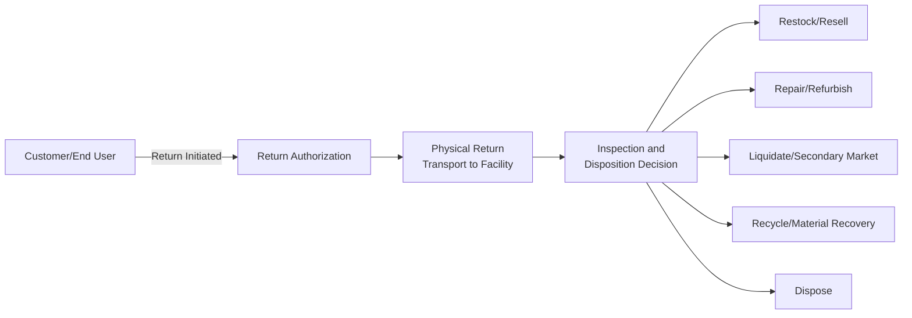
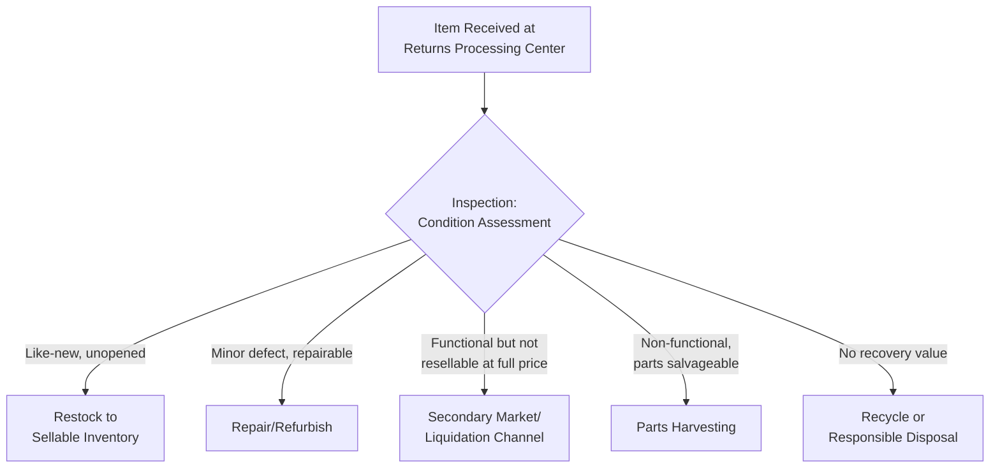
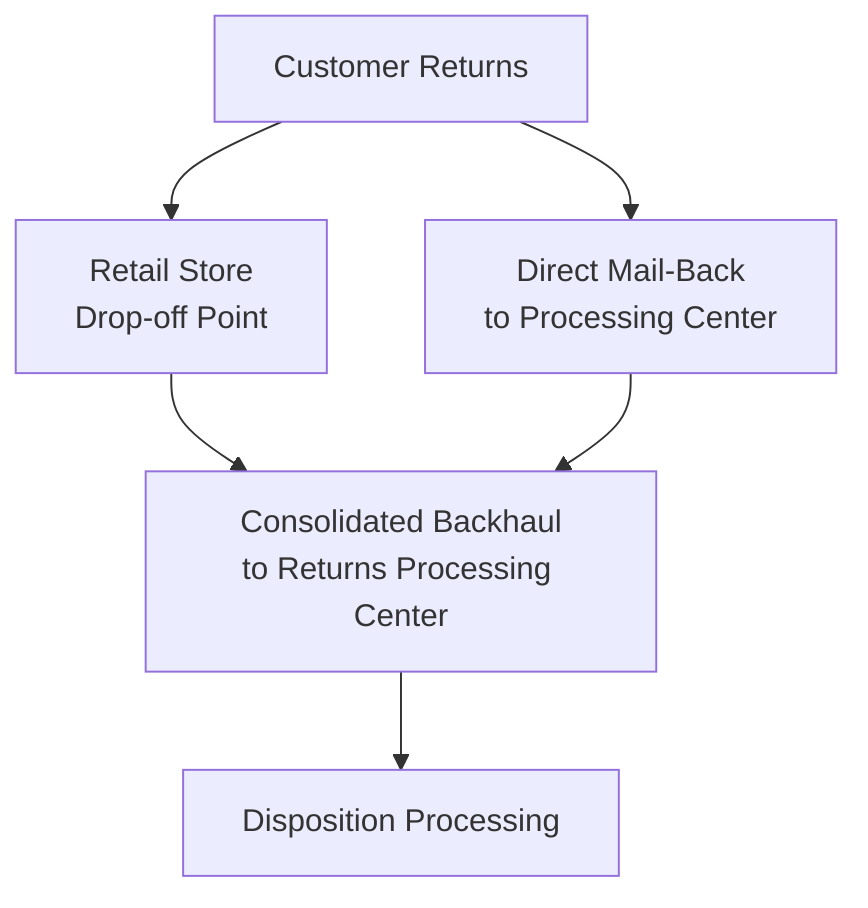
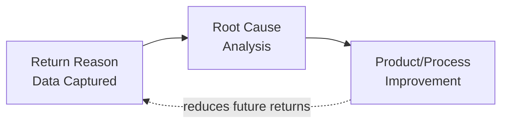

## Reverse Logistics and Returns Management

### Definition and Scope

Reverse logistics is the process of planning, implementing, and controlling the efficient, cost-effective flow of goods, materials, and information from the point of consumption back to the point of origin — encompassing product returns, repairs, refurbishment, remanufacturing, recycling, and disposal. Returns management is the specific operational subset focused on handling customer-initiated product returns through this reverse flow.

**Key Points**

- Reverse logistics flow is inherently more complex and variable than forward logistics — return volumes, timing, and product condition are far less predictable than outbound shipments
- The rise of e-commerce has dramatically increased return volumes and elevated reverse logistics from a peripheral operational concern to a strategic cost and customer-experience driver
- Effective reverse logistics captures recoverable value (resale, refurbishment, parts harvesting, recycling) rather than treating all returns as pure loss/disposal cost

---

### The Reverse Logistics Flow

This flow inverts the traditional forward supply chain (manufacturer → distributor → retailer → customer), moving instead from the end customer back toward the point of origin, and requires distinct process design rather than simply running the forward chain in reverse.

---

### Reasons for Reverse Flow

| Category | Examples |
| --- | --- |
| **Customer returns** | Wrong size/fit, changed mind, product not as expected, buyer's remorse |
| **Defective/warranty returns** | Product malfunction, quality defects, warranty claims |
| **Recalls** | Safety or regulatory-driven mandatory product recovery |
| **End-of-life returns** | Product take-back programs, trade-ins, recycling mandates |
| **Commercial returns (B2B)** | Retailer returns of unsold inventory, damaged shipments, overstock |
| **Packaging returns** | Reusable pallets, containers, or packaging requiring recovery |

---

### The Disposition Decision Process

Upon receipt, returned items must be inspected and routed to the most economically and operationally appropriate outcome — the central value-recovery decision in reverse logistics.

$$\text{Disposition Value} = \max(V_{restock}, V_{refurb} - C_{refurb}, V_{liquidate}, V_{parts}, V_{recycle}) - C_{disposal}$$

The disposition decision should route each item to whichever outcome maximizes net recovered value, since the cost of processing (inspection, refurbishment labor, transportation to secondary channels) varies significantly by disposition path and can exceed recovered value for low-value items.

---

### Return Authorization and Policy Design

#### Return Merchandise Authorization (RMA)

A formal process requiring customers to obtain authorization before returning a product, enabling the receiving organization to plan for expected return volume, verify legitimacy, and provide return instructions (packaging, shipping method, designated return location).

#### Return Policy Trade-offs

- **Lenient policies** (free returns, extended return windows, no-questions-asked) increase customer satisfaction and purchase conversion but increase return volume and associated processing cost
- **Restrictive policies** (restocking fees, shorter windows, condition requirements) reduce return volume and cost but can suppress initial purchase conversion and damage customer loyalty

**Example**

An online apparel retailer analyzing its return policy finds that offering free returns increases conversion rate but also increases return rate substantially, since customers "bracket" purchases (ordering multiple sizes/colors intending to return most). The retailer evaluates whether the net effect — higher gross sales from improved conversion, offset by higher reverse logistics processing cost — is favorable, and may implement targeted policy adjustments (e.g., restocking fees for high-return-rate customer segments or categories) rather than uniformly restricting the policy across all products.

---

### Reverse Logistics Network Design

Reverse logistics networks often differ structurally from forward distribution networks due to differing volume patterns, value density, and processing requirements:

- **Centralized returns processing centers (RPCs)** — consolidating returns from a broad geography into fewer, specialized facilities to capture processing scale economies, since return volumes per location are typically far lower and less predictable than forward shipment volumes
- **In-store/retail location returns** — leveraging existing retail footprint as return drop-off points, reducing customer friction while requiring backhaul logistics to move returned goods to processing facilities
- **Third-party reverse logistics providers** — specialized 3PLs focusing specifically on returns processing, refurbishment, and secondary market liquidation, allowing the originating organization to outsource this operationally distinct function

---

### Value Recovery Channels

| Channel | Description | Typical Value Recovery |
| --- | --- | --- |
| **Original channel resale** | Restocked and sold as new/like-new through primary sales channels | Highest recovery, requires like-new condition |
| **Outlet/clearance channels** | Sold through discount retail channels at reduced price | Moderate recovery |
| **Secondary/liquidation marketplaces** | Bulk sale to liquidators or B2B secondary marketplaces | Lower recovery, faster disposition |
| **Refurbishment and resale** | Repaired/restored and sold as "refurbished" or "open-box" | Moderate-high recovery, requires repair investment |
| **Parts harvesting** | Disassembled for usable components/parts | Value limited to component worth |
| **Material recycling** | Broken down for raw material recovery | Lowest monetary recovery, environmental/regulatory value |

---

### Key Performance Metrics

| Metric | Purpose |
| --- | --- |
| Return rate (% of sales returned) | Overall reverse flow volume, often segmented by product category |
| Processing cycle time | Time from return receipt to disposition completion |
| Recovery rate/value recaptured | % of original value recovered through disposition channels |
| Restocking rate | % of returns successfully returned to sellable inventory |
| Return reason code distribution | Diagnostic data identifying root causes (sizing, quality, description mismatch) |
| Disposal/landfill rate | Sustainability metric tracking non-recovered volume |

---

### Root Cause Analysis and Return Reduction

Beyond processing efficiency, mature reverse logistics programs use return data diagnostically to reduce return volume at the source:

- **Product description/sizing accuracy** — addressing "not as described" or sizing-related returns through improved product information, sizing guides, or augmented reality fit tools
- **Quality control feedback loop** — routing defect-related return data back to manufacturing/quality functions to address root-cause production issues
- **Packaging and damage prevention** — analyzing transit-damage returns to improve packaging design
- **Fraud and abuse detection** — identifying patterns of policy abuse (e.g., "wardrobing" — using and returning items) to inform policy adjustments for specific customer segments

---

### Sustainability and Regulatory Dimensions

- **Extended Producer Responsibility (EPR)** — regulatory frameworks in various jurisdictions requiring manufacturers to manage end-of-life product take-back and recycling, directly mandating reverse logistics capability for covered product categories
- **Circular economy alignment** — reverse logistics is a core enabler of circular economy models (reuse, refurbishment, remanufacturing) as an alternative to linear take-make-dispose production
- **Landfill diversion** — sustainability-focused organizations increasingly track and report the percentage of returned goods diverted from disposal through resale, refurbishment, or recycling channels

[Unverified] Specific regulatory EPR requirements vary substantially by jurisdiction, product category, and are subject to ongoing legislative change; organizations should verify current applicable requirements for their specific product categories and operating regions directly rather than relying on general summary.

---

### Common Pitfalls

- Treating reverse logistics as an afterthought bolted onto forward logistics infrastructure rather than designing dedicated processes suited to its distinct volume and variability characteristics
- Failing to capture and act on return reason data, missing opportunities to reduce return volume at the source through product or process improvement
- Underinvesting in disposition speed, allowing returned inventory to sit unprocessed and lose resale value (particularly acute for fashion/seasonal or fast-depreciating electronics categories)
- Setting return policy purely to maximize short-term conversion without modeling the full cost of resulting return volume and reverse logistics processing burden
- Inadequate fraud/abuse detection, allowing policy exploitation to erode the margin benefit of lenient return policies
- Overlooking value recovery optimization — defaulting returned items to liquidation or disposal without systematically evaluating higher-value disposition alternatives (refurbishment, original-channel resale)

---

**Related Topics**

- Distribution network design (reverse network structural parallels)
- Third-party and fourth-party logistics (outsourced returns processing)
- Circular economy and sustainable supply chain practices
- Warehouse management systems (returns processing workflows)
- Customer experience and e-commerce fulfillment strategy
- Quality management and root cause analysis (CAPA processes)
- Extended Producer Responsibility (EPR) regulatory frameworks
- Inventory valuation and disposition accounting treatment