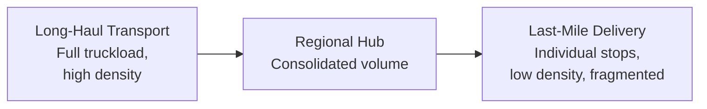
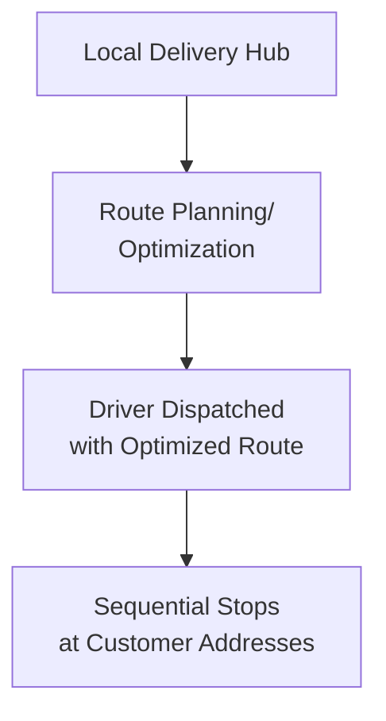
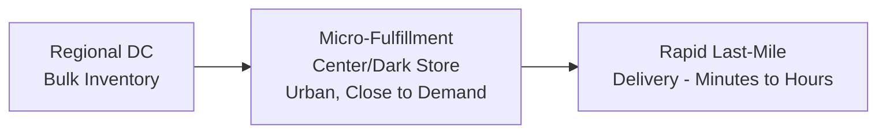
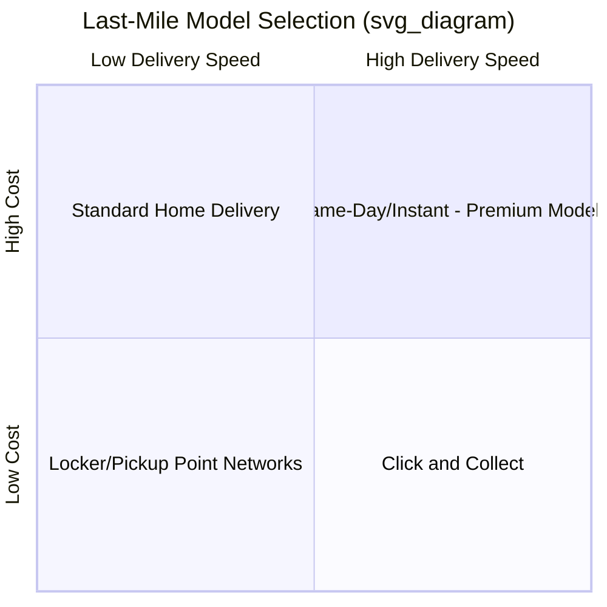

## Last-Mile Delivery Strategies

### Definition and Scope

Last-mile delivery is the final leg of the supply chain — moving a product from a distribution center, local hub, or retail location to the end customer's final delivery point. It is widely recognized as the most complex and cost-intensive segment of the delivery process on a per-package basis, driven by fragmented, low-volume, geographically dispersed destinations compared to the high-density, bulk movements characteristic of upstream logistics.

**Key Points**

- Last-mile delivery commonly represents a disproportionately large share of total shipping cost relative to the physical distance covered, due to the shift from bulk/consolidated movement to individual, dispersed drop-offs
- The explosive growth of e-commerce and rising customer expectations for speed (same-day, next-day delivery) have made last-mile strategy a critical competitive differentiator rather than a purely operational afterthought
- No single last-mile model dominates — optimal strategy varies by customer density, product type, delivery speed commitment, and cost structure, often requiring a blended, multi-model approach

---

### Why Last-Mile Is Disproportionately Costly

Key cost drivers specific to the last mile:

- **Low stop density** — each vehicle serves many individually dispersed addresses rather than a few high-volume destinations
- **Failed delivery attempts** — customer absence requiring redelivery, re-routing, or holding at a pickup point
- **Time-window commitments** — narrow delivery windows (or same-day/instant delivery promises) reduce routing flexibility and vehicle utilization efficiency
- **Urban congestion and access constraints** — traffic, parking limitations, building access restrictions in dense urban environments
- **Rising customer service expectations** — faster delivery promises compress the time available for route consolidation and optimization

$$\text{Cost per Package}_{last-mile} \gg \text{Cost per Package}_{long-haul}$$

driven primarily by the sharp drop in stops-per-mile and packages-per-stop as the delivery moves from consolidated hub-to-hub transport into fragmented final delivery. [Inference — while directionally well-established across logistics literature, the exact proportion of total shipping cost attributable to last-mile varies by industry, geography, and delivery model, and specific percentage figures should be sourced from current data for any particular application]

---

### Core Last-Mile Delivery Models

#### 1. Direct-to-Consumer Home Delivery

Traditional model where a carrier (parcel carrier, dedicated fleet, or gig-economy driver) delivers directly to the customer's residence.

- **Owned/private fleet** — greater control over service quality and branding, but requires significant capital investment and fixed cost commitment
- **Third-party parcel carriers** (national/regional carriers) — variable cost, broad network reach, less service customization
- **Gig-economy/crowdsourced delivery** — flexible, scalable capacity matching demand fluctuations, but less consistent driver quality/control

#### 2. Click-and-Collect / Buy-Online-Pickup-In-Store (BOPIS)

Customer orders online and retrieves the order from a physical retail location, eliminating the final delivery leg entirely by shifting the "last mile" burden to the customer.

- Reduces delivery cost and time-window complexity for the retailer
- Leverages existing retail store network as a fulfillment/pickup infrastructure
- Requires accurate real-time inventory visibility across stores to support order promising

#### 3. Locker and Pickup Point Networks

Parcels delivered to secure, unattended lockers or designated third-party pickup locations (convenience stores, dedicated pickup points) rather than the customer's door.

- Consolidates multiple individual customer deliveries into a single stop at the locker/pickup location, improving delivery density and reducing failed-delivery risk
- Trades customer convenience (must travel to collect) for reduced delivery cost and improved first-attempt success rate
- Particularly effective in dense urban/multi-unit residential environments where individual door delivery faces access constraints

#### 4. Crowdsourced and Gig-Economy Delivery

On-demand, flexible-capacity delivery using independent contractor drivers, commonly used for same-day/instant delivery models (food delivery, quick commerce).

- Enables rapid capacity scaling to match demand fluctuations without fixed fleet investment
- Well-suited to unpredictable, spiky demand patterns (e.g., food delivery peak hours)
- Trade-offs include less consistent service quality control and dependency on gig-worker labor market conditions and regulatory environment

#### 5. Micro-Fulfillment Centers and Dark Stores

Small-format fulfillment facilities located close to dense customer populations, enabling rapid (often sub-hour) delivery by minimizing the distance and time between order and dispatch.

#### 6. Emerging Autonomous and Technology-Enabled Delivery

- **Delivery robots** — small autonomous ground vehicles for short-range, sidewalk-level delivery in suitable dense urban/campus environments
- **Drone delivery** — aerial delivery for suitable lightweight packages, particularly explored for rural/hard-to-access areas or time-critical small items
- **Autonomous delivery vehicles** — self-driving vans/vehicles for route-based delivery, reducing labor cost dependency

[Unverified] The operational scale, regulatory approval status, and commercial viability of autonomous/drone delivery vary significantly by region and continue to evolve; specific deployment claims should be verified against current company and regulatory announcements rather than assumed as universally available or mature.

---

### Route Optimization

Given the high stop-density sensitivity of last-mile cost, route optimization is a central operational lever:

$$\min \sum_{route} \text{Distance/Time} \quad \text{subject to time windows, vehicle capacity, driver hours}$$

This is a variant of the **Vehicle Routing Problem (VRP)**, an NP-hard combinatorial optimization problem typically solved using heuristic algorithms (nearest-neighbor, savings algorithm, genetic algorithms) rather than exact solutions for realistic problem sizes, given the computational complexity of finding a provably optimal solution as stop count grows.

**Example**

A regional grocery delivery service serving 200 daily orders across a metro area implements dynamic route optimization software that clusters orders geographically and sequences stops to minimize total driving distance while respecting customer-selected delivery windows.

**Output**: Reported industry case studies of similar route optimization implementations commonly show meaningful reductions in total miles driven and corresponding increases in deliveries completed per driver-shift, since unoptimized routing (e.g., simple chronological order-received sequencing) typically leaves substantial improvement available purely from better geographic clustering and sequencing. [Inference — specific improvement percentages are highly dependent on baseline routing practice, geographic density, and delivery window constraints; treat any single case study figure as illustrative rather than a guaranteed outcome]

---

### Cost-Service Trade-off Framework

Faster delivery commitments generally carry higher per-package cost due to reduced routing consolidation flexibility, smaller batch sizes per vehicle trip, and premium capacity requirements. Organizations increasingly offer **tiered delivery options** (standard, expedited, same-day) allowing customers to self-select their position on this cost-speed trade-off, and dynamically price accordingly.

---

### Delivery Density and Urban vs. Rural Considerations

| Factor | Dense Urban | Suburban | Rural |
| --- | --- | --- | --- |
| Stop density | High — favors micro-fulfillment, lockers | Moderate | Low — favors consolidation, longer routes |
| Access constraints | High (parking, building access) | Moderate | Low |
| Cost per delivery | Can be lower with density | Moderate | Typically highest per-package |
| Favored models | Lockers, walking/cycling couriers, micro-fulfillment | Traditional route-based home delivery | Consolidated routes, longer delivery windows, possible third-party pickup points |

---

### Key Performance Metrics

| Metric | Purpose |
| --- | --- |
| Cost per delivery/package | Core efficiency metric, often the largest single controllable cost lever |
| First-attempt delivery success rate | Minimizing costly redelivery attempts |
| On-time delivery rate | Service reliability against customer-promised windows |
| Stops per route/hour | Route density and driver productivity |
| Customer satisfaction/NPS | Delivery experience impact on overall customer relationship |
| Failed delivery rate | Diagnostic metric for address accuracy, access issues, or customer availability patterns |

---

### Common Pitfalls

- Optimizing purely for delivery speed without accounting for the disproportionate cost increase from reduced routing consolidation flexibility
- Underinvesting in route optimization technology, leaving significant achievable efficiency gains unrealized through purely manual or simplistic routing
- Offering uniform delivery windows/promises across geographically and density-diverse markets, missing opportunities for density-appropriate model differentiation (e.g., locker networks in dense urban cores vs. traditional home delivery in suburban areas)
- Insufficient failed-delivery mitigation (e.g., proactive customer communication, flexible redelivery/pickup options), driving avoidable redelivery cost
- Treating last-mile strategy as a single fixed model rather than a blended portfolio matched to customer segment, product type, and geographic density
- Underestimating the labor market and regulatory dependency risk of gig-economy delivery models, particularly given evolving labor classification regulations in various jurisdictions

[Unverified] Labor classification regulations for gig-economy delivery workers are actively evolving in multiple jurisdictions; organizations relying on this model should verify current applicable regulatory status directly rather than relying on general summary, given the pace of legislative change in this area.

---

**Related Topics**

- Distribution network design (micro-fulfillment and hub placement)
- Warehouse management systems (dark store/micro-fulfillment operations)
- Transportation mode selection and management
- Vehicle Routing Problem (VRP) and route optimization algorithms
- Omnichannel fulfillment strategy (BOPIS integration)
- Gig economy labor models and regulatory considerations
- Customer experience and delivery promise management
- Reverse logistics and returns management